# 01 Guia Emissor Publico Nacional Web

*Converted from: 01-guia-emissor-publico-nacional-web.pdf*

---

## Page 1

1
Sistema Nacional Nota Fiscal de Serviço
Guia do Emissor Público Nacional Web da NFS-e

### Images from Page 1

## Page 2

2
HISTÓRICO DE VERSÕES
Versão
Data
Alterações da Versão
1.0
1.1
23/09/2025
Inclusão dos itens 4.3, 4.3.1, 4.3.2, 4.3.3 e 4.3.4 referentes a Emissão de NFS-e por
decisão administrativa / judicial
Resumo do Documento
Descrição:
Este documento é um roteiro para auxiliar os emitentes da Nota Fiscal de Serviço eletrônica
– NFS-e a usarem o emissor web do sistema da NFS-e.
Destinação
Emitentes de NFS-e

## Page 3

3
Sumário
1.
INTRODUÇÃO .............................................................................................................................................. 7
1.1.
ACESSO AO EMISSOR PÚBLICO NACIONAL DA NFS-E. .............................................................................................. 8
1.1.1.
Acesso com Usuário/Senha ................................................................................................................ 8
1.1.2.
Acesso com Certificado Digital ........................................................................................................ 12
1.1.3.
Acesso com GOVBR ............................................................................................................................. 13
2.
PAINEL PRINCIPAL.................................................................................................................................... 14
2.1.
MENU....................................................................................................................................................................... 15
2.2.
PAINÉIS GERENCIAIS ............................................................................................................................................ 15
3.
CONFIGURAÇÕES ..................................................................................................................................... 15
4.
EMITINDO A NOTA FISCAL...................................................................................................................... 17
4.1.EMISSÃO DE NFS-E COMPLETA (TODOS CONTRIBUINTES)........................................................................................... 17
4.1.1.
PASSO 1 – Pessoas ..................................................................................................................................... 19
4.1.2.
PASSO 2 – Serviço ...................................................................................................................................... 33
4.1.3.
PASSO – Valores ......................................................................................................................................... 48
4.1.4.
PASSO 4 – Emitir NFS-e ............................................................................................................................. 62
4.1.5.
NFS-e Gerada com sucesso ....................................................................................................................... 65
4.2.
EMISSÃO DE NFS-E SIMPLIFICADA (CONTRIBUINTES MEI OU DO SIMPLES NACIONAL) .......................................... 66
4.3.
EMISSÃO POR DECISÃO ADMINISTRATIVA OU JUDICIAL ............................................................................................. 66
4.3.1.
INCLUSÃO DE NFS-E POR DECISÃO ADMINISTRATIVA / JUDICIAL .......................................................................... 66
4.3.2.
CONSULTA DE NFS-E EMITIDA POR DECISÃO ADMINISTRATIVA / JUDICIAL ........................................................... 68
4.3.3.
CANCELAR NFS-E EMITIDAS POR DECISÃO ADMINISTRATIVA / JUDICIAL............................................................... 68
4.3.4.
SUBSTITUIR NFS-E EMITIDA POR DECISÃO ADMINISTRATIVA / JUDICIAL ............................................................... 69
4.4.
CONFIGURAÇÃO DO SISTEMA PARA EMISSÃO DA NFS-E SIMPLIFICADA. .................................................................. 70
4.4.1.
Configurações no menu principal: ............................................................................................................. 71
4.4.2.
Criando serviços favoritos ........................................................................................................................... 72
4.4.3.
Emitir NFS-e .................................................................................................................................................. 73
4.4.4.
NFS-e Gerada com sucesso ....................................................................................................................... 77
5.
CONSULTAS NFS-E EMITIDAS................................................................................................................ 79
5.1.
VISUALIZAR NFS-E E EVENTOS VINCULADOS .......................................................................................................... 80
5.2.
SUBSTITUIÇÃO DE NFS-E ........................................................................................................................................ 81
5.3.
CANCELAMENTO DE NFS-E E SOLICITAÇÃO DE CANCELAMENTO POR ANÁLISE FISCAL .......................................... 81
5.4.
DOWNLOAD XML .................................................................................................................................................... 84
5.5.
DOWNLOAD DANFSE ............................................................................................................................................. 84
6.
CONSULTA NFS-E RECEBIDAS .............................................................................................................. 85
6.1.
VISUALIZAR NFS-E RECEBIDA .................................................................................................................................. 86
6.2.
DOWNLOAD XML .................................................................................................................................................... 86
6.3.
DOWNLOAD DANFSE ............................................................................................................................................. 86
6.4.
MANIFESTAÇÃO DE NFS-E ...................................................................................................................................... 87
6.4.1.
Confirmar uma NFS-e .................................................................................................................................. 87
6.4.2.
Rejeitar uma NFS-e ...................................................................................................................................... 88
7.
RASCUNHO DPS ........................................................................................................................................ 90
7.1.
EDITAR DPS ............................................................................................................................................................ 91
7.2.
EXCLUIR DPS .......................................................................................................................................................... 91
8.
SERVIÇOS FAVORITOS ............................................................................................................................ 92
9.
CONSULTA PÚBLICA DE UMA NFS-E .................................................................................................... 94
9.1.
CONSULTA USANDO A CHAVE DE ACESSO DA NFS-E .............................................................................................. 94
9.2.
CONSULTA INFORMANDO OS DADOS DA DPS ......................................................................................................... 96

## Page 4

4
10.
CONTROLE DE ACESSO AO SISTEMA NACIONAL NFS-E – CONTRIBUINTES ............................... 97
10.1. GERENCIAMENTO DE PERFIS E NÍVEIS DE ACESSO ..................................................................................................... 97
10.2. CONTROLE DE PRIMEIRO ACESSO (EMITENTES / NÃO EMITENTES DE NFS-E) ........................................................... 97
10.3. REALIZAR PRIMEIRO ACESSO AO SISTEMA NACIONAL NFS-E..................................................................................... 97
10.4. RECUPERAR SENHA DO USUÁRIO .............................................................................................................................. 100
10.5. CONFIRMAÇÃO DO CADASTRAMENTO PRESENCIAL AO USUÁRIO............................................................................. 102
10.6.   CONTROLE DE ACESSO AO SISTEMA NACIONAL NFS-E PARA O EMISSOR WEB .................................................... 102
10.6.1.   Controle de Acesso por Usuário/Senha .................................................................................................. 102
10.6.2. Controle de Acesso por Certificado Digital ............................................................................................... 102
10.6.3. Controle de Acesso ao Sistema Nacional NFS-e via GOV.BR ................................................................ 103

## Page 5

5
HISTÓRICO DE VERSÕES
Versão
Data
Alterações da Versão
1.0
Resumo do Documento
Descrição:
Este documento é um roteiro para auxiliar os contribuintes para uso do Emissor Público
acional Web da Nota Fiscal de Serviço – NFS-e.
Destinação

## Page 6

6
Siglas utilizadas:
ABRASF - Associação Brasileira de Secretários e Dirigentes das Finanças dos Municípios das Capitais
ATM - Administração Tributária Municipal
ADN – Ambiente de Dados Nacional
CNC – Cadastro Nacional de Contribuintes
CNM - Confederação Nacional dos Municípios
DNA – Documento Nacional de Arrecadação GMP - Gestor Municipal Principal
DPS – Declaração da Prestação de Serviços Sefin Nacional – Secretaria de Finanças Nacional CGNFS-e -
Comitê Gestor da NFS-e
MAN – Módulo de Apuração Nacional
NFS-e - Nota Fiscal de Serviço Eletrônica Nacional
RFB - Receita Federal do Brasil
SEBRAE - Serviço Brasileiro de Apoio às Micro e Pequenas Empresas SERPRO - Serviço Federal de
Processamento de Dados

## Page 7

7
Emissor Público Nacional NFS-e
A emissão da NFS-e Nacional é feita através de um sistema público de emissão, disponível
para acesso via Web, Mobile ou API.
•
Emissão Web:  sistema para gerenciamento por parte do contribuinte, onde ele
poderá se cadastrar, emitir, consultar e cancelar as NFS-e emitidas.
•
Emissão Mobile: permitirá a emissão de NFS-e simplificada, visando atender
especificamente aos contribuintes dos municípios que utilizam a Sefin Nacional,
comunicando-se somente com o Sistema Nacional da NFS-e.
•
Emissão via API: funciona como uma Secretária de Finanças Municipal (SEFIN
Nacional NFS-e) com objetivo de recepcionar e validar as Declarações de Prestação de
Serviços (DPS) dos contribuintes de municípios conveniados ao SN NFS-e – sejam
estas DPS enviadas diretamente para API ou emitidas nos emissores públicos
nacionais Web e APP. O município que não possuir um ambiente computacional para
validar os DPS de seus contribuintes poderá se conveniar ao sistema nacional para
utilização da Sefin Nacional NFS-e pelos seus contribuintes de ISSQN (Imposto Sobre
Serviços de Qualquer Natureza).
Mais informações sobre os emissores encontram-se na Portal da Nota Fiscal de Serviço
eletrônica.
Emissor Público Nacional NFS-e – Web
1.
Introdução
Este módulo consiste em um sistema para gerenciamento de NFS-e do contribuinte. Está
basicamente estruturado nas funcionalidades para:
•
Configuração do emissor;
•
Emissão de NFS-e;
•
Consultas NFS-e emitidas;
•
Consultas NFS-e recebidas;
•
Cancelamento de NFS-e;
•
Substituição de NFS-e;
•
Registro de serviços mais realizados pelo emitente (favoritos); e
•
Gravação de rascunhos.
Além destas funcionalidades, o Emissor Público Nacional NFS-e – Web realiza diversas
integrações com outras bases de dados: Tabelas de convênios dos Municípios (Painel Administrativo

## Page 8

8
Nacional), Tabelas Parametrizadas pelos Municípios (Painel Administrativo Municipal), Cadastros
CNPJ, CPF, Simples Nacional, TOM e Cadastro Nacional de Contribuinte (CNC NFS-e).
O painel está disponível no endereço https://www.nfse.gov.br/EmissorNacional. Ao
1.1.
Acesso ao Emissor Público Nacional da NFS-e.
O contribuinte deverá acessar o Portal de Gestão NFS-e - Contribuinte.
O acesso ao Portal se dá de 3 formas:
a) Acesso com usuário e senha;
b) Acesso com certificado digital;
c) Acesso via GOVBR.
1.1.1.
Acesso com Usuário/Senha
Para realizar este acesso, é necessário, incialmente, fazer um cadastro para o emissor (CPF ou
CNPJ). Para isto deve-se clicar em: “Fazer primeiro acesso”.

### Images from Page 8

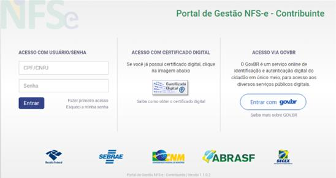

## Page 9

9
Na próxima tela serão solicitadas as informações conforme o tipo de contribuinte pessoa física
ou Jurídica.
A) Pessoa Física:
Marcar a opção
. O sistema abrirá os campos: “CPF” e “Data de nascimento”. Preencher
os dois campos e clicar em
.
Erro
Mensagem
CPF não existente
“Não foi possível recuperar informações do
Contribuinte.”
CPF informado para o emitente da
NFS-e é inválido (verificar DV).
“Informe um CPF válido”
A data de nascimento diferente da
informada  no cadastro CPF.
“A data de nascimento informada não
corresponde ao CPF informado.”

### Images from Page 9

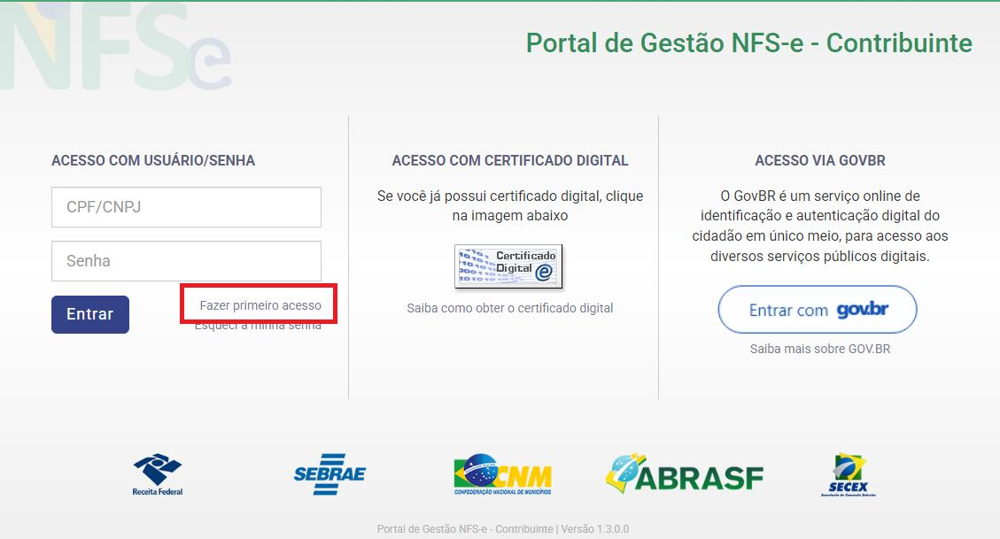

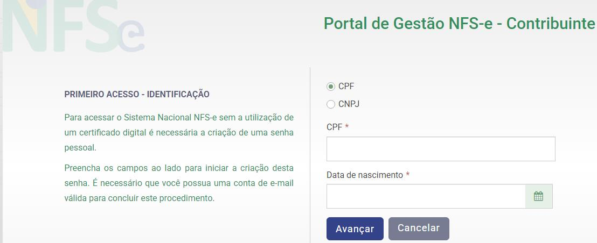

## Page 10

10
A tela a seguir solicitará o número do título de eleitor para o CPF informado. Preencher o campo
e clicar em
.
Caso o emissor tenha declarado imposto de renda pessoa física será necessário informar os
números dos recibos das declarações de renda dos dois últimos anos. Preencher os campos e clicar
em
.
Na próxima tela, deverá informar um e-mail e criar uma senha de acesso. Preencher os campos
e clicar em
.

### Images from Page 10

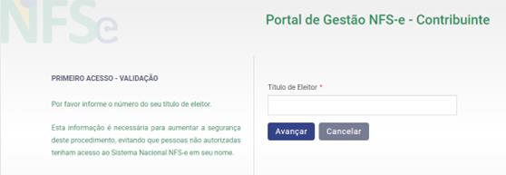

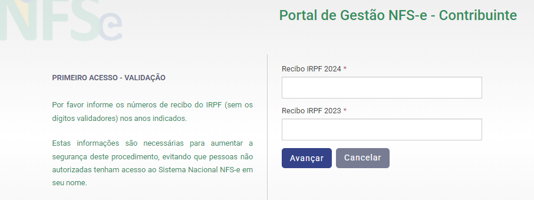

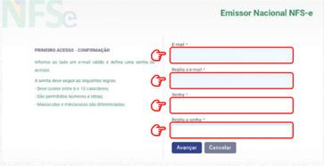

## Page 11

11
Será enviado um código de segurança no e-mail cadastrado. Deve-se acessar o e-mail e verificar
o “código de segurança” enviado.
Informar o código no campo correspondente e clicar em
.
A etapa para o primeiro acesso está finalizada.
B) Pessoa Jurídica:
Marcar a opção
. O sistema abrirá os campos: “CNPJ”, CPF do responsável e “Data
de nascimento”(do responsável). Preencher os dois campos e clicar em
.
Erro
Mensagem
CNPJ não existente
“Não foi possível recuperar informações do
Contribuinte.”
CPF do responsável diferente do
informado no Cadastro CNPJ
“O CPF informado não corresponde ao CPF
responsável pelo CNPJ informado.”
A
data
de
nascimento
do
responsável
é
diferente
da
cadastrada  no cadastro CPF
“A data de nascimento informada não
corresponde ao CPF informado.”

### Images from Page 11

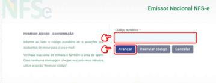

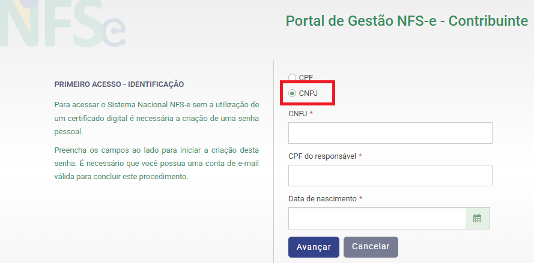

## Page 12

12
O Portal exibirá a página inicial onde deve ser informado o usuário (CPF/CNPJ) e a senha.
Preencher os dois campos e clicar em
.
1) Não foi possível criar seu usuário
1.1.2.
Acesso com Certificado Digital
Outra forma de acesso é com o uso do certificado digital, clicar sobre o ícone do certificado
e o sistema abrirá a janela para selecionar o certificado.

### Images from Page 12

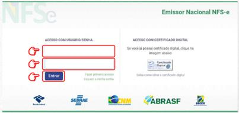

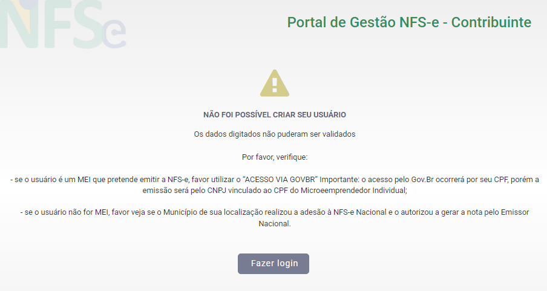

## Page 13

13
Selecione o certificado a ser usado e informe a senha na janela seguinte.
1.1.3.
Acesso com GOVBR
Uma terceira forma de acesso é com o uso do serviço GOVBR, clicar sobre o ícone
e o sistema abrirá a janela do GOVBR. Realizar as etapas, conforme a
orientação do site.

### Images from Page 13

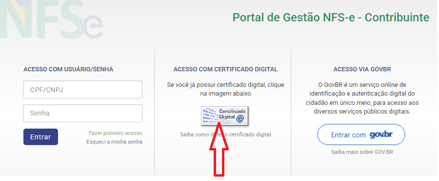

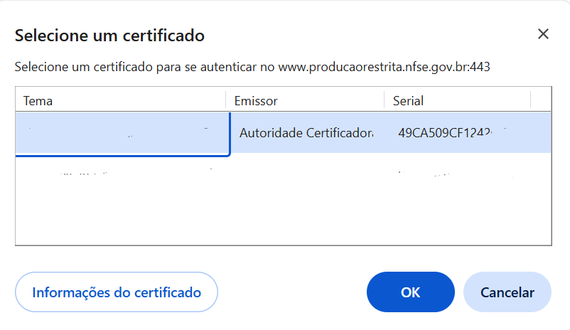

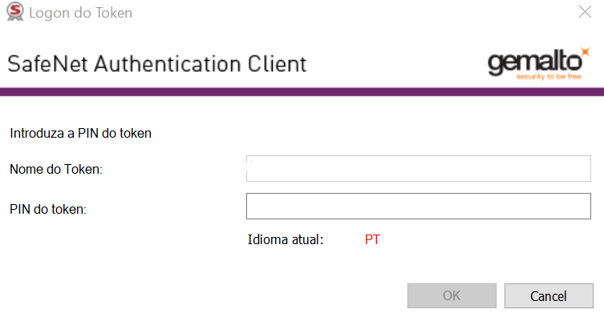

## Page 14

14
2.
Painel Principal
Ao realizar o login por uma das formas descritas no item 1, o sistema exibirá o painel principal
do módulo Emissor Público Nacional NFS-e. Este painel possui diversas consultas realizadas na base
de dados do Emissor Web para o usuário que está acessando o sistema.
Estas informações consolidadas são apresentadas no painel principal em pequenos
“dashboards” de acordo com o perfil do usuário logado. Estas informações podem não ser
apresentadas dependendo do usuário que estiver acessando o sistema, pois o objetivo principal
desses dashboards é auxiliar a interação do usuário emitente de NFS-e com o Emissor Web. Assim,
um usuário não emitente não possui rascunhos ou últimas NFS-e emitidas para serem
apresentadas.

### Images from Page 14

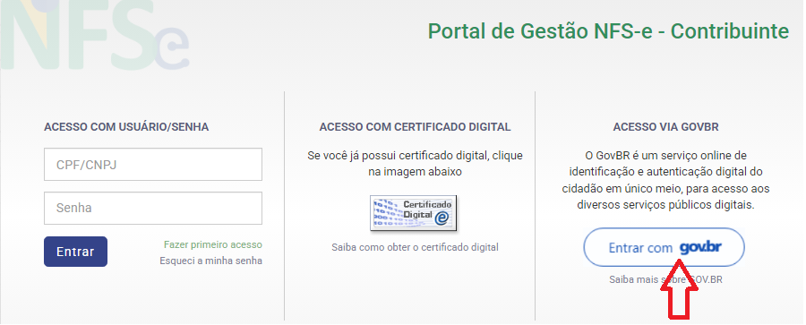

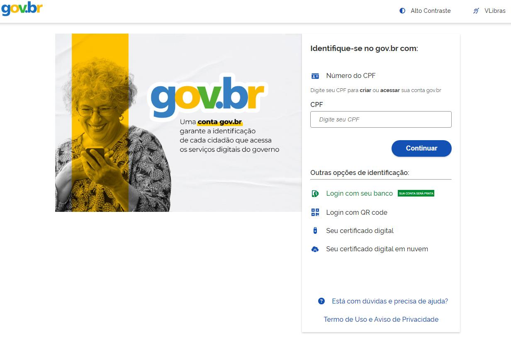

## Page 15

15
O Painel Principal apresenta um menu com os módulos do sistema e o painel gerencial.
2.1.
Menu
•
Página inicial;
•
Tipos de emissão; (completa e simplificada);
•
NFS-e emitidas;
•
NFS-e recebidas;
•
Rascunhos;
•
Configurações;
•
Serviços Favoritos;
2.2. Painéis gerenciais
São apresentados, no Painel Principal, os painéis gerenciais:
•
Rascunhos;
•
Dados do usuário que acessou o Emissor Web;
•
Últimas NFS-e emitidas;
•
Painel para acesso rápido a algumas funcionalidades;
3.
Configurações

### Images from Page 15

## Page 16

16
Este módulo deve ser o primeiro a ser acessado. Ele contempla as funcionalidades com
complemento das informações do emitente da NFS-e.
O e-mail e o telefone informados podem ser diferentes das informações
cadastradas no município e/ou nas bases de dados da RFB. Por este motivo, para
cada NFS-e emitida pelo Emissor Nacional Web, eles serão utilizados no grupo de
informações da DPS conforme o tipo de emitente (prestador, tomador ou
intermediário) e serão impressos na DANFSe somente quando forem ausentes nas
fontes cadastrais oficiais.
Campo
Descrição
Tipo
Ocorrênci
a
Ação
E-mail
Endereço do e-mail
Endereço
de e-mail
Opcional
Informar o endereço
de e-mail
Telefone
Telefone para contato Número
Opcional
Incluir um telefone
Valor aproximado dos tributos – marcar a opção que melhor atende ao perfil do emissor. Para
cada emissão de NFS-e, a opção selecionada abaixo influenciará no cálculo/exibição dos valores
totais dos tributos Federais, Estaduais e Municipais.
se esta for a opção marcada, nenhum
preenchimento será necessário.

### Images from Page 16

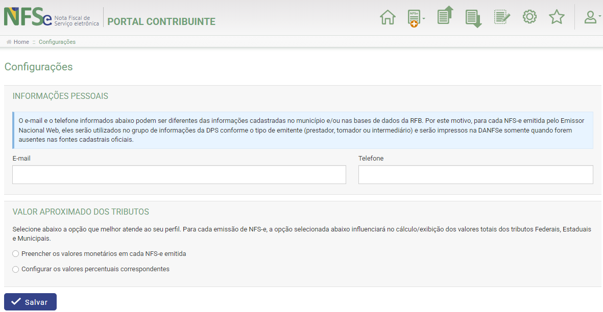

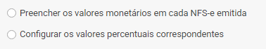

## Page 17

17
se esta for a opção marcada, deve-se
preencher os percentuais “Federal”, “Estadual” e “Municipal”.
Após essa configuração a emissão da nota fiscal de serviços eletrônica poderá ser feita.
4.
Emitindo a Nota Fiscal
Para emitir a nota fiscal pelo Emissor Web, deve-se optar por um dos ícones marcados com o sinal de + na
imagem abaixo e selecionar se deseja utilizar a Emissão Completa ou a Emissão Simplificada - esta última opção
é disponível apenas para quem é MEI.
4.1.Emissão de NFS-e Completa (Todos Contribuintes)
A Emissão Completa é obrigatória para alguns tipos de prestação de serviço, como exportação
e serviços cujo ISSQN é devido no local do tomador.
Para emitir a nota fiscal de modo completo pelo portal web, basta clicar no ícone marcado na
imagem abaixo e selecionar a opção “Emissão Completa”

### Images from Page 17

## Page 18

18
Ou na guia “Acesso Rápido”:

### Images from Page 18

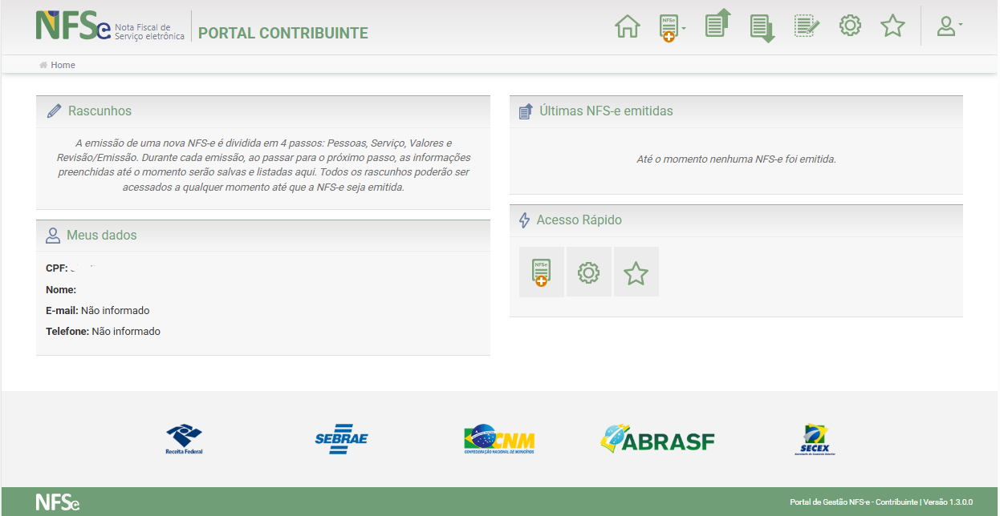

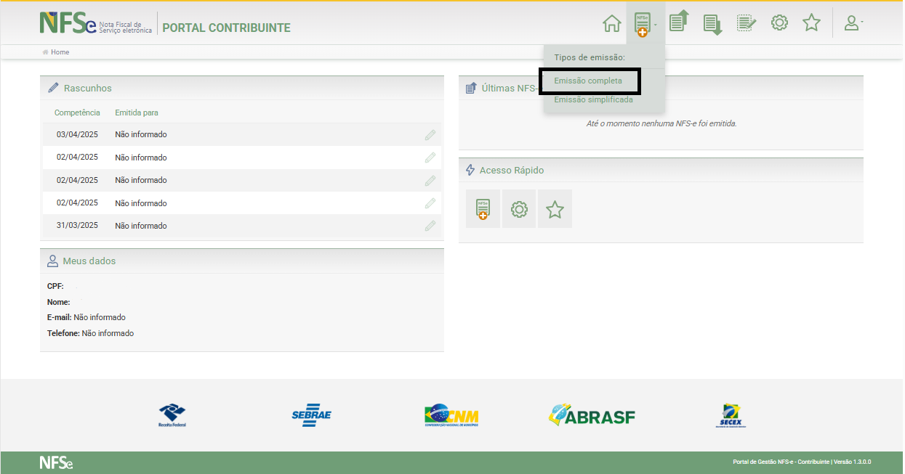

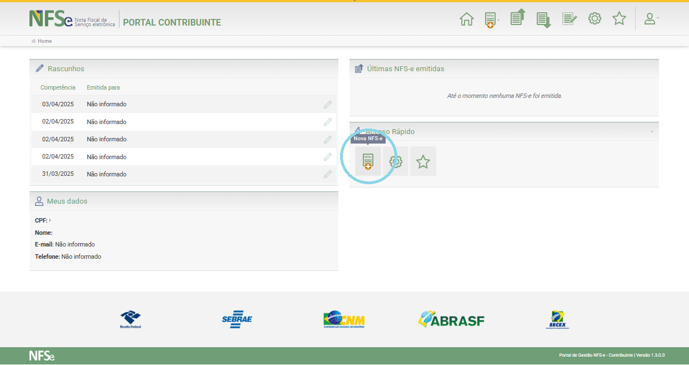

## Page 19

19
Para preencher e emitir uma NFS-e serão consideradas regras de acordo com as opções de
cada conjunto de informações solicitadas como Pessoas, Serviço, Valores e Emitir NFS-e.
Na tabela abaixo estão explicitadas a maioria das informações que poderão ser necessárias.
A obrigatoriedade dos campos, bem como as regras de negócio aplicadas para cada um
deles, são dadas pelas planilhas de leiaute DPS e RN DPS (AnexoI-LeiautesRN_DPS_NFSe-
SNNFSe).
4.1.1.
PASSO 1 – Pessoas
Tela para preenchimento da pessoa física ou jurídica emitente da NFSe.
A obrigatoriedade dos campos da tabela, bem como as regras de negócio aplicadas para
cada um deles, estão na planilha de leiaute DPS e RN DPS descrita abaixo. Após o preenchimento
dos campos, conforme indicado, clicar em
.

### Images from Page 19

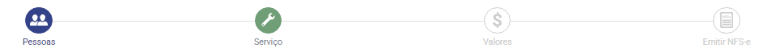

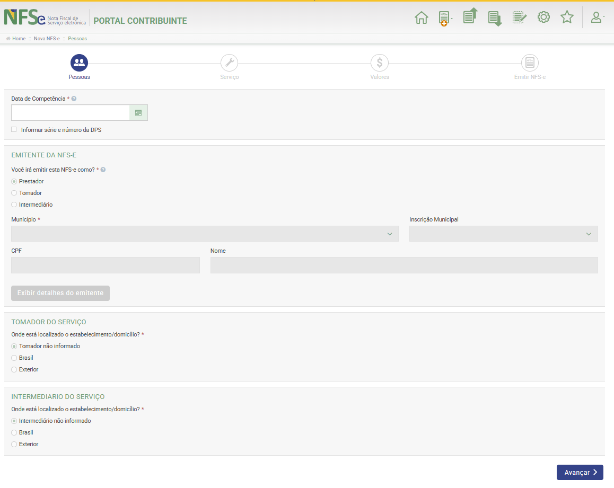

## Page 20

20
Campo
Descrição
Tipo
Ocorrência
Ação
Data de Competência
Data em que o serviço
foi prestado
Data
Obrigatório Incluir
a
data
da
competência ou clicar
no ícone do calendário
e navegar até a data
definida.
DPS - (Declaração de Prestação de Serviço)  é um documento de posse e responsabilidade do
contribuinte, que deverá ser gerado manualmente ou por alguma aplicação adquirida,
possuindo uma numeração sequencial crescente e devendo ser convertido em NFS-e no prazo
estipulado pela legislação tributária municipal.
Este documento atende também àqueles contribuintes que, porventura, não dispõem de infra-
estrutura de conectividade em tempo integral, podendo gerar os documentos e enviá-los, em
lote, para processamento e geração das respectivas NFS-e.
Para que as DPS possam fazer parte de um lote a ser enviado para geração das NFS-e
correspondentes, é necessário que o contribuinte possua uma aplicação instalada em seus
computadores (desenvolvida particularmente seguindo as especificações disponibilizadas pelo
Comitê Gestor da NFS-e).
O envio de DPS à secretaria para geração da NFS-e é feito em lotes, ou seja, vários RPS
agrupados para gerar uma NFS-e para cada um deles.
Mais informações sobre DPS podem ser consultadas diretamente no site O que é DPS? — Portal
da Nota Fiscal de Serviço eletrônica.
ou
O número e a série da
DPS
são
campos
obrigatórios
de
controle da DPS que
ajudam a identificar
unicamente uma DPS.
Em geral, campos são
gerados
automaticamente pelo
sistema
para
cada
emitente de NFS-e. No
entanto,
existem
situações em que o
Checkbox Opcional
Clicar se a opção for
informar a DPS.

### Images from Page 20

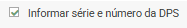

## Page 21

21
emitente
ainda
necessita controlá-los
ou deverá informá-los
manualmente.
O
sistema
emissor
permite
que
o
emitente
possa
informar o número de
série (transcrever o
número de série) que
foi repassado ao não
emitente da NFS-e.
Série
Informação sobre a
série da DPS.
Numérico Obrigatório Incluir série da DPS,
deve ser um número
entre
80.000
e
89.999,
de
acordo
com a regra Faixas de
utilização da série da
DPS,
descrita
no
AnexoIV-
LeiautesRN_ADN-
SNNFSe_V1.00.02-
Produção.xlsx
—
Portal da Nota Fiscal
de Serviço eletrônica
Número da DPS
Número da DPS
Numérico Obrigatório Incluir número da DPS
Emitente da NFS-e - aqui podem ser informadas 3 opções: Prestador, Tomador ou
Intermediário. A depender da opção feita, os campos para preenchimento vão sendo ajustados.
Na atual versão, a NFS-e somente poderá ser emitida pelo Prestador de Serviço. As emissões
de NFS-e por Tomador e Intermediário ainda não estão disponíveis, a funcionalidade será
disponibilizada em uma versão futura.

### Images from Page 21

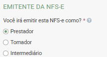

## Page 22

22
Campo
para
informação de  quem
será o emitente da
NFS-e:
Prestador,
Tomador
ou
Intermediário.
CheckBox Obrigatório Selecionar uma das 3
opções
para
o
emitente:
o Prestador
o Tomador
o Intermediário
CPF
Informação
do
NI
(CPF/CNPJ)
do
emitente
Numérico Obrigatório Este
campo
é
recuperado
dos
cadastros RFB ou CNC
conforme convênio do
município
Nome
Informação sobre o
nome ou Razão Social
do emitente
Texto
Obrigatório Este
campo
é
recuperado
dos
cadastros RFB ou CNC
conforme convênio do
município
Município
Informação sobre o
nome do município do
emitente
Combo
Obrigatório Este
campo
é
recuperado
dos
cadastros RFB ou CNC
conforme convênio do
município.
O
município do emitente
da
NFS-e
será
preenchido
automaticamente,
e
corresponde ao código
do município emissor
(cLocEmi)
informado
na NFS-e.
De acordo com as
regras de negócio.
Inscrição Municipal
Informação
da
Inscrição Municipal do
emitente
Combo
Obrigatório Este
campo
é
recuperado
dos
cadastros RFB .
Opção
no
Simples Informa
se
o Texto
De acordo Recuperar
dos

### Images from Page 22

## Page 23

23
Nacional
contribuinte emitente
é ou não optante pelo
Simples Nacional
com
as
regras
de
negócio
cadastros RFB
Regime de Apuração
Tributária pelo Simples
Nacional
Informar se o regime
de
apuração
dos
tributos
federais
e
municipal
serão
realizados pelo SN ou
pela NFS-e
Combo
Opcional
Selecionar o tipo de
apuração dos tributos
federais e municipal
serão realizados pelo
SN ou pela NFS-e
Telefone
Preencher
com
o
número do telefone do
emitente
Número
Opcional
-
E-mail
Preencher
com
o
endereço
do
e-mail
cadastrado
como
contato no município
Endereço
de e-mail
Opcional
-
CEP
Informação
do
número do CEP
Número
Obrigatório Este
campo
é
recuperado
dos
cadastros RFB ou CNC
conforme convênio do
município
Logradouro
Informação do nome
do logradouro
Texto
Obrigatório Este
campo
é
recuperado
dos
cadastros RFB ou CNC
conforme convênio do
município
Número
Informação
do
número do logradouro
Texto
Obrigatório Este
campo
é
recuperado
dos
cadastros RFB ou CNC
conforme convênio do
município

### Images from Page 23

## Page 24

24
Complemento
Preencher
com
o
complemento
do
logradouro
Texto
Opcional
-
Bairro
Preencher
com
o
nome do bairro
Texto
Obrigatório Este
campo
é
recuperado
dos
cadastros RFB ou CNC
conforme convênio do
município
Tomador do Serviço - aqui podem ser informadas 3 opções: Tomador não informado,
Brasil ou Exterior. A depender da opção feita, os campos para preenchimento vão sendo
ajustados.
Para determinados Códigos de Tributação Nacional a serem preenchidos na etapa 2,
o preenchimento do Tomador do serviço é obrigatório, pois define o Local de
Incidência
do
ISSQN
(Lei
Complementar
116/2003).
Verificar
planilha
MUN.INCID_INFO.SERV. do AnexoI-LeiautesRN_DPS_NFSe-SNNFSe
Opção para informar
onde está localizado o
estabelecimento/domi
cílio
CheckBox Obrigatório Marcar uma das 3
opções disponíveis.
o Intermediário
não
informado
o Brasil
o Exterior
Tomador não informado - Caso esta opção seja marcada, nenhum campo aparecerá para
preenchimento posterior.

### Images from Page 24

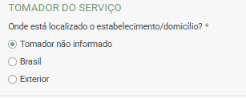

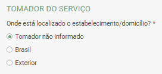

## Page 25

25
Tomador no Brasil – Caso esta opção seja marcada, os campos a serem disponibilizados
referem-se a informações de uma pessoa física ou jurídica domiciliada no Brasil.
CPF/CNPJ
Informação
do
CPF/CNPJ do tomador
Numérico Obrigatório Incluir o CPF/CNPJ do
tomador
Inscrição Muncipal
Informação
da
inscrição Municipal do
tomador
Numérico Obrigatório Incluir
a
inscrição
municipal do tomador
Nome/Razão Social
Informação do nome
ou Razão Social do
tomador
Texto
Obrigatório Este
campo
é
recuperado
dos
cadastros RFB ou CNC
conforme convênio do
município
Telefone
Informação
do
número do telefone do
tomador
Número
Opcional
Incluir
número
do
telefone do tomador
E-mail
Informação
do
endereço
do
e-mail
cadastrado
como
contato no município
Endereço
de e-mail
Opcional
Incluir o endereço de
e-mail do tomador
Endereço Tomador no Brasil
CEP
Informação
do
número do CEP
Número
Obrigatório Incluir
o
CEP
do
endereço
Município
Informação do nome
do município ao qual
pertence o tomador no
Brasil
Texto
Obrigatório Este
campo
é
recuperado da tabela
TOM
com
o
CEP
informado

### Images from Page 25

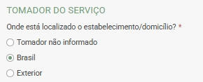

## Page 26

26
Bairro
Informação do nome
do bairro
Texto
Obrigatório Este
campo
é
recuperado da tabela
TOM
com
o
CEP
informado
Logradouro
Informação do nome
do logradouro
Texto
Obrigatório Este
campo
é
recuperado da tabela
TOM
com
o
CEP
informado
Número
Informação
do
número do logradouro
Texto
Obrigatório Incluir o número do
logradouro
Complemento
Informação
do
complemento
do
logradouro
Texto
Opcional
Incluir o complemento
do logradouro
Tomador do Serviço no Exterior - Caso esta opção seja marcada, os campos a serem
disponibilizados referem-se a informações específicas de outros países para uma pessoa física
ou jurídica domiciliada fora do Brasil.
Marcação se haverá ou
não a informação do
NIF
(Número
de
Identificação Fiscal –
número fornecido pelo
órgão
de
administração
tributária do exterior e
que identifica pessoa
física
ou
jurídica
CheckBox Obrigatório Marcar
uma
das
opções

### Images from Page 26

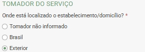

## Page 27

27
externa
ao
Brasil
(equivale ao CPF ou
CNPJ, identificando a
pessoa
física
ou
jurídica no exterior).
Opção para caso o NIF
não for informado
CheckBox
Informação sobre o
motivo
da
não
informação do NIF
Checkbox Obrigatório Selecionar uma das
duas opções:
Dispensado do NIF ou
Não exigência do NIF
NIF
Informação
do
número
de
identificação
internacional
Numérico Obrigatório Incluir
o
NIF
do
tomador.
Pode recuperar o NIF
informado dos últimos
tomadores
.
Nome/Razão Social
Nome ou Razão Social
do tomador
Texto
Obrigatório Preencher
com
o
Nome/Razão Social do
tomador
Telefone
Número do telefone do
tomador
Número
Opcional
Preencher
com
número do telefone do
tomador
e-mail
Endereço do
e-mail
cadastrado
como
contato no município
Endereço
de e-mail
Opcional
Preencher
com
o
endereço de e-mail do
tomador
Endereço do Tomador no Exterior
Logradouro
Informação do nome
do
logradouro
no
Texto
Obrigatório Preencher
com
o

### Images from Page 27

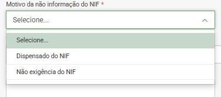

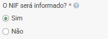

## Page 28

28
exterior
logradouro no exterior
Número
Informação
do
número do logradouro
no exterior
Texto
Obrigatório Preencher
com
o
número do logradouro
no exterior
Complemento
Informação
do
complemento
do
logradouro no exterior
Texto
Opcional
Preencher
com
o
complemento
do
logradouro no exterior
Bairro
Informação do nome
do bairro no exterior
Texto
Obrigatório Preencher
com
o
bairro no exterior
Cidade
Informação do nome
da cidade no exterior
Texto
Obrigatório Preencher
com
o
nome da cidade no
exterior
Código
de
Endereçamento Postal
Informação do código
de
endereçamento
postal do endereço no
exterior
Caracter
Obrigatório Preencher
com
o
código
de
endereçamento postal
do
endereço
no
exterior
Estado, província ou
região
Informação do nome
do Estado, província
ou região no exterior
Texto
Obrigatório Preencher
com
o
nome
do
Estado,
província ou região no
exterior
País
Informação do nome
do País
Combo
Obrigatório Selecionar
um
dos
países da lista
Intermediário do Serviço – aqui podem ser informadas 3 opções: Intermediário não
informado,
Brasil ou Exterior. A depender da opção feita, os campos a serem preenchidos serão
disponibilizados na tela.

## Page 29

29
Opção para informar
se
há
um
intermediário e onde
ele está localizado.
CheckBox Obrigatório Deve-se marcar uma
das 3 opções.
o Intermediário não
informado
o Brasil
o Exterior
Intermediário não informado – Caso esta opção seja marcada, nenhum campo aparecerá
para preenchimento posterior.
Intermediário no Brasil – Caso esta opção seja marcada, os campos a serem disponibilizados
referem-se a informações de uma pessoa física ou jurídica domiciliada no Brasil.
CPF/CNPJ
CPF/CNPJ
do
intermediário
Numérico Obrigatório Preencher
com
o
CPF/CNPJ
do
intermediário
Inscrição Municipal
Inscrição Municipal do
intermediário
Numérico Opcional
Preencher
com
a
inscrição municipal do
intermediário
Nome/Razão Social
Nome ou Razão Social
do intermediário
Texto
Obrigatório Este
campo
é
recuperado
dos
cadastros RFB ou CNC
conforme convênio do
município

### Images from Page 29

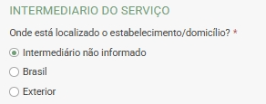

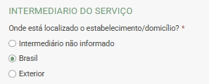

## Page 30

30
Telefone
Número do telefone do
intermediário
Número
Opcional
Preencher
com
número do telefone do
intermediário
E-mail
Endereço do
e-mail
cadastrado
como
contato no município
Endereço
de e-mail
Opcional
Preencher
com
o
endereço de e-mail do
intermediário
Endereço Intermediário no Brasil
CEP
Informação
do
número do CEP
Número
Obrigatório Preencher com o CEP
do endereço
Município
Informação do nome
do município ao qual
pertence
o
intermediário no Brasil
Texto
Obrigatório Este
campo
é
recuperado
das
informações
de
logradouro na tabela
TOM
com
o
CEP
informado
Bairro
Informação do nome
do bairro
Texto
Obrigatório Este
campo
é
recuperado
das
informações
de
logradouro na tabela
TOM
com
o
CEP
informado
Logradouro
Informação do nome
do logradouro
Texto
Obrigatório Este
campo
é
recuperado
das
informações
de
logradouro na tabela
TOM
com
o
CEP
informado
Número
Informação
do
número do logradouro
Texto
Obrigatório Preencher
com
o
número do logradouro
Complemento
Informação
do
complemento
do
logradouro
Texto
Opcional
Preencher
com
o
complemento
do
logradouro

### Images from Page 30

## Page 31

31
Intermediário do Serviço no Exterior - Caso esta opção seja marcada, os campos a serem
disponibilizados referem-se a informações específicas de outros países para uma pessoa física
ou jurídica domiciliada fora do Brasil.
Marcação se haverá ou
não a informação do
NIF
(Número
de
Identificação Fiscal –
número fornecido pelo
órgão
de
administração
tributária do exterior e
que identifica pessoa
física
ou
jurídica
externa
ao
Brasil
(equivale ao CPF ou
CNPJ, identificando a
pessoa
física
ou
jurídica no exterior).
CheckBox Obrigatório Marcar
uma
das
opções:
o Sim
o Não
Opção para caso o NIF
não for informado
CheckBox
Se a opção for Não
Informação sobre o
motivo
da
não
informação do NIF
Checkbox Obrigatório Selecionar uma das
duas opções:
Dispensado do NIF ou
Não exigência do NIF
Opção para caso o NIF
seja informado
Checkbox
Se a opção for Sim
NIF
Informação
do
número
de
Numérico Obrigatório Incluir
o
NIF
do
tomador.

### Images from Page 31

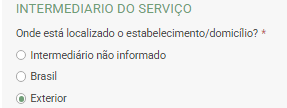

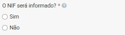

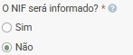

## Page 32

32
identificação
internacional
Pode recuperar o NIF
informado dos últimos
Intermediários
Nome/Razão Social
Nome ou Razão Social
do tomador
Texto
Obrigatório Preencher
com
o
Nome/Razão Social do
tomador
Telefone
Número do telefone do
tomador
Número
Opcional
Preencher
com
número do telefone do
tomador
E-mail
Endereço do
e-mail
cadastrado
como
contato no município
Endereço
de e-mail
Opcional
Preencher
com
o
endereço de e-mail do
tomador
Endereço do Intermediário no Exterior
Logradouro
Informação do nome
do
logradouro
no
exterior.
Texto
Obrigatório Preencher
com
o
logradouro no exterior
Número
Informação
do
número do logradouro
no exterior
Texto
Obrigatório Preencher
com
o
número do logradouro
no exterior
Complemento
Informação
do
complemento
do
logradouro no exterior
Texto
Opcional
Preencher
com
o
complemento
do
logradouro no exterior
Bairro
Informação do nome
do bairro no exterior
Texto
Obrigatório Preencher
com
o
bairro no exterior
Cidade
Informação do nome
da cidade no exterior
Texto
Obrigatório Preencher
com
o
nome da cidade no
exterior
Código
de
Endereçamento Postal
Informação do código
de
endereçamento
postal do endereço no
exterior
Caracter
Obrigatório Preencher
com
o
código
de
endereçamento postal
do
endereço
no

### Images from Page 32

## Page 33

33
exterior
Estado, província ou
região
Informação do nome
do Estado, província
ou região no exterior
Texto
Obrigatório Preencher
com
o
nome
do
Estado,
província ou região no
exterior
País
Informação do nome
do País
Combo
Obrigatório Selecionar
um
dos
países
da
lista
(AnexoA-
Tabelas_ISO2Paises_
MunIBGE_Rodovias-
SNNFSe_V1.00.02-
Produção.xlsx
—
Portal da Nota Fiscal
de Serviço eletrônica)
4.1.2. PASSO 2 – Serviço
Tela para preenchimento do(s) serviço(s) prestado pela pessoa física ou jurídica emitente da NFS-
e.
A obrigatoriedade dos campos da tabela, bem como as regras de negócio aplicadas para cada um
deles, estão na planilha de leiaute DPS e RN DPS descrita abaixo. Após o preenchimento da janela,
clicar em
.

### Images from Page 33

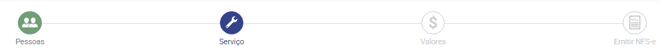

## Page 34

34
Campo
Descrição
Tipo
Ocorrência
Ação
Local da prestação do serviço
País
Informação sobre o
país onde ocorreu a
conclusão do serviço
prestado
Combo
Obrigatório Selecionar
um
dos
países
da
lista
constantes
do
AnexoA-
Tabelas_ISO2Paises_
MunIBGE_Rodovias-
SNNFSe_V1.00.02-
Produção .
Município
Informação sobre o
município
onde
ocorreu a conclusão
do serviço prestado,
quando o serviço for
prestado no Brasil.
Combo
Obrigatório Caso o local escolhido
para a prestação do
serviço
seja
Brasil,
Digitar pelo menos 3
caracteres do nome do
município
(AnexoA-
Tabelas_ISO2Paises_
MunIBGE_Rodovias-

### Images from Page 34

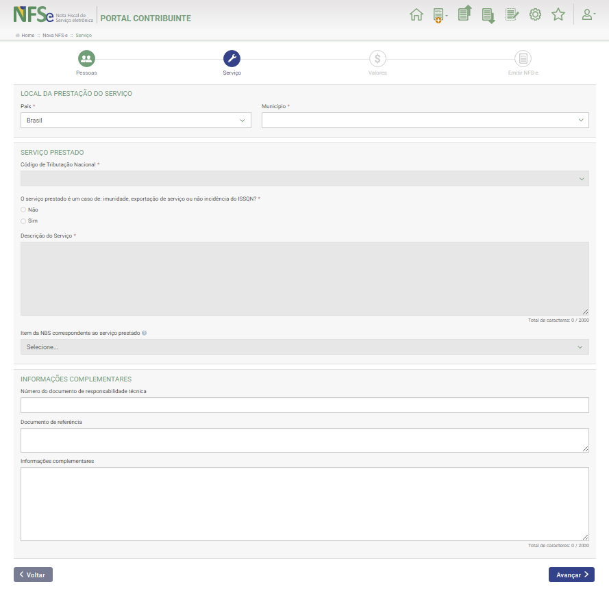

## Page 35

35
SNNFSe_V1.00.02-
Produção ) e o sistema
buscará o nome na
lista.
Serviço Prestado – Alguns campos relativos ao serviço prestado somente serão
disponibilizados dependendo do Código de Tributação Nacional informado.
Códido de Tributação
Nacional
Informação sobre o
Código de Tributação
Nacional  do serviço
prestado.
Combo
Obrigatório Digitar pelo menos 3
caracteres do Código
de Tributação Nacional
constante da AnexoB-
ListasServNac_NBS-
SNNFSe_V1.00.02-
Produção e o sistema
buscará o nome na
lista.
Caso
o
Código
de
Tributação
Nacional
seja um dos casos de
preenchimento
obrigatório do Local da
Prestação do serviço,
o sistema apresentará
a
tela
para
confirmação
Código Complementar
do Município
Informação sobre o
Código Complementar
Municipal  do serviço
prestado.
Combo
Obrigatório Selecionar dentre a
lista disponibilizada
Informação
se
o
serviço prestado é um
caso de: imunidade,
exportação de serviço
Combo
Obrigatório Marcar
uma
das
opções:

### Images from Page 35

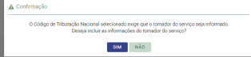

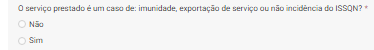

## Page 36

36
ou não incidência do
ISSQN?
Vários campos da terceira tela (Valores) serão preenchidos a depender das opções feitas neste
campo.
Se a resposta for “Não”, nenhuma informação adicional será necessária.
Se a resposta for “sim”, outros campos abrirão para preenchimento.
Caso tenha se optado por “sim” no campo anterior, deve-se informar se é um caso de:
imunidade, exportação de serviço ou não incidência do ISSQN?
Informação se é um
caso de “Imunidade”
de
tributação
do
ISSQN sobre o serviço
prestado.
combo
Obrigatório
uma
das
opções,
caso tenha
se optado
por
“sim”
no campo
anterior.
Selecionar
“Imunidade” caso seja
a
opção
para
não
tributação do ISSQN
sobre
o
serviço
prestado.

### Images from Page 36

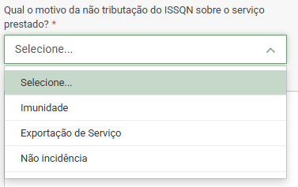

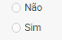

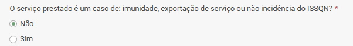

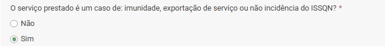

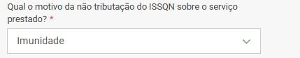

## Page 37

37
Selecionar uma das opções do Tipo de Imunidade para não incidência de ISSQN.
Informação se é um
caso de “Exportação
de
Serviço”
de
tributação do ISSQN
sobre
o
serviço
prestado.
O sistema exibirá a seguinte mensagem no painel:
Para efeitos do ISSQN, uma operação pode representar uma exportação de serviço quando:
a) o serviço foi concluído no exterior; ou,
b) o resultado dessa prestação é verificado no exterior.
Importante: o prestador deverá possuir elementos de prova, a serem exibidos para o Fisco
quando solicitado, de que os serviços foram executados de modo a atender uma demanda a
ser satisfeita no mercado exterior, em favor do tomador que atue, como tal, naquele outro
mercado.
Informação do país em
que
se
verificou
o
resultado do serviço
prestado
Combo
Opcional
Selecionar
um
dos
países
da
lista
constantes
do
AnexoA-
Tabelas_ISO2Paises_
MunIBGE_Rodovias-
SNNFSe_V1.00.02-
Produção
Informação se é um
caso
de
“Não
incidência”
de
tributação do ISSQN
sobre
o
serviço
Combo
Opcional
Preenchimento
automático quando no
campo
“Código
de
Tributação
Nacional”
for informado o código

### Images from Page 37

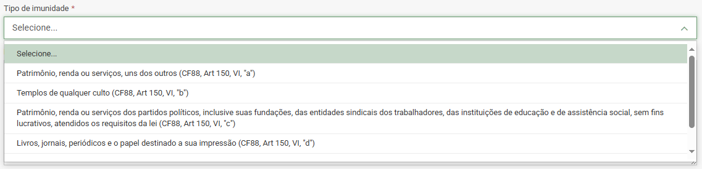

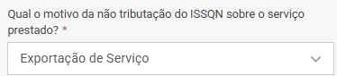

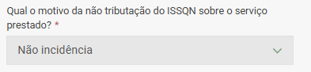

## Page 38

38
prestado. Esta opção
somente é possível se
no campo “Código de
Tributação
Nacional”
for informado o código
99.01.01
-
Serviço
sem
incidência
de
ISSQN e ICMS ou para
códigos
de
serviço
configurados
como
não
ocorrência
de
ISSQN
no
painel
município
do
respectivo município.
99.01.01
-
Serviço
sem
incidência
de
ISSQN e ICMS ou para
códigos
de
serviço
configurados
como
não
ocorrência
de
ISSQN
no
painel
município
do
respectivo município.
IMPORTANTE: Se o “Código de Tributação Nacional” informado não for o 99.01.01 ou algum
cadastrado no respectivo município como não incidência, o sistema não permitirá esta seleção
e exibirá a mensagem:
Nome do Município de
incidência do imposto.
Este
campo
será
exibido a depender do
“Código de Tributação
Nacional”,
por
exemplo 17.05.01 –
Fornecimento de mão-
de-obra, mesmo em
caráter
temporário,
Texto
Obrigatório
O Sistema Nacional NFS-e
identifica a localidade de
incidência
do
ISSQN
conforme
regras
estabelecidas na LC 116/03.
Existem exceções em que o
Sistema Nacional NFS-e não
identifica a localidade de
incidência
nem
haverá
destaque
do
ISSQN
na
emissão da NFS-e:
1) Em caso de imunidade
não existe localidade de
incidência para o ISSQN;
2) Em caso de exportação
de
serviço
não
existe
localidade de incidência para
o ISSQN;
3) Em caso de serviços sem
a
incidência
de
ISSQN

### Images from Page 38

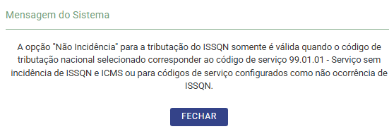

## Page 39

39
inclusive
de
empregados
ou
trabalhadores, avulsos
ou
temporários,
contratados
pelo
prestador de serviço.
(cTribNac igual a 990101),
não existe localidade de
incidência para o ISSQN;
4) Em caso de operação
tributável
deve
existir
localidade de incidência para
o ISSQN.
Inclusive para os serviços
prestados para os subitens
03.04 e 22.01, se informado
um município específico no
local
de
prestação
de
serviço,
conforme
TAB.MUN_IBGE.
As exceções para não existir
município de incidência do
ISSQN
nas
NFS-e
de
serviços prestados para os
subitens 03.04 e 22.01,
respectivamente,
são
definidos abaixo:
a) Em caso de Locação,
sublocação, arrendamento,
direito
de
passagem
ou
permissão
de
uso,
compartilhado ou não, de
ferrovia, rodovia, postes,
cabos, dutos e condutos de
qualquer natureza (subitem
03.04 da lista de serviço do
Sistema Nacional NFS-e),
se o local de prestação de
serviço informado na DPS
corresponder à localidade
geral definida para este
serviço (0001000, conforme
TAB.LOC.GERAL),
então não é identificada a
localidade de incidência para
o ISSQN na NFS-e
(as
informações
das
localidades de incidência do
ISSQN para o serviço 03.04
ocorrerão na solicitação de
apuração
enviada
pelo
contribuinte ao MAN);
Data de Competência
Data da competência
da
incidência
do
ISSQN.
Data
Obrigatório
Recupera os cadastros RFB
Código Complementar
Municipal
Código
tributário
Municipal
(para
os
serviços
com
especialização
definida)
Combo
Obrigatório
Incluir o código selecionado
Descrição do Serviço
Descrição do serviço
prestado
Texto
Obrigatório Incluir uma descrição
detalhada do serviço
prestado
Item
da
NBS Informação sobre a Combo
Opcional
Escolher a NBS de

## Page 40

40
correspondente
ao
serviço prestado
NBS - Nomenclatura
Brasileira de Serviços
uma
lista
disponibilizada.
Código
interno
do
contribuinte
Código
interno
do
contribuinte
Texto
Obrigatório Incluir código interno
do contribuinte
Serviço – Informações para Comércio Exterior – quando o País da Prestação do
serviço é diferente de Brasil, algumas informações adicionais são requisitadas.
Para a RFB, a prestação de serviço caracteriza-se como uma operação de comércio exterior
quando existe ao menos um dos seguintes itens identificados/localizados no exterior: tomador,
intermediário ou local da prestação do serviço. Desta forma, são exigidas do emitente da DPS
informações acerca deste tipo de transação conforme a seguir.
Informa a modalidade
pela qual o serviço
será prestado
Combo
Obrigatório Selecionar uma das
opções de modalidade
do serviço prestado da
lista disponibilizada.
o Transfronteiriço
o Consumo no Brasil
o Movimento
Temporário
de
Pessoas Físicas
o Consumo
no
Exterior
Informa
o
vínculo
entre as partes no
negócio
Combo
Obrigatório Selecionar
um
dos
vínculos
do
serviço
prestado
da
lista
disponibilizada.
o Sem vínculo com o
tomador/prestador
o Controlada
o Controladora
o Coligada
o Matriz
Moeda
Identifica a moeda da
transação comercial.
Código
Obrigatório Informar o código da
moeda publicado na
tabela de moedas do

### Images from Page 40

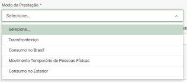

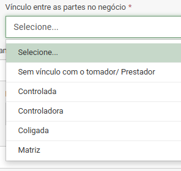

## Page 41

41
Banco
Central
do
Brasil composto por 3
dígitos numéricos.
Valor do serviço em
moeda estrangeira
Valor
do
serviço
expresso na moeda
estrangeira
especificada
Valor
Obrigatório Incluir valor na moeda
estrangeira
especificada
Descreve
o
mecanismo
de
apoio/fomento
ao
Comércio
Exterior
utilizado
pelo
prestador do serviço.
Combo
Obrigatório Selecionar
o
mecanismo
de
apoio/fomento
ao
Comércio
Exterior
utilizado
pelo
prestador do serviço
dentre as opções da
lista.
o Nenhum;
o ACC – Adiantamento
sobre Contrato de
Câmbio – Redução a
zero do IR e do IOF;
o ACE – Adiantamento
sobre
Cambiais
Entregues
–
Redução a Zero do
IR e do IOF;
o BNDES-Exim
Pós-
Embarque
–
Serviços;
o BNDES-Exim
Pré-
Embarque
–
Serviços.
Mecanismo
de
apoio/fomento
ao
Comércio
Exterior
utilizado pelo tomador
do serviço
Combo
Obrigatório Selecionar
o
mecanismo
de
apoio/fomento
ao
Comércio
Exterior
utilizado pelo tomador
do serviço dentre as

### Images from Page 41

## Page 42

42
opções da lista.
o Nenhum;
o Adm.
Pública
e
Repr.
Internacional;
o Aluguéis e Arrend.
Mercantil
de
máquinas, equip.,
embarc.
E
aeronaves;
o Arrendamento
mercantil
de
aeronave
de
empresa
de
transporte
aéreo
público;
o Comissão
a
agentes
externos
na exportação.
Informação se Existe
vínculo da operação à
movimentação
temporária de bens.
Combo
Obrigatório Selecionar a opção do
vínculo dentre a lista
disponibilizada:
o Não;
o Vinculada
–
Declaração
de
Importação;
o Vinculada
–
Declaração
de
Exportação.
Se a opção acima for : Vinculada – Declaração de Importação, o contribuinte deve informar  o
número da declaração de Importação (DI/DSI/DA/DRI-E) averbado.
DI/DSI/DA/DRI-E
averbado
Número da Declaração
de
Importação
(DI/DSI/DA/DRI-E)
averbado.
Texto
Obrigatório Incluir
Número
da
Declaração
de
Importação
(DI/DSI/DA/DRI-E)
averbado.

### Images from Page 42

## Page 43

43
Se a opção acima for : Vinculada – Declaração de Exportação, o contribuinte deve informar o
Registro de Exportação (RE) averbado.
RE averbado
Número do Registro de
Exportação
(RE)
averbado.
Texto
Obrigatório Incluir o Número do
Registro
de
Exportação
(RE)
averbado.
Deseja
compartilhar
a
NFS-e que será gerada
desta DPS com o MDIC?
Informação sobre o
compartilhamento da
NFS-e que será gerada
a partir desta DPS com
o MDIC.
Combo
Obrigatório Selecionar uma das
opções:
o
Sim
o
Não
INFORMAÇÕES PARA OBRA
Campos que serão exibidos quando o Serviço prestado se refere a Obras - o Código
de Tributação Nacional são dos subitens 07.02 e 07.05.
Deve-se marcar uma das opções de informação:
Código da Obra
Número
de
identificação da obra
Texto
Obrigatório Incluir o código da
obra
Somente permitido se a opção do Local da Prestação do Serviço for Brasil.
CEP
Informação
do
número do CEP da
obra.
Número
Obrigatório Incluir o CEP da obra
Município
Informação do nome Texto
Obrigatório O sistema recupera as

### Images from Page 43

## Page 44

44
do município ao qual
pertence a obra no
Brasil
informações
de
logradouro na tabela
TOM
com
o
CEP
informado
Bairro
Informação do bairro  Texto
Obrigatório O sistema recupera as
informações
de
logradouro na tabela
TOM
com
o
CEP
informado
Logradouro
Informação do nome
do logradouro.
Texto
Obrigatório O sistema recupera as
informações
de
logradouro na tabela
TOM
com
o
CEP
informado
Número
Informação
do
número
do
logradouro,
Texto
Obrigatório Incluir o número do
logradouro
Complemento
Informação
do
complemento
do
logradouro.
Texto
Opcional
Incluir o complemento
do logradouro
Somente permitido se a opção do Local da Prestação do Serviço não for Brasil.
Bairro
Informação do bairro
no exterior.
Texto
Obrigatório Informar o bairro no
exterior do local da
obra.
Logradouro
Informação do nome
do
logradouro
no
exterior.
Texto
Obrigatório Informar o logradouro
no exterior do local da
obra.
Número
Informação
do
número do logradouro
Texto
Obrigatório Informar o número no
exterior do local da
obra.

### Images from Page 44

## Page 45

45
Complemento
Informação
do
complemento
do
logradouro no exterior.
Texto
Opcional
Informar
o
complemento
no
exterior do local da
obra.
Código
de
Endereçamento Postal
Informação
do
número do Código de
endereçamento Postal
no exterior.
Número
Obrigatório Informar o código de
endereçamento fiscal
no exterior do local da
obra.
Estado, província ou
região
Informação do Estado,
província ou região no
exterior.
Texto
Obrigatório Informar o  no exterior
Estado, província ou
região
do
local
da
obra.
Cidade
Informação da cidade
no exterior.
Texto
Obrigatório Informar a cidade no
exterior do local da
obra.
Inscrição
Imobiliária
Fiscal
Código
de
inscrição
imobiliária
fornecida
pela Prefeitura
Texto
Obrigatório Incluir
a
inscrição
imobiliária
fiscal
(
código fornecido pela
prefeitura
para
a
identificação da obra
ou
para
fins
de
recolhimento
do
IPTU).
INFORMAÇÕES PARA ATIVIDADE DE EVENTO
Campos que serão exibidos quando o Serviço prestado se refere a atividades de
Eventos - o Código de Tributação Nacional  dos subitens do item 12.
Data Inicial
Data em que se iniciou
a prestação do serviço
Data
Obrigatório Incluir a data de início
do serviço
Data Final
Data em que se foi ou
será
concluída
a
prestação do serviço
Data
Obrigatório Incluir a data final do
serviço
Descrição
Descrição do serviço
prestado
Texto
Obrigatório Incluir descrição do
serviço
Seleção de uma das formas de informação sobre o serviço prestado:

## Page 46

46
Identificação
Informação sobre o
código identificador da
atividade do evento
determinado
pela
Administração
Tributária
Código
Opcional
Incluir
código
de
identificação
da
atividade do evento
Somente permitido se a opção do Local da Prestação do Serviço for Brasil.
CEP
Informação
do
número do CEP da
obra.
Número
Obrigatório Incluir o CEP do local
do evento.
Município
Informação do nome
do município ao qual
pertence a obra no
Brasil
Texto
Obrigatório O sistema recupera as
informações
de
logradouro na tabela
TOM
com
o
CEP
informado
Bairro
Informação do bairro  Texto
Obrigatório O sistema recupera as
informações
de
logradouro na tabela
TOM
com
o
CEP
informado
Logradouro
Informação do nome
do logradouro.
Texto
Obrigatório O sistema recupera as
informações
de
logradouro na tabela
TOM
com
o
CEP
informado

### Images from Page 46

## Page 47

47
Número
Informação
do
número
do
logradouro,
Texto
Obrigatório Incluir o número do
logradouro do local do
evento.
Complemento
Informação
do
complemento
do
logradouro.
Texto
Opcional
Incluir o complemento
do logradouro do local
do evento.
Somente permitido se a opção do Local da Prestação do Serviço não for Brasil.
Bairro
Informação do bairro
no exterior.
Texto
Obrigatório Informar o bairro no
exterior do local do
evento.
Logradouro
Informação do nome
do
logradouro
no
exterior.
Texto
Obrigatório Informar o logradouro
no exterior do local do
evento.
Número
Informação
do
número do logradouro
Texto
Obrigatório Informar o número no
exterior do local do
evento.
Complemento
Informação
do
complemento
do
logradouro no exterior.
Texto
Opcional
Informar
o
complemento
no
exterior do local do
evento.
Código
de
Endereçamento Postal
Informação
do
número do Código de
endereçamento Postal
no exterior.
Número
Obrigatório Informar o código de
endereçamento fiscal
no exterior do local do
evento.
Estado, província ou
região
Informação do Estado,
província ou região no
exterior.
Texto
Obrigatório Informar o  no exterior
Estado, província ou
região
do
local
do
evento.
Cidade
Informação da cidade Texto
Obrigatório Informar a cidade no
exterior do local do

### Images from Page 47

## Page 48

48
no exterior.
evento.
INFORMAÇÕES COMPLEMENTARES
Número
do
documento
de
responsabilidade
técnica
Informação sobre o
número do documento
de
responsabilidade
técnica
Texto
Opcional
Incluir o número  do
documento
de
responsabilidade
técnica.
Documento
de
referência
Informação
sobre
documentos
referenciados
Texto
Opcional
Incluir dados sobre o
documento
de
responsabilidade
técnica.
Informações
Complementares
Descrição
de
informações
complementares
Texto
Opcional
Incluir
informações
complementares sobre
o serviço.
Após o preenchimento dos campos da etapa Serviço, clicar em “avançar”.
4.1.3. PASSO – Valores
Tela para preenchimento dos valores do(s) serviço(s) que originou a emissão da NFSe.
A obrigatoriedade dos campos da tabela, bem como as regras de negócio aplicadas para cada um
deles, estão na planilha de leiaute DPS e RN DPS descrita abaixo.
Preencher os campos conforme as regras descritas na tabela abaixo e clicar em “Avançar”  .A
obrigatoriedade dos campos da tela do passo, bem como as regras de negócio aplicadas para cada
um deles, são dadas para cada campo das planilhas de leiaute DPS e RN DPS (AnexoI-
LeiautesRN_DPS_NFSe-SNNFSe) que corresponda ao campo na tela.
Alguns campos podem não estar editáveis, serão preenchidos de acordo com as
configurações , do contribuinte e/ou serviço, do município em que o contribuinte
está autorizado a emitir notas, bem como os indicadores municipais previamente
cadastrados no Painel Municipal.
Campo
Descrição
Tipo
Ocorrência
Ação
Valor
do
Serviço Informação sobre o Valor
Obrigatório Incluir o valor total do

### Images from Page 48

## Page 49

49
prestado
valor
total
cobrado
pelo serviço prestado
serviço
Valor
recebido
pelo
intermediário
Informação sobre o
valor
pago
ao
intermediário
(caso
informado na etapa 1
(pessoas)
Valor
Opcional
Incluir valor recebido pelo
intermediário (se houver).
Desconto
incondicionado
Informação sobre o
valor
do
desconto
incondicionado
(desconto
oferecido
sem
que
haja
necessidade de que
alguma condição seja
cumprida
para
obtenção do desconto.
Ele é concedido por
vontade do prestador
sem
qualquer
imposição, reduzirá o
valor
do
serviço
prestado).
Valor
Opcional
Incluir o valor do desconto
incondicional.
Desconto
condicionado
Informação sobre o
valor
do
desconto
condicionado
(desconto
oferecido
desde
que
alguma
condição
seja
cumprida
para
obtenção do desconto.
este
depende
de
alguma
condição
posterior à emissão da
NFS-e.
A
base
de
cálculo não é reduzida
por este desconto).
Valor
Opcional
Incluir o valor do desconto
condicionado.
TRIBUTAÇÃO MUNICIPAL

## Page 50

50
Alguns campos já estarão preenchidos a depender das opções feitas em etapas anteriores.
Por exemplo: não é permitido ao emitente informar alguns campos se tratar de uma situação
de exportação de serviço, conforme a planilha "COMEX - EXPORTAÇÃO DE SERVIÇO".
- Este campo será pré-preenchido dependendo das
opções das telas anteriores:
• Operação tributável;
• Imunidade;
• Exportação de serviço;
• Não Incidência;
Informação de que a
operação é tributável.
Combo Obrigatório Preenchimento automático
do tipo de exigibilidade do
ISSQN
seguindo
regras
devido ao preenchimento
de
campos
das
telas
anteriores.
Relaciona os Regimes
Especiais
de
Tributação
definidos.
Somente
disponível
quando a operação for
tributável.
Combo Obrigatório Selecionar
umas
das
opções:
• Nenhum;
• Ato cooperado;
Se a opção for “Nenhum”, alguns campos serão disponibilizados para preenchimento;
País
Resultado
do
Serviço
Código do país onde se
verificou o resultado
da
prestação
do
serviço para o caso de
Exportação
de
Serviço.
Se houver indicação
Combo Obrigatório Incluir
país
onde
ser
verificou o resultado do
serviço exportado.

### Images from Page 50

## Page 51

51
pelo
emitente
de
exportação de serviço,
mesmo não havendo
nenhum
elemento
para a ocorrência de
exportação, então o
emitente deve indicar
em qual país ocorreu o
resultado do serviço
prestado.
Suspensão da exigibilidade do ISSQN – campos de informação sobre a exigibilidade do
imposto.
A depender das opções das telas anteriores, alguns campos serão preenchidos
automaticamente.
Se a operação for tributável, alguns campos deverão ser preenchidos.
Informação sobre a
exigibilidade
do
recolhimento
do
ISSQN devido nesta
operação
está
suspensa?
Opção
Sim/N
ão
Obrigatório Exibe os campos relativos
à
suspensão
da
exigibilidade:
•
Sim; ou
•
Não.
Informação sobre o
tipo de suspensão:
Judicial
ou
Administrativa
combo Obrigatório Selecionar
o
tipo
da
suspensão:
• Exigibilidade
suspensa por decisão
judicial; ou
• Exigibilidade
suspensa
por
processo
administrativo.

### Images from Page 51

## Page 52

52
Número do processo
Informação
do
número da suspensão
da exigibilidade
Valor
Obrigatório Informar o número do
processo da suspensão
Retenção do ISSQN – Informação se haverá ou não retenção de ISSQN.
Importante:
Nos casos de exigibilidade suspensa não é possível informar retenção do ISSQN,
o sistema exibirá uma mensagem de alerta.
Informação
de
que
“Não” haverá retenção
de ISSQN.
Combo Obrigatório Marcar “Não”. Neste caso
nenhum campo a mais
será mostrado.
Informação
de
que
“Sim” haverá retenção
de ISSQN.
Combo Obrigatório Marcar “Sim”. Neste caso
será aberto o campo por
quem o ISSQN será retido.
Opções de retenção do
ISSQN
Informação
se
o
ISSQN:
• Retido
pelo
Tomador
• Retido
pelo
Intermediário
Botão
Radio
Obrigatório Informar
o
tipo
da
retenção do ISSQN.
a) Se a opção for “Retido
pelo Tomador” – deve ter
sido informado o tomador
de serviço na primeira tela.
Se não for informado, será
mostrada a mensagem:

### Images from Page 52

## Page 53

53
Pode ser usado o botão
“+Incluir Tomador”;
b) Se a opção for “Retido
pelo Tomador” – deve ter
sido informado o tomador
de serviço na primeira tela.
Se não for informado, será
mostrada a mensagem :
Pode ser usado o botão
“+Incluir Intermediário”;
Incluir Tomador
Botão
Obrigatório Informar
os
dados
do
tomador se não tiverem
sido informados o passo
pessoas
Incluir Intermediário
Botão
Obrigatório Informar
os
dados
do
intermediário
se
não
tiverem sido informados o
passo pessoas
Benefício Municipal -  Exibe os campos relativos ao benefício municipal
Informação há amparo
de benefício municipal
na tributação.
Opção
Sim/N
ão
Obrigatório Informar:
• “Não”.
Neste
caso
nenhum campo a mais
será mostrado.
• “Sim” – só é possível se
o
município
tiver
cadastrado  “benefício”

### Images from Page 53

## Page 54

54
para o serviço prestado
e/ou
prestador
do
serviço
na
data
de
competência informada.
(Obs: entrar em contato
com
o
município,
se
alguma
das
situações
acima ocorrer.).
Informação de “sim”
para
amparo
de
benefício municipal na
tributação.
Opção
Sim/N
ão
Obrigatório Informar
“sim”
para
benefício
fiscal.
Alguns
campos
obrigatórios
deverão ser preenchidos.
Informação sobre a
identificação do BM
Combo Obrigatório Selecionar dentre uma das
opções configuradas pelo
município concedente.
Valor para redução da BC Informação sobre o
valor da redução do
BM na BC
Valor
Obrigatório Informar o valor, caso seja
um
dos
beneficiados
cadastrados
pelo
município.
Informações para dedução/redução da base de cálculo do ISSQN
Caso seja um dos beneficiados do município, marcar “Sim”;
O painel mostrará então as opções:

### Images from Page 54

## Page 55

55
Caso o município tenha configurado o serviço e/ou contribuinte na lsita dos beneficiados do BM, o campo a
seguir deverá ser preenchido com “Sim” ou “Não”.
Não será informado
nenhum
tipo
de
dedução/redução
Combo Obrigatório Selecionar
uma
das
opções:
• Não
• Sim
Valor
Informação sobre o
valor de Redução da
BC
Valor
Obrigatório Informar a parte do valor
monetário do documento
apto a ser utilizado como
redução da BC.
O valor deve ser menor que o valor do serviço prestado.
Percentual
O
valor
da
dedução/redução será
calculado
pelo
percentual informado
Valor
Obrigatório Informar
o
valor
percentual do documento
que estará apto a ser
utilizado como redução da

### Images from Page 55

## Page 56

56
BC, caso o BM seja em
relação à alíquota.
Ao clicar em
, o painel abrirá a tela para inclusão das informações
referentes aos documentos vinculados à dedução.
Informação do tipo de
documento
a
ser
informado.
Combo Obrigatório Selecionar da lista:
A
depender
do
tipo
de
documento
informado,
o
painel exibirá os campos com

### Images from Page 56

## Page 57

57
as
informações
a
serem
preenchidas.
Chave de Acesso da
NFS-e ou da Chave de
acesso da NF-e
Informação sobre a
chave de acesso da
NF-e ou NFS-e a ser
vinculada à dedução.
Valor
Obrigatório Informar o número da
chave
de
acesso
do
documento:
Se NF-e deve conter 44
dígitos numéricos;
Se NFS-e deve conter 50
dígitos numéricos;
O sistema fará a busca do
respectivo documento na
base
de
dados
e
confirmará
a
existência
dele, caso o documento
não exista será exibida a
mensagem: Informe uma
chave de NF-e ou NFS-e
válida.
Informação sobre a
identificação
da
dedução.
Combo Obrigatório Selecionar uma das opções
disponíveis.
Data da emissão
Informação sobre a
data de emissão do
documento
Data
Obrigatório Informar
a
data
de
emissão do documento
Valor dedutível
Informação
sobre
valor dedutível.
Valor
Obrigatório Informar a parte do valor
do documento apto a ser
utilizado como dedução.
Valor da dedução
Informação sobre o
valor da dedução.
Valor
Obrigatório Parte do valor identificado
como apto a reduzir a base
de cálculo da NFS-e em
emissão.
Alíquota
Informação do percentual
do imposto efetivo aplicado
Valor
Conforme
Regra
de
Recuperado do valor percentual
informado na tela “Serviço” para

### Images from Page 57

## Page 58

58
ao valor da base de cálculo
Negócio
o cálculo do ISSQN.
BC ISSQN
Informação sobre a base de
cálculo do ISSQN.
Valor
Conforme
Regra
de
Negócio
Recuperado do valor total do
serviço reduzido o valor total das
deduções e do valor do desconto
incondicionado.
Valor ISSQN
Valor do imposto a ser
recolhido
Valor
Conforme
Regra
de
Negócio
Calculado
automaticamente,
sendo o valor do imposto a ser
recolhido para pagamento ao
município.
TRIBUTAÇÃO FEDERAL
Quando o emitente tem os tributos relacionados apurados pelo Simples Nacional,
as informações de Tributação Federal já estarão preenchidas e não podem ser
alteradas.
Pis/Cofins – Os campos a serem preenchidos dependem da opção da “Situação Tributária do
PIS/COFINS” selecionada.
Informação
sobre
s
tipo
de
operação
tributária
Combo Opcional
Selecionar dentre os tipos
de operação tributária da
lista disponibilizada:

### Images from Page 58

## Page 59

59

### Images from Page 59

## Page 60

60
BC PIS/COFINS
Total do valor da base
de
cálculo
para
PIS/COFINS
Valor
Conforme
Regra
de
Negócio
Incluir o valor informado
PIS - Alíquota
Valor do percentual a
ser aplicado
Valor
percen
tual
Conforme
Regra
de
Negócio
Incluir
percentual
informado
PIS – Valor do Imposto
Valor
calculado
do
imposto pela alíquota
informada
Valor
Conforme
Regra
de
Negócio
-
COFINS - Alíquota
Valor do percentual a
ser aplicado
Valor
percen
tual
Conforme
Regra
de
Negócio
Incluir
percentual
informado
COFINS
–
Valor
do
imposto
Valor
calculado
do
imposto pela alíquota
informada
Valor
Conforme
Regra
de
Negócio
-
Tipo retenção do PIS/COFINS
Define que não haverá
retenção do Pis/Cofins
Combo Obrigatório

### Images from Page 60

## Page 61

61
Define
que
haverá
retenção do Pis/Cofins
Combo Obrigatório
Outros tributos federais
Valor Retido IRRF
Valor do IRPF retido
conforme
legislação
própria
Valor
Opcional
Incluir o valor do IRPF se
aplicável
Valor Retido CSLL
Valor da CSLL retido
conforme
legislação
própria
Valor
Opcional
Incluir o valor do CSLL se
aplicável
Valor Retido CP
Valor da Contribuição
Patrimonial
Previdenciária
retida
conforme
legislação
própria
Valor
Opcional
Incluir
o
valor
da
Contribuição
Patrimonial
Previdenciária se aplicável
VALOR APROXIMADO DOS TRIBUTOS
As informações dos valores aproximados dos tributos podem ser pré-configuradas, agilizando a
emissão da NFS-e.
Para isto, acesse a opção "Configurações" no menu principal.
Valores monetários totais para os tributos Federal, Estadual e Municipal
Federal
Informação sobre o
valor monetário total
para
os
tributos
Federais da NFS-e em
relação ao valor do
serviço.
Valor
Obrigatório Preencher com o valor
monetário total para os
tributos Federais da NFS-e
em relação ao valor do
serviço.
Estadual
Informação sobre o
valor monetário total
para
os
tributos
Estaduais da NFS-e
Valor
Obrigatório Preencher com o valor
monetário total para os
tributos estaduais da NFS-
e em relação ao valor do

### Images from Page 61

## Page 62

62
em relação ao valor do
serviço.
serviço.
Municipal
Informação sobre o
valor monetário total
para
o
imposto
municipal da NFS-e
em relação ao valor do
serviço.
Valor
Obrigatório Preencher com o valor
monetário total para o
imposto municipal da NFS-
e em relação ao valor do
serviço.
Valores percentuais totais para os tributos Federal, Estadual e Municipal
Federal
Informação
dos
valores
percentuais
totais para os tributos
Federais.
Valor
Obrigatório Informar
o
valor
percentual
total
de
impostos federais da NFS-
e em relação ao valor total
do serviço.
Estadual
Informação
dos
valores
percentuais
totais para os tributos
estaduais.
Valor
Obrigatório Informar
o
valor
percentual
total
de
impostos
estaduais
da
NFS-e em relação ao valor
total do serviço.
Municipal
Informação
dos
valores
percentuais
totais para o imposto
municipal.
Valor
Obrigatório Informar
o
valor
percentual
total
do
imposto municipal da NFS-
e em relação ao valor total
do serviço.
4.1.4. PASSO 4 – Emitir NFS-e
Será apresentado um resumo dos itens informados em cada um dos passos de preenchimento da
NFS-e. Neste momento o usuário tem a possibilidade de retornar e alterar as informações prestadas
antes de solicitar a emissão da NFS-e.

### Images from Page 62

## Page 63

63
Neste passo é importante que se revise a Declaração de Prestação de Serviço (DPS) e confira o
cálculo prévio do imposto devido. Se necessário, é possível a alteração  das informações prestadas
nos passos anteriores.
O acionamento do comando “Emitir NFS-e” da tela envia o XML da DPS que foi formado pelo
preenchimento das informações dos passos para o Serviço de Geração de NFS-e da Sefin Nacional
NFS-e. Este serviço valida a DPS conforme regras do ANEXO_I-SEFIN_ADN-DPS_NFSe-SNNFSe e
retorna o XML da NFS-e gerada.
4.1.4.1. Editar Pessoas
O usuário deve conferir os dados das pessoas envolvidas na emissão do documento, caso alguma
informação não esteja correta, deve clicar em “Editar Pessoas”, fazer as alterações necessárias e
clicar em “Avançar”.
4.1.4.2. Editar Serviço
O usuário deve conferir os dados do serviço informado na emissão do documento, caso alguma
informação não esteja correta, deve clicar em “Editar Serviço”, fazer as alterações necessárias e
clicar em “Avançar”.

### Images from Page 63

## Page 64

64
4.1.4.3. Editar Valores
Os valores serão recuperados conforme os dados preenchidos nas etapas anteriores, o usuário deve
conferir os valores retornados para a emissão do documento, caso alguma informação não esteja
correta, deve clicar em “Editar Tributação”, fazer as alterações necessárias e clicar em “Avançar”.

### Images from Page 64

## Page 65

65
4.1.5. NFS-e Gerada com sucesso
Após conferir todos os dados informados, o usuário deve clicar em
, será
apresentado um resumo da NFS-e gerada incluindo a chave de acesso a mesma.
Após a NFS-e gerada com sucesso o Emissor Web permite ações:
•
Baixar o XML da NFS-e (baixa o arquivo XML da NFS-e);
•
Baixar o DANFSe (Documento Auxiliar de Nota Fiscal de Serviço eletrônica - representação
da NFS-e com informações resumidas da nota);
•
Visualizar NFS-e (visualização no navegador do emitente em formato web);
•
NFS-e emitidas (direciona para a funcionalidade que exibe as NFS-e emitidas pelo usuário);
•
Nova NFS-e (recomeça o preenchimento da DPS para a geração de uma nova NFS-e);

### Images from Page 65

## Page 66

66
4.2. Emissão de NFS-e Simplificada (Contribuintes MEI ou do Simples Nacional)
Os contribuintes pertencentes ao Simples Nacional podem emitir uma versão simplificada da NFS-
e, ou seja, o preenchimento de um grupo menor de informações é suficiente para emitir a NFS-e.
Ao final do preenchimento o Emissor Público Nacional NFS-e emite uma NFS-e com o mesmo leiaute
especificado no ANEXO_I-SEFIN_ADN-DPS_NFSe-SNNFSe. A maioria dos campos necessários e
obrigatórios pelo leiaute já foram obtidos pelo cadastro do contribuinte.
A obrigatoriedade dos campos, bem como as regras de negócio aplicadas para cada um deles, são
dadas pelas planilhas de leiaute DPS e RN DPS (ANEXO_I-SEFIN_ADN-DPS_NFSe-SNNFSe).
4.3. Emissão por decisão administrativa ou judicial
A emissão de notas pelo fluxo de decisão administrativa ou judicial possibilita a geração dos
documentos fiscais sem a necessidade de validação completa das regras de negócio aplicáveis ao
processo padrão de emissão, conforme estabelecido no ANEXO_I-SEFIN_ADN-DPS_NFSe-SNNFSe
na planilha RN_DPS_NFS-e coluna “L”.
Essa funcionalidade tem como objetivo atender às determinações estabelecidas por tais
decisões, sendo importante ressaltar que o contribuinte deve estar devidamente vinculado a uma
decisão reconhecida pelo município.
4.3.1.
Inclusão de NFS-e por decisão administrativa / judicial
Para inclusão de uma nota referente a decisão administrativa ou judicial, deve-se cliclar na
opção “Emissão por decisão administrativa / judicial” existente no menu principal:

### Images from Page 66

## Page 67

67
Caso o contribuinte não esteja vinculado a nenhuma decisão administrativa / judicial em
nenhum município conveniado, será apresentada a tela a seguir:
Caso contrário, se o usuário estiver vinculado a qualquer decisão administrativa / judicial,
será exibida a tela abaixo para inclusão das informações:
A prestação das informações segue o mesmo fluxo que uma emissão normal, com algumas
particularidades, como por exemplo na tela de “Pessoas”:
•
Informar uma data de competência onde o usuário pode emitir uma NFS-e por
decisão administrativa / judicial;

### Images from Page 67

## Page 68

68
•
Informar os demais campos da tela, atentando para a possibilidade de informar o
mesmo CPF/CNPJ do emitente como tomador / intermediário do serviço.
Para tela de “Serviços”:
•
Informar os campos desejados na tela, atentando para a seleção do município de
incidência, que neste caso não é calculado pelo sistema;
•
O preenchimento dos grupos de obras, atividade de evento e comércio exterior é
opcional.
Finalmente, na tela de “Valores”:
•
É necessário informar todos os valores, tendo em vista que os cálculos automáticos
não são realizados;
•
Também é necessário informar os valores da NFS-e, que no fluxo normal são
calculados automaticamente.
Após o preenchimento das informações nas telas anteriores, basta clicar em “Emitir NFS-e”
para finalizar o processo.
4.3.2.
Consulta de NFS-e emitida por decisão administrativa / judicial
Para identificar notas emitidas pelo fluxo de decisão administrativa / judicial, basta acessar
a opção “NFS-e Emitidas” no menu principal, as notas emitidas por decisão administrativa / judicial
possuem a identificação abaixo (icone com detalhe azul):
4.3.3.
Cancelar NFS-e emitidas por decisão administrativa / judicial
Para cancelar uma nota emitida pelo fluxo de decisão administrativa / judicial, deve-se
acessar a opção “NFS-e Emitidas no menu principal, e identificar a nota que deseja cancelar.
No menu lateral da nota desejada, selecionar a opção “Cancelar NFS-e” conforme a tela
abaixo:

### Images from Page 68

## Page 69

69
Preencher as informações da janela aberta e clicar em “Cancelar NFS-e”, a nota cancelada
terá seu status alterado conforme a tela abaixo:
4.3.4.
Substituir NFS-e emitida por decisão administrativa / judicial
Para substituir uma nota emitida, deve-se acessar a opção “NFS-e Emitidas” e identificar a
nota que deseja substituir.
No menu lateral, selecionar a opção “Substituir”:

### Images from Page 69

## Page 70

70
O sistema verificará se a nota selecionada pode ser substituída por outra emitida tanto pelo
fluxo padrão quanto pelo fluxo de decisão administrativa ou judicial. Caso essa substituição seja
possível, será exibida uma janela para que o emitente escolha qual fluxo deseja utilizar:
Após selecionar o fluxo desejado e clicar em “Confirmar”, o sistema irá direcionar para o
fluxo de emissão por substituição.
4.4. Configuração do sistema para emissão da NFS-e simplificada.
Para a emissão da NFSs-e simplificada, é necessário realizar algumas configurações no sistema.
Acesse as opções "Configurações" e "Serviços Favoritos" no menu superior e preencha as
informações de "Valor aproximado dos Tributos" e crie os serviços favoritos, respectivamente.

### Images from Page 70

## Page 71

71
Se o usuário acessar a “Emissão Simplificada” e não tiver feito às configurações, o sistema exibirá
a seguinte tela.
4.4.1. Configurações no menu principal:
O sistema exibirá a seguinte tela:
Informar o e-mail e telefone e marcar a opção para os cálculos/exibição dos valores totais
dos tributos Federais, Estaduais e Municipais.

### Images from Page 71

## Page 72

72
Clicar em
e voltar para a emissão simplificada.
4.4.2. Criando serviços favoritos
O sistema exibirá a tela abaixo para inclusão de
.
Preencher os campos:
1)  Apelido (termo que ajudará o emissor, posteriormente, a identificar o serviço pré-
configurado dentro do Sistema Nacional da NFS-e. deve ter no máximo 50 caracteres).
2) Código de Tributação Nacional – selecionar dentre os códigos da lista;
3) Item da NBS correspondente ao serviço prestado – Nomenclatura Brasileira de Serviços
intangíveis e outras operações que produzam variações no patrimônio é o classificador
nacional para a identificação dos serviços e viabiliza adequadamente a elaboração
fiscalização e avaliação de políticas públicas de forma integrada. Selecionar dentre os
valores cadastrados.
4) Descrição do serviço.

### Images from Page 72

## Page 73

73
Após o preenchimento de todos os campos, clicar em
.
O serviço será mostrado na tela inicial, onde será possível editar ou excluir ,
,um serviço já cadastrado, ou cadastrar um
.
4.4.3. Emitir NFS-e
Após as configurações acima feitas, para os serviços cadastrados com “favoritos”, é possível a
Emissão Simplificada da NFS-e.

### Images from Page 73

## Page 74

74
Será apresentado um formulário simplificado para preenchimento de quatro informações:
Identificador do tomador de serviço, serviço prestado (que é o código de tributação, mas que será
apresentado na tela conforme configuração feita previamente pelo próprio contribuinte), valor do
serviço prestado e se há ou não Retenção na Fonte.
Para quase todos os serviços prestados estes campos serão suficientes para a emissão simplificada
para contribuintes MEI ou do Simples Nacional.
Caso o serviço prestado seja uma obra ou atividade de evento, o sistema solicita informações
adicionais de preenchimento que identificação a obra ou seu local de execução e no caso de
atividade de evento o local desta atividade.
Campo
Descrição
Tipo
Ocorrênci
a
Ação
CPF/CNPJ do Cliente
Informação sobre o
CPF/CNPJ do tomador
Numérico Obrigatório Incluir o CPF/CNPJ do
tomador
Nome/Razão Social do
Cliente
Informação sobre o
Nome/Razão Social do
Cliente
Texto
Obrigatório Preenchimento
automático
pelo
sistema com busco no
cadastro CPF/CNPJ
Serviço Prestado
Recupera o nome da Combo
Obrigatório Selecionar um serviço

### Images from Page 74

## Page 75

75
lista
dos
serviços
favoritos cadastrados.
Obs: caso deseje-se
adicionar
algum
serviço à lista, basta
cadastrar
“novo
serviço”
na
funcionalidade
de
“Serviços
Favoritos”,
item 3.3.2. acima.
prestado da lista pré-
cadastrada
em
“Serviços Favoritos”.
Descrição do Serviço
Campo acionado se
clicar no editar (canto
direito)
do
campo
“Serviço Prestado”.
O
texto
informado
neste
campo
será
utilizado somente na
emissão da NFS-e que
está sendo emitida.
Não altera o texto
cadastrado
no
“Serviço Favorito”.
Texto
Opcional
Editar
ou
complementar o texto
salvo na descrição do
serviço
quando
cadastrado
como
“Serviço Favorito”.
Valor
do
serviço
prestado
Informação sobre o
valor
total
cobrado
pelo serviço prestado,
em moeda nacional.
Valor
Obrigatório Incluir valor total do
serviço, em reais.
Retenção na Fonte
Indica se há ou não
retenção do ISSQN
Combo
Obrigatório Incluir a informação
sobre retenção
Serviço – Informações para Obra (Subitens 7.02 e 7.05)
Quando a emissão da NFS-e refere-se a serviço de obra, alguns campos adicionais devem ser
informados.
O primeiro deles é marcar a opção se vai ser informado o Código de obra
ou Endereço no Brasil. Conforme a opção marcada, o sistema exibirá campos diferentes a
serem preenchidos.

## Page 76

76
Opção: Código de obra
Código da Obra
Informação sobre o
número
de
identificação da obra
Texto
Obrigatório Incluir o código da
obra
Município
onde
o
serviço foi prestado
Informação do nome
do município ao qual
pertence a obra no
Brasil
Texto
Obrigatório Selecionar
um
dos
municípios
disponibilizados
na
lista.
Opção: Endereço no Brasil
CEP
Informação do Código
de
endereçamento
postal no Brasil
Numérico Obrigatório Informar o CEP do
local da obra.
Município
Informação do nome
do município ao qual
pertence a obra no
Brasil
Texto
Obrigatório Recupera
as
informações
de
Município
na
tabela
TOM
com
o
CEP
informado
Bairro
Informação do nome
do bairro
Texto
Obrigatório Recupera
as
informações
de
logradouro na tabela
TOM
com
o
CEP
informado

### Images from Page 76

## Page 77

77
Logradouro
Informação do nome
do logradouro
Texto
Obrigatório Recupera
as
informações
de
logradouro na tabela
TOM
com
o
CEP
informado
Número
Informação
do
número do logradouro
Texto
Obrigatório Incluir o número do
logradouro
Complemento
Informação
do
complemento
do
logradouro
Texto
Opcional
Incluir o complemento
do logradouro
Serviço – Informações para Atividades de Eventos (subitens do item 12 -
Serviços de diversões, lazer, entretenimento e congêneres)
Quando o serviço cadastrado é um serviço que o código de tributação nacional se inicia com
12, serão exibidos alguns campos sobre o endereço do evento.
Identificação
Código
identificador
da atividade do evento
determinado
pela
Administração
Tributário
Código
Opcional
Incluir
código
de
identificação
da
atividade do evento
Logradouro
Nome do logradouro
Texto
Obrigatório Recupera
as
informações
de
logradouro na tabela
TOM
com
o
CEP
informado
Número
Número do logradouro Texto
Obrigatório Incluir o número do
logradouro
Complemento
Complemento
do
logradouro
Texto
Opcional
Incluir o complemento
do logradouro
Após o preenchimento dos dados requisitados, conforme o serviço prestado, deve-se clicar no ícone
.
4.4.4. NFS-e Gerada com sucesso

### Images from Page 77

## Page 78

78
Será apresentado um resumo da NFS-e gerada incluindo a chave de acesso a mesma.
Após a NFS-e gerada com sucesso o Emissor Web permite ações:
•
Baixar o XML da NFS-e (baixa o arquivo XML da NFS-e);
•
Baixar o DANFSe (Documento Auxiliar de Nota Fiscal de Serviço eletrônica - representação
da NFS-e com informações resumidas da nota);
•
Visualizar NFS-e (visualização no navegador do emitente em formato web);
•
NFS-e emitidas (direciona para a funcionalidade que exibe as NFS-e emitidas pelo usuário);
•
Nova NFS-e (recomeça o preenchimento da DPS para a geração de uma nova NFS-e);

### Images from Page 78

## Page 79

79
5.
Consultas NFS-e Emitidas
Ao clicar no ícone “NFS-e emitidas”, o usuário consulta as NFS-e emitidas, na tela exibirá alguns
campos de cada uma das NFS-e (Emissão, Emitida para, Competência, Município Emissor, Preço
Serviço (R$), Situação):
A partir da listagem das NFS-e emitidas o emitente pode filtrar as notas conforme filtros descritos
no campo de pesquisa da aplicação. O sistema deve totalizar o quantitativo de registros que
atendem os critérios de buscas (Total NFS-e emitidas) e exibir na tela o campo totalizador das NFS-
e emitidas, desde o início de utilização do sistema até a data presente de visualização da consulta
pelo emitente. Para atender aos requisitos de performance e usabilidade do sistema o resultado da
consulta é retornado por páginas na tela.
Outras ações podem ser realizadas para cada uma das notas listadas, acessando
em cada
uma das linhas:
•
Visualizar NFS-e (visualização no navegador do emitente em formato web);
•
Substituir NFS-e (recarrega as informações da DPS da NFS-e para que o emitente possa
alterar informações de alguns campos possíveis e reenviar a DPS para gerar uma NFS-e
substituta à NFS-e original);
•
Cancelar NFS-e (realiza a ação para o cancelamento da NFS-e selecionada);
•
Download do XML da NFS-e (baixa o arquivo XML da NFS-e);

### Images from Page 79

## Page 80

80
•
Download do DANFSe (Documento Auxiliar de Nota Fiscal de Serviço eletrônica -
representação da NFS-e com informações resumidas da nota);
Se o usuário clicar em
(começará o preenchimento da DPS para a geração de
uma nova NFS-e.
5.1.
Visualizar NFS-e e Eventos Vinculados
Permite visualizar as informações da NFS-e além da opção de download da mesma nos formatos
HTML (Transformação do XML com XSLT), XML e PDF. A visualização retorna, além das informações
da NFS-e, também dos eventos vinculados à NFS-e. Estes últimos, os eventos, estão disponíveis
somente no formato HTML (Transformação do XML com XSLT).

### Images from Page 80

## Page 81

81
5.2.
Substituição de NFS-e
O processo de substituição de uma NFS-e é o processo de emissão de uma DPS com alteração de
uma ou mais informações de uma DPS já emitida com NFS-e gerada, com a informação da chave
de acesso da NFS-e existente informada na nova DPS, para que o sistema entenda que este envio
de DPS se trata de uma substituição de NFS-e e realize todas as validações necessárias para realizar
a substituição da NFS-e original pela NFS-e substituta.
Este processo realiza o cancelamento da NFS-e original através da geração e vinculação de um
Evento de Cancelamento por Substituição de NFS-e. O cancelamento por substituição de uma NFS-
e segue as regras de validação para cancelamento de NFS-e conforme ANEXO_I-SEFIN_ADN-
DPS_NFSe-SNNFSe.
Todos estes documentos fiscais eletrônicos ficam vinculados mantendo a rastreabilidade entre eles.
O processo de substituição pelo Emissor Web é realizado prestando as mesmas informações da
emissão da DPS. Ao final é exibido um comparativo entre as informações da NFS-e original e da
NFS-e substituta conforme telas abaixo.
Os parâmetros para a substituição de uma NFS-e são cadastradas pelo município vinculado à
emissão da Nota. Cada município define os seguintes parâmetros e devem ser a eles encaminhados
as dúvidas em relação a eles:
•
Se existe um prazo máximo para a substituição de uma NFS-e;
•
Qual é o prazo máximo (em dias) para substituição de uma NFS-e;
•
Se é permitido substituir uma NFS-e onde os não-emitentes não foram identificados;
•
Se é permitido alterar as informações dos não-emitentes na NFS-e substituta.
5.3.
Cancelamento de NFS-e e Solicitação de Cancelamento por Análise Fiscal
O processo de cancelamento de uma NFS-e realiza o cancelamento da NFS-e original através da
geração e vinculação de um Evento de Cancelamento de NFS-e. O cancelamento de uma NFS-e

### Images from Page 81

## Page 82

82
segue as regras de validação para cancelamento de NFS-e ANEXO_I-SEFIN_ADN-DPS_NFSe-
SNNFSe.
Entretanto, caso o cancelamento de NFS-e não seja possível conforme as regras para cancelamento
do ANEXO_I-SEFIN_ADN-DPS_NFSe-SNNFSe, o sistema exibirá uma mensagem de alerta:
Se a resposta for “SIM”, ele permite que esta ação para cancelamento se torne um evento de
Solicitação para Cancelamento de NFS-e por Análise Fiscal.
Será exibida a tela abaixo, onde deve ser selecionado o “Motivo do Cancelamento”  e a
“Justificativa”.
Todos estes documentos fiscais eletrônicos ficam vinculados mantendo a rastreabilidade entre eles.
O processo de cancelamento pelo Emissor Web é realizado prestando as informações permitidas
conforme telas abaixo. Este evento gera um arquivo XML, conforme leiautes dos eventos definidos

### Images from Page 82

## Page 83

83
no anexo II que é processado conforme regras para ser armazenado em banco de dados e vinculado
à NFS-e.
Campo
Descrição
Tipo
Ocorrênci
a
Ação
Chave de acesso
Informação da chave
de
acesso
que
identifica a NFS-e
Texto
Obrigatório Recuperado
Detalhes da NFS-e
Número da DPS
Informação sobre o
número da DPS
Numérico Conforme
Regra
de
Negócio
Recuperado
Série da DPS
Informação da série
da DPS
Numérico Conforme
Regra
de
Negócio
Recuperado
Número da NFS-e
Informação sobre o
Número da NFS-e
Numérico Conforme
Regra
de
Negócio
Recuperado
Data da Geração
Informação da data da
geração da NFS-e
Data
Obrigatório Recuperado
Valor do serviço
Informação sobre o
valor
total
cobrado
pelo serviço prestado
Valor
Obrigatório Recuperado
Município Gerador
Informação sobre o
município que gerou a
NFS-e
Texto
Obrigatório Recuperado
Emitido para
Informação
sobre
para que a NFS-e foi
emitida
Texto
Obrigatório Recuperado
Serviço prestado
Informação
do
código/Descrição
do
Texto
Obrigatório Recuperado

## Page 84

84
Serviço
Motivo Cancelamento
Descrição do motivo
do cancelamento
Combo
Obrigatório Incluir o motivo do
cancelamento da NFS-
e
Justificativa
Descrição
da
justificativa
para
o
cancelamento
Texto
Obrigatório Incluir a justificativa
para o cancelamento
5.4.
Download XML
Para “baixar” o arquivo XML da NFS-e emitida o emitente aciona o comando “Download XML” para
manter uma cópia deste arquivo no seu ambiente computacional.
5.5.
Download DANFSe
Para “baixar” o arquivo PDF do DANFS-e da NFS-e emitida o emitente aciona o comando “Download
DANFSe” para manter uma cópia deste arquivo no seu ambiente computacional.

### Images from Page 84

## Page 85

85
6.
Consulta NFS-e Recebidas
Nesta página é possível realizar a consulta às NFS-e emitidas por outros usuários, onde ele figura
como tomador ou intermediário. O usuário pode filtrar, de uma listagem disponibilizada as notas
conforme filtros descritos no campo de pesquisa da aplicação.
O sistema vai totalizar o quantitativo de registros que atendem os critérios de buscas (Total NFS-
e recebidas) e exibir na tela o campo totalizador das NFS-e recebidas, desde o início de utilização
do sistema até a data presente de visualização da consulta pelo usuário.
Outras ações podem ser realizadas para cada uma das notas listadas:

### Images from Page 85

## Page 86

86
•
Visualizar NFS-e (visualização no navegador do emitente em formato web);
•
Baixar o XML da NFS-e (baixa o arquivo XML da NFS-e);
•
Baixar o DANFSe (Documento Auxiliar de Nota Fiscal de Serviço eletrônica - representação
da NFS-e com informações resumidas da nota);
•
Confirmar;
•
Rejeitar.
•
Iniciar uma nova emissão através do botão Nova NFS-e.
6.1.
Visualizar NFS-e recebida
Apresentará a NFS-e emitida por outro usuário para o CPF/CNPJ do usuário emitente logado.
6.2.
Download XML
Para “baixar” o arquivo XML da NFS-e emitida o emitente aciona o comando “Download XML” para
manter uma cópia deste arquivo no seu ambiente computacional. O sistema baixará o modelo xml
com os dados preenchidos da NFS-e.
6.3.
Download DANFSe
Para “baixar” o arquivo PDF do DANFS-e da NFS-e emitida o emitente aciona o comando “Download
DANFSe” para manter uma cópia deste arquivo no seu ambiente computacional. O sistema fará
download de um pdf com o DANFS-e da NFS-e emitida para o usuário logado.

### Images from Page 86

## Page 87

87
6.4.
Manifestação de NFS-e
O emitente da NFS-e logado no sistema poderá manifestar-se a respeito de uma NFS-e que foi
emitida com sua identificação como tomador de um serviço de uma NFS-e.
O Evento de Manifestação de NFS-e pode ser de Confirmação (onde o não emitente aceita e
concorda com as informações registradas na nota) ou de Rejeição (onde o não emitente não aceita
nem concorda com as informações registradas na nota).
Cada um dos não emitentes indicados na NFS-e pode manifestar-se em relação a uma nota.
Portanto, estão previstos eventos de Confirmação e Rejeição de NFS-e emitidos cada um pelo
Prestador, Tomador ou Intermediário, a depender de quem seja o emitente da NFS-e.
Assim, toda nota recebida por um usuário estará na área de Notas Recebidas do sistema
e poderá acionar os comandos para confirmar ou rejeitar aquela NFS-e. Esta ação gera um
arquivo XML, conforme leiaute definido no ANEXO_I-SEFIN_ADN-DPS_NFSe-SNNFSe e, que será
processado, armazenado e vincula à NFS-e correspondente.
6.4.1.
Confirmar uma NFS-e
Ao consultar a área de Notas Recebidas, o usuário poderá acionar o comando “confirmar”  do menu
disponibilizado caso reconheça a NFS-e emitida para ele como tomador de serviço de um outro
emitente. Esta ação gera um arquivo XML (evento de manifestação), conforme leiaute definido no
ANEXO_I-SEFIN_ADN-DPS_NFSe-SNNFSe e, que será processado, armazenado e vincula à NFS-e
correspondente.
Ao clicar em “confirmar”, o sistema exibirá uma tela com um resumo da NFS-e emitida, conforme
modelo abaixo:

### Images from Page 87

## Page 88

88
Caso o usuário reconheça a NFS-e emitida para ele, deve clicar no botão
. O
sistema exigirá que a manifestação seja assinada. Deve-se confirmar a assinatura e a manifestação
será transmitida.
6.4.2.
Rejeitar uma NFS-e
Ao consultar a área de Notas Recebidas, o usuário poderá acionar o comando “rejeitar”  do menu
disponibilizado caso reconheça a NFS-e emitida para ele como tomador de serviço de um outro
emitente. Esta ação gera um arquivo XML (evento de manifestação), conforme leiaute definido no
ANEXO_I-SEFIN_ADN-DPS_NFSe-SNNFSe, que será processado, armazenado e vincula à NFS-e
correspondente.
Ao clicar em “rejeitar”, o sistema exibirá uma tela com um resumo da NFS-e emitida, conforme
modelo abaixo:

### Images from Page 88

## Page 89

89
Deve-se selecionador no campo “Motivo da Rejeição” uma das opções:
•
NFS-e em duplicidade;
•
NFS-e emitida pelo tomador;
•
Não ocorrência do fato gerador;
•
Erro quanto a responsabilidade tributária;
•
Erro quanto ao valor do serviço, valor das deduções ou serviço prestado ou data do fato
gerador;
•
Outros.
Deve-se preencher também o campo da “Justificativa”.

### Images from Page 89

## Page 90

90
Após o preenchimento deve-se clicar no botão
. O sistema exigirá que a
manifestação seja assinada. Deve-se confirmar a assinatura e a manifestação será transmitida.
7.
Rascunho DPS
Esta funcionalidade permite que o emitente possa concluir o preenchimento e enviar a DPS para a
geração da NFS-e em um momento posterior.
O principal uso desta funcionalidade é devido à perda de conexão do link de internet com o Emissor
Web. O sistema  “salva o rascunho”, automaticamente a cada 5 segundos, contendo as informações
da DPS que estão sendo preenchidas, para que o emitente possa retornar em outro momento e,
do ponto onde parou, continuar o preenchimento conforme demonstrado na coluna passo da tela
abaixo.
Campo
Descrição
Tipo
Ocorrência Ação
Atualização
Informação da data da
última atualização do
rascunho
Data
Obrigatório
Recuperado
Competência
Informação da data da
competência da NFS-e
Data
Obrigatório
Recuperado
Emitida para
Identificação
sobre
para quem foi emitida
a
NFS-e
Texto
Obrigatório
Recuperado
Valor
Informação sobre o
valor total da NFS-e
emitida
Valor
Obrigatório
Recuperado
Passo
Identificação em qual
passo de emissão a
DPS está
Ícone
Obrigatório
Recuperado
Ações no registro
Informação sobre as
possíveis ações para
Ícone
Obrigatório
Direcionar para ação
selecionada:

### Images from Page 90

## Page 91

91
a NFS-e
•
Editar
•
Excluir
7.1.
Editar DPS
A partir do registro do rascunho listado, o emitente pode continuar a edição da DPS acionando o
comando “Editar”.
A edição de uma DPS permite a alteração de todos os campos da DPS seguindo os mesmos passos
para a emissão de NFS-e demonstradas neste documento de regras de negócio.
7.2.
Excluir DPS
A partir do registro do rascunho listado, o emitente pode deletar fisicamente o rascunho acionando
o comando “Excluir”.

### Images from Page 91

## Page 92

92
8.
Serviços Favoritos
Esta funcionalidade permite ao emitente gravar informações conforme tela abaixo para facilitar o
preenchimento dos campos no passo 2 do Emissor Web. Estes registros servem também ao Emissor
Móvel, que os utiliza para o preenchimento de informações na DPS simplificada.
Ao clicar o botão
, o sistema exibirá a tela para o preenchimento dos
seguintes campos:
1)  Apelido (termo que ajudará o emissor, posteriormente, a identificar o serviço pré-
configurado dentro do Sistema Nacional da NFS-e. deve ter no máximo 50 caracteres).
2) Código de Tributação Nacional – selecionar dentre os códigos da lista;
3) Item da NBS correspondente ao serviço prestado – Nomenclatura Brasileira de Serviços
intangíveis e outras operações que produzam variações no patrimônio é o classificador
nacional para a identificação dos serviços e viabiliza adequadamente a elaboração
fiscalização e avaliação de políticas públicas de forma integrada. Selecionar dentre os
valores cadastrados.
4) Descrição do serviço.

### Images from Page 92

## Page 93

93
Após o preenchimento de todos os campos, clicar em
.
O serviço será mostrado na tela inicial, onde será possível editar ou excluir ,
,um serviço já cadastrado, ou cadastrar um
.
Campo
Descrição
Tipo
Ocorrênci
a
Ação
Município
Informação sobre o
município para o qual
será criado o serviço
Texto
Obrigatório Recupera
dos
cadastros RFB ou CNC
conforme convênio do

### Images from Page 93

## Page 94

94
favorito
município
Apelido
Termo para identificar
posteriormente
o
serviço
pré-
cadastrado no sistema
da NFS-e
Texto
Obrigatório Incluir apelido para o
serviço
Código de Tributação
Nacional
Informação do nome
do serviço que que
será identificado pelo
apelido
Combo
Obrigatório Incluir
o
serviço
selecionado
como
favorito
Item
da
NBS
correspondente
ao
serviço selecionado
Informação
da
Nomenclatura
Brasileira de Serviços
Combo
Obrigatório Incluir
a
NBS
selecionada
Descrição do serviço
Descrição do serviço
prestado
Texto
Obrigatório Incluir a descrição do
serviço prestado
9.
Consulta Pública de uma NFS-e
Com a unificação dos sistemas de NFS-e no Brasil, a chave de acesso nacional ajuda a padronizar
o processo de emissão e controle de notas fiscais, eliminando as diferenças regionais que
dificultavam a integração de sistemas entre municípios e empresas de diferentes localidades.
A consulta pública é disponibilizada a todos os envolvidos no processo fiscal (prestadores,
tomadores e órgãos fiscalizadores) para que realizem consultas e validações do documento em
plataformas digitais que tiverem os dados de emissão.
A consulta a uma NFS-e é possível através do site NFS-e | Consulta Pública de NFS-e, onde será
exigido o preenchimento de alguns parâmetros.
9.1.
Consulta usando a chave de acesso da NFS-e

## Page 95

95
A chave de acesso da NFS-e serve como um “código de identificação” da nota fiscal, permitindo
que os envolvidos no processo fiscal façam as suas consultas.
A chave de acesso é composta por 44 dígitos numéricos, sendo que cada um desses dígitos
representa uma informação sobre a nota fiscal e a empresa emitente do documento.
Exemplo de uma Chave de Acesso e sua composição:
31062001251235800000112230000000173023019580208160
•
Código do Município: Código do município do endereço do emitente, para descobrir o
nome do município através do código, acesse: Códigos dos municípios IBGE
•
Ambiente gerador: Ambiente gerador da NFS-e: 1- Sistema Próprio do Município, 2- Sefin
Nacional NFS-e.
•
Tipo Inscrição Federal: 1-CPF, 2-CNPJ
•
Inscrição Federal: Se for CPF completar com 000 à esquerda.
•
Número da NFSe: Número da NFS-e (Sequencial pelo emitente)
•
Ano/Mês Emissão: Ano e mês que a nota foi emitida.
•
Código Numérico: Código numérico de 9 posições, aleatório, gerado automaticamente
pelo sistema gerador da NFS-e.

### Images from Page 95

## Page 96

96
•
Dígito Verificador: Dígito verificador do código numérico.
Deve-se preencher a chave de acesso, preencher o HCaptcha e clicar em
.
9.2.
Consulta informando os dados da DPS
A Declaração de Prestação de Serviço (DPS) é um documento de posse e responsabilidade do
contribuinte, que deverá ser gerado manualmente ou por alguma aplicação adquirida, possuindo
uma numeração sequencial crescente e devendo ser convertido em NFS-e no prazo estipulado pela
legislação tributária municipal.
Neste caso deve-se, obrigatoriamente, preencher os seguintes dados:
•
CPF/CNPJ do Emitente;
•
Série da DPS (a série da DPS (Declaração de Prestação de Serviço) na NFS-e nacional é um
código sequencial utilizado para identificar a ordem de emissão das DPS, que são
documentos preparatórios para a emissão da Nota Fiscal de Serviço eletrônica. A série pode
ser numérica ou alfabética, dependendo da prefeitura ou do sistema utilizado. A série da
DPS pode ser encontrada no próprio documento eletrônico ou PDF da NFS-e, geralmente em
um campo específico com a nomenclatura "Série da DPS" ou similar. No arquivo XML da
NFS-e, as informações da série também podem ser encontradas nas tags correspondentes.)
•
Número da DPS;
•
Município de emissão (selecionar dentre aqueles disponíveis na lista).

### Images from Page 96

## Page 97

97
Deve-se preencher a chave de acesso, preencher o HCaptcha e clicar em
.
10. Controle de Acesso ao Sistema Nacional NFS-e – Contribuintes
10.1. Gerenciamento de Perfis e Níveis de Acesso
Gerencia Níveis e Perfis de Acesso do Usuário (Emitentes / Não Emitentes de NFS-e)
Níveis de Acesso ao Sistema Nacional NFS-e
Existem três níveis de acesso definidos para o Sistema Nacional NFS-e:
•
Nível 1 - acesso por usuário/senha;
•
Nível 2 - acesso por usuário/senha com validação e cadastro prévio presencial pelo município
do emitente;
•
Nível 3 - acesso por certificado digital;
10.2. Controle de Primeiro Acesso (Emitentes / Não Emitentes de NFS-e)
O controle de primeiro acesso dos perfis Emitentes e Não Emitentes de NFS-e é composto por
processos que são descritos abaixo, desde a funcionalidade para primeiro acesso ao sistema até o
controle de níveis de acesso a funcionalidades disponíveis. Segue abaixo a descrição deste
gerenciamento que verifica o cadastramento do emitente de DF-e pelo município no Sistema
Nacional NFS-e
10.3. Realizar primeiro acesso ao Sistema Nacional NFS-e
O Cadastramento de Login/Senha no Sistema Nacional da NFS-e será realizada pelo próprio usuário
no Portal Nacional NFS-e.
Para utilizar esta funcionalidade o usuário deve possuir os números de recibos das Declarações do
Imposto de renda Pessoa Física (DIRPF) dos últimos 2 anos. Durante o processo de cadastramento
será solicitado os números dos recibos de entrega das Declarações do Imposto de renda Pessoa
Física (DIRPF) dos exercícios referentes às declarações ativas (últimas entregues) das quais o CPF
do contribuinte seja titular.
Se a geração de senha for para um CNPJ, os números de recibo das DIRPF que devem ser
informados são os do CPF que seja responsável legal pelo CNPJ. Em caso de existência de registro
de declaração de somente um dos últimos exercícios, será obrigatório que o contribuinte informe o
número do recibo referente à declaração ativa (última entrega) deste ano.
Caso o usuário não tenha nenhum recibo da DIRPF será utilizado o título de eleitor para o
cadastramento do Login/Senha, obtido do cadastro CPF da RFB.
Caso não possua título de eleitor, não será possível criação de usuário/senha e o usuário será

### Images from Page 97

## Page 98

98
instruído a comparecer presencialmente ao município em que seja emitente para ser cadastrado
no sistema. Outra opção sem a necessidade de comparecimento presencial poderá ser o acesso ao
sistema por certificado digital.
Ao final, o processo de primeiro acesso realizado é registrado na tabela de log do sistema.

### Images from Page 98

## Page 99

99

### Images from Page 99

## Page 100

100
10.4. Recuperar senha do usuário
O processo para recuperação de senha, caso o usuário já tenha se cadastrado, segue praticamente
o mesmo fluxo realizado no primeiro acesso, exceto pelo início do processo em que o usuário já
poderá acionar a recuperação de senha desde o início, sem realizar o primeiro acesso pois este
fluxo já foi realizado. Segue abaixo as telas para melhor entendimento.

### Images from Page 100

## Page 101

101
Caso o CPF ou CNPJ digitados não sejam encontrados no Sistema Nacional NFS-e, o sistema
apresenta a tela a seguir para que o usuário opte por realizar o login com um CPF/CNPJ reconhecido
pelo sistema ou que possa realizar todo o processo de primeiro acesso, conforme telas do item
Realizar primeiro acesso ao Sistema Nacional NFS-e deste documento.
Durante os processos de primeiro acesso e recuperação de senha de usuário, a existência dos CNPJ
ou CPF informados pelo usuário, os números da última ou das duas últimas declarações de imposto
de renda pessoa física e o título de eleitor do CPF informado ou do CPF responsável pelo CNPJ são
verificados nos respectivos cadastros da RFB.
Caso o CPF ou CNPJ sejam encontrados, ou seja, o usuário já tenha realizado o primeiro acesso ao
sistema, o Sistema Nacional NFS-e exibe os e-mails cadastrados vinculados ao CPF ou CNPJ para
que o usuário possa escolher qual e-mail deseja que o sistema envie o link para redefinição de
senha.
Ao final, o processo de recuperação de senha realizada é registrado na tabela de log do sistema.

### Images from Page 101

## Page 102

102
10.5. Confirmação do Cadastramento Presencial ao Usuário
A realização do cadastro inicial de autorização para emissão de NFS-e, bem como a regularização
da situação cadastral de emitentes de NFS-e serão realizadas no serviço de atendimento presencial
do município do emitente
Mediante a apresentação e conferência da documentação necessária exigida pelo município, o
Gestor Atendente Municipal realiza acesso à funcionalidade disponível no Painel Administrativo
Municipal e realiza o cadastramento inicial ou a regularização do emitente diretamente no CNC
NFS-e.
O emitente deverá cadastrar uma senha. No primeiro acesso, o Sistema Nacional NFS-e identificará
o usuário e solicitará que sua senha seja alterada.
10.6.   Controle de Acesso ao Sistema Nacional NFS-e para o Emissor Web
10.6.1.   Controle de Acesso por Usuário/Senha
O acesso pelo usuário CNPJ ou CPF e pela senha gerada no Sistema Nacional da NFS-e, disponibiliza
as funcionalidades conforme definição dos níveis de acesso para o tipo de acesso realizado do
Sistema Nacional da NFS-e, sem a necessidade de certificado digital.
Se o emitente estiver apenas cadastrado, mas não estiver habilitado, ou seja, estiver bloqueado
para emissão, o sistema permitirá acesso à funcionalidade para emissão de NFS-e, mas indicará
por mensagem ao emitente a sua situação de bloqueio no CNC.
Ao final, o controle de acesso por usuário/senha realizado é registrado na tabela de log do sistema.
10.6.2. Controle de Acesso por Certificado Digital
O acesso por certificado digital disponibiliza as funcionalidades de consultas e emissão de NFS-e do
Sistema Nacional da NFS-e.
Ao final, o controle de acesso por certificado digital realizado é registrado na tabela de log do
sistema.

### Images from Page 102

## Page 103

103
10.6.3. Controle de Acesso ao Sistema Nacional NFS-e via GOV.BR
A integração com GOV.BR pode ser utilizada para autenticação e acesso ao Emissor Web da NFS-
e. A princípio, essa forma de acesso será permitida apenas para os MEIs. Os demais prestadores
de serviço que não são MEI, tanto pessoa física (via CPF) quanto pessoa jurídica (via CNPJ), terão
que continuar utilizando a forma de autenticação com login e senha, sendo necessário o primeiro
cadastro, conforme já ocorre atualmente em produção. O acesso pelo GOV.BR para esses
prestadores de serviço, não MEI, será tratado em uma nova pré-especificação e uma nova demanda
será criada, sendo uma evolução desta.
O usuário pessoa física representante legal de um MEI será autenticado no Emissor Web via GOV.BR
e haverá um mecanismo de vinculação automática do seu CPF ao seu CNPJ MEI correspondente.
a.
Níveis de Acesso GOV.BR aceitos pelo Emissor Web
Serão aceitos os níveis prata e ouro do GOV.BR para acesso ao Emissor Web da NFS-e por pessoa
física que estará vinculada a um CNPJ MEI. O nível bronze foi considerado insuficiente para os
padrões mínimos de segurança exigidos pelo sistema.
Importante observar que a forma de acesso ao emissor Web via login e senha também é possível
para o prestador de serviço MEI (para a criação da senha de acesso, o cadastramento, “Fazer
primeiro acesso”, continuará sendo necessário), sendo o GOV.BR apenas mais uma opção de acesso
a ser oferecida (sem a necessidade de cadastramento prévio no Emissor Web).
Não há qualquer restrição ao acesso em relação à forma utilizada pelo usuário pessoa física
representante legal do MEI (login e senha, certificado digital, etc.) desde que tenha os níveis prata
ou ouro.
b.
Formas de Acesso GOV.BR

### Images from Page 103

## Page 104

104
Por se tratar de uma pessoa física vinculada a um CNPJ MEI, não é necessário que o emitente
assine as notas emitidas com certificação digital, possibilitando que o usuário acesse o sistema
utilizando qualquer forma disponível no GOV.BR, seja login e senha, certificado digital, certificado
em nuvem, login com banco ou login com QR Code. Caso surjam novas formas de acesso
futuramente, elas serão avaliadas pela equipe do sistema NFS-e, que decidirá se o login será
permitido ao utilizá-las.
c.
Formas de Acesso não GOV.BR
O acesso por login e senha do próprio sistema da NFS-e (não pelo GOV.BR) continua funcionando
normalmente para os MEI, sendo necessária a criação de uma senha de acesso via cadastramento
(“Fazer primeiro acesso”).

