# 02 Guia Painel Administrativo Municipal

*Converted from: 02-guia-painel-administrativo-municipal.pdf*

---

## Page 1

Sistema Nacional Nota Fiscal de
Serviço
Guia do Painel Municipal da NFS-e
Versão 1.2
Outubro 2025

### Images from Page 1

## Page 2

Guia para preenchimento do Painel Municipal da NFSe – versão 1.2
2
HISTÓRICO DE VERSÕES
Versão
Data
Alterações da Versão
1.2
01/10/2025
Inclusão da alteração na Configuração do Convênio – Adoção Faseada
1.1
23/09/2025
Inclusão dos itens 3.10, 3.10.1 e 3.10.2 referentes a parametrização de decisões
administrativas e judiciais
Resumo do Documento
Descrição:
Este documento é um roteiro para auxiliar os Municípios brasileiros na parametrização
no Painel Municipal do sistema da Nota fiscal de Serviços Eletrônica.
Destinação
Aos gestores municipais na parametrização do Painel Municipal da NFS-e

### Images from Page 2

## Page 3

Guia para preenchimento do Painel Municipal da NFSe – versão 1.2
3
Sumário
1. Arquitetura do Painel Administrativo Municipal NFS-e................................................. 13
1.1.
Ativação do Município no Sistema Nacional NFS-e .......................................... 13
1.2.
Ambientes disponíveis ..................................................................................... 13
1.3.
Primeiro acesso municipal ao Sistema da NFS-e .............................................. 14
1.4.
As Duas Etapas do Painel Administrativo Municipal .......................................... 16
2. Parametrização por Gestores Municipais .................................................................... 17
2.1.
Consulta de Gestores Municipais ..................................................................... 18
2.2.
Inclusão de Gestores Municipais ..................................................................... 19
2.3.
Alteração das Informações do Gestor Municipal ............................................... 21
3.
Primeira Etapa – Definição das Parametrizações e Ativação do Município ................ 24
3.1. Informações do Município .................................................................................... 28
3.2. Legislação para o ISSQN ..................................................................................... 31
3.2.1.Consultar Legislação ...................................................................................... 32
3.2.2.
Incluir Legislação ....................................................................................... 32
3.3.
Configuração do Convênio .............................................................................. 36
3.3.1. Ambiente de Dados Nacional (ADN NFS-e) .................................................... 38
3.3.2. Emissores Públicos Nacionais (web, mobile, API) ........................................... 38
3.4.
Parametrização de Eventos ............................................................................. 39
3.4.1.
Cancelamento de NFS-e ............................................................................ 40
3.4.2. Substituição de NFS-e ................................................................................... 42
3.5.
Parametrização dos Serviços........................................................................... 46
3.5.1. Lista de Serviços – Conceitos e Modelagem .................................................. 46
3.5.2. Parametrização na página da web .................................................................. 51
3.5.3. Parametrização de Serviços através do Upload de um arquivo ....................... 66
3.5.4. Download da lista de serviços ........................................................................ 71
3.5.5. Listagem de Pendências ................................................................................ 73
3.6.
Cadastro de Contribuintes ............................................................................... 74
3.6.1.
Cadastrar um Contribuinte Local na página Web ........................................ 76
3.6.2.
Upload de Arquivo de Contribuintes do Município ...................................... 80
3.6.3.
Editar Informações de um Contribuinte ...................................................... 83

### Images from Page 3

## Page 4

Guia para preenchimento do Painel Municipal da NFSe – versão 1.2
4
3.6.4.
Visualizar Histórico de Alterações de Informações do Contribuinte ............. 84
3.6.5.
Desabilitar Emissão de NFS-e .................................................................... 84
3.7.
Regimes Especiais de Tributação .................................................................... 86
3.7.1.
Configuração de Regimes Especiais de Tributação no painel ..................... 87
3.7.2.
Vincular Contribuinte ao Regime Especial de Tributação selecionado ......... 91
3.8.
Retenções do ISSQN ...................................................................................... 95
3.8.1. Configuração de Retenções ........................................................................... 96
3.8.2. Upload de Arquivo dos contribuintes vinculados às Retenções do ISSQN ..... 104
3.9.
Benefícios Municipais ..................................................................................... 106
3.9.1. Vinculação individual de contribuinte ao benefício ......................................... 111
3.9.2. Upload de Arquivo de contribuintes vinculados ao Benefício Municipal .......... 111
3.10.
Parametrização Decisões Administrativas / Judiciais .................................... 113
3.10.1 Encerramento de data de vigência ............................................................... 116
3.10.2. Criar nova vigência de serviço ou contribuinte ............................................ 119
4.
Segunda Etapa – Alteração das Parametrizações Municipais Após Ativação ........... 125
5.
Painel Municipal Principal ...................................................................................... 126
5.1.
Página Inicial .................................................................................................. 126
5.2.
Parametrização .............................................................................................. 126
5.2.1.
Informações do Convênio ......................................................................... 128
5.2.2.
Dados do Município .................................................................................. 129
5.2.3.
Alterações da “Legislação para o ISSQN” ................................................. 131
5.2.4.
Alterações da “Lista de Serviços” ............................................................. 134
5.2.5.
Alteração Regime Especial de Tributação ................................................. 139
5.2.6.
Editar Retenções do ISSQN ...................................................................... 140
5.2.7.
Edição de Benefícios Municipais ............................................................... 141
5.2.8.
Eventos – Cancelamento de NFS-e ........................................................... 143
5.2.9.
Eventos – Substituição de NFS-e .............................................................. 143
5.3.
Verificar Pendências ...................................................................................... 144
5.4.
Consulta NFS-e .............................................................................................. 148
5.4.1. Visualizar NFS-e e Eventos Vinculados ......................................................... 150
5.4.2. Cancelamento por Ofício .............................................................................. 153

### Images from Page 4

## Page 5

Guia para preenchimento do Painel Municipal da NFSe – versão 1.2
5
5.5.
Gestores Municipais ....................................................................................... 155
5.5.1.
Editar ....................................................................................................... 155
5.5.2.
Histórico ................................................................................................... 156
5.5.3.
Inativar ..................................................................................................... 157
5.6.
Cadastro Nacional de Contribuintes (CNC NFS-e) .......................................... 159
5.6.1.
Visão Geral ............................................................................................... 159
5.6.2.
Contribuintes locais .................................................................................. 161
5.6.3.
Cadastrar um Contribuinte Local .............................................................. 165
5.6.4.
Consulta Nacional..................................................................................... 166
5.6.5.
Upload de cadastro .................................................................................. 167
5.6.6.
Upload Arquivo Autorização de Emissão ................................................... 168
6.
Controle de Acesso ao Sistema Nacional NFS-e – Municípios ................................. 171
6.1.  Gerenciamento de Perfis e Níveis de Acesso ..................................................... 171
6.1.1.  Gerenciar Níveis e Perfis de Acesso dos Gestores Municipais ...................... 171

### Images from Page 5

## Page 6

Guia para preenchimento do Painel Municipal da NFSe – versão 1.2
6
Siglas utilizadas:
ABRASF - Associação Brasileira de Secretários e Dirigentes das Finanças dos Municípios das Capitais
ATM - Administração Tributária Municipal
ADN – Ambiente de Dados Nacional
CNC – Cadastro Nacional de Contribuintes
CNM - Confederação Nacional dos Municípios
DNA – Documento Nacional de Arrecadação GMP - Gestor Municipal Principal
DPS – Declaração da Prestação de Serviços Sefin Nacional – Secretaria de Finanças Nacional CGNFS-e -
Comitê Gestor da NFS-e
MAN – Módulo de Apuração Nacional
NFS-e - Nota Fiscal de Serviço Eletrônica Nacional
RFB - Receita Federal do Brasil
SEBRAE - Serviço Brasileiro de Apoio às Micro e Pequenas Empresas SERPRO - Serviço Federal de
Processamento de Dados

### Images from Page 6

## Page 7

Guia para preenchimento do Painel Municipal da NFSe – versão 1.2
7
Alterações desta versão
Item 3.3. - Configuração do Convênio – pág 36
Inclusão do texto e alteração da figura:
Na primeira versão, os municípios podiam adotar o Sistema Nacional da NFS-e de duas formas:
1. Sistema próprio do município: emite a NFS-e localmente, converte para o layout nacional e
compartilha com o Ambiente de Dados Nacional (ADN).
2. Emissor Nacional: emite diretamente no sistema nacional, com os dados sendo recebidos pelo ADN.
Até então, não era permitido o uso simultâneo dos dois sistemas para uma mesma competência por um
município, o que impedia uma migração gradual. Essa limitação técnica havia sido definida para evitar
conflitos na emissão de documentos fiscais.
Como consequência:
•
Municípios não podiam migrar aos poucos para o Emissor Nacional.
•
Isso poderia gerar dificuldades operacionais, dúvidas e sobrecarga de suporte.
•
Também não era possível manter o compartilhamento de NFS-e anteriores à migração.
Diante disso, surgiu a necessidade de permitir uma adoção faseada, por grupos de contribuintes,
mantendo o compartilhamento das NFS-e anteriores e reduzindo os impactos da mudança.
Uma nova funcionalidade foi criada para permitir que os municípios controlem quais contribuintes
devem emitir a NFS-e em cada sistema (próprio ou nacional), em momentos distintos. Isso possibilita uma
migração gradual e planejada, por fases, reduzindo impactos para os contribuintes e para a administração
municipal.
Como cada município pode adotar estratégias diferentes, serão apresentadas propostas específicas
para cada cenário.
Poderão ser realizadas alterações na Configuração do Convênio e no cadastro de contribuinte local (ver
item 3.7. Cadastro de Contribuintes).
No Painel Municipal da NFS-e, foram adicionados dois novos parâmetros ao grupo "EMISSORES
PÚBLICOS NACIONAIS (WEB, MOBILE, API)", permitindo configurar e gerenciar essa transição de forma
mais flexível.
Item 3.6. Cadastro de Contribuintes – pág 74 e seguintes.
Inclusão dos itens: 3.6.1.1 Autorização de uso dos Emissores Públicos, 3.6.1.2. Situação para emissão de NFS-
e e 3.6.1.3. Situação cadastral

### Images from Page 7

## Page 8

Guia para preenchimento do Painel Municipal da NFSe – versão 1.2
8
Figura 24 – Versão 1.1 - Página de configuração das informações a respeito do convênio municipal com a
NFS-e.

### Images from Page 8

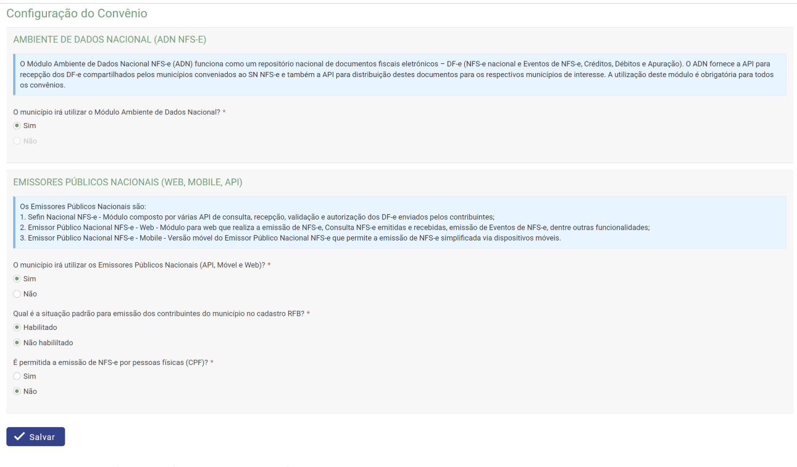

## Page 9

Guia para preenchimento do Painel Municipal da NFSe – versão 1.2
9
Painel Administrativo Municipal NFS-e – Web
1. Objetivo
O presente documento tem por objetivo principal guiar as Administrações Tributárias Municipais (ATM’s)
aderentes à Nota Fiscal de Serviço Eletrônica Nacional (NFS-e) quanto à utilização do Painel Municipal no
Sistema Nacional.
Espera-se que com a leitura deste guia, os representantes das ATM’s sejam capazes de realizar todas as
configurações necessárias para permitir que o sistema nacional funcione com sua capacidade de
automatização e validação de dados da forma em que foi idealizado e seus contribuintes emitam a NFS-e
Nacional.
2. O que é a NFS-e Nacional
A NFS-e Nacional consiste na criação de um leiaute único de documento fiscal, de forma a padronizar
todos os modelos de notas fiscais de serviço existentes no país. Os objetivos principais da adoção de um
padrão para o adimplemento das obrigações acessórias no setor de serviços consistem não só na melhoria
do ambiente de negócios no país, mas também de uma maior integração entre as administrações tributárias
das esferas municipal, distrital e federal, gerando a racionalização de recursos governamentais, maior
eficiência na atividade fiscal, culminando no fornecimento de melhores serviços aos cidadãos.
Esta integração entre diferentes esferas das administrações tributárias e a parametrização do Sistema
Nacional – objeto deste manual, permitirão que os contribuintes não tenham que fornecer ao fisco informações
que ele já disponha. Se farão necessárias apenas informações relativas ao serviço prestado.
3. Processo de emissão da NFS-e Nacional
A premissa principal da construção da NFS-e Nacional é que o Fisco não deve solicitar ao contribuinte
informações que já possui na sua base de dados. A partir dessa premissa foi possível criar uma ferramenta
que simplificasse de sobremaneira todo o processo de emissão da NFS-e Nacional por parte do contribuinte.
Este processo se baseia em três passos:
1) Preenchimento e envio da Declaração de Prestação de Serviço (DPS)
O contribuinte fornece ao Fisco informações básicas a respeito do serviço prestado na DPS e as envia
à Secretaria de Finanças Nacional (Sefin Nacional - Ambiente computacional que funciona como uma
Secretaria de Finanças/Fazenda Municipal, validando as Declarações de Prestação de Serviços (DPS) que são
enviadas pelos contribuintes, gerando, autorizando e assinando as NFS-e correspondentes).
2) Validação e emissão da NFS-e
A Sefin Nacional recepciona as informações prestadas pelo contribuinte, realiza diversas validações
com os dados que já possui na Base de Dados Nacional (BDN), complementa os dados da NFS-e e realiza a
emissão da NFS-e Nacional.

### Images from Page 9

## Page 10

Guia para preenchimento do Painel Municipal da NFSe – versão 1.2
10
3) Recepção da NFS-e Nacional
Uma vez emitida a NFS-e Nacional, o emissor recepciona o documento fiscal, que engloba então os
dois blocos de informações: o primeiro fornecido pelo contribuinte e o segundo pela Sefin Nacional.
Figura 1 - Passos na emissão da NFS-e Nacional.
Módulo Painel Administrativo Municipal NFS-e
Este módulo do Sistema Nacional NFS-e disponibiliza funcionalidades de uso pela administração
tributária municipal do município conveniado ao sistema nacional. É neste módulo do sistema que o município
reflete os aspectos próprios de sua legislação tributária referentes ao ISSQN. O objetivo do módulo é uma
interface para que o município insira informações, parâmetros, alíquotas e especificidades próprias de sua
legislação, como benefícios fiscais.
Todos os municípios, a partir da LEI COMPLEMENTAR Nº 214, DE 16 DE JANEIRO DE 2025, são
obrigados a adaptar os seus sistemas autorizadores e aplicativos de emissão simplificada de documentos
fiscais eletrônicos vigentes para utilização de leiaute padronizado, que permita aos contribuintes informar os
dados relativos ao IBS e à CBS, necessários à apuração desses tributos; e
II - compartilhar os documentos fiscais eletrônicos, após a recepção, validação e autorização, com o ambiente
nacional de uso comum do Comitê Gestor do IBS e das administrações tributárias da União, dos Estados, do
Distrito Federal e dos Municípios.
§ 1º Para fins do disposto no caput deste artigo, os Municípios e o Distrito Federal ficam obrigados, a partir de
1º de janeiro de 2026, a:

### Images from Page 10

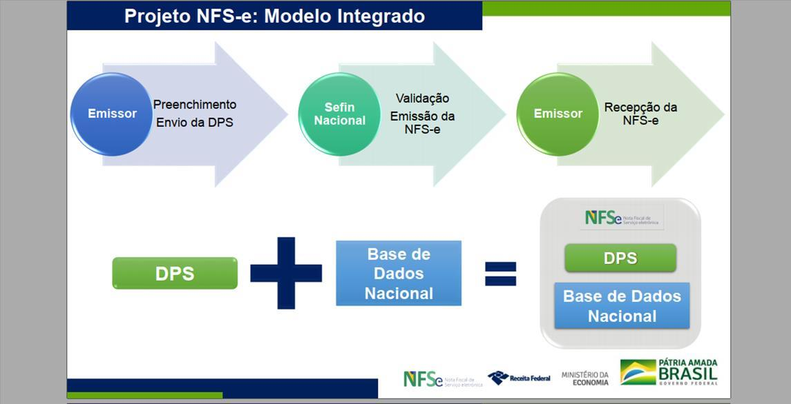

## Page 11

Guia para preenchimento do Painel Municipal da NFSe – versão 1.2
11
I - autorizar seus contribuintes a emitir a Nota Fiscal de Serviços Eletrônica de padrão nacional (NFS-e) no
ambiente nacional ou, na hipótese de possuir emissor próprio, compartilhar os documentos fiscais eletrônicos
gerados, conforme leiaute padronizado, para o ambiente de dados nacional da NFS-e; e
II - compartilhar o conteúdo de outras modalidades de declaração eletrônica, conforme leiaute padronizado
definido no regulamento, para o ambiente de dados nacional da NFS-e.
§ 2º O disposto no § 1º deste artigo aplica-se até 31 de dezembro de 2032.
§ 3º Os dados do ambiente centralizador nacional da NFS-e deverão ser imediatamente compartilhados em
ambiente nacional nos termos do inciso II do § 1º deste artigo.
§ 4º O padrão e o leiaute a que se referem os incisos I e II do § 1º deste artigo são aqueles definidos em
convênio firmado entre a administração tributária da União, do Distrito Federal e dos Municípios que tiver
instituído a NFS-e, desenvolvidos e geridos pelo Comitê Gestor da Nota Fiscal de Serviços Eletrônica de
padrão nacional (CGNFS-e).
§ 5º O ambiente de dados nacional da NFS-e é o repositório que assegura a integridade e a disponibilidade
das informações constantes dos documentos fiscais compartilhados.
§ 6º O Comitê Gestor do IBS e a RFB poderão definir soluções alternativas à plataforma NFS-e, respeitada a
adoção do leiaute do padrão nacional da NFS-e para fins de compartilhamento em ambiente nacional.
§ 7º O não atendimento ao disposto no caput deste artigo implicará a suspensão temporária das transferências
voluntárias.
O Painel Administrativo Municipal NFS-e fornece funcionalidades para que o município conveniado se
“parametrize” no sistema nacional.
______________________________________________________________________________________________
Dentre os aspectos principais que o município conveniado deve parametrizar estão:
•
possibilidade de criação de códigos tributários municipais (serviços da listagem municipal);
•
indicação de atributos dos serviços (formas de dedução/redução, regimes especiais de tributação e
alíquotas) para validação da DPS e emissão de NFS-e;
•
habilitação e manutenção da situação cadastral do contribuinte no Cadastro Nacional de
Contribuintes;
•
gerenciamento de regras próprias referentes a Retenções do ISSQN e a Benefícios Municipais da
legislação municipal; e
•
consultas de documentos fiscais eletrônicos (DF-e) em que esteja envolvido.
______________________________________________________________________________________________
A funcionalidade de parametrização de atributos municipais deve ser criteriosamente gerenciada pelos
gestores municipais, pois é necessária para a correta emissão de uma NFS-e pelo contribuinte que utilize o
Sistema Nacional da NFS-e (exemplos: alíquotas que podem variar entre 2% e 5% para os diversos tipos de

### Images from Page 11

## Page 12

Guia para preenchimento do Painel Municipal da NFSe – versão 1.2
12
serviços, prazos para cancelamento e substituição de NFS-e) e são necessárias para a correta validação da
DPS e emissão de uma NFS-e.
Não serão criados atributos de parametrização restritos para um município ou outro especificamente.
Os atributos possíveis de parametrização são aqueles comuns ao negócio do ISSQN para todos os municípios,
cuja informação do atributo varia segundo a legislação interna de cada município.
________________________________________________________________________________________________
Não existem atributos de parametrização particulares para um município especificamente.
________________________________________________________________________________________________
O próprio módulo Painel Administrativo Municipal NFS-e gerencia o que deve ser parametrizado, para
que o usuário (gestor municipal) não deixe de parametrizar informações que são necessárias para o correto
funcionamento do sistema nacional de forma integrada
As informações de parametrizações da legislação municipal do município serão utilizadas para
validações em diversas regras quando da emissão da NFS-e. A depender da regra de negócio, as informações
recuperadas serão do município emissor da NFS-e (município em que o emitente possui estabelecimento ou
domicílio e que está habilitado a emitir NFS-e) ou podem ser recuperadas do município de incidência do
ISSQN.
Fazem parte desta aplicação as funcionalidades:
1. Cadastros dos gestores municipais;
2. Cadastro de contribuintes municipais:
• Upload de arquivo com contribuintes municipais;
• Gestão individualizada de contribuintes municipais;
3. Parametrizações municipais:
• Lista de Serviços
o Código de Tributação Municipal
o Alíquota
o Dedução/Redução
• Retenções;
• Outros Benefícios;
• Regime Especial de Tributação;
• Eventos de NFS-e.

### Images from Page 12

## Page 13

Guia para preenchimento do Painel Municipal da NFSe – versão 1.2
13
1. Arquitetura do Painel Administrativo Municipal NFS-e
1.1.
Ativação do Município no Sistema Nacional NFS-e
Ao assinar o convênio de adesão ao Sistema Nacional NFS-e, o município é cadastrado pelo Gestor
Nacional do sistema através de funcionalidade específica, conforme descrito no Manual de Uso do Painel
Administrativo Nacional.
Este cadastro insere o município conveniado ao sistema nacional inicialmente com situação “Inativo”.
Uma vez inserido, o gestor municipal principal do município inicia o processo de parametrização do município
no sistema, conforme as regras do manual acima citado. Somente após a conclusão do preenchimento de
todos os parâmetros é que o município poderá acionar um comando para mudar a situação do município para
“Ativo”, ou seja, as regras da legislação municipal, que são os parâmetros no painel municipal, passam a ser
reconhecidas pelo sistema nacional.
Toda DPS emitida por um contribuinte do município (se for o caso do município se conveniar utilizando
os emissores públicos) são validadas também conforme estas parametrizações. Também outras DPS emitidas
por contribuintes de outros municípios, cuja incidência do ISSQN se dê no município “Ativo”, utilizam as
parametrizações para validar regras que forem pertinentes ao município de incidência do imposto.
1.2.
Ambientes disponíveis
O sistema NFSe possui dois ambientes disponíveis:
•
Ambiente de produção restrita: é um ambiente de testes, limitado, criado para que os municípios e
contribuintes possam realizar testes funcionais; os dados recebidos não têm validade jurídica; os
eventos gerados devem ter a informação de identificação do ambiente; e, após os testes, os
contribuintes podem remover todos os eventos enviados ao ambiente de produção restrita. Ou seja,
o ambiente de Produção Restrita é uma infraestrutura criada no âmbito no Sistema NFSe para viabilizar
a realização de testes pelos municípios e pelas empresas, sem qualquer efeito jurídico.
•
Ambiente de produção: é o ambiente onde o sistema NFSe é executado e utilizado pelos usuários
finais, ou seja, é o ambiente ao vivo onde o sistema está sendo executado e é acessado por usuários
ou clientes reais.
A Produção Restrita terá a mesma versão do sistema NFSe que será disponibilizada em ambiente
de produção, o que traz toda a garantia na validade dos dados informados ...
________________________________________________________________________________________________
O Painel Municipal do ambiente de testes (produção restrita) e de produção devem, após a parametrização
final do ambiente de produção, estarem idênticos. Desta forma, o contribuinte poderá usar o ambiente de
testes de forma fidedigna ao ambiente real para testar os sistemas deles.
________________________________________________________________________________________________

### Images from Page 13

## Page 14

Guia para preenchimento do Painel Municipal da NFSe – versão 1.2
14
1.3.
Primeiro acesso municipal ao Sistema da NFS-e
O
responsável
pelo
Município
deverá
acessar
o
endereço
https://www.nfse.gov.br/PainelMunicipal/ com o seu certificado digital e realizar o login no sistema.
Para acessar o Painel Municipal deve-se usar o endereço:
a) Ambiente de testes - Produção Restrita
https://www.producaorestrita.nfse.gov.br/PainelMunicipal/Login?ReturnUrl=%2fPainelMunicipal%2f
b) Ambiente de Produção
https://www.nfse.gov.br/PainelMunicipal/Login?ReturnUrl=%2fPainelMunicipal .
Para acessar os Painéis é necessário o uso de certificado digital.
1)
Clicar em                     e inserir a autenticação com certificado digital;
Figura 2: Página de autenticação para entrada no Painel Administrativo municipal
O Painel Administrativo Municipal NFS-e fornece funcionalidades para que o município conveniado se
“parametrize” no sistema nacional.

### Images from Page 14

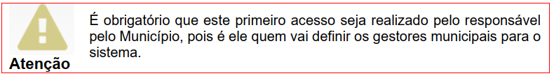

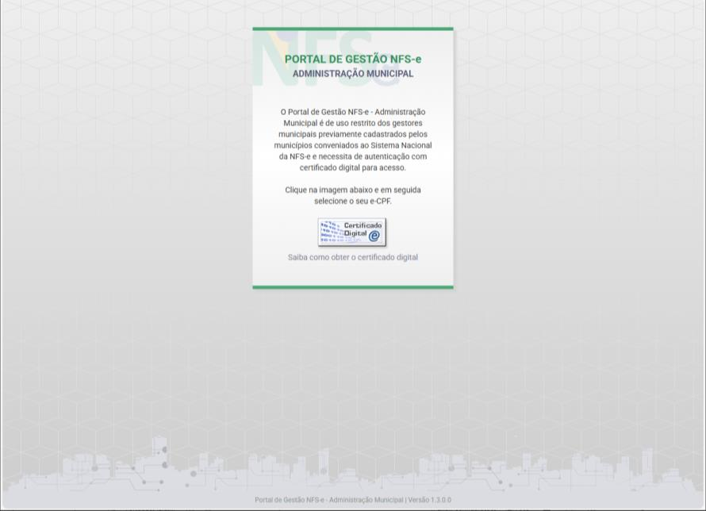

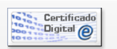

## Page 15

Guia para preenchimento do Painel Municipal da NFSe – versão 1.2
15
________________________________________________________________________________________________
Dentre os aspectos principais que o município conveniado deve parametrizar estão:
•
possibilidade de criação de códigos tributários municipais (serviços da listagem municipal);
•
indicação de atributos dos serviços (formas de dedução/redução, regimes especiais de tributação e
alíquotas) para validação da DPS e emissão de NFS-e;
•
habilitação e manutenção da situação cadastral do contribuinte no Cadastro Nacional de
Contribuintes;
•
gerenciamento de regras próprias referentes a Retenções do ISSQN e a Benefícios Municipais da
legislação municipal; e
•
consultas de documentos fiscais eletrônicos (DF-e) em que esteja envolvido.
________________________________________________________________________________________________
A funcionalidade de parametrização de atributos municipais deve ser criteriosamente gerenciada pelos
gestores municipais, pois é necessária para a correta emissão de uma NFS-e pelo contribuinte que utilize o
Sistema Nacional da NFS-e (exemplos: alíquotas que podem variar entre 2% e 5% para os diversos tipos de
serviços, prazos para cancelamento e substituição de NFS-e) e são necessárias para a correta validação da
DPS e emissão de uma NFS-e.
Não serão criados atributos de parametrização restritos para um município ou outro especificamente.
Os atributos possíveis de parametrização são aqueles comuns ao negócio do ISSQN para todos os municípios,
cuja informação do atributo varia segundo a legislação interna de cada município.
________________________________________________________________________________________________
Não existem atributos de parametrização particulares para um município especificamente.
________________________________________________________________________________________________
O próprio módulo Painel Administrativo Municipal NFS-e gerencia o que deve ser parametrizado, para
que o usuário (gestor municipal) não deixe de parametrizar informações que são necessárias para o correto
funcionamento do sistema nacional de forma integrada
As informações de parametrizações da legislação municipal do município serão utilizadas para
validações em diversas regras quando da emissão da NFS-e. A depender da regra de negócio, as informações
recuperadas serão do município emissor da NFS-e (município em que o emitente possui estabelecimento ou
domicílio e que está habilitado a emitir NFS-e) ou podem ser recuperadas do município de incidência do
ISSQN.
Fazem parte desta aplicação as funcionalidades:
1. Cadastros dos gestores municipais;
2. Cadastro de contribuintes municipais:

### Images from Page 15

## Page 16

Guia para preenchimento do Painel Municipal da NFSe – versão 1.2
16
• Upload de arquivo com contribuintes municipais;
• Gestão individualizada de contribuintes municipais;
3. Parametrizações municipais:
• Lista de Serviços
o Código de Tributação Municipal
o Alíquota
o Dedução/Redução
• Retenções;
• Outros Benefícios;
• Regime Especial de Tributação;
• Eventos de NFS-e.
1.4. As Duas Etapas do Painel Administrativo Municipal
Existem duas etapas de uso do Painel Administrativo Municipal: a etapa antes da ativação do município
no sistema nacional e a etapa após a ativação. Estas duas etapas se distinguem nos seguintes aspectos: a)
antes da ativação o gestor municipal possui maior flexibilidade para mudar os valores dos parâmetros, pois
não são registrados históricos de alteração destes valores dos parâmetros. b) após a ativação qualquer
mudança de valores dos parâmetros é considerada uma alteração “controlada” e é registrada no histórico de
alterações dos parâmetros com as datas inicial e final de vigência, pois a emissão de documentos fiscais é
afetada pelo período de vigência conforme a data de competência da DPS (da qual irá ser gerada a NFS-e).

### Images from Page 16

## Page 17

Guia para preenchimento do Painel Municipal da NFSe – versão 1.2
17
2. Parametrização por Gestores Municipais
Após o cadastro do município no Sistema Nacional NFS-e, para o primeiro momento do município
no Painel Administrativo Municipal, somente o Gestor Municipal Principal (Responsável pelo CNPJ do
Município) terá acesso a ele. O Gestor Municipal Principal (Responsável pelo CNPJ do Município) acessará
o Painel Administrativo Municipal NFSe e dará início à ativação ao Sistema Nacional da NFS-e através da
assinatura eletrônica.
Este gestor poderá realizar ele mesmo a tarefa de parametrização e ativação do município ou cadastrar
um ou mais Gestores Auditores Municipais para realizarem as parametrizações e ativação do município no
Sistema Nacional NFS-e.
Ele poderá incluir outros atores da gestão municipal, conforme descrito no item Cadastro de Gestores
Municipais deste manual, sendo eles:
1) o Gestor Municipal Parametrizador, tem permissão para realizar todo e qualquer parâmetro disponível para
administração pelo município no Painel Administrativo Municipal;
2) o Gestor Municipal Atendente, não tem permissão para realizar nenhum tipo de parametrização do município
no painel municipal, apenas lhe é permitido realizar a administração via web do Cadastro Nacional de
Contribuintes NFS-e, conforme regras municipais próprias e caso o município utilize o cadastro próprio de
contribuintes no sistema nacional (CNC NFS-e – Web).
O responsável pela parametrização do município no sistema nacional deve realizar a parametrização
do município no sistema nacional e acionar o comando de conclusão da parametrização.
________________________________________________________________________________________________
A ativação somente é possível se o Gestor Municipal competente para esta tarefa informar todos os parâmetros
exigidos pelo painel municipal. O próprio sistema realiza o controle do que é obrigatório parametrizar e o que
é opcional.
________________________________________________________________________________________________
Definição dos Gestores Municipais
A funcionalidade de cadastro de gestores municipais permite o gerenciamento das pessoas que
pertencem à gestão municipal realizarem funcionalidades disponíveis no painel municipal do Sistema Nacional
NFS-e. A funcionalidade de gerenciamento dos gestores municipais permite Consultar, Incluir, Alterar e Excluir
as informações de cada um dos registros do cadastro mantendo seu histórico de atividades no sistema. Segue
abaixo as telas do gerenciamento do cadastro.
Após a entrada no painel, a primeira etapa a ser realizada deve ser a inclusão dos gestores do
município.

### Images from Page 17

## Page 18

Guia para preenchimento do Painel Municipal da NFSe – versão 1.2
18
Clicando no ícone Gestores Municipais
é possível a inclusão de novos gestores e o perfil que cada um
deles.
Figura 3: Página inicial do Painel Municipal antes da parametrização.
2.1. Consulta de Gestores Municipais
Na página inicial de “Gestores Municipais” há uma lista paginada com a relação de todos os gestores
já cadastrados o Perfil, a data da atualização e a situação (Ativo ou Inativo) de cada um deles, pode-se
pesquisar um gestor pelo nome ou pelo CPF. Há ainda a opção para incluir um novo gestor.
Figura 4: Página de administração dos Gestores Municipais.
Além disso, ao clicar nos 3 pontos ao final da linha, é possível editar, obter histórico ou Inativas um
gestor já cadastrado.

### Images from Page 18

## Page 19

Guia para preenchimento do Painel Municipal da NFSe – versão 1.2
19
Figura 5: Página de administração dos Gestores Municipais mostrando o menu lateral.
2.2. Inclusão de Gestores Municipais
Nesta tela é possível a inserção de um novo gestor, clicando em            :.            .
Figura 6: Página de administração dos Gestores Municipais.
Com a inserção de um CPF, a ação de pesquisa busca pelo CPF informado no cadastro de pessoas
físicas da RFB, recuperando o nome da pessoa. As demais informações devem ser preenchidas pelo
cadastrador.

### Images from Page 19

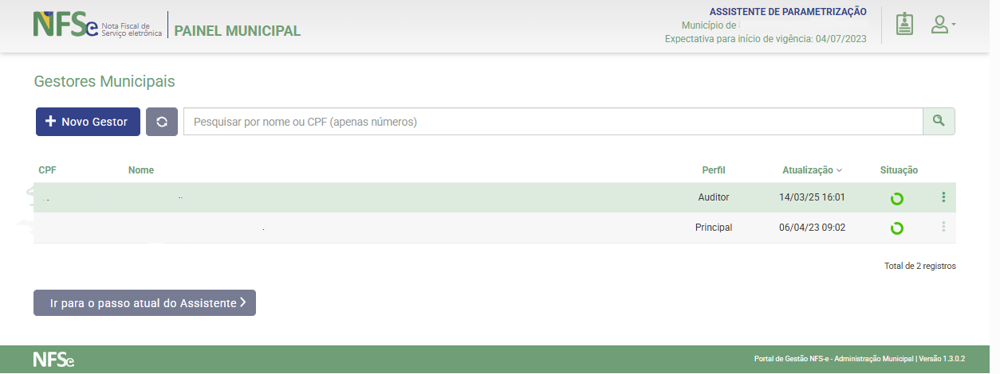

## Page 20

Guia para preenchimento do Painel Municipal da NFSe – versão 1.2
20
Figura 7 - Informações solicitadas para o cadastramento de um novo Gestor Municipal
Cada gestor será cadastrado com um perfil específico (Principal, Auditor, Atendente ou
Parametrizador). Podem ser cadastrados vários gestores para cada um dos perfis, exceto o perfil Principal.
Figura 8- Opções disponíveis para o tipo de gestor a ser cadastrado.
Níveis de Acesso às Funcionalidades para Gestores Municipais
Gestor Principal Municipal – O perfil deste gestor tem acesso e permissão para executar todas as
funcionalidades disponíveis no painel municipal, inclusive a funcionalidade de cadastramento dos demais
perfis de gestores municipais além da sua própria substituição por outro Gestor Principal do Município.
Gestor Auditor Municipal – O perfil deste gestor tem acesso e permissão para executar todas as
funcionalidades disponíveis no Painel Administrativo Municipal.
Gestor Parametrizador Municipal – O perfil deste gestor tem acesso e permissão para parametrizar as
funcionalidades disponíveis no painel municipal.
Gestor Atendente Municipal – O perfil deste gestor tem acesso e permissão para executar apenas as
funcionalidades de gerenciamento do cadastro de contribuintes do município, disponíveis no painel municipal.

### Images from Page 20

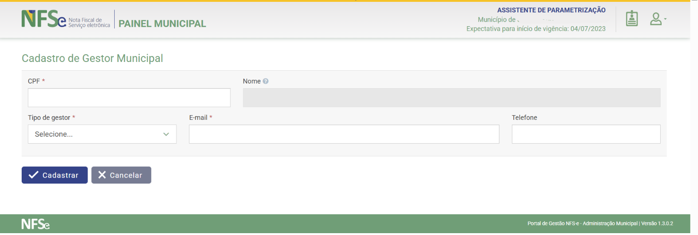

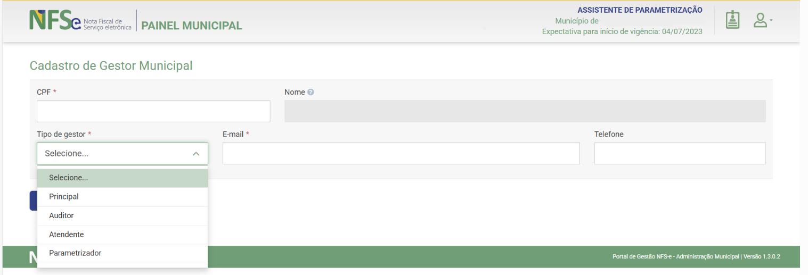

## Page 21

Guia para preenchimento do Painel Municipal da NFSe – versão 1.2
21
Um mesmo gestor municipal pode ser vinculado a mais de um município, desde que seu cadastro esteja ativo
em apenas um município por vez em um mesmo período.
Ao final clicar em                      para prosseguir.
2.3. Alteração das Informações do Gestor Municipal
Os gestores municipais cadastrados poderão ter seus perfis alterados quanto as seguintes informações:
Tipo de gestor, e-mail e telefone. Para acessar esta funcionalidade, o gestor municipal deverá acessar a lista
de gestores municipais cadastrados, identificar o perfil que deseja alterar e selecionar o ícone
no canto
direito da linha correspondente. Em seguida, a opção “Editar” deverá ser selecionada.  As informações
alteradas são registradas em uma tabela de Histórico.
Figura 9 - Lista de gestores cadastrados para o município e menu para administração de cada gestor.
A seguinte página será exibida:
Figura 10 - Tela de edição das informações do gestor municipal.

### Images from Page 21

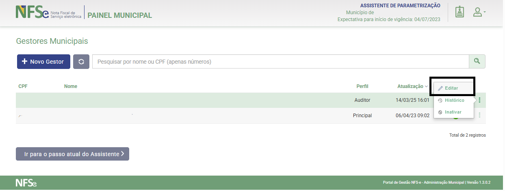

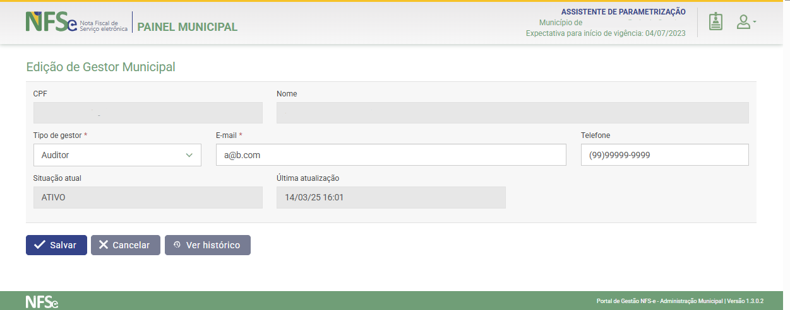

## Page 22

Guia para preenchimento do Painel Municipal da NFSe – versão 1.2
22
As alterações deverão ser realizadas e depois salvas, clicando-se no botão
.
Uma mensagem de confirmação das alterações é gerada na parte superior da página.
Figura 11 - Mensagem de confirmação das alterações realizadas.
Desativação/Reativação Gestor Municipal
O Sistema da NFS-e Nacional não permite o descadastramento de um gestor, mas tão somente a
inativação do perfil desejado.
Para ativar ou inativar um perfil, deve-se acessar a lista de gestores cadastrados e acessar o ícone
e marcar a opção desejada (inativar ou reativar).  Em seguida é exibida uma tela de confirmação da
ativação/ inativação solicitada: para confirmar a operação, o botão “Sim” deverá ser selecionado.
Figura 12 - Página de administração dos Gestores Municipais com a opção “Inativar”

### Images from Page 22

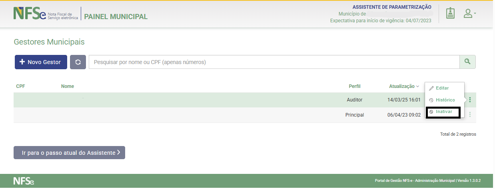

## Page 23

Guia para preenchimento do Painel Municipal da NFSe – versão 1.2
23
Figura 13 - Tela para confirmação da inativação de um gestor municipal.

### Images from Page 23

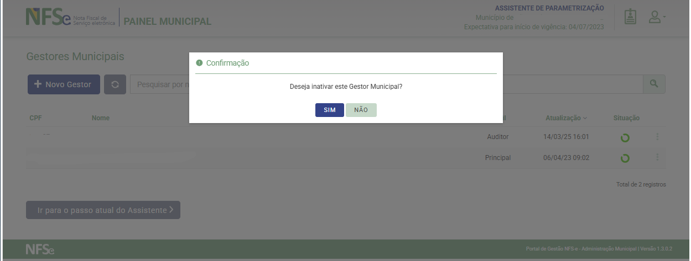

## Page 24

Guia para preenchimento do Painel Municipal da NFSe – versão 1.2
24
3. Primeira Etapa – Definição das Parametrizações e Ativação do Município
O gestor do município recém conveniado e cadastrado no Sistema Nacional NFS-e deve acessar o Painel
Administrativo Municipal NFS-e, realizar a parametrização do município no sistema nacional e acionar o
comando de conclusão da parametrização. A ativação somente é possível se o Gestor Municipal competente
para esta tarefa informar todos os parâmetros exigidos pelo painel municipal. O próprio sistema realiza o
controle do que é obrigatório parametrizar e o que é opcional.
A parametrização contém informações que fazem parte da legislação tributária municipal referente ao
ISSQN instituído no município, conforme dito anteriormente, que são minimamente necessárias para a ativação
do convênio de um município no Sistema Nacional NFS-e. Uma vez ativo, é possível ao Sistema Nacional NFS-
e realizar as validações necessárias à DPS e gerar a NFS-e adequadamente de forma padronizada e
consistente com as regras das legislações federais e municipais, de forma a automatizar a utilização do sistema
para os contribuintes ao mesmo tempo que atribui corretude e integridade às informações dos documentos
fiscais.
O controle de preenchimento dos parâmetros municipais no sistema nacional é realizado através do
assistente de parametrização que é exibida enquanto o convênio municipal não estiver ativo e auxilia a
administração municipal a identificar as pendências para a conclusão da parametrização. A exibição dos
elementos que devem ser configurados/parametrizados e sua respectiva situação atual permite ao gestor
municipal identificar itens pendentes de parametrização. Ao clicar sobre esses elementos o sistema
redireciona para a respectiva tela onde se poderá realizar as devidas parametrizações.
________________________________________________________________________________________________
A realização dos itens de parametrização obrigatórios no Painel Administrativo Nacional NFS-e é exigida para
todos os municípios conveniados ao Sistema Nacional NFS-e, independentemente do tipo ou opções de uso
de módulos do sistema nacional, informados na configuração de seu convênio.
________________________________________________________________________________________
Na primeira entrada no Painel com o certificado digital, dar-se-á início ao Assistente de Parametrização do
Sistema Nacional da NFS-e deve-se clicar em

### Images from Page 24

## Page 25

Guia para preenchimento do Painel Municipal da NFSe – versão 1.2
25
Figura 14 - Página inicial do Painel Municipal antes da parametrização.
O painel exibirá a primeira tela para a inclusão dos Informações do Município, também é possível ver
um menu com todas as parametrizações a serem feitas.
Figura 15 – Página inicial da parametrização

### Images from Page 25

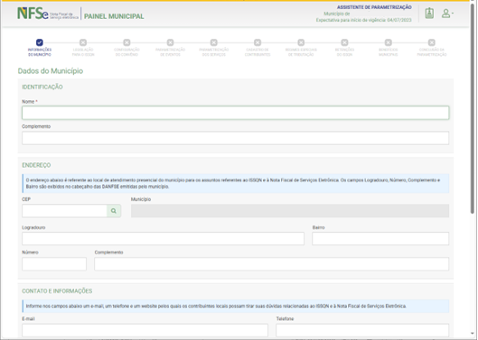

## Page 26

Guia para preenchimento do Painel Municipal da NFSe – versão 1.2
26
O comando para "Concluir Parametrização" será habilitado somente quando não houver nenhuma
pendência em todos os elementos, exceto os não obrigatórios, que serão explicitados mais adiante neste
manual.
As situações que os itens de parametrização podem assumir, são:
1.
Não há pendências;
2.
Existem pendências;
3.
Informações não obrigatórias;
4.
Elemento bloqueado (depende do preenchimento de algum item);
Ao longo da parametrização, o painel exibirá todos os parâmetros que serão necessários para a
finalização da parametrização.
Abaixo segue uma figura ilustrativa dos passos e suas respectivas ordenações no Fluxo de
Parametrização Inicial do Painel Administrativo Municipal.
As situações de cada um dos itens de parametrização:
a) Gestores Municipais – Item de parametrização não obrigatório pois o Gestor Municipal Principal que
já vem cadastrado do painel nacional possui todas as atribuições para executar todas as
funcionalidades existentes no painel municipal realizando todas as parametrizações possíveis para o
município. No entanto já neste momento inicial é possível cadastrar outros gestores municipais
(auditores, parametrizadores e atendentes) para delegação de tarefas do município pertinentes à
parametrização do município no Sistema Nacional NFS-e;
b) Informações do Município – Informações do município que são utilizadas quando da impressão da
DANFSe (Documento Auxiliar de Nota Fiscal de Serviço Eletrônica);
c) Legislação para o ISSQN – Itens da legislação referente ao ISSQN que serão utilizados como
informação obrigatória de todos os demais itens do painel municipal;

### Images from Page 26

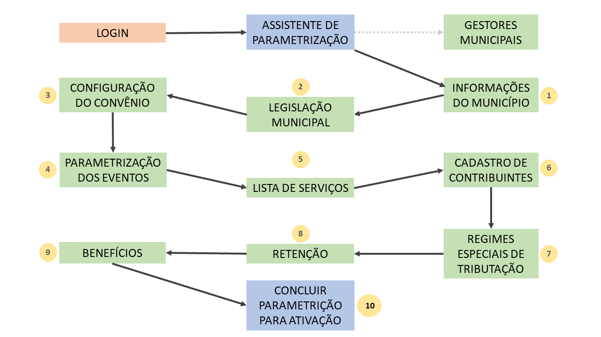

## Page 27

Guia para preenchimento do Painel Municipal da NFSe – versão 1.2
27
d) Configuração do Convênio – Verifica se as informações obrigatórias para a configuração do convênio
foram preenchidas;
e) Parametrização de Eventos – Parametrização relativa aos Eventos de NFS-e, Eventos do MAN e outros
que necessitarem de parametrização de acordo com a legislação municipal.
f)
Cancelamento de NFS-e – Verifica se as informações obrigatórias para o evento de cancelamento de
NFS-e do município foram preenchidas;
g) Substituição de NFS-e – Verifica se as informações obrigatórias para a substituição de NFS-e do
município foram preenchidas;
h) Parametrização dos Serviços – A lista de Serviços Nacional deve ser administrada nos subitens que
estão definidos ou em códigos de serviços municipais de parametrização opcional, somente para
casos em que o município possua códigos de serviços próprios em sua legislação municipal, pois o
município pode estar aderente à lista de serviço nacional, que é a lista de serviço mínima e comum
para todos os municípios. Para cada código de serviço administrado deverá ser atribuído alíquota e
as informações de Dedução/Redução.
i)
Cadastro de Contribuintes – Depende da configuração do convênio para ser obrigatório informar ao
menos um contribuinte do município ou se é um item de parametrização municipal opcional;
j)
Regimes Especiais de Tributação – Verifica se para cada serviço existente no município foram
definidas as regras para cada um dos regimes especiais de tributação disponíveis na legislação do
município;
k) Retenções do ISSQN – Verifica se os critérios para possibilidade de retenções do valor de ISSQN para
recolhimento pelo tomador ou intermediário foram preenchidas. Critérios específicos do município
para ocorrência da retenção do ISSQN podem não vigorar na legislação municipal e, portanto, este
município segue os critérios para retenção descritos nos incisos do Art 6º, § 2o da Lei Complementar
116/2003;
l)
Benefícios Municipais – Verifica se os critérios para possibilidade de benefícios municipais configuram
pelo menos uma redução de base de cálculo, isenção ou alíquota diferenciadas para serviços
baseados nas leis municipais relativos ao cálculo do ISSQN devido. Assim como as retenções do
imposto, critérios específicos do município para ocorrência de benefício municipal podem não vigorar
na legislação municipal. Por isso, a parametrização de benefícios municipais é opcional.
O Painel exibe um menu com todos os parâmetros disponíveis,  deve-se acessar cada um deles e
preencher conforme indicado neste Guia.

### Images from Page 27

## Page 28

Guia para preenchimento do Painel Municipal da NFSe – versão 1.2
28
O comando para "Concluir Parametrização"
será habilitado somente quando
não houver nenhuma pendência em todos os elementos, exceto os não obrigatórios, que serão explicitados
mais adiante neste manual.
Figura 16 – Página final da parametrização
3.1. Informações do Município
O sistema será direcionado para a tela que contém as informações básicas relativas ao município
como:
•
Identificação (Nome e Complemento) - este campo é exibido no cabeçalho do DANFS-e, para
identificação do Município. O tamanho máximo que pode assumir é de 56 caracteres e
normalmente é preenchido com “Prefeitura Municipal de XXX”;
•
Complemento - neste campo, pode ser inserido para exibição no DANFS-e o nome do
departamento responsável pela administração do ISSQN no município. O tamanho máximo que
pode assumir é de 32 caracteres;

### Images from Page 28

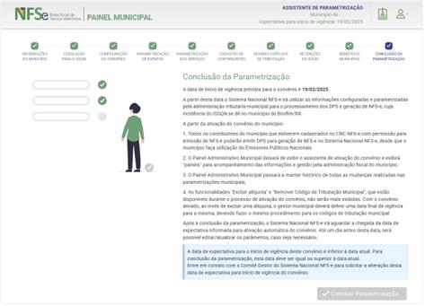

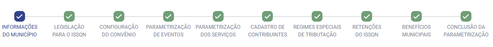

## Page 29

Guia para preenchimento do Painel Municipal da NFSe – versão 1.2
29
•
Endereço - caso seja interesse da ATM, o endereço para atendimentos relativos ao ISSQN e
à NFS-e no município poderá ser informado e exibido no DANFS-e. Neste caso, a ATM deverá
preencher os campos relativos são endereço: CEP, logradouro, número, complemento e bairro;
•
Contato e Informações - poderão ser inseridos os dados relativos ao e-mail institucional, ao
telefone e ao website que são disponibilizados aos contribuintes para entrarem em contato com a
ATM para tirar dúvidas quanto ao ISSQN e à NFS-e; e
•
Brasão - caso deseje, a ATM poderá inserir o brasão da prefeitura para exibição no DANFS-e.
Para isso deverá selecionar a imagem do brasão através tela exibida quando da seleção do ícone
.
•
Preencher todas as informações requisitadas e, ao final,
.
Figura 16 – Informações sobre o município, que serão exibidas na NFS-e.

### Images from Page 29

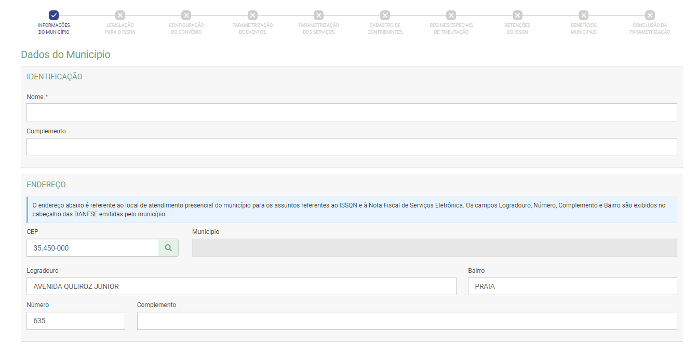

## Page 30

Guia para preenchimento do Painel Municipal da NFSe – versão 1.2
30
Figura 17- Informações de contato e inserção do brasão da prefeitura no sistema.
Caso a ATM deseje apenas excluir o brasão atual, deverá selecionar a caixa “Excluir o brasão atual”.
Estas informações municipais serão utilizadas para compor a DANFSe (Documento Auxiliar de Nota
Fiscal de Serviço Eletrônica), junto com as informações das NFS-e em que o município for emissor.
Uma vez realizadas todas as alterações, o botão “Salvar e continuar” disponibilizado ao final da página
deverá ser selecionado. Será então exibida uma mensagem de confirmação das alterações e a página é
atualizada.

### Images from Page 30

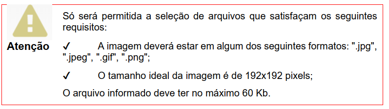

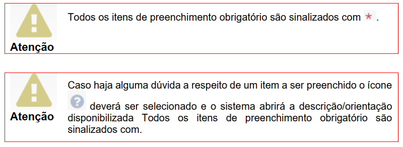

## Page 31

Guia para preenchimento do Painel Municipal da NFSe – versão 1.2
31
3.2. Legislação para o ISSQN
O cadastro de legislação possibilita ao município registrar sua legislação, que fundamenta todas as
definições/alterações de parâmetros do convênio municipal. Sempre que uma manutenção nos parâmetros
for realizada, será necessário informar qual a legislação que a sustenta.
Figura 18 - Tela de informações a respeito da Legislação do ISSQN.
Esta funcionalidade permite que o parametrizador registre e catalogue a legislação tributária referente
ao ISSQN. Por padrão o assistente de parametrização do painel municipal já vem com a LC 116/03 cadastrada
para todo município conveniado.
O gestor municipal pode adicionar cada uma das suas normas tributárias locais referentes ao ISSQN
em que estão descritos os itens de parâmetros que serão registrados na parametrização do painel municipal.
O sistema não realiza nenhuma consistência das informações acerca da legislação que for incluída no
painel municipal bem como a correta utilização nos parâmetros que forem realizados pelo gestor municipal. A
integridade e exatidão dos dados inseridos das legislações e o uso delas no registro dos parâmetros é
responsabilidade do município.
Cada norma incluída no cadastro tem um identificador único. O identificador tem a seguinte regra de
formação: 7 dígitos para o código do município, 2 dígitos para o tipo de parâmetro e 5 dígitos sequenciais
únicos por município/parâmetro;
________________________________________________________________________________________________
Sempre que uma manutenção nos parâmetros for realizada, será necessário informar qual a legislação
________________________________________________________________________________________________

### Images from Page 31

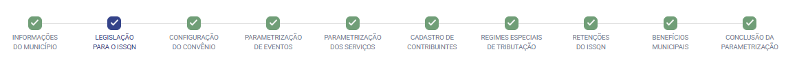

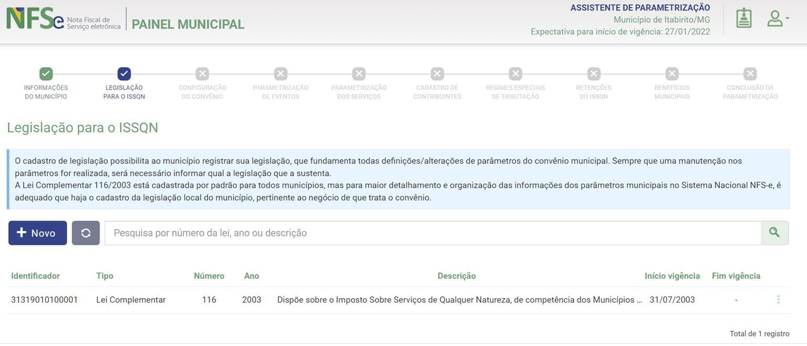

## Page 32

Guia para preenchimento do Painel Municipal da NFSe – versão 1.2
32
3.2.1.Consultar Legislação
Na tela inicial da “Legislação para o ISSQN” há a lista paginada com a relação de todas as legislações
já cadastradas anteriormente. Há ainda a opção para incluir uma nova legislação.
É possível realizar consultas sobre a legislação já cadastrada, informando, na barra de busca, o número da
lei, o ano ou a descrição e clicando na lupa
.
Figura 19 - Tela de informações a respeito da Legislação do ISSQN com menu ‘”Editar”, “Excluir” e “Ver
Vínculos”.
3.2.2. Incluir Legislação
Para iniciar a inclusão da legislação municipal ou uma nova legislação a qualquer momento, deve-se
clicar em
. A Lei Complementar 116/2003 está cadastrada por padrão para todos os municípios, mas
para maior detalhamento e organização das informações dos parâmetros municipais no Sistema Nacional
NFS-e, é adequado que haja o cadastro da legislação local do município, pertinente ao negócio de que trata
o convênio.
Figura 20 - Tela de informações a respeito da Legislação do ISSQN

### Images from Page 32

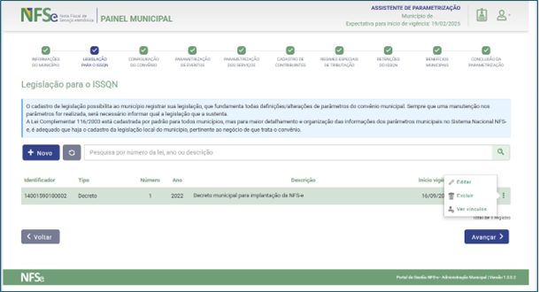

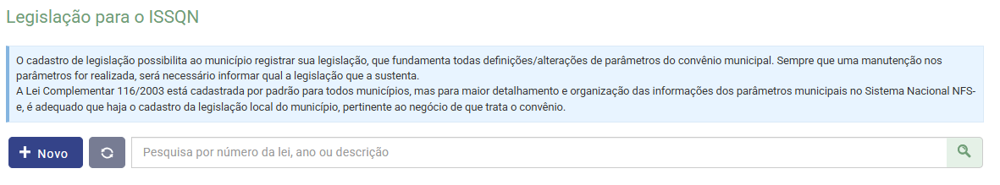

## Page 33

Guia para preenchimento do Painel Municipal da NFSe – versão 1.2
33
Abrirá a página para o Cadastro de Legislação Municipal.
Figura 21 - Página de cadastro de um novo ato normativo.
A) Tipo:
Ao selecionar esse campo, é disponibilizada uma lista de possíveis tipos de atos normativos a serem
cadastrados. A ATM deverá selecionar o que deseja inserir no sistema.
Figura 22 - Tipos de atos normativos disponíveis para seleção.
B) Número
Uma vez selecionado o tipo do ato normativo, deverá ser inserido o seu número identificador. Por exemplo: ao
cadastrar a Lei 9.430, o tipo selecionado deverá ser “Lei Ordinária” e o número, “9430”.

### Images from Page 33

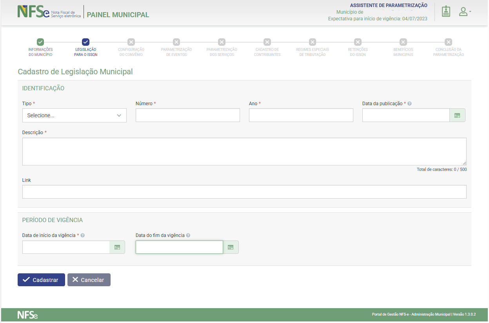

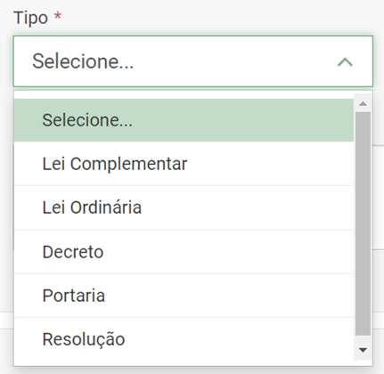

## Page 34

Guia para preenchimento do Painel Municipal da NFSe – versão 1.2
34
Além do número, o ano do ato deverá também ser editado para a sua correta identificação.
D) Data da Publicação
Nesse campo deverá ser inserida a data da publicação do ato nos meios de publicação oficiais do município.
E) Descrição
Nesse campo deverá ser inserida uma breve descrição sobre o assunto a que se destina o ato normativo. São
essas informações que ficarão visíveis e permitirão a correta identificação do ato pela ATM e pelos
contribuintes.
F) Link
Nesse campo poderá (campo não obrigatório) ser inserido o link para ter acesso à página na internet para
acesso ao ato normativo que está sendo cadastrado.
G) Data de início da vigência
Nesse campo deverá ser inserida a data da efetiva entrada em vigor do ato normativo.
Para finalizar o cadastro, o botão
deverá ser selecionado no final da página. Será então
exibida uma mensagem de confirmação do cadastramento do ato e este já poderá ser visualizado na página
de Legislação.
O painel retornará a página da Legislação para o ISSQN, clicar em                       para ir para a
Configuração do Convênio, ou clicar em qualquer uma das opções da lista de parâmetros.
O sistema, por padrão, adotará um número identificador para cada legislação cadastrada, o qual será
utilizado nas demais funcionalidades do sistema.

### Images from Page 34

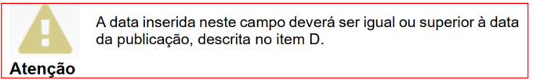

## Page 35

Guia para preenchimento do Painel Municipal da NFSe – versão 1.2
35
Figura 23 - Mensagem de confirmação do cadastramento do ato normativo e visualização da lista da Legislação
cadastrada.

### Images from Page 35

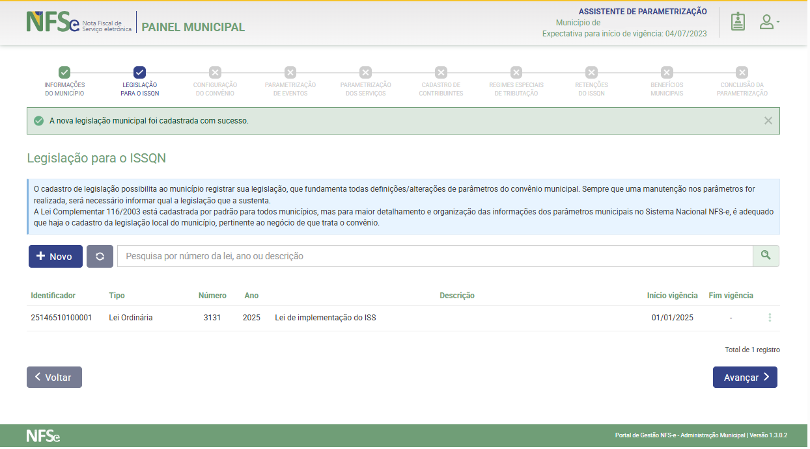

## Page 36

Guia para preenchimento do Painel Municipal da NFSe – versão 1.2
36
3.3. Configuração do Convênio
As configurações do convênio municipal são relativas à aderência aos Módulos do Sistema Nacional da
NFS-e, ou seja, o município irá informar sobre o uso do Sistema Nacional, informando como:
•
O município irá utilizar o Módulo Ambiente de Dados Nacional?
•
O município irá utilizar os Emissores Públicos Nacionais (API, Móvel e Web)?
•
Qual origem das informações dos contribuintes o município irá utilizar - base de contribuintes
(CNC ou Cadastros CPF/CNPJ da RFB)?
•
O município irá utilizar o Módulo de Apuração Nacional?
•
O município permite aproveitamento de Créditos disponíveis no Painel de Créditos?
Caso opte por não utilizar todos os módulos do sistema nacional ofertados, o município pode escolher
alguns deles para uso, conforme possibilidades definidas no painel administrativo.
Se a opção for pelos cadastros RFB, somente os contribuintes cujos endereços estejam registrados
no próprio município, nos cadastros CPF ou CNPJ, poderão emitir NFS-e pelo município.
Na primeira versão, os municípios podiam adotar o Sistema Nacional da NFS-e de duas formas:
3. Sistema próprio do município: emite a NFS-e localmente, converte para o layout nacional e
compartilha com o Ambiente de Dados Nacional (ADN).
4. Emissor Nacional: emite diretamente no sistema nacional, com os dados sendo recebidos pelo ADN.
Até então, não era permitido o uso simultâneo dos dois sistemas para uma mesma competência por um
município, o que impedia uma migração gradual. Essa limitação técnica havia sido definida para evitar
conflitos na emissão de documentos fiscais.
Como consequência:
•
Municípios não podiam migrar aos poucos para o Emissor Nacional.
•
Isso poderia gerar dificuldades operacionais, dúvidas e sobrecarga de suporte.
•
Também não era possível manter o compartilhamento de NFS-e anteriores à migração.
Diante disso, surgiu a necessidade de permitir uma adoção faseada, por grupos de contribuintes,
mantendo o compartilhamento das NFS-e anteriores e reduzindo os impactos da mudança.
Uma nova funcionalidade foi criada para permitir que os municípios controlem quais contribuintes
devem emitir a NFS-e em cada sistema (próprio ou nacional), em momentos distintos. Isso possibilita uma
migração gradual e planejada, por fases, reduzindo impactos para os contribuintes e para a administração
municipal.

### Images from Page 36

## Page 37

Guia para preenchimento do Painel Municipal da NFSe – versão 1.2
37
Como cada município pode adotar estratégias diferentes, serão apresentadas propostas específicas
para cada cenário.
Poderão ser realizadas alterações na Configuração do Convênio e no cadastro de contribuinte local (ver
item 3.7. Cadastro de Contribuintes).
No Painel Municipal da NFS-e, foram adicionados dois novos parâmetros ao grupo "EMISSORES
PÚBLICOS NACIONAIS (WEB, MOBILE, API)", permitindo configurar e gerenciar essa transição de forma
mais flexível:
1)
2)
Figura 24 – Versão 1.1 - Página de configuração das informações a respeito do convênio municipal com a
NFS-e.

### Images from Page 37

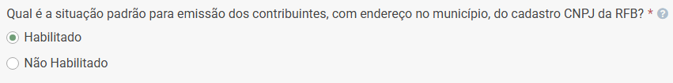

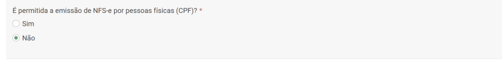

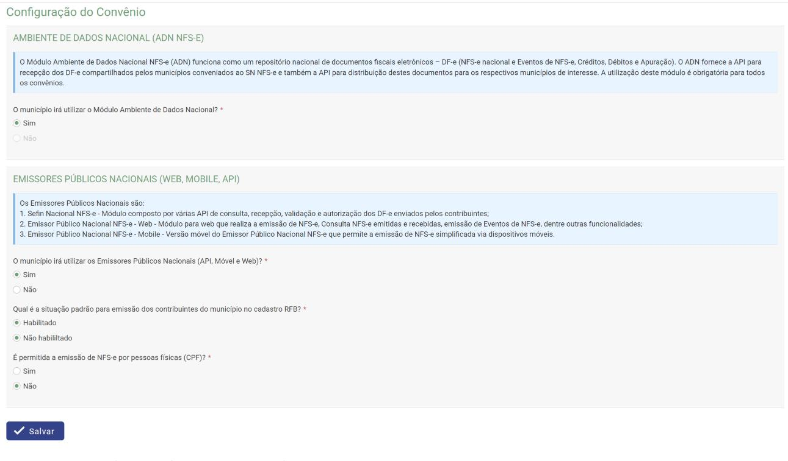

## Page 38

Guia para preenchimento do Painel Municipal da NFSe – versão 1.2
38
Mais informações sobre cada campo podem ser encontradas colocando o cursor do mouse for colocado
no ponto de interrogação (?).
3.3.1. Ambiente de Dados Nacional (ADN NFS-e)
Ambiente de Dados Nacional da NFS-e (ADN/NFS-e) é o repositório que assegura a integridade e a
disponibilidade das informações constantes nos documentos fiscais. Atua na distribuição e compartilhamento
dos documentos entre os Municípios e contribuintes.
A adesão municipal ao ADN é obrigatória na assinatura do termo de adesão ao convênio. O ADN
destina-se ao compartilhamento das informações das NFS-e emitidas pelo Município em seus emissores
próprios ou fazendo uso dos emissores públicos nacionais (Web, Mobile, API).
3.3.2. Emissores Públicos Nacionais (web, mobile, API)
Nesse campo o representante municipal deverá informar se o Município irá utilizar os emissores públicos
disponibilizados pelo Sistema Nacional da NFS-e: versão web, aplicativo de dispositivos móveis e Application
Programming Interface (API).
Ler com atenção cada uma das informações requisitadas e marcar todos os campos obrigatórios. O
sistema verifica se as informações obrigatórias para a configuração do convênio foram preenchidas;
Feitas as devidas opções, basta selecionar o botão
no canto inferior direito da página.

### Images from Page 38

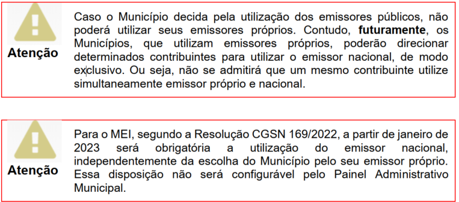

## Page 39

Guia para preenchimento do Painel Municipal da NFSe – versão 1.2
39
3.4.
Parametrização de Eventos
Esta página é dedicada à parametrização de Eventos de Cancelamento de NFS-e e Substituição de
NFS-e.
Figura 25 - Configuração de eventos da NFS-e de Nacional.
A definição da parametrização de Eventos de NFS-e no painel municipal insere as regras da legislação
municipal no que se refere ao “ciclo de vida” da NFS-e. Uma NFS-e pode ser cancelada ou substituída de
acordo com a legislação municipal.
Todos os municípios conveniados deverão parametrizar os Eventos de Cancelamento de NFS-e no
Sistema Nacional NFS-e.
Uma NFS-e que seja cancelada ou substituída no sistema próprio do município, para ser refletido este
cancelamento no sistema nacional, deverá ter o cancelamento ou substituição transcritos para o leiaute de
eventos padrão nacional e depois compartilhado com o ambiente de dados nacional. Este evento
compartilhado pelo município reflete um aspecto do ciclo de vida da nota fiscal de serviço que ocorreu no
município e foi, de alguma forma, aceito por ele. Cabe ao sistema nacional aceitar este documento realizando
validações estruturais e de negócio conforme as parametrizações do município para o documento
compartilhado. Uma vez validado o sistema irá consistir e refletir o cancelamento da NFS-e no sistema nacional
para que a informação esteja de acordo com a realidade da legislação municipal parametrizada no sistema
nacional. Caso a parametrização não esteja de acordo com os fatos ocorridos acerca do cancelamento da
NFS-e ou o sistema próprio do município está permitindo o cancelamento em desacordo com sua própria
legislação ou o município parametrizou equivocamente em relação à sua legislação. Será preciso analisar e

### Images from Page 39

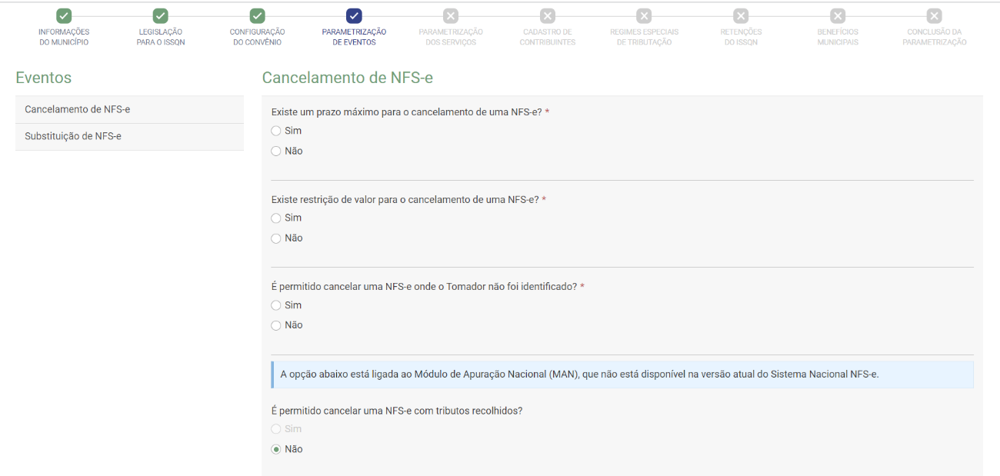

## Page 40

Guia para preenchimento do Painel Municipal da NFSe – versão 1.2
40
realizar os ajustes necessários para que o documento seja novamente compartilhado e validado para ser
consistido no ADN NFS-e, ou seja, o Evento de Cancelamento de NFS-e que for compartilhado por um
município será rejeito pelo sistema nacional se estiver em desacordo com a parametrização vigente deste
evento no momento do compartilhamento.
3.4.1. Cancelamento de NFS-e
A ATM deverá parametrizar no sistema todas as situações em que aceitará um pedido de
cancelamento da NFS-e Nacional. Caso o pedido esteja de acordo com essa parametrização, a nota poderá
ser cancelada de forma automatizada, via sistema.
Para as situações em que os parâmetros não sejam atendidos (exemplo: o prazo para solicitar foi
ultrapassado), a nota não será cancelada automaticamente, sendo que o emitente deverá submeter um pedido
de evento de análise fiscal para seu cancelamento. Por sua vez, se a ATM avaliar que é correto o pedido,
poderá deferir o cancelamento a nota.”
Figura 26 - Opções de parametrização sobre o cancelamento da NFS-e Nacional.
As parametrizações variam conforme opção do município, devem ser definidas conforme abaixo:
1) Existe um prazo máximo para o cancelamento de uma NFS-e?
Se a ATM determinar um prazo máximo a partir da emissão da NFS-e em que ela possa ser cancelada,
deverá selecionar a opção “Sim” e em seguida inserir o prazo, em dias.

### Images from Page 40

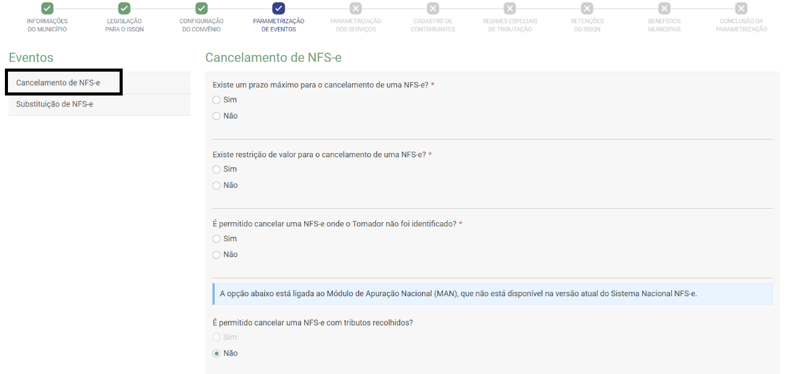

## Page 41

Guia para preenchimento do Painel Municipal da NFSe – versão 1.2
41
Figura 27 - Inserção do prazo máximo admitido para o cancelamento da NFS-e Nacional.
O prazo máximo admitido pelo sistema para o cancelamento da NFS-e é de 2 (dois) anos,
ou seja, 730 dias. Se a ATM não estipular um prazo máximo para o cancelamento da NFS-e
Nacional, deverá selecionar a opção “Não”. Se a ATM não estipular um prazo máximo para
o cancelamento do documento fiscal, este passará a ser o limite máximo admitido pelo
sistema, qual seja, 2 (dois) anos, ou 730 dias.
2) Existe restrição de valor para o cancelamento de uma NFS-e?
Neste campo a ATM deverá indicar se aceita o cancelamento da NFS-e até determinado valor, ou
seja, poderá inserir um valor máximo para o documento fiscal em que será aceito de modo automatizado o
pedido de seu cancelamento.
Figura 28 - Determinação do valor máximo da NFS-e em que se aceita o cancelamento.
Se a ATM não estabelecer um valor máximo para o cancelamento da NFS-e, qualquer valor será aceito
pelo sistema, desde que as outras condições parametrizadas sejam respeitadas.
3)
É permitido cancelar uma NFS-e onde o Tomador não foi identificado?
Em determinadas condições, uma nota pode ser emitida sem a identificação do tomador dos serviços.
No campo em análise, a ATM deverá indicar se aceitará o cancelamento das notas sem a identificação do
Tomador do Serviço (deverá selecionar “Sim” caso aceite este tipo de cancelamento e “Não”, em caso
contrário)

### Images from Page 41

## Page 42

Guia para preenchimento do Painel Municipal da NFSe – versão 1.2
42
Figura 30 - Opção de cancelamento da NFS-e sem identificação do Tomador.
4)
É permitido cancelar uma NFS-e com tributos recolhidos?
A ATM deverá indicar também se aceita o cancelamento de uma NFS-e em que os  tributos declarados
tenham sido pagos e recolhidos ao Fisco, podendo gerar restituições e compensações por parte da ATM.
Se a ATM aceitar o cancelamento supra descrito, a opção “Sim” deverá ser selecionada. Caso contrário,
seleciona-se a opção “Não”.
Figura 31 - Opção de cancelamento da NFS-e com tributos recolhidos.
Existem regras comuns e obrigatórias para todos os municípios relativas ao evento cancelamento de
NFS-e.
1.
Não é possível cancelar uma NFS-e que esteja marcada com bloqueio de cancelamento;
2.
Não há restrição para cancelamento de ofício de NFS-e;
Ao completar a etapa, clicar em .                                       .
3.4.2. Substituição de NFS-e
Assim como nas configurações sobre cancelamento, a ATM deverá indicar as situações que aceitará
a substituição da NFS-e Nacional.
A substituição de nota ocorre com a ação de substituição de NFS-e pelo envio de nova DPS indicando
uma chave de acesso de NFS-e já existente no sistema. Ao receber uma DPS contendo uma chave de acesso
a ser substituída, o sistema cancela a NFS-e existente e gera uma nota substituta, vinculando os documentos
envolvidos (notas substituída e substituta).
Quando um contribuinte realiza a substituição de uma NFS-e, ocorrem duas ações por parte do
Sistema da NFS-e Nacional: a NFS-e antiga é cancelada e substituída pela nova enviada ao sistema.
Além das configurações parametrizadas por cada Município, o sistema possui regras gerais, comuns a todos
os conveniados:

### Images from Page 42

## Page 43

Guia para preenchimento do Painel Municipal da NFSe – versão 1.2
43
1. É permitida a substituição nos casos de enquadramento/desenquadramento do Simples Nacional, sem
limite de prazo;
2. Não é permitida a substituição das NFS-e que estejam canceladas (por qualquer motivo);
3. Não é permitida a substituição das NFS-e que estejam bloqueadas pela administração municipal.
A modelagem de substituição de NFS-e no sistema nacional ocorre em dois processos, a primeira é a
substituição da NFS-e existente por uma substituta e a segunda o cancelamento da NFS-e substituída.
Um processo não existe sem o outro e as regras para substituição de NFS-e são a causa da realização
ou não de um evento de cancelamento de NFS-e por substituição.
Dessa forma, as regras do município existentes para a substituição de NFS-e devem ser definidas para
a substituição de NFS-e, que somente é concluída com o cancelamento por substituição de NFS-e, tratado
como um evento no sistema nacional. Assim, amplia-se o conceito de substituição de NFS-e como um evento
dentro do sistema nacional e o município deve definir suas regras na parametrização de eventos do painel
municipal, conforme abaixo.
Uma vez acessada a página de configuração das regras sobre substituição as seguintes opções são
mostradas na tela:
Figura 32 - Informações exigidas a respeito da substituição da NFS-e.
1. Existe um prazo máximo para a substituição de uma NFS-e?
Se a ATM determinar um prazo máximo a partir da emissão da NFS-e em que ela possa ser
substituída, deverá selecionar a opção “Sim” e em seguida inserir o prazo, em dias.

### Images from Page 43

## Page 44

Guia para preenchimento do Painel Municipal da NFSe – versão 1.2
44
Figura 33 - Parametrização do prazo admitido para a substituição de uma NFS-e.
2.
É permitido substituir uma NFS-e onde os não-emitentes não foram identificados?
Neste item a ATM deverá indicar se permitirá a substituição de documentos fiscais em que os não emitentes
não são identificados.
Por exemplo, a ATM permitirá a substituição de uma NFS-e emitida pelo prestador em que o
Tomador/intermediário não foram identificados? Se a resposta for positiva, a opção “Sim” deverá ser
selecionada, caso contrário, “Não”.
Figura 34 - Opções sobre a substituição de NFS-e em que os não emitentes não foram identificados.
3.
É permitido alterar as informações dos não-emitentes na NFS-e substituta?
A ATM deverá indicar se permite que as informações relativas aos não emitentes da NFS-e sejam
alteradas. Em caso positivo, a opção “Sim” deverá ser selecionada e viabilizará que determinadas
informações sejam alteradas.
Caso não deseje permitir tais alterações, a ATM deverá selecionar a opção “Não”.
Figura 35 - Opções de alteração das informações dos não emitentes da NFS-e.

### Images from Page 44

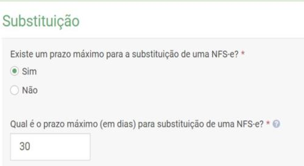

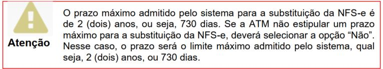

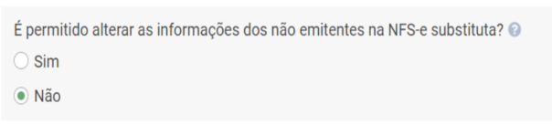

## Page 45

Guia para preenchimento do Painel Municipal da NFSe – versão 1.2
45
4.
É permitido substituir uma NFS-e com tributos recolhidos?
Neste item a ATM deverá indicar se permite a substituição de NFS-e cujos tributos já tenham sido pagos e
recolhidos. Caso tal evento seja permitido, deverá selecionar a opção “Sim” e caso contrário, “Não”.
Figura 36 - Opções de substituição de uma NFS-e com tributos recolhidos.
Uma vez marcadas todas as opções, o botão
deverá ser acionado no final da página.

### Images from Page 45

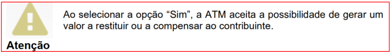

## Page 46

Guia para preenchimento do Painel Municipal da NFSe – versão 1.2
46
3.5.
Parametrização dos Serviços
Esta página possui a Lista de Serviços do Sistema Nacional NFS-e, organizada pelos itens da LC116/03
e subitens (que são os próprios subitens da LC116/03 na íntegra ou desdobrados em um ou mais para melhor
administração do município no Sistema Nacional NFS-e). Os parâmetros municipais devem ser administrados
diretamente nos subitens da lista ou, se o município assim optar, em códigos municipais de tributação criados
pelo próprio município abaixo dos subitens da lista de serviços nacionais.
Na tela de parametrização dos serviços, os representantes municipais poderão parametrizar
informações como alíquota, dedução/redução ou até mesmo acrescentar um código de tributação municipal
na lista de serviços.
Para avançar ao próximo passo do assistente de parametrização é necessário administrar todos os
subitens da lista ou códigos de tributação municipal que tenham sido criados pelo município.
Figura 37 - Tela de Parametrização dos Serviços.
Ao parametrizar a lista de serviços, o representante municipal poderá preencher as informações na
web, na própria página de parametrização ou, caso prefira, poderá fazer o download do arquivo da lista de
serviços (ver item 3.5.4), preencher as informações exigidas, e posteriormente fazer o upload do arquivo na
web.
3.5.1. Lista de Serviços – Conceitos e Modelagem
O Sistema Nacional NFS-e utiliza uma lista de serviços com subitens “desdobrados” dos subitens da lista
de serviços anexa à LC 116/03, ou seja, o “desdobro” é um subitem que corresponde exatamente ou se deriva

### Images from Page 46

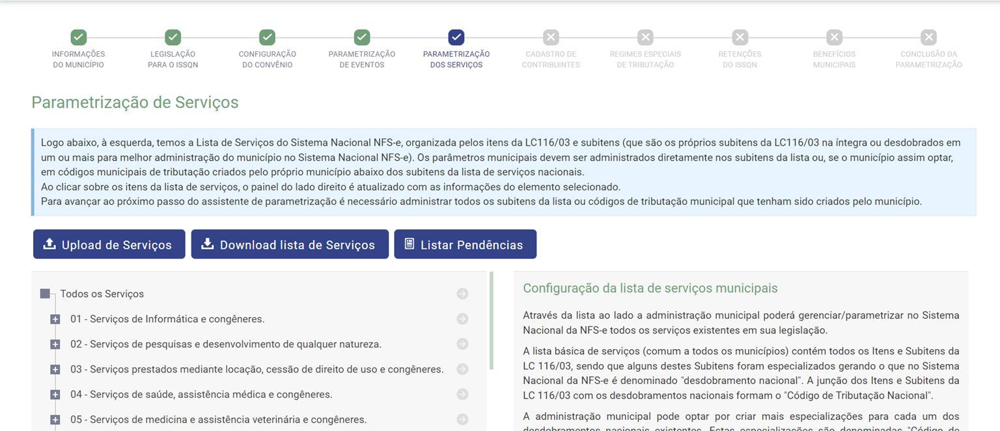

## Page 47

Guia para preenchimento do Painel Municipal da NFSe – versão 1.2
47
de um subitem da lista de serviços anexa à LC 116/03. Através da lista disponibilizada, a administração
municipal poderá gerenciar/parametrizar no Sistema Nacional da NFS-e todos os serviços existentes em sua
legislação.
a) Conceito dos Subitens “Desdobrados” para o Sistema Nacional NFS-e
O Sistema Nacional NFS-e utiliza uma lista de serviços com subitens “desdobrados” dos subitens da
lista de serviços anexa à LC 116/03, ou seja, o “desdobro” é um subitem que corresponde exatamente ou se
deriva de um subitem da lista de serviços anexa à LC 116/03. Deve-se dizer que a lista de serviços do sistema
nacional é exatamente a lista de serviços anexa à LC 116/03 em todo seu conteúdo adicionada à lista nacional
o código “990101 - Serviços sem a incidência de ISSQN e ICMS”. Apenas usou-se um artifício de
desdobramento, desmembramento de alguns subitens que são mais extensos ou conjugam uma ou mais
atividades com intuito de haver uma maior flexibilização para os municípios conveniados.
Como exemplos, a lista de serviços anexa à LC 116/03 possui o subitem 1.06 – Assessoria e consultoria
em informática. Na lista de serviços utilizada no Sistema Nacional NFS-e, que consta no AnexoB-
ListasServNac_NBS-SNNFSe_v0.2.xlsx (anexo que tem a lista de serviços “desdobrada” utilizada pelo Sistema
Nacional NFS-e), este subitem que também é considerado um desdobro, foi derivado da lista anexa à LC 116
e corresponde exatamente ao mesmo subitem 1.06 existente nesta listagem.
Já o subitem 7.02 – Execução, por administração, empreitada ou subempreitada, de obras de
construção civil, hidráulica ou elétrica e de outras obras semelhantes, inclusive sondagem, perfuração de
poços, escavação, drenagem e irrigação, terraplanagem, pavimentação, concretagem e a instalação e
montagem de produtos, peças e equipamentos (exceto o fornecimento de mercadorias produzidas pelo
prestador de serviços fora do local da prestação dos serviços, que fica sujeito ao ICMS) da LC 116, foi
“desdobrada” em dois subitens de serviços que constam no AnexoB-ListasServNac_NBS-SNNFSe_v0.2.xlsx,
ou seja, o subitem 7.02 da LC 116/03 foi subdividido para contemplar separadamente em um subitem a
atividade de Execução por Administração e no outro subitem a atividade de Execução por Empreitada ou
Subempreitada, ambas as atividade sendo realizadas para os mesmos tipos de serviços descritos no subitem
original. Abaixo segue a descrição dos dois subitens “desdobrados” derivados do subitem 7.02 da lista de
serviços anexa à LC 116/03 para exemplificar a explicação dada.
7.02.01 – Execução, por administração, de obras de construção civil, hidráulica ou elétrica e de outras obras
semelhantes, inclusive sondagem, perfuração de poços, escavação, drenagem e irrigação, terraplanagem,
pavimentação, concretagem e a instalação e montagem de produtos, peças e equipamentos (exceto o
fornecimento de mercadorias produzidas pelo prestador de serviços fora do local da prestação dos serviços,
que fica sujeito ao ICMS).
7.02.02 – Execução, por empreitada ou subempreitada, de obras de construção civil, hidráulica ou elétrica e
de outras obras semelhantes, inclusive sondagem, perfuração de poços, escavação, drenagem e irrigação,
terraplanagem, pavimentação, concretagem e a instalação e montagem de produtos, peças e equipamentos

### Images from Page 47

## Page 48

Guia para preenchimento do Painel Municipal da NFSe – versão 1.2
48
(exceto o fornecimento de mercadorias produzidas pelo prestador de serviços fora do local da prestação dos
serviços, que fica sujeito ao ICMS).
Dessa forma, a lista de serviços da LC 116/03 não é modificada semanticamente, contudo a lista de
serviços “desdobrados” se torna a lista de serviços de abrangência nacional utilizada minimamente por todos
os municípios conveniados ao Sistema Nacional NFS-e.
b)
Conceito do Código de Tributação Nacional
Dito isto, entende-se que não houve nenhuma modificação no conteúdo da lista de serviços anexa à LC
116/03 e sim apenas um desmembramento de alguns subitens da lista para melhor acomodar as atividades
dos subitens e flexibilizar seu uso pelos municípios conveniados ao sistema nacional em seu dia a dia.
Para não descaracterizarmos a lista anexa à LC 116/03, acrescentou-se mais dois dígitos após os dígitos
do subitem original para que o sistema nacional contemplasse a LC 116/03 original com alguns subitens
“desdobrados”, mantendo dessa forma uma única lista de serviços que pudesse contemplar todos os
municípios brasileiros, desde os menores aos maiores que possuem atividades de serviço com aspectos
legislativos mais diferenciados para atividades diferentes que estão contempladas originalmente no mesmo
subitem da LC 116/03.
O subitem 07.02 original da LC 116/03 passa a corresponder aos subitens 07.02.01 e 07.02.02 da lista
de serviços “desdobrados”, ou seja, no nível nacional, válido para todos os municípios conveniados ao sistema
nacional, os subitens da lista nacional possuem 6 dígitos em seus códigos. Até mesmo subitens que não foram
efetivamente desdobrados como o 2.01 da LC 116/03 passam a ter a codificação com 6 dígitos: 02.01.01.
Assim padronizamos toda a lista e não há diferença de entendimento do formato dos subitens para os usuários.
c)
Conceito do Código de Tributação Municipal
Entendendo ainda que as variadas atividades de serviço podem ter diferentes aspectos que, por
diversos motivos, tem algum tipo de tratamento diferenciado pelo município, o sistema nacional permite ainda
uma possibilidade de flexibilização para o município criar atividades de serviços de forma vertical, ou seja,
definição do código de tributação municipal criada abaixo de algum “desdobro” da lista de serviço nacional,
disposta no anexo AnexoB-ListasServNac_NBS-SNNFSe.xlsx.
Assim temos, possibilidades de atividades de serviços especializadas que possuem cada qual um
código de tributação municipal. Estas atividades são específicas para cada município que as criou e seguem,
obrigatoriamente, as mesmas “regras gerais” do código de tributação nacional da qual é “filho”, pois os
códigos de tributação nacionais (desdobrado) são os serviços listados na LC 116/03 e, portanto, seguem as
“regras gerais”, que mencionamos acima, como por exemplo, as regras de incidência do ISSQN definidas pela
lei complementar.
Então vejamos, o subitem 07.02 original da LC 116/03 passou a corresponder aos subitens 07.02.01 e
07.02.02 da lista de serviços “desdobrados”, ou seja, temos 6 dígitos em seus códigos no nível nacional. Caso
o município necessite criar uma atividade específica somente poderá fazê-lo abaixo de um código nacional e,

### Images from Page 48

## Page 49

Guia para preenchimento do Painel Municipal da NFSe – versão 1.2
49
portanto, devemos ter uma numeração específica para possibilitar esta flexibilização. Dessa maneira, aos
códigos nacionais serão acrescentados 3 dígitos diferentes de 000 para indicar o código de tributação
municipal que representa uma atividade específica criada pelo município
d)
Conceito do Código de Tributação 99.01.01
A lista de serviços nacional utilizada no Sistema Nacional NFS-e é a lista de serviços anexa a LC 116/03
com alguns subitens desdobrados, como explicado anteriormente. Foi incluído um subitem ao final da lista
com o código 99.01.01 - Serviços sem a incidência de ISSQN e ICMS. Este código, conforme sua própria
descrição informa, serve para as prestações de serviços com não incidência de ISS e ICMS, que tenham a
necessidade de emissão de uma NFS-e.
Como exemplo, empresas fazem a emissão da NFS-e utilizando subitem de serviço Vetado e nesses
casos o município teria que utilizar o código da lista nacional, 99.01.01 - Serviços sem a incidência de ISSQN
e ICMS.
Este código não recebe nenhum tipo de parâmetro, ou seja, não é possível vincular nenhum tipo de
parâmetro a este código como deve ser realizado nos demais códigos da lista de serviços.
e)
Modelagem da Parametrização dos Subitens da Lista de Serviços
Realizado o entendimento da estrutura da lista de serviços do Sistema Nacional NFS-e, passamos agora
a compreender como devemos parametrizar os subitens da lista de serviços.
É importante compreender que os parâmetros informados na lista de serviços são vinculados a cada
subitem da lista, ou seja, é o subitem que agrega as informações de parametrização, pois quando um
contribuinte emite uma DPS ele indica o subitem da lista de serviço que prestou e, portanto, é este subitem
que deve conter os parâmetros que automatizarão a prestação de informações pelo contribuinte, além de
permitir que as informações inseridas no documento fiscal estejam corretas e precisas, de acordo com a
informação do próprio município.
Isso deve ser dito para tornar claro que, quando o gestor municipal estiver realizando as
parametrizações, ele encontrará algumas facilidades para realizá-las, como por exemplo incluir uma mesma
alíquota para todos os subitens, ou para todos os subitens de um item da lista de serviços em apenas um
passo da funcionalidade do painel municipal, ou seja, não seria obrigatório ao gestor municipal incluir uma
alíquota subitem a subitem da lista de serviço. Basta ao gestor municipal escolher a raiz dos subitens que
deseja incluir uma alíquota por exemplo que o sistema automaticamente inclui a alíquota que for informada
para todos os subitens “filhos” daquele ponto.
Por exemplo, se um município A tem somente uma alíquota de 2% para todos os subitens de seu ISSQN,
então basta ele selecionar o topo da lista apresentada “Todos os Serviços” e informar 2% para o parâmetro
alíquota. O sistema automaticamente incluirá 2% como alíquota em todos os subitens da lista deste município
A. Ainda neste exemplo, se apenas os subitens do item 17 tem uma alíquota de 5% e todos os demais são 2%,
então ele pode realizar o primeiro passo informando 2% para todos os subitens e depois selecionar apenas o

### Images from Page 49

## Page 50

Guia para preenchimento do Painel Municipal da NFSe – versão 1.2
50
item 17 e redefinir de 2% (que foi definido no 1º passo) para 5%. O sistema irá redefinir a alíquota de 5%
somente para os subitens do item 17.
Este processo pode ser realizado conforme convier ao gestor municipal de forma a ser mais otimizado
seu processo de parametrização da lista de serviço. Até mesmo, se lhe convier, pode realizar subitem a
subitem, não importando a ordem de subitens que se faça.
O importante é entender que é no subitem que estão administrados os parâmetros da lista de serviços
e que todos os subitens devem ser completamente parametrizados.
A lista de serviços possui quatro tipos de parâmetros a saber:
1.
Código de Tributação Municipal;
2.
Alíquota;
3.
Dedução/Redução;
4.
Código original do município;
No Portal, para facilitar a manutenção e navegação entre os serviços do município, a lista é exibida de
forma hierárquica. Ao clicar sobre qualquer elemento da lista com o ícone
é possível ver todos os
elementos vinculados a ele. Os elementos com o ícone
indicam o último nível da hierarquia.
Todos os elementos da lista de serviços possuem um botão de seleção (
) que quando acionado
exibirá automaticamente no painel de detalhamento (existente no lado direito da página) as informações e
possíveis ações referentes ao elemento selecionado. O Sistema Nacional da NFS-e permite que as
parametrizações dos serviços sejam feitas individualmente ou em grupo, ou seja, ao selecionar um elemento
que contenha outros elementos vinculados, as ações realizadas serão aplicadas em todos estes elementos
vinculados.

### Images from Page 50

## Page 51

Guia para preenchimento do Painel Municipal da NFSe – versão 1.2
51
Figura 38 - Tela de Parametrização dos Serviços.
3.5.2. Parametrização na página da web
O Sistema Nacional da NFS-e permite que as parametrizações dos serviços sejam realizadas na página
da web, conforme será explicado a seguir.
Através da lista de serviços a ATM poderá gerenciar/parametrizar no Sistema da NFSNacional todos os
serviços existentes em sua legislação.
A lista básica de serviços, comum a todos os municípios conveniados, contém todos os Itens e Subitens
da Lei Complementar 116 de 31 de julho de 2003 mais alguns outros desdobramentos derivados da
especialização desses subitens, compondo assim o "Código de Tributação Nacional".
Se o código de serviço utilizado atualmente pelo Município for compatível com os códigos de tributação
do Sistema Nacional, basta configurar as alíquotas de acordo com o item “19.3.2. Definição da alíquota” e a
possibilidade de eventuais deduções ou reduções de base de cálculo conforme item “19.3.3.
Dedução/Redução”, ambos desse manual.

### Images from Page 51

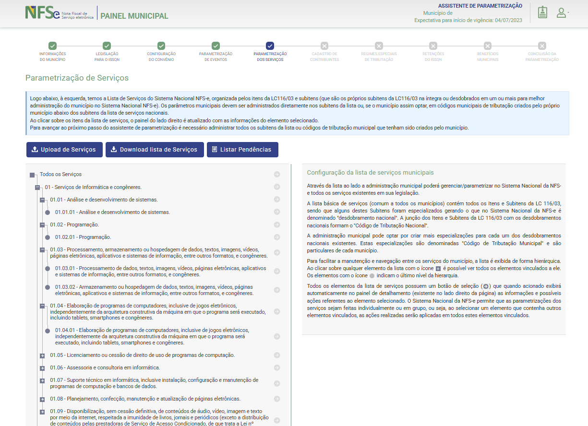

## Page 52

Guia para preenchimento do Painel Municipal da NFSe – versão 1.2
52
Entretanto, se o Município utiliza maiores desdobramentos para identificar determinados serviços de
um mesmo subitem da lista, poderá então complementar a parametrização de serviços com a configuração
do Código de Tributação Municipal conforme item a seguir.
3.5.2.1. Configuração do Código Original do Município
A administração municipal pode optar por criar mais especializações para cada um dos
desdobramentos nacionais existentes. Estas especializações formam o "Código de Tributação Municipal" e
são específicas de cada Município.
Para facilitar o gerenciamento e navegação entre os serviços do município, a lista de serviços é exibida
de forma hierárquica. Ao clicar sobre qualquer elemento da lista com o ícone
é possível ver todos os
elementos vinculados a ele. Os elementos com o ícone
indicam o último nível da hierarquia. É neste ponto
que é permitido a criação de um “Código de Tributação Municipal”.
Ao clicar no elemento com o ícone
será apresentada tela com opção para definir a alíquota e a
opção para criar Código de Tributação Municipal.
Todos os elementos da lista de serviços possuem um botão de seleção (
) que quando acionado
exibirá automaticamente no painel de detalhamento (existente no lado direito da página) as informações e
possíveis ações referentes ao elemento selecionado.
Nesta etapa é possível criar ou editar os Códigos Originais no Município
e  alterar a
alíquota
1.
Para criar um item especializado, selecionar o botão “Criar Código de Tributação Municipal”.

### Images from Page 52

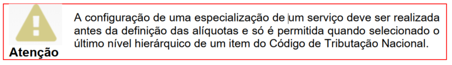

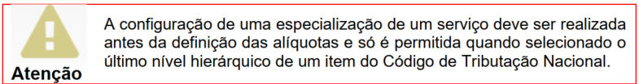

## Page 53

Guia para preenchimento do Painel Municipal da NFSe – versão 1.2
53
Figura 39 - Seleção de um serviço da lista para especialização.
O sistema então irá exibir a tela abaixo com três campos a serem preenchidos.
Figura 40 - Configuração do código e do nome da especialização do serviço.
O primeiro campo a ser preenchido diz respeito à Identificação do Serviço no Sistema Nacional. Nesse
espaço deverá ser digitado um código de três dígitos que corresponderá ao Código Tributário Municipal. Só
não pode ser utilizado aqui o código “000”.
Em seguida, passa-se à configuração do código original do serviço no município, nesse campo pede-
se que a ATM insira no campo o código correspondente do serviço no município. Esse item poderá ser
preenchido com letras e números e não tem uma quantidade de caracteres pré-determinada, apenas deverá
ser preenchido.
No campo descrição deverá ser inserido a forma como o serviço definido nesse desdobramento deverá
ser identificado na Lista Código de Serviços.
Uma vez realizada a configuração dos três campos explicados acima, deverá ser selecionado o botão
“Salvar”. O novo desdobramento será mostrado na nova página do sistema carregada.

### Images from Page 53

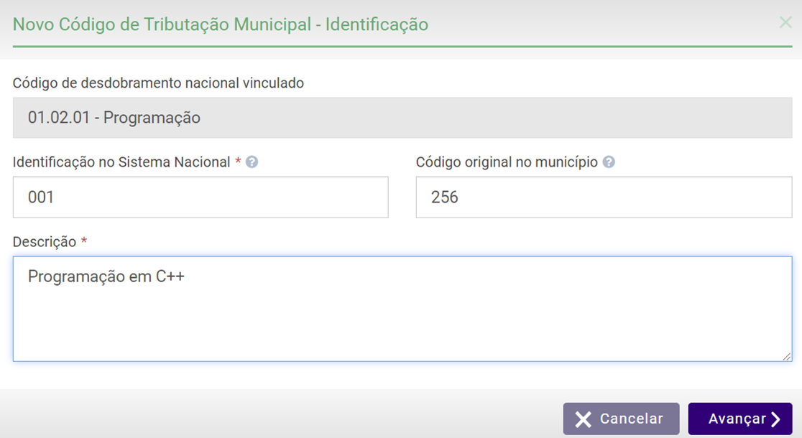

## Page 54

Guia para preenchimento do Painel Municipal da NFSe – versão 1.2
54
Figura 41 - Tela de configuração da alíquota da especialização do serviço a ser criada.
Uma nova tela é exibida, para a configuração da alíquota do código de serviço a ser criado. Nesse
campo são respeitadas as mesmas regras para a definição das alíquotas, descritas no item 16 - Parametrização
dos Serviços desse Manual.
As telas que são mostradas abaixo se referem às configurações de Dedução/Redução da Base de
cálculo do ISSQN e dos Regimes Especiais de Tributação admitidos. Para a configuração desses campos,
sugere-se a pesquisa dos itens 16 - Parametrização dos Serviços e 18 - Regimes Especiais de Tributação
desse Manual.

### Images from Page 54

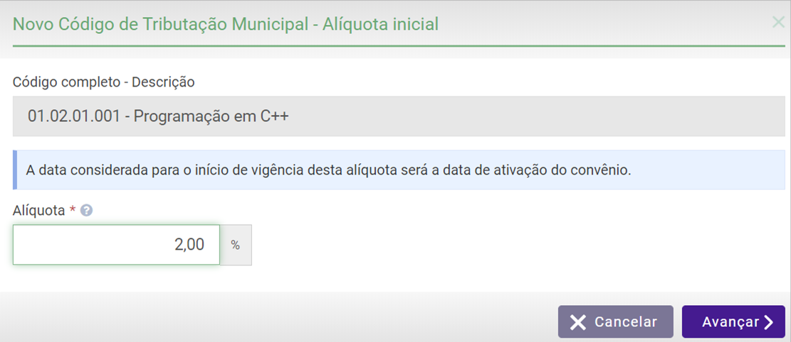

## Page 55

Guia para preenchimento do Painel Municipal da NFSe – versão 1.2
55
Figura 42 - Tela de configuração de Dedução/Redução da base de cálculo para a especialização do serviço.
Figura 43 - Tela de configuração dos Regimes Especiais de Tributação admitidos para a especialização do
serviço criada.
Uma vez preenchidos todos os campos solicitados, deve-se salvar as configurações realizadas.
O sistema então irá mostrar a lista de serviços atualizada com o Código Tributário Municipal devidamente
inserido e com as informações gerais referentes às alíquotas e opções de configuração.

### Images from Page 55

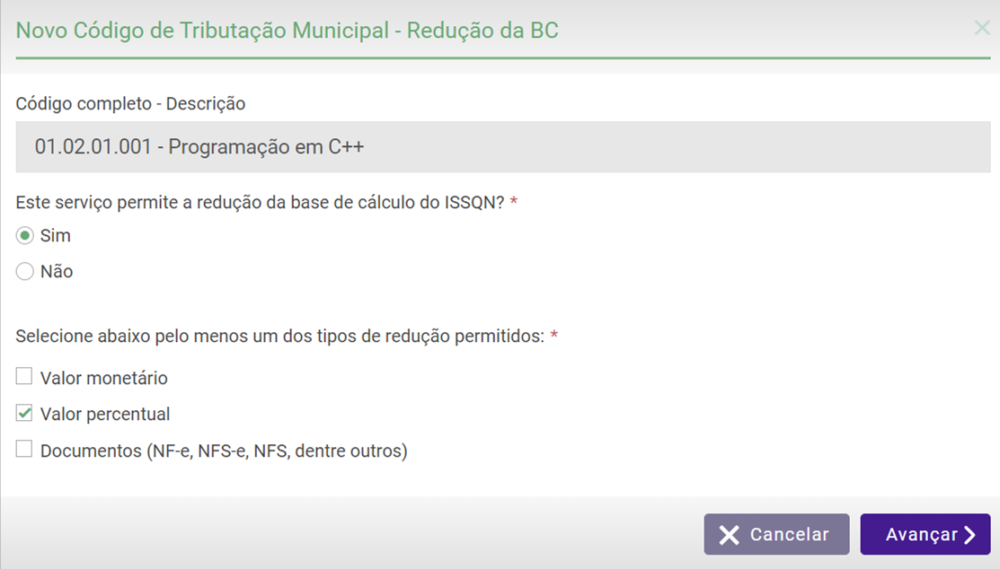

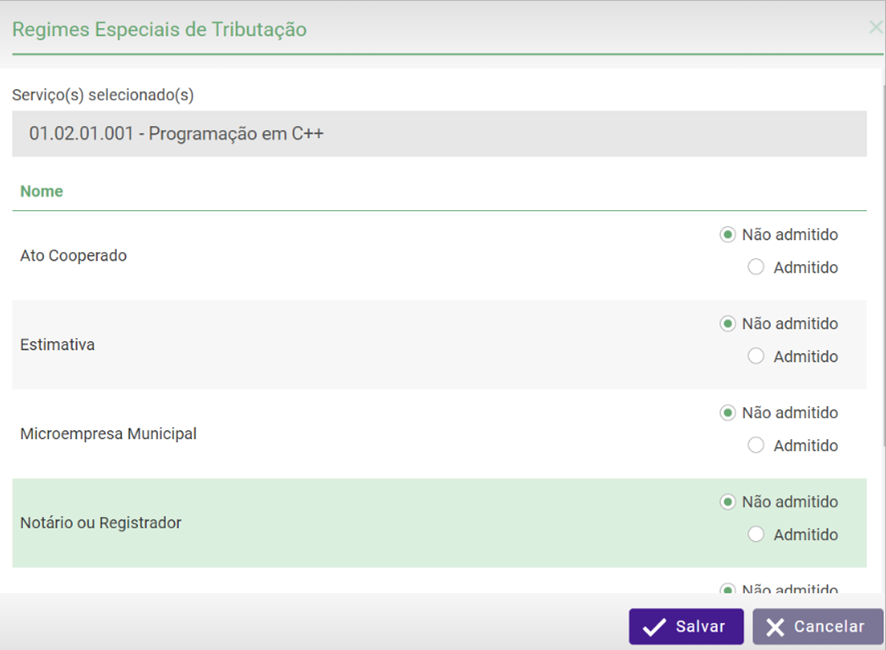

## Page 56

Guia para preenchimento do Painel Municipal da NFSe – versão 1.2
56
Figura 44 - Lista de Serviços atualizada com o Código de Tributação Municipal.
O Sistema Nacional da NFS-e permite que as parametrizações dos serviços sejam realizadas
individualmente ou em grupo, ou seja, ao selecionar um elemento que contenha outros elementos
subordinados a ele, as ações realizadas serão aplicadas em todos estes elementos vinculados.
Figura 45 - Seleção de todos os serviços para parametrização.

### Images from Page 56

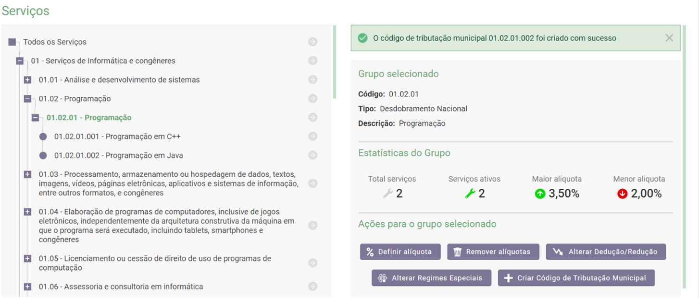

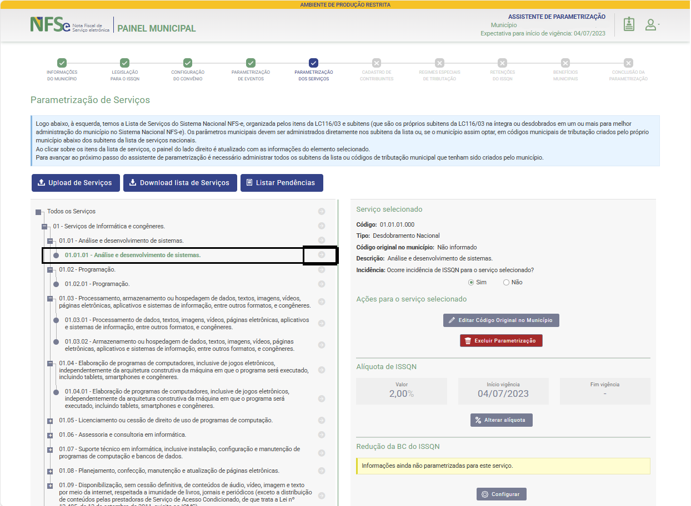

## Page 57

Guia para preenchimento do Painel Municipal da NFSe – versão 1.2
57
O código Original do Município pode ser editado usando o ícone “Editar Código Original do Município”.
Figura 46 – Tela para edição do código Original do Município.
3.5.2.2. Definição de alíquotas para os serviços
O Sistema Nacional da NFS-e permite que as parametrizações dos serviços sejam realizadas
individualmente ou em grupo, ou seja, ao selecionar um elemento que contenha outros elementos
subordinados a ele, as ações realizadas serão aplicadas em todos estes elementos vinculados.
As alíquotas dos serviços existentes em um município conveniado ao sistema nacional devem ser
definidas, assim como todas as demais parametrizações obrigatórias exigidas para a “Ativação” do município
e o correto funcionamento do sistema. A alíquota pertence ao “desdobro” do subitem da lista de serviço
nacional. O conceito de desdobro do subitem foi explicado anteriormente neste manual.
Através desta lista a administração municipal poderá gerenciar/parametrizar no Sistema Nacional da
NFS-e todos os serviços existentes em sua legislação.
A lista básica de serviços (comum a todos os municípios) contém todos os Itens e Subitens da lista
anexa à LC 116/03, sendo que alguns destes subitens foram especializados gerando o que no Sistema
Nacional da NFS-e é denominado "desdobramento nacional" ou “desdobro” do subitem. A junção dos itens e

### Images from Page 57

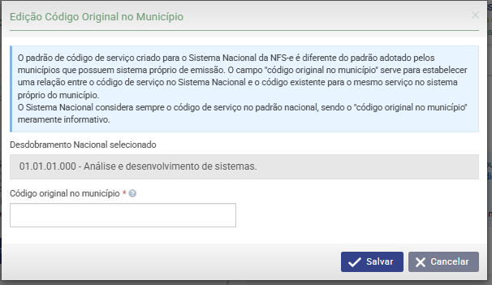

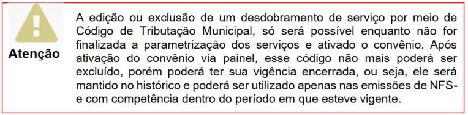

## Page 58

Guia para preenchimento do Painel Municipal da NFSe – versão 1.2
58
subitens originais da LC 116/03 com os desdobramentos nacionais formam o "Código de Tributação Nacional"
(como pode ser observado no leiaute DPS).
A administração municipal pode optar por criar mais especializações para cada um dos
desdobramentos nacionais existentes. Estas especializações são denominadas "Código de Tributação
Municipal" e são particulares de cada município (também pode ser observado no leiaute DPS).
Para facilitar o gerenciamento e navegação entre os serviços do município, a lista é exibida de forma
hierárquica. Ao clicar sobre qualquer elemento da lista com o ícone
é possível ver todos os elementos
vinculados a ele. Os elementos com o ícone
indicam o último nível da hierarquia.
Todos os elementos da lista de serviços possuem um botão de seleção (
) que quando acionado
exibirá automaticamente no painel de detalhamento (existente no lado direito da página) as informações e
possíveis ações referentes ao elemento selecionado. O Sistema Nacional NFS-e permite que as
parametrizações dos serviços sejam feitas individualmente ou em grupo, ou seja, ao selecionar um elemento
que contenha outros elementos vinculados, as ações realizadas serão aplicadas em todos estes elementos
vinculados.
Para definir a alíquota para um determinado serviço, deve-se clicar na seta (
) no final da linha
descritiva de cada grupo/subgrupo:
Figura 47 - Seleção de todos os serviços para parametrização.
Ao selecionar um grupo/subgrupo, uma janela com os detalhes do serviço selecionado será exibida
no lado direito da tela para que sejam definidos:  se ocorre incidência de ISSQN para os serviços do grupo
selecionado, a definição da alíquota, se há Dedução/redução ou excluir Parametrizações.

### Images from Page 58

## Page 59

Guia para preenchimento do Painel Municipal da NFSe – versão 1.2
59
Figura 48  – Alteração dos parâmetros de todos os serviços as lista selecionada..
Ao selecionar o botão
a seguinte tela é exibida:
Figura 49 - Tela de definição da alíquota aplicável a todos os serviços da lista.
No campo “Legislação” deverá ser escolhida a legislação que determina a alíquota aplicável ao serviço
selecionado. Essa Lei deverá ser previamente cadastrada no passo “Legislação para o ISSQN”.
A alíquota então deverá ser inserida no campo de mesmo nome. Como a mensagem exibida na tela
orienta, durante a ativação do convênio não é possível alterar a data de início de vigência da alíquota, pois o
sistema considerará a mesma data de início de vigência do convênio.

### Images from Page 59

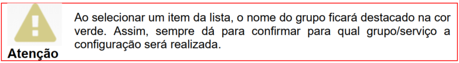

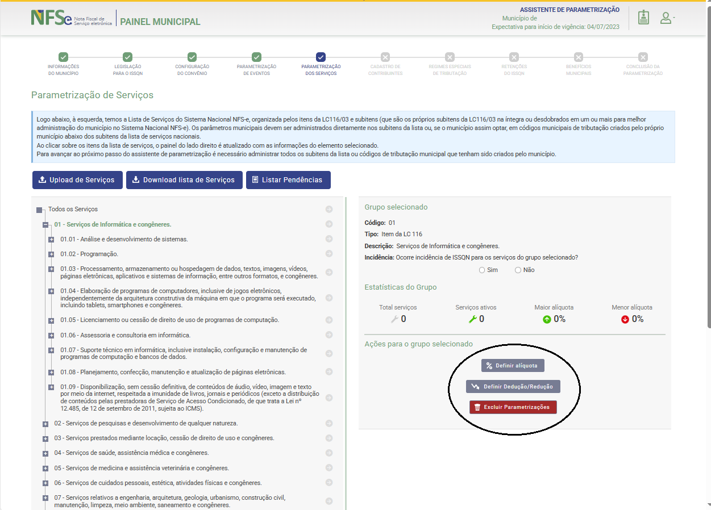

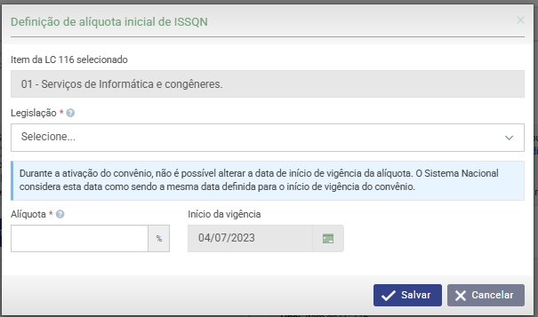

## Page 60

Guia para preenchimento do Painel Municipal da NFSe – versão 1.2
60
Uma vez preenchido o campo da alíquota, basta selecionar o botão “Salvar”. Será então exibida uma
tela demonstrando as informações salvas.
O sistema se comporta da mesma maneira quando um grupo menor de serviços é selecionado.
Figura 50 - Tela de confirmação das alterações referentes à alíquota.
Figura 51 - Seleção de um grupo para definição da alíquota

### Images from Page 60

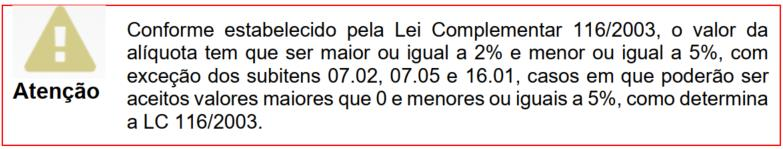

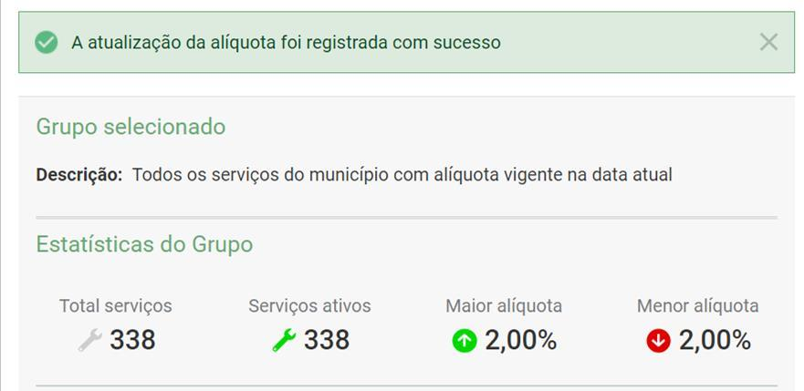

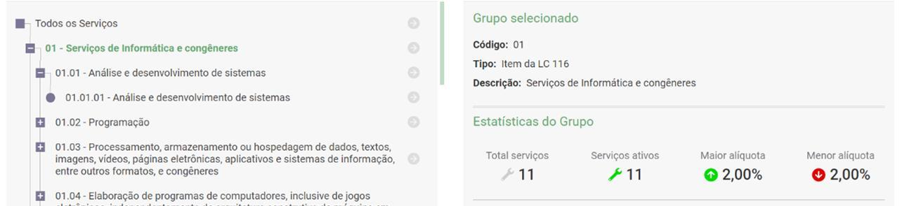

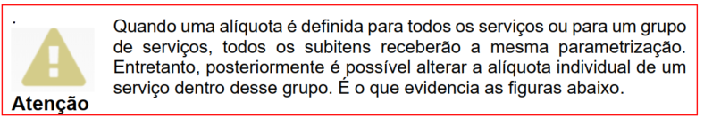

## Page 61

Guia para preenchimento do Painel Municipal da NFSe – versão 1.2
61
Figura 52- Tela de alteração da alíquota do grupo selecionado
Figura 53 - Tela de alteração da alíquota do item selecionado.

### Images from Page 61

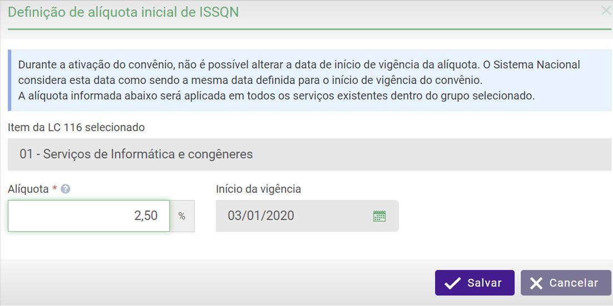

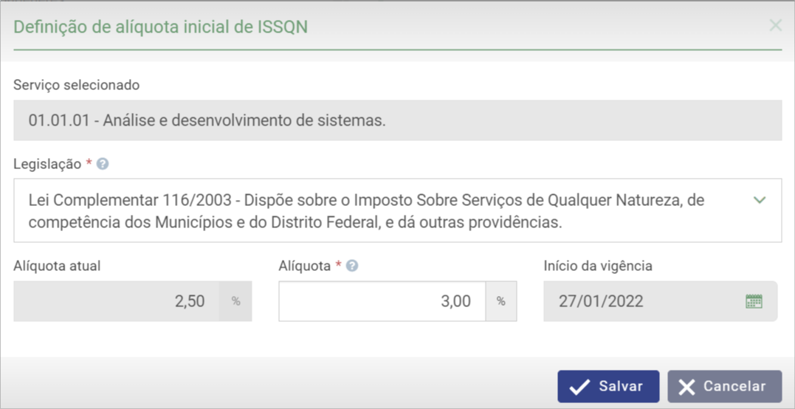

## Page 62

Guia para preenchimento do Painel Municipal da NFSe – versão 1.2
62
Figura 54 - Seleção de um subitem da lista para definição de alíquota.
Figura 55 - Confirmação da alteração da alíquota para todo o grupo selecionado.
Figura 56 - Confirmação da alteração da alíquota para o item selecionado.
O Sistema da NFS-e Nacional permite ainda que se possa verificar as informações gerais das
configurações até então realizadas. Ao selecionar “Todos os serviços” ou um grupo de serviços, o sistema
mostra qual é a menor e a maior alíquota configurada, bem como a quantidade de serviços ativos.

### Images from Page 62

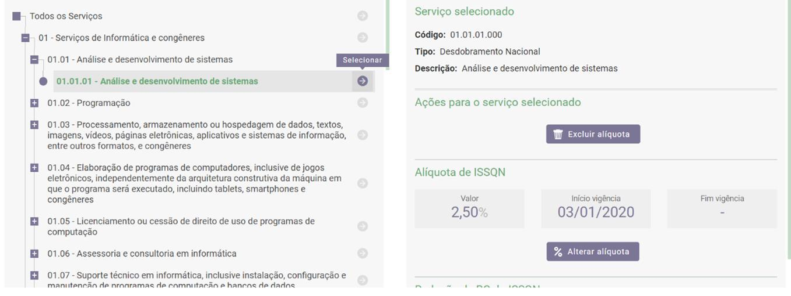

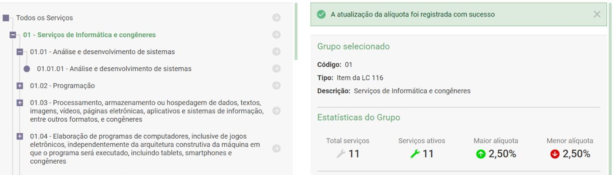

## Page 63

Guia para preenchimento do Painel Municipal da NFSe – versão 1.2
63
Figura 57 - Tela que evidencia visão geral dos serviços parametrizados.
3.5.2.3. Definição de Dedução / Redução
A definição de Dedução/Redução no caso refere-se a uma possibilidade de diminuição da base de
cálculo para aferição do ISSQN. Os conceitos são idênticos, mas a terminologia é diferente para os subitens
da lista de serviços.
O termo “Dedução” é utilizado para os grupos de serviços 07.02, 07.05, e seus desdobramentos, pois
são alterações na base de cálculo permitidas pela Lei Complementar 116/2003. Já o termo “Redução” é
utilizado para os demais serviços e caracterizam uma renúncia fiscal por parte do município.
A Dedução / Redução somente pode ser definidas após a definição da alíquota para um “desdobro”
da lista.
Ao selecionar “Todos os serviços” ou um grupo de serviços, todas as configurações realizadas serão
aplicadas aos itens subordinados hierarquicamente a eles. No exemplo abaixo, foi selecionado o grupo de
serviços vinculados aos “Serviços de Informática e congêneres”.
Figura 58 – Exemplo de Grupo de serviços vinculados

### Images from Page 63

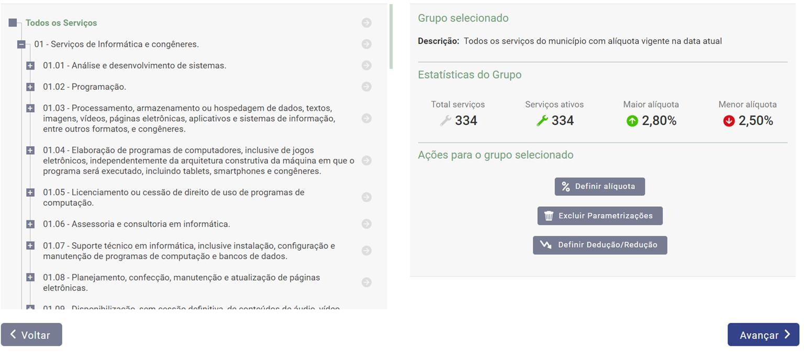

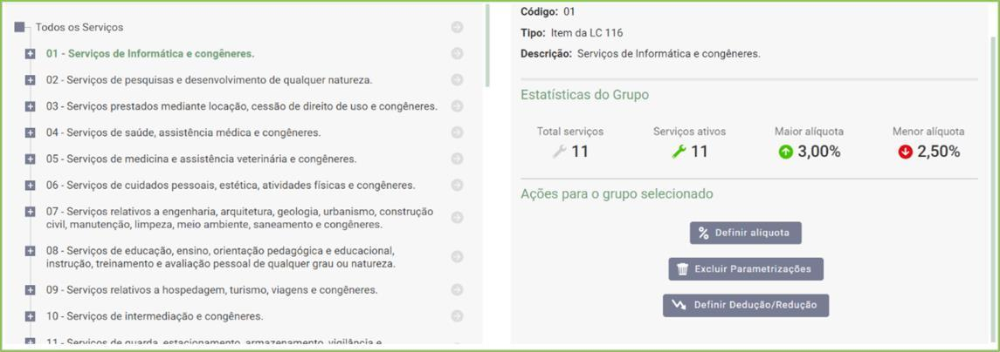

## Page 64

Guia para preenchimento do Painel Municipal da NFSe – versão 1.2
64
Para definir se haverá dedução/redução, deve-se clicar em
e preencher os campos
requeridos conforme indicado abaixo:
Figura 59 - Opção do tipo de dedução/redução permitidos para os serviços selecionados.
A tela acima é então exibida e deverá ser selecionada a legislação que suporta a dedução/redução da
base de cálculo do ISSQN.
O município poderá então selecionar as seguintes opções:
● Valor monetário: dedução/redução por valor expresso em moeda;
● Valor percentual: dedução/redução por um valor percentual aplicado sobre a base de cálculo do
imposto;
• Documentos: dedução/redução permitidos através de documentos anexados à
NFS-e a ser emitida.
Poderão ser selecionadas uma ou mais dessas três opções disponíveis. Finalizada essa configuração,
deve-se clicar no botão “Salvar”.
As configurações realizadas poderão ser conferidas ao selecionar cada serviço. No exemplo do grupo
“Serviços de Informática e congêneres”, ao selecionar o item “01.01.01 – Análise e desenvolvimento de
sistemas”, último nível hierárquico do grupo, as configurações aparecem salvas.

### Images from Page 64

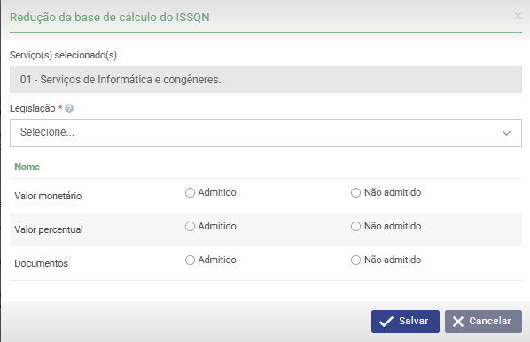

## Page 65

Guia para preenchimento do Painel Municipal da NFSe – versão 1.2
65
Figura 60 - Informações de dedução e redução salvas para o serviço selecionado.
Uma vez realizadas todas as parametrizações na lista de serviços, o botão “Avançar” no canto inferior
direito deverá ser acionado.
3.
Se houver necessidade de excluir as parametrizações feitas anteriormente, deve-se clicar em    abrirá
uma janela
para confirmação da exclusão.
Figura 61 – Tela de confirmação de exclusão das parametrizações.

### Images from Page 65

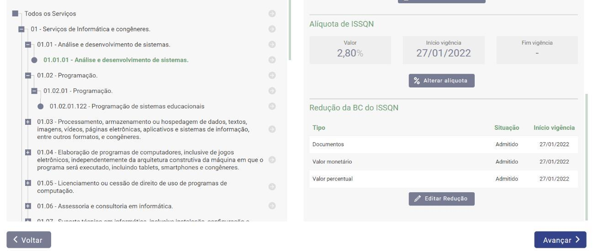

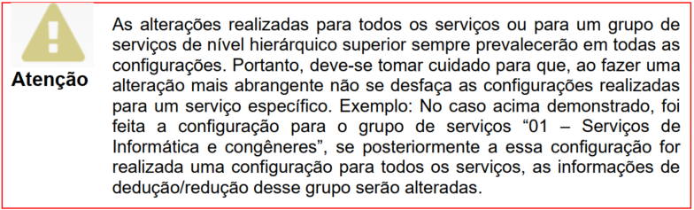

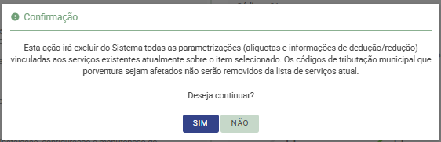

## Page 66

Guia para preenchimento do Painel Municipal da NFSe – versão 1.2
66
3.5.3. Parametrização de Serviços através do Upload de um arquivo
Esta funcionalidade permite atualizar e parametrizar a lista de serviços do município através do upload de
um arquivo. Ou seja, O gestor municipal poderá inserir um ou mais códigos de tributação municipal na lista de
serviços nacional. É possível criar Códigos de Tributação Municipal e administrar os parâmetros de todos os
serviços (alíquotas e dedução/redução). Cada registro do arquivo é processado individualmente na ordem em
que eles forem posicionados. O processamento do arquivo não sobrescreve as informações já existentes na lista
de serviços. Caso seja necessário, deve-se utilizar as funcionalidades de exclusão individual disponíveis na lista
de serviços.
Ao acionar o botão “Upload de Serviços” na página de parametrização de serviços, uma nova página será
aberta.
Figura 62 - Página de upload da planilha de serviços
Ao acionar o botão de “Leiaute do arquivo”, é aberta uma tela informando como as informações
deverão ser formatadas no arquivo para upload de forma que o sistema reconheça corretamente todos os
dados.

### Images from Page 66

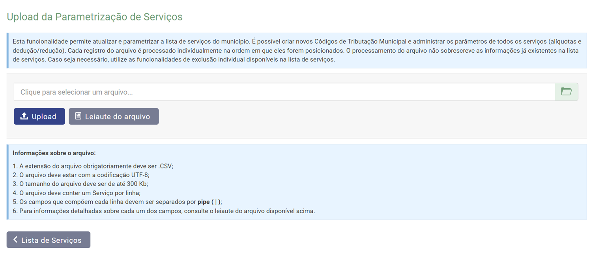

## Page 67

Guia para preenchimento do Painel Municipal da NFSe – versão 1.2
67
Figura 63 - Tela informativa sobre leiaute para upload das informações.
As informações disponibilizadas para o upload do arquivo de parametrização de serviços são as
seguintes:
1. A extensão do arquivo obrigatoriamente deve ser .CSV;
2. O arquivo deve estar com a codificação UTF-8;
3. O tamanho do arquivo deve ser de até 300 Kb;
4. O arquivo deve conter um Serviço por linha;
5. Os campos que compõem cada linha devem ser separados por pipe ( | );
6. Para informações detalhadas sobre cada um dos campos, consulte o leiaute do arquivo disponível acima.
Descrição dos campos do arquivo de upload
Formação da linha
Cada linha do arquivo .csv deve conter exatamente 8 pipes ( | ), que é o caracter reservado da
funcionalidade para separar os 9 campos existentes para cada serviço (linha do arquivo), ou 4 pipes ( | ) se o
serviço não possuir incidência de ISSQN, deixando os últimos 4 campos em branco.

### Images from Page 67

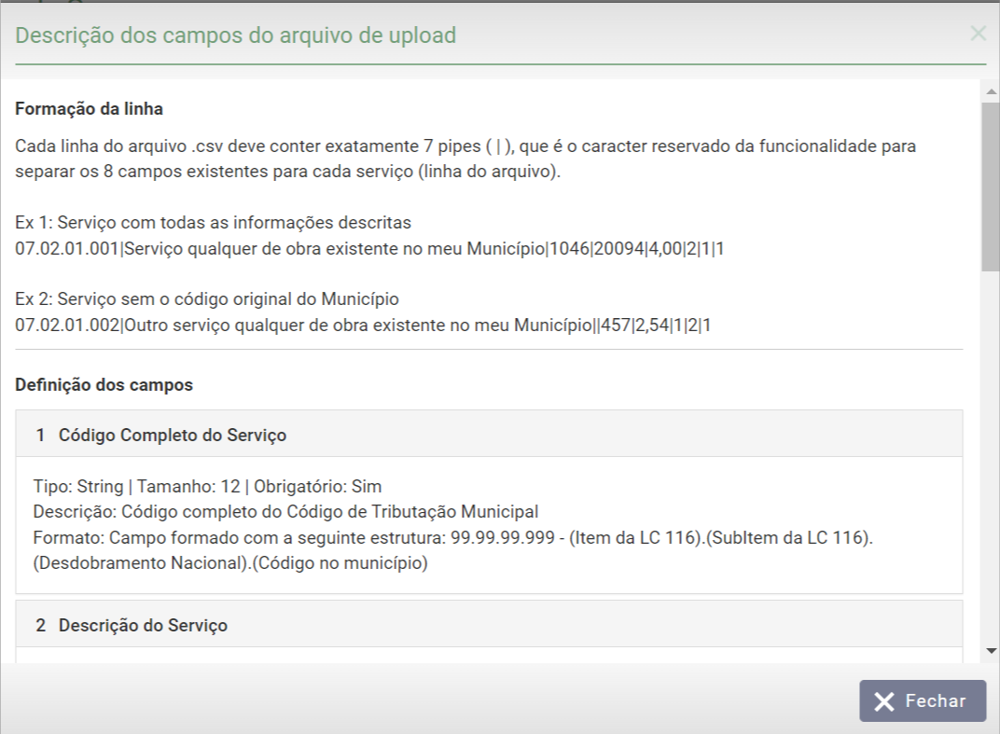

## Page 68

Guia para preenchimento do Painel Municipal da NFSe – versão 1.2
68
Ex 1: Serviço com todas as informações descritas
07.02.01.001|Serviço qualquer de obra existente no meu Município|1046|20094|1|4,00|2|1|1
Ex 2: Serviço sem o código original do Município
07.02.01.002|Outro serviço qualquer de obra existente no meu Município||457|1|2,54|1|2|1
Ex 3: Serviço com ISSQN não incidente
14.02.01.000|Assistência técnica||31005000100001|2
Definição dos campos
1 Código Completo do Serviço
Tipo: String | Tamanho: 12 | Obrigatório: Sim
Descrição: Código completo do Código de Tributação Municipal
Formato: Campo formado com a seguinte estrutura: 99.99.99.999 - (Item da LC 116).(SubItem da LC
116).(Desdobramento Nacional).(Código no município)
2 Descrição do Serviço
Tipo: String | Tamanho: 500 | Obrigatório: Sim
Descrição: Descrição completa do Código de Tributação Municipal
Formato: Texto livre de até 500 caracteres
3 Código Original no Município
Tipo: String | Tamanho: 50 | Obrigatório: Não
Descrição: Código utilizado no município para identificar este mesmo serviço
Formato: Texto livre
Importante: Campo utilizado apenas para rastrear e vincular os códigos existentes no municipio aos códigos
criados no Sistema Nacional da NFS-e
4 Identificador da Legislação
Tipo: Número | Tamanho: 18 | Obrigatório: Sim
Descrição: Identificador único da legislação vinculada à criação do serviço
Formato: Número de até 18 dígitos
Importante: Utilizar ID exibido para cada uma das legislações listadas na tela de legislações
5 Incidência de ISSQN
Tipo: Número | Tamanho: 1 | Obrigatório: Sim
Descrição: Determina se o serviço é ou não incidente do Imposto Sobre Serviços de Qualquer Natureza
(ISSQN)
Formato: 1 - Incidente; 2 - Não Incidente

### Images from Page 68

## Page 69

Guia para preenchimento do Painel Municipal da NFSe – versão 1.2
69
Importante: Os demais 4 campos abaixo, "Alíquota do serviço" e "Dedução/Redução" devem ser
preenchidos caso o serviço seja configurado como Incidente (1). Caso seja configurado como Não-Incidente
(2), os 4 campos abaixo não precisam ser informados.
6 Alíquota do serviço
Tipo: Número | Tamanho: 3 | Obrigatório: Não
Descrição: Valor da alíquota definida para o serviço
Formato: Número entre 2,00 e 5,00 com até 2 casas decimais
Importante: As casas decimais devem ser informadas (quando existirem) utilizando vírgula como separador
7 Dedução/Redução - Valor monetário
Tipo: Número | Tamanho: 1 | Obrigatório: Não
Descrição: Determina se o serviço admite ou não a dedução/redução da Base de Cálculo do ISS utilizando
valor monetário
Formato: 1 - Não admite; 2 - Admite
8 Dedução/Redução - Valor percentual
Tipo: Número | Tamanho: 1 | Obrigatório: Não
Descrição: Determina se o serviço admite ou não a dedução/redução da Base de Cálculo do ISS utilizando
valor percentual
Formato: 1 - Não admite; 2 - Admite
9 Dedução/Redução - Documentos
Tipo: Número | Tamanho: 1 | Obrigatório: Não
Descrição: Determina se o serviço admite ou não a dedução/redução da Base de Cálculo do ISS utilizando
documentos
Formato: 1 - Não admite; 2 - Admite
Segue abaixo exemplos da formação da linha em um arquivo para upload de serviços.
Cada linha do arquivo .csv deve conter exatamente 7 pipes ( | ), que é o caracter reservado da
funcionalidade para separar os 8 campos existentes para cada serviço (linha do arquivo).
as informações deverão fazer parte de uma mesma célula na planilha, tendo as informações separadas por
pipe (|). A sequência de informações a serem inseridas é a seguinte:

### Images from Page 69

## Page 70

Guia para preenchimento do Painel Municipal da NFSe – versão 1.2
70
1) Código Nacional de Serviços separado por ponto a cada dois dígitos.
2) Três dígitos que correspondem ao código municipal para identificação do serviço no Sistema Nacional da
NFS-e. Caso não seja um serviço desdobrado pelo município esses dígitos deverão ser “000”.
3) Descrição Completa do Serviço. Caso haja desdobramento municipal o campo deve ser preenchido com
a descrição que será utilizada para identificar o desdobramento do código.
4) Código original do serviço no município. Consiste no código de identificação do serviço no município,
antes da NFS-e Nacional.
5) Identificador da legislação vinculada à criação do serviço. Corresponde à legislação cadastrada no
sistema da NFS-e (o número pode ser consultado na Lista Legislação para o ISSQN).
6) Alíquota definida para o serviço.
7) Determina se o serviço admite ou não a dedução/redução da Base de Cálculo do ISS utilizando valor
monetário: 1 - Não admite; 2 – Admite.
8) Determina se o serviço admite ou não a dedução/redução da Base de Cálculo do ISS utilizando valor
percentual: 1 - Não admite; 2 – Admite.
9) Determina se o serviço admite ou não a dedução/redução da Base de Cálculo do ISS utilizando
documentos: 1 - Não admite; 2 – Admite.
Ex 1: Serviço com todas as informações descritas
07.02.01.001|Serviço qualquer de obra existente no meu Município|1046|20094|4,00|2|1|1

### Images from Page 70

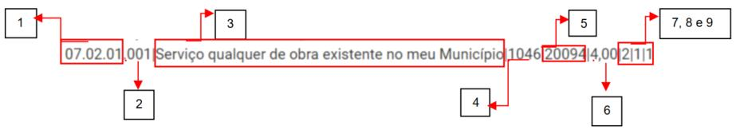

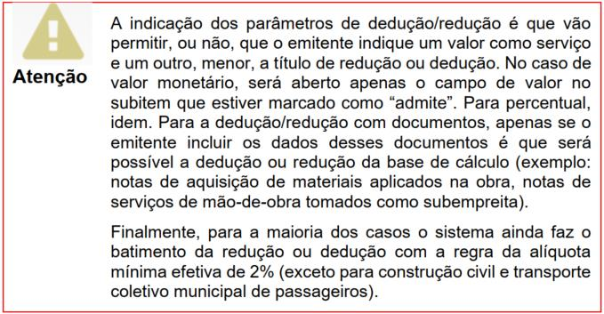

## Page 71

Guia para preenchimento do Painel Municipal da NFSe – versão 1.2
71
Ex 2: Serviço sem o código original do Município
07.02.01.002|Outro serviço qualquer de obra existente no meu Município||457|2,54|1|2|1
Com o arquivo no formato descrito acima, deve-se clicar na barra de upload ou clicar no ícone
para buscar o arquivo em algum lugar armazenado no computador local:
Encontrado o caminho do arquivo, deve-se clicar no
.
3.5.4. Download da lista de serviços
A ATM poderá realizar o download da lista de serviços através do botão “Download lista de Serviços”.
Isto permite ao gestor municipal verificar a estrutura da lista atual do município. O sistema permite o download
de dois tipos possíveis de formatos:
Visão simplificada da estrutura da lista de serviços do município e facilita, por exemplo, a montagem
dos códigos de tributação municipal de forma mais ágil. Nesta lista, o arquivo conterá apenas 3 informações:
Código completo (12 posições), Descrição do serviço e Código original no município (se houver).
•
Visão completa, ou seja, a lista com a estrutura dos códigos de tributação atuais com suas
respectivas parametrizações. Nesta lista, o arquivo conterá todas as parametrizações já
realizadas (alíquota e informações de dedução/redução) para cada um dos serviços.
Para fazer o download de todos os serviços cadastrados no sistema na tela ou fazer o download da
lista de serviços (um arquivo .csv) no botão:
Figura 64 - Tela de Parametrização dos Serviços.
Uma nova tela será aberta, com as seguintes opções:

### Images from Page 71

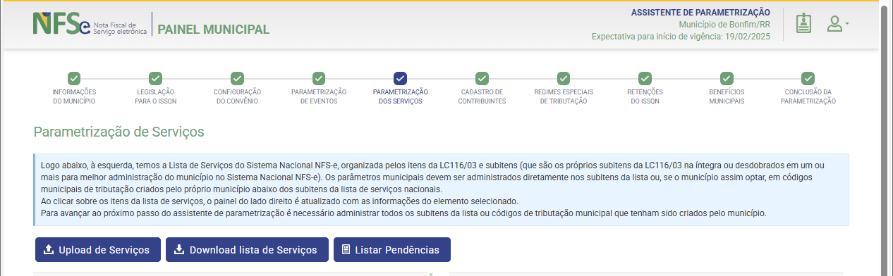

## Page 72

Guia para preenchimento do Painel Municipal da NFSe – versão 1.2
72
Figura 65 - Opções de download da lista de serviços.
3.5.4.1. Lista Simples
Nesta opção é disponibilizada a lista de serviços apenas com o código e a descrição do serviço.
Ao fazer o download das informações, o arquivo gerado é no formato csv e as informações são
disponibilizadas na seguinte formatação:
Figura 66 - Leiaute do arquivo da lista de serviços simples.
3.5.4.2. Lista Completa
É disponibilizada também a lista de serviços completa, contendo todas as parametrizações realizadas
até o momento para o município e a formatação completa para um possível preenchimento pelo município,
para posteriormente, fazer o upload do arquivo no sistema.

### Images from Page 72

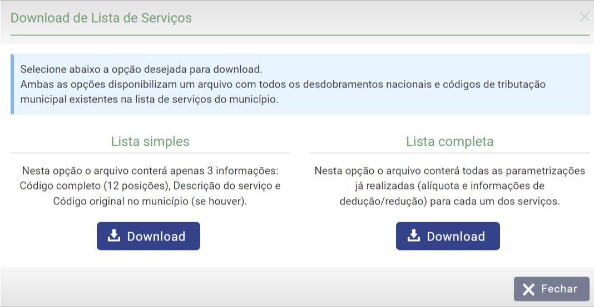

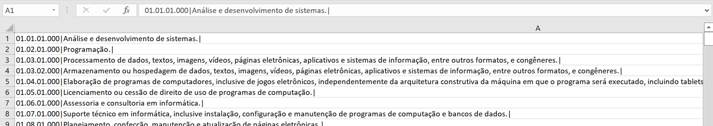

## Page 73

Guia para preenchimento do Painel Municipal da NFSe – versão 1.2
73
Figura 67 - Leiaute da lista de serviços completa.
Uma vez realizado o download da lista de serviços ficará mais simples o preenchimento de todas as
informações necessárias para o posterior upload do arquivo no sistema.
3.5.5. Listagem de Pendências
O sistema permite ao gestor municipal verificar a ocorrência de “buracos” na parametrização da lista de
serviços, ou seja, se algum item de parametrização da lista (alíquota, dedução/redução) faltou em algum serviço.
O código de tributação municipal é um item da lista a ser administrado, ou seja, ele deve possuir os parâmetros
de alíquota e dedução/redução caso seja criado abaixo de algum subitem da lista de serviços nacional padrão do
sistema. Ao acionar o comando para listar as pendências o sistema exibe uma lista de itens que faltam alguma
parametrização.

### Images from Page 73

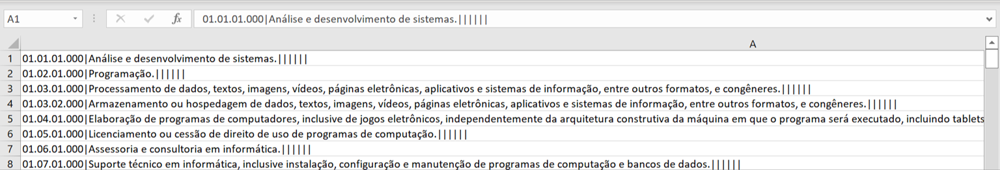

## Page 74

Guia para preenchimento do Painel Municipal da NFSe – versão 1.2
74
3.6. Cadastro de Contribuintes
O Sistema Nacional NFS-e utiliza as bases RFB (CNPJ / CPF) como base principal de informações dos
contribuintes para emissão de NFS-e. O município tem o Cadastro Nacional Complementar (CNC) NFSe, que
é uma base de dados específica do sistema nacional para complementar informações de quaisquer
contribuintes.
O Cadastro Nacional Complementar (CNC) NFS-e:
• É um dos módulos do Sistema Nacional NFS-e e estará disponível para os municípios que
efetivarem convênio com o Sistema Nacional da Nota Fiscal de Serviços Eletrônica – SN NFS-e;
• É uma base de dados nacional de contribuintes do ISSQN, composta por informações de
contribuintes que o município deseje complementar ou utilizar em detrimento às informações
provenientes das bases RFB (CNPJ / CPF);
• É operado no âmbito do Sistema Nacional NFS-e e mantido pelos municípios, sendo cada
município responsável pelo cadastramento e atualização das informações complementares dos
contribuintes que forem registrados;
•  Será composto pelas informações cadastrais complementares dos contribuintes que tiverem
dados complementares informados pelos municípios conveniados ao Sistema Nacional NFS-e na
situação “Ativo”, conforme ERNPAINELNACIONAL-SNNFSe.pdf.;
• Facilitará a distribuição de todas as informações cadastrais dos contribuintes que estiverem
registrados no CNC NFS-e. Esta distribuição entre os municípios se faz independentemente do
momento de ativação do convênio do município com o Sistema Nacional NFS-e. Cada município
que estiver ativo no Sistema Nacional NFS-e poderá acessar todas as informações desde o início
de funcionamento deste cadastro complementar;
Para o correto funcionamento do CNC NFS-e é indispensável o atributo de “Indicador Municipal (IM)”
para cada registro de contribuintes CPF e CNPJ. Os valores e formatos atribuídos para os registros são abertos
para que cada município estabeleça sua estrutura de IM, desde que seja formado por até 15 caracteres.
Por padrão, todo e qualquer contribuinte que constar nas bases CNPJ e CPF é um emitente do
município que estiver registrado em seu endereço nestas bases. Através do CNC o município pode registrar
uma informação complementar que impossibilitará o contribuinte de emissão de documentos fiscais (NFS-e)
no Sistema Nacional NFS-e.
Através do Painel Administrativo Municipal o sistema permite que a administração tributária municipal
gerencie seus contribuintes no CNC por duas funcionalidades:

### Images from Page 74

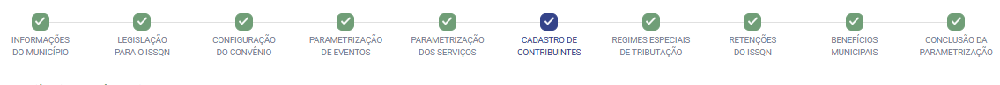

## Page 75

Guia para preenchimento do Painel Municipal da NFSe – versão 1.2
75
• Gerenciar informações complementares de um contribuinte por vez e;
• Gerenciar informações complementares de um ou mais contribuintes através do Upload de Arquivo
com informações complementares;
Definições do Sistema
• É importante ressaltar que todo o sistema está orientado para usar informações de uma tríade
constituída por Código do Município, CNPJ/CPF e Indicador Municipal (IM) de um estabelecimento,
informados pelo município. Desta maneira, ao longo deste documento, todas referências a tríade
“Município/CNPJ/IM” ou “Município/CPF/IM” devem ser levadas no contexto de que o par CNPJ/IM
ou CPF/IM foi informado por um determinado Município.
• O mesmo CNPJ/CPF pode ser informado por mais de um município e em um mesmo município,
desde que tenha inscrições municipais diferentes.
• O CNC NFS-e possibilita o gerenciamento das informações permitindo a inclusão e alteração de
informações complementares. Uma das informações é a situação cadastral do contribuinte no CNC,
que permite a exclusão lógica do contribuinte do cadastro, finalizando assim as informações
complementares para este contribuinte neste município no CNC.
• Para a emissão de uma NFS-e, de um contribuinte, por um determinado município emissor, que
tenha o registro deste contribuinte no CNC, mas com a informação complementar que representa a
exclusão lógica, como definido anteriormente, serão consideradas as informações básicas
provenientes dos cadastros RFB (CNPJ/CPF).
• O município será responsável pelo envio das informações complementares respeitando as regras do
LEIAUTE_CNC do documento ANEXO_III-CNCSNNFSe.xlsx, para cada tipo de manutenção
(inclusão, alteração).
• Será gerado histórico para cada alteração enviada e realizada no CNC NFS-e.
• Importante ressaltar que todo o Sistema Nacional da NFS-e leva em consideração a vigência das
informações como por exemplo, alíquotas, benefícios, reduções e etc. Para as movimentações de
alteração o mesmo conceito será utilizado.
• A “Exclusão Lógica” (Situação Cadastral no CNC – Ativo/Inativo) não considera períodos de vigência
pois uma vez inativado o registro complementar do contribuinte deixa de existir no CNC e o sistema
passa a utilizar os dados provenientes dos cadastros RFB para um determinado CNPJ/CPF.
• Para o processamento das solicitações de movimentação de um contribuinte o CNC NFS-e irá
considerar a chave única formada pelo código do município, o CNPJ/CPF e a IM do contribuinte
informados.
• É de responsabilidade do município a definição da necessidade de envio das movimentações
relativas aos seus contribuintes. O CNC NFS-e deverá fazer os processamentos das solicitações tão
logo as receba.

### Images from Page 75

## Page 76

Guia para preenchimento do Painel Municipal da NFSe – versão 1.2
76
O envio do CNC é opcional, porém se o município tiver interesse em cadastrar o
indicador municipal (inscrição municipal, por exemplo) para todos os seus
contribuintes, deverá enviar o CNC para todos eles e realizar as atualizações quando
necessárias.
Figura 68 - Tela de cadastro do CNC quando a opção de Cadastro da RFB é selecionada no passo
“Configuração do convênio”
É possível o cadastro de cada contribuinte individualmente ou o upload de um arquivo com uma lista.
3.6.1. Cadastrar um Contribuinte Local na página Web
Neste item do menu é disponibilizada a possibilidade de cadastrar cada contribuinte individualmente,
por meio da página na internet.
Na tela abaixo, clicar em
:

### Images from Page 76

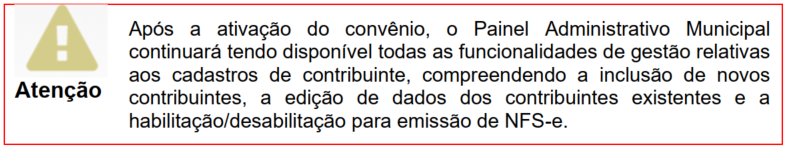

## Page 77

Guia para preenchimento do Painel Municipal da NFSe – versão 1.2
77
Figura 69 - Tela inicial do cadastro de Contribuintes
Ao selecionar essa opção, as seguintes informações são solicitadas pelo sistema:
Figura 70 - Campos de preenchimento relativos à identificação do contribuinte e ao seu endereço.
• CPF/CNPJ: neste campo deverão ser digitados os algarismos referentes aos números de registros
perante a Receita Federal do Brasil;
● Nome/Razão Social: este campo é carregado automaticamente pelo sistema quando do
preenchimento do CPF/CNPJ, de acordo com as informações cadastradas na RFB;
● Inscrição Municipal: deverão ser digitados os algarismos da inscrição municipal do contribuinte que
está sendo cadastrado;
● Data da Inscrição Municipal: a data da realização da inscrição municipal deverá ser inserida nesse
campo, no formato DD/MM/AAAA;
● Informações de Endereço do contribuinte: primeiramente deverá ser incluído o número do CEP do
endereço do contribuinte. O sistema automaticamente preencherá o campo “Município” e se

### Images from Page 77

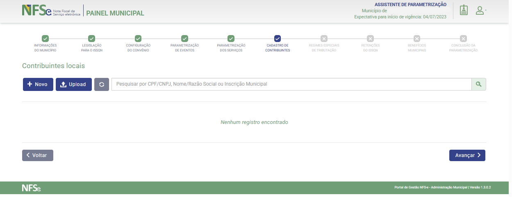

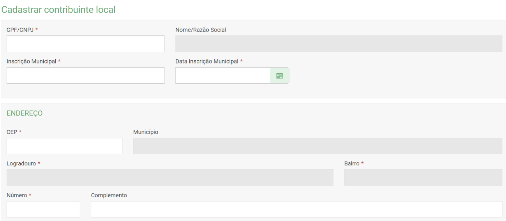

## Page 78

Guia para preenchimento do Painel Municipal da NFSe – versão 1.2
78
disponíveis, as informações de logradouro e bairro. As demais informações deverão ser completadas
pela ATM: número e complemento (este apenas se houver);
• Informações de contato: caso deseje, a ATM poderá preencher os campos de telefone e e-mail
para contato com o contribuinte.
Figura 71 - Informações relativas ao contato com o contribuinte e à sua situação cadastral perante
o município.
• Informações de situação cadastral: a ATM deverá indicar se o contribuinte está habilitado ou não à
emissão da NFS-e e se desejar, poderá incluir a situação cadastral do contribuinte e o motivo da
situação;
• ● Situação: a ATM poderá indicar neste campo a situação em que se encontra o cadastro do
contribuinte no município (por exemplo, “Atualizado”, etc).
• ● Motivo da situação: caso a situação exija algum esclarecimento, ele poderá ser realizado neste
campo.
Uma vez realizadas todas as configurações, a ATM deverá
as informações. Uma mensagem
de confirmação será exibida no início da página e o contribuinte poderá ser visualizado na lista de contribuintes
locais.

### Images from Page 78

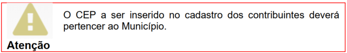

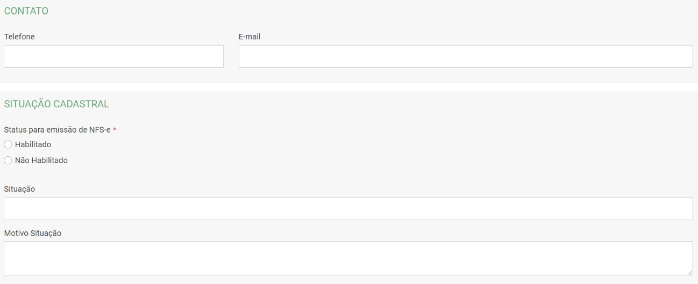

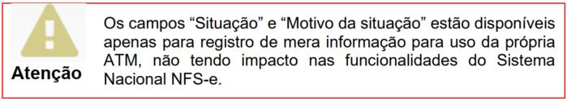

## Page 79

Guia para preenchimento do Painel Municipal da NFSe – versão 1.2
79
Figura 72 - Tela de confirmação da inserção do contribuinte.
3.6.1.1 Autorização de uso dos Emissores Públicos
Esta funcionalidade foi desenvolvida para permitir que o município realize uma adoção faseada do
Sistema Nacional da NFS-e, definindo quais contribuintes devem emitir o documento fiscal em cada
sistema (próprio ou nacional), em momentos distintos.
Por meio dessa parametrização, é possível configurar individualmente o contribuinte, indicando qual
sistema de emissão ele utilizará. Isso viabiliza uma migração gradual e planejada, por etapas, reduzindo
os impactos tanto para os contribuintes quanto para a administração municipal.
Informar a data inicial de autorização do contribuinte para emissão de NFS-e nos emissores públicos do
Sistema Nacional NFS-e.
A data informada deve ser igual ou superior à data do indicador municipal, que por sua vez deve ser
maior ou igual a data de cadastro do contribuinte na RFB. Uma vez cadastrada, a data de autorização de uso
dos emissores só poderá ser editada caso a data informada seja posterior a data atual.
Figura 73 - Tela para inclusão da data da autorização de uso dos emissores públicos.
3.6.1.2. Situação para emissão de NFS-e
Este parâmetro indica se o contribuinte está Autorizado ou Suspenso a emitir NFS-e

### Images from Page 79

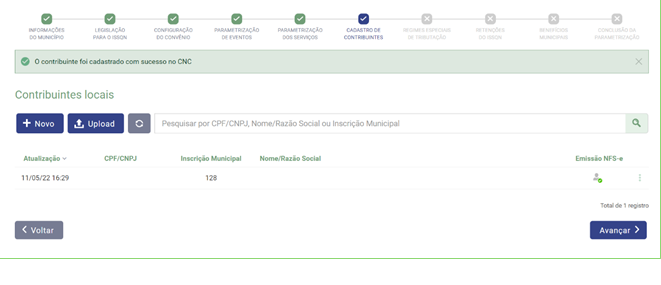

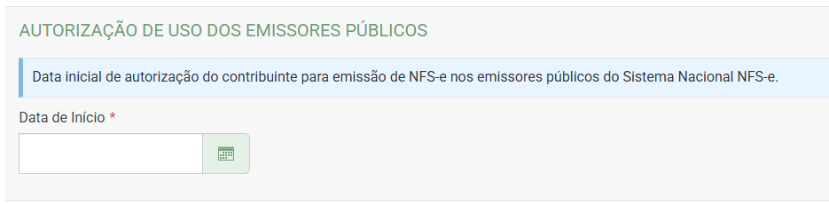

## Page 80

Guia para preenchimento do Painel Municipal da NFSe – versão 1.2
80
Figura 74 - Tela para marcar a situação para emissão da NFS-e.
3.6.1.3. Situação cadastral
Este parâmetro mostra a situação do registro do contribuinte no CNC NFS-e pelo município (Ativo ou
Inativo). A marcação da situação inativo representa a exclusão lógica do registro no CNC e não poderá ser
alterada.
Se Inativo, informar a “descrição e o motivo da situação”.
Figura 75 - Tela para marcar a situação cadastral d contribuinte no CNC.
Ao final do preenchimento, clicar em “Salvar” para confirmar a inclusão do contribuinte.
3.6.2. Upload de Arquivo de Contribuintes do Município
O sistema da NFS-e de Nacional permite que em um único procedimento a ATM inclua as informações
de um ou mais contribuintes.
Para isso deverá ser carregado no sistema um arquivo seguindo o leiaute disponibilizado na página de
upload.
A funcionalidade permite em um único procedimento incluir as informações de um ou mais
contribuintes.

### Images from Page 80

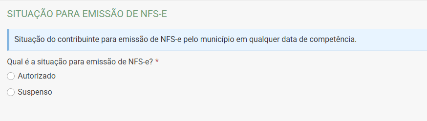

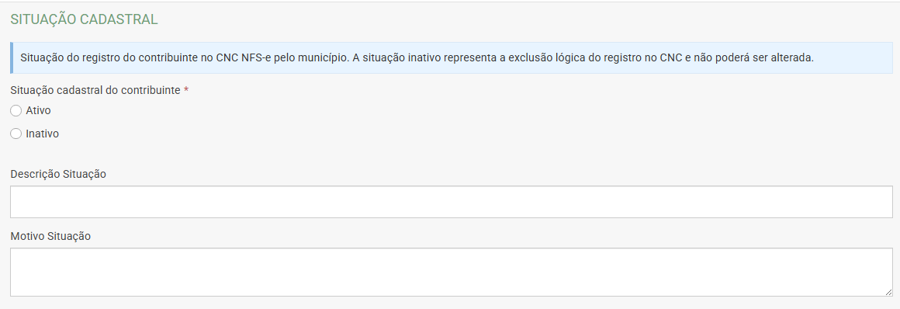

## Page 81

Guia para preenchimento do Painel Municipal da NFSe – versão 1.2
81
Figura 76 - Página de upload do arquivo com os contribuintes cadastrados no município.
Os campos não obrigatórios não precisam ser informados, mas o campo deve estar representado na
linha com o conteúdo vazio.
Ao clicar em
o sistema mostrará a descrição de todos os campos e a
regra de formação de cada um deles, conforme tela abaixo:

### Images from Page 81

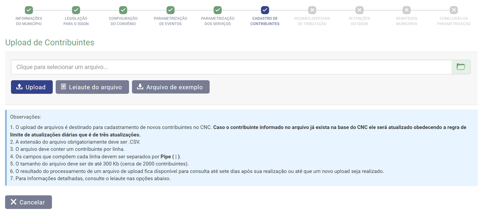

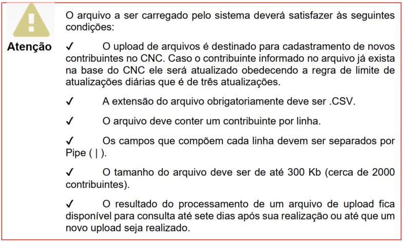

## Page 82

Guia para preenchimento do Painel Municipal da NFSe – versão 1.2
82
Figura 77 - Descrição de todos os campos exigidos no leiaute do arquivo a ser carregado no sistema NFS-e.

### Images from Page 82

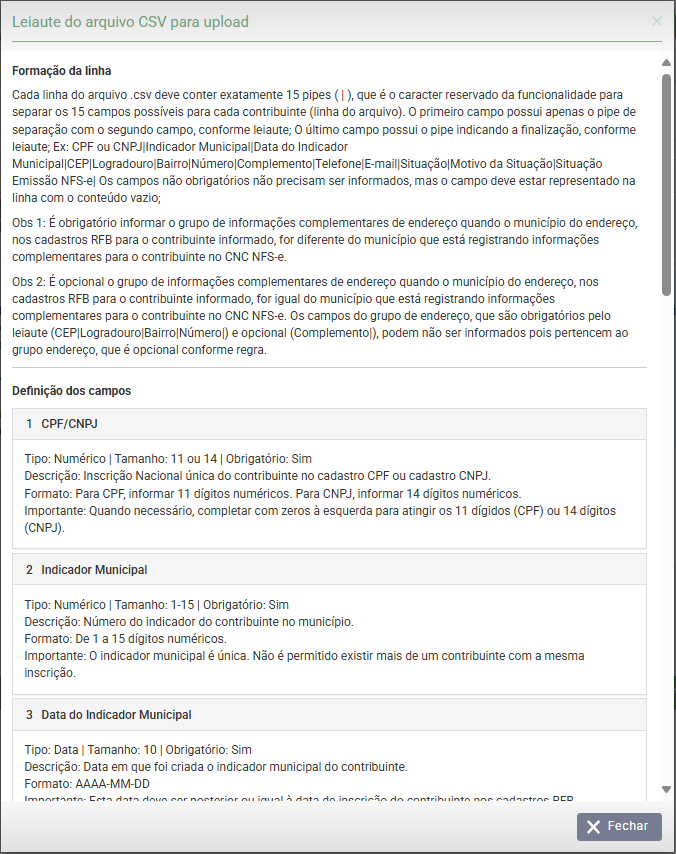

## Page 83

Guia para preenchimento do Painel Municipal da NFSe – versão 1.2
83
Ex:
CPF/CNPJ|IndicadorMunicipal|DatadoIndicadorMunicipal|NomeFantasia|CEP|Bairro|Logradouro|Número|Co
mplemento|Telefone|E-mail|Situação|Motivo da Situação|Situação Emissão NFS-e| Situação Cadastral do
Contribuinte no CNC|Data de Autorização de Uso dos Emissores Públicos
Ao acionar o botão “Arquivo de exemplo” a ATM poderá fazer o download do arquivo configurado
seguindo todas as regras impostas pelo sistema.
Para fazer o upload do arquivo na página, a ATM deverá acionar o botão, selecionar o arquivo desejado
e em seguida “Upload”.
Em seguida é aberta uma página de resultado do upload do arquivo, em que pode ser verificada a
data do upload, a quantidade de registros contidas no arquivo, quantos registros foram realizados com
sucesso, qual o limite de atualização diária de registros e a quantidade de registros não processados.
Figura 78 - Tela de resultado do arquivo escolhido para upload.
Figura 79 – Modelo de arquivo para upload.
3.6.3. Editar Informações de um Contribuinte
Após a inclusão de um contribuinte, ao clicar nos três pontos, é possível fazer a Edição, visualizar
detalhes, verificar o Histórico ou Desabilitar a emissão de NFS-e.

### Images from Page 83

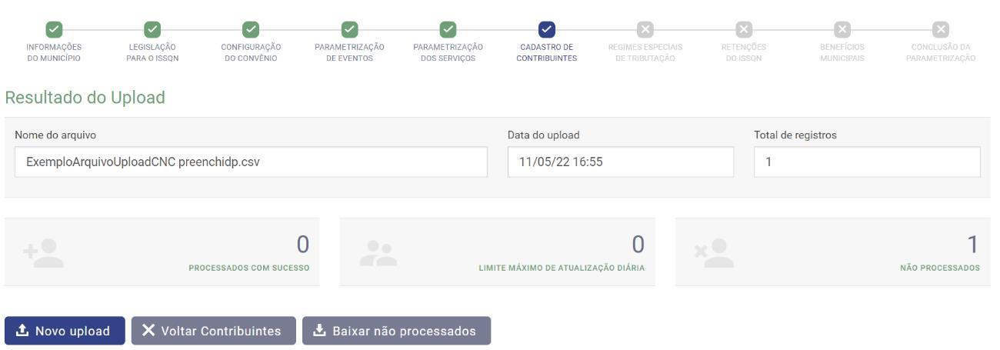

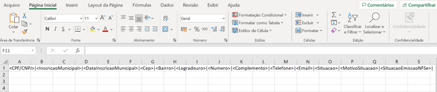

## Page 84

Guia para preenchimento do Painel Municipal da NFSe – versão 1.2
84
Figura 80 – Tela com a lista dos contribuintes cadastrados opção “Edição/Detalhes”.
3.6.4. Visualizar Histórico de Alterações de Informações do Contribuinte
Para o contribuinte selecionado será apresentado seu CPF/CNPJ e respectivo Nome/Razão Social e uma
linha do tempo com as alterações efetuadas evidenciando:
•
O campo alterado
•
A informação anterior e a informação alterada (De “xxx” Para “YYY”)
•
Data da alteração
•
Usuário responsável pela alteração (CPF)
Figura 81 – Tela com a lista dos contribuintes cadastrados opção “Histórico”.
3.6.5. Desabilitar Emissão de NFS-e
Será apresentado texto informando que caso seja confirmada a solicitação, o contribuinte não poderá
emitir mais NFS-e até que seja habilitado novamente pelo Gestor do município.

### Images from Page 84

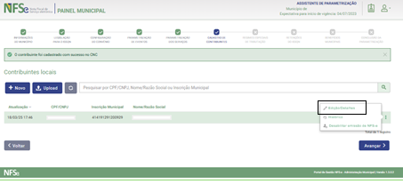

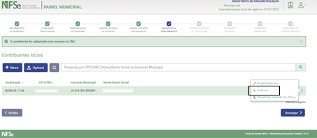

## Page 85

Guia para preenchimento do Painel Municipal da NFSe – versão 1.2
85
Figura 82 – Tela com a lista dos contribuintes cadastrados opção “Desabilitar emissão de NFS-e”.
Figura 83 – Tela para confirmação da desabilitação da emissão de
NFS-e

### Images from Page 85

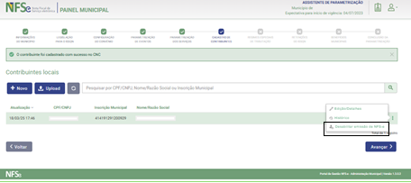

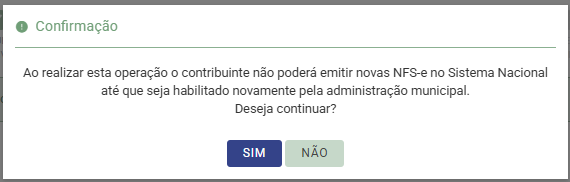

## Page 86

Guia para preenchimento do Painel Municipal da NFSe – versão 1.2
86
3.7. Regimes Especiais de Tributação
Neste passo da parametrização, serão inseridas no sistema informações a respeito dos regimes
especiais de tributação que são admitidos pela ATM.
Para o Sistema NFS-e, a expressão “regime especial de tributação” se aplica a notas que serão geradas
pelos emitentes indicados sem o cálculo do ISS no documento, uma vez que a eventual base de cálculo do
imposto, nessas situações, pode não ser o preço dos serviços (exemplo: profissionais autônomos pessoa física
e sociedade de profissionais) ou cujo cálculo será realizado por outra via ou método (notário ou estimativa).
Além disso, em relação aos optantes do Simples Nacional, esse regime se sobrepõe aos demais regimes
especiais aqui descritos, ou seja, a opção pelo SN prevalece, não sendo possível indicar um segundo regime
por ocasião da geração da NFS-e, ainda que o mesmo tenha sido cadastrado na parametrização descrita neste
tópico (exceção feita à sociedade de serviços contábeis, por conta da regra do SN que permite recolher o ISS
por fora do regime nacional das ME e EPP, de acordo com a legislação do Município).
Os Regimes Especiais de Tributação somente podem ser definidos após a definição da alíquota para
um “desdobro” da lista. Assim como os outros parâmetros tratados até agora, exceto código de tributação
municipal, a administração destes parâmetros é realizada nos desdobros dos subitens da lista de serviços
nacional.
Importante explicitar que, para os municípios com opção de utilização de informações cadastrais através
da RFB, os regimes especiais de tributação serão definidos por subitens da lista de serviços no momento da
parametrização da lista de serviços.
Para os municípios com opção de cadastrar seus contribuintes pela funcionalidade CNC, os regimes
especiais de tributação deverão ser parametrizados no momento da inclusão desse contribuinte.
Cada regra de parametrização de regimes especiais de tributação incluídas tem um identificador único.
O identificador tem a seguinte regra de formação: 7 dígitos para o código do município, 2 dígitos para o tipo
de parâmetro e 5 dígitos sequenciais únicos por município/parâmetro;

### Images from Page 86

## Page 87

Guia para preenchimento do Painel Municipal da NFSe – versão 1.2
87
Figura 84 - Regimes Especiais de Tributação a serem configurados.
3.7.1. Configuração de Regimes Especiais de Tributação no painel
Ao clicar nos 3 pontos, no final de cada um dos regimes cadastrados, é possível selecionar a opção
“Configurar” para cada uma das opções exibidas na tela:
● Ato Cooperado
● Estimativa
● Microempresa Municipal
● Notário ou Registrador
● Profissional Autônomo
● Sociedades de Profissionais

### Images from Page 87

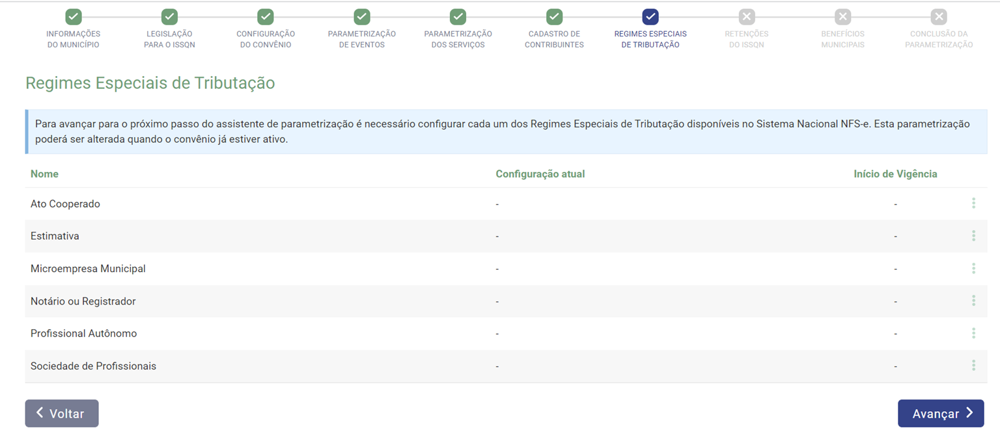

## Page 88

Guia para preenchimento do Painel Municipal da NFSe – versão 1.2
88
Figura 85 - Seleção da configuração de cada item dos Regimes Especiais de Tributação.
Para cada um dos regimes especiais mencionados anteriormente, a ATM deverá preencher:
Figura 86 - Configuração dos regimes especiais de tributação.
•
Configuração: nesse campo deverá ser selecionado se o município não admite o tipo de regime em
questão, se o admite por meio apenas da informação na DPS pelo emitente (sem verificação) ou se admite
apenas para determinados contribuintes e/ou serviços específicos.
Para a opção “Informado na DPS pelo Emitente – Sem verificação”, o sistema sempre permitirá que
qualquer emitente indique esse tipo de regime especial na emissão de uma NFS-e, ou seja, não haverá

### Images from Page 88

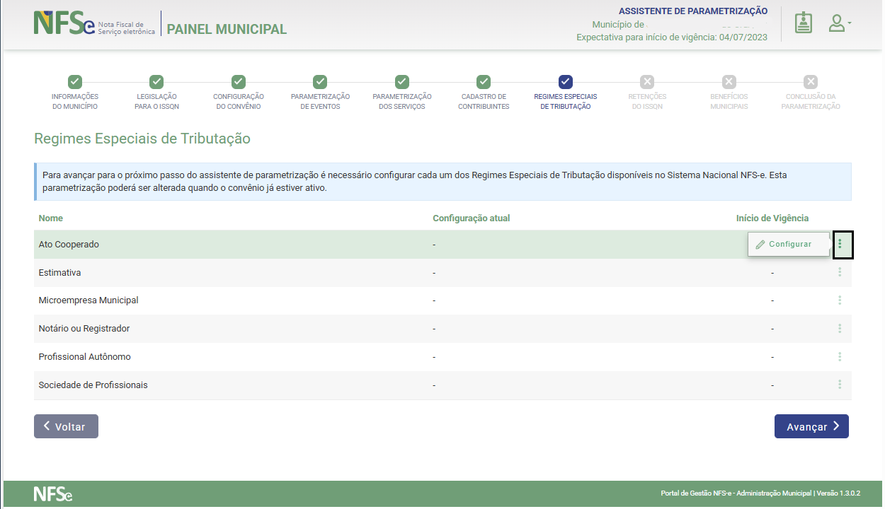

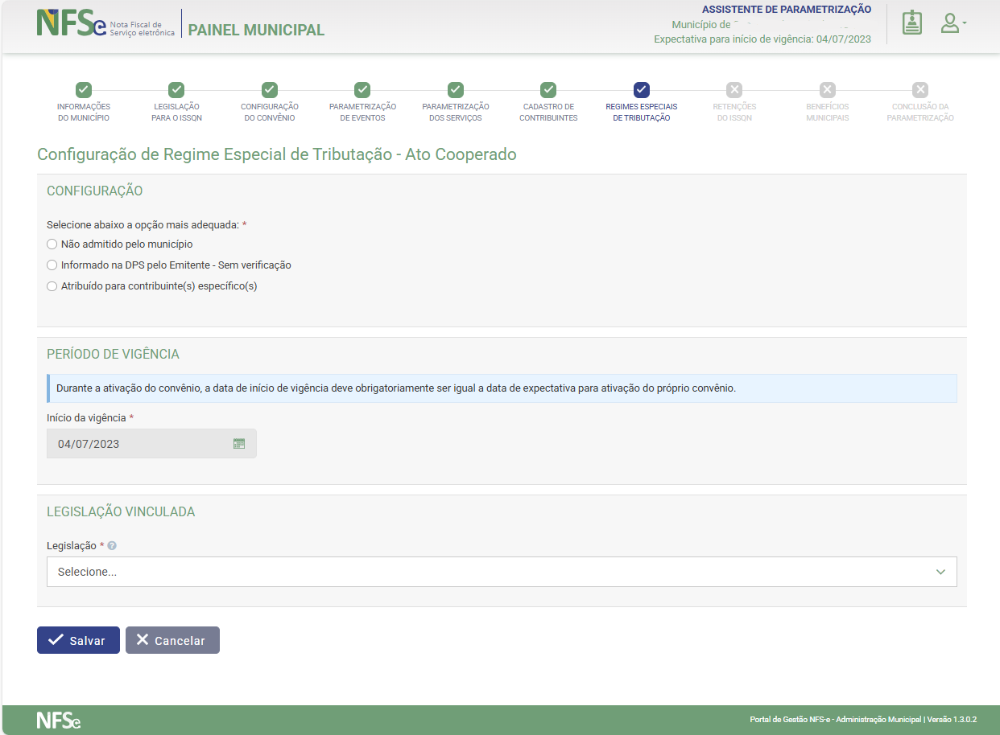

## Page 89

Guia para preenchimento do Painel Municipal da NFSe – versão 1.2
89
validação por parte do Sistema Nacional da NFS-e em relação ao regime, sendo aceita a declaração do
contribuinte.
Ao selecionar a última opção, no final da página são abertos três campos: identificação, contribuintes
vinculados e serviços vinculados. No primeiro deverá ser inserida uma descrição do Regime para facilitar a
identificação do regime no sistema posteriormente. No campo de contribuintes, ao selecionar o botão
“+Incluir” o sistema abre uma nova janela em que o CPF/CNPJ do contribuinte deverá ser digitado no sistema
e confirmado em seguida.
Figura 87 - Inserção de um contribuinte específico no regime especial configurado.
A configuração também poderá ser realizada por serviço, especificamente. No campo serviços
vinculados o botão “+Incluir” deverá ser selecionado. O sistema abrirá então uma tela com a lista de serviços
para a escolha pela ATM.
Período de vigência: Deverá ser indicado quando iniciará a vigência do regime configurado. Enquanto
o convênio não estiver ativado, o início da vigência coincide com a data da expectativa para ativação do
convênio.
● Legislação vinculada: deverá ser selecionada a legislação que permite a aplicação do regime
especial em questão.
Uma vez inseridas todas as informações exigidas no sistema, o botão “Salvar” deverá ser selecionado.

### Images from Page 89

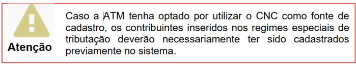

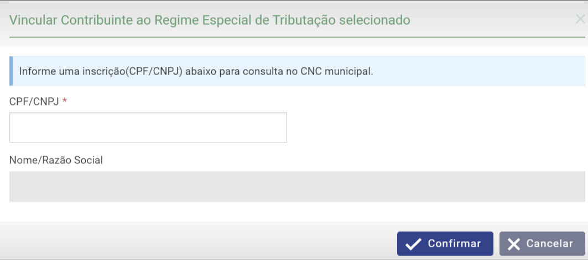

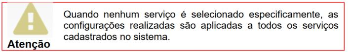

## Page 90

Guia para preenchimento do Painel Municipal da NFSe – versão 1.2
90
Figura 88 - Tela de confirmação da configuração do regime especial de tributação.
Uma vez realizadas as configurações, para cada regime as opções disponibilizadas são:
Figura 89 - Opções disponibilizadas depois de configurados os regimes.
Lista de atribuições: é exibido todo o histórico de configurações realizadas para o regime especial
selecionado.
Figura 90 - Histórico de configurações do regime especial selecionado.

### Images from Page 90

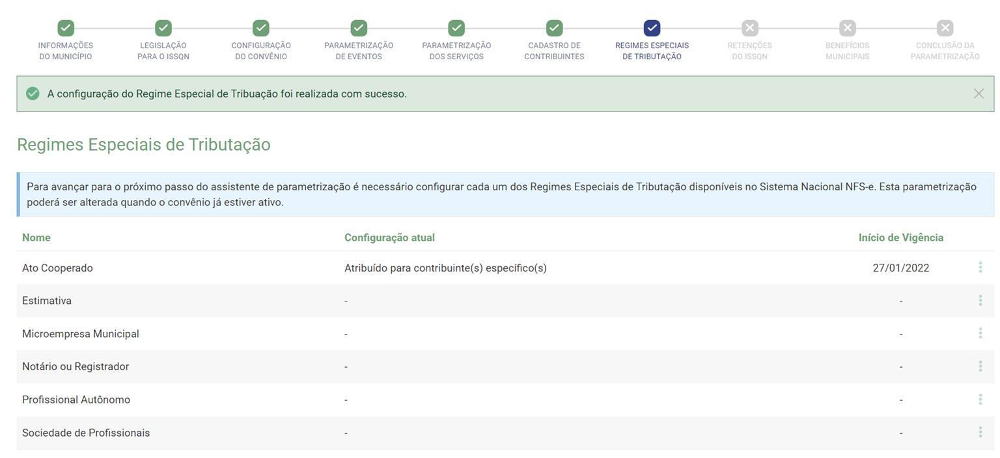

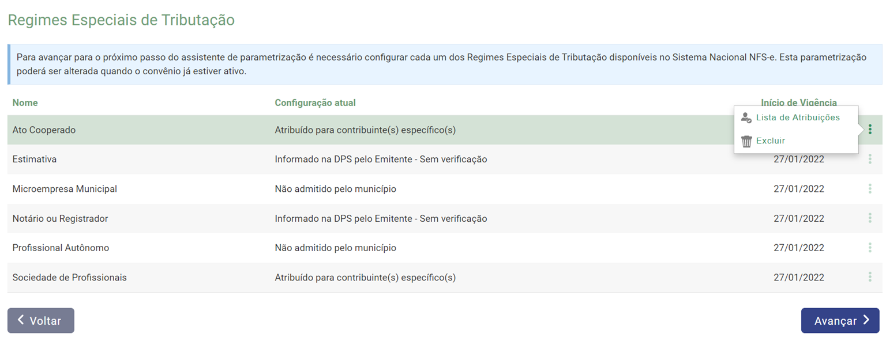

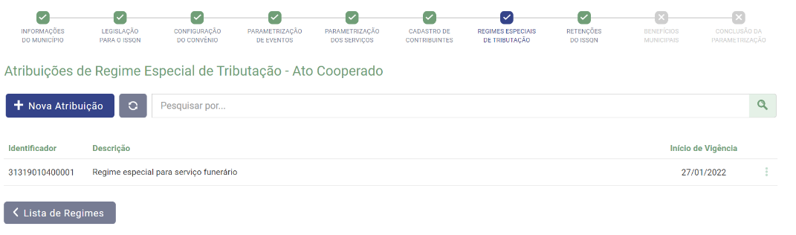

## Page 91

Guia para preenchimento do Painel Municipal da NFSe – versão 1.2
91
Caso a ATM deseje, poderá alterar a configuração do regime especial selecionado acrescentando
contribuintes ou serviços, mas não poderá alterar as demais informações.
● Excluir: enquanto o convênio não é ativado, as configurações realizadas para um determinado regime
especial poderão ser excluídas. Depois da ativação do convênio, um regime não mais poderá ser
excluído, ele pode apenas encerrar a exigência.
Na hipótese de regimes com controle por contribuinte específico, que sejam criados
vários regimes do mesmo tipo, para serviços e contribuintes distintos, ou seja, podem
ser criados regimes de sociedade de profissional só para serviços de advocacia, de
medicina, de engenharia, e assim por diante, vinculando apenas o código de serviço
específico e os CNPJs específicos em cada grupo (nesse cenário, um CNPJ somente
poderá gerar a NFS-e com indicação de regime de sociedade de profissionais para o
serviço que foi correlacionado para seu CNPJ, se for emitir NFS-e para outro tipo de
serviço, ele será calculado conforme o preço do serviço e a alíquota.
Ao finalizar a configuração de todos os regimes especiais, o botão “Avançar” deverá ser acionado no
canto inferior direito da página.
3.7.2. Vincular Contribuinte ao Regime Especial de Tributação selecionado
Ao clicar no botão
, o painel exibirá uma janela para inclusão do CPF/CNPJ a ser vinculado.
Figura 91 – Tela para inclusão de contribuinte em regime de tributação especial.
3.7.2.1.
Upload de Arquivo de Regimes Especiais de Tributação
A funcionalidade permite em um único procedimento incluir as informações de um ou mais
contribuintes. As regras gerais estão descritas no site web da funcionalidade.
Ao clicar no botão
, o painel exibirá uma janela para o upload do arquivo no formato descrito
abaixo:

### Images from Page 91

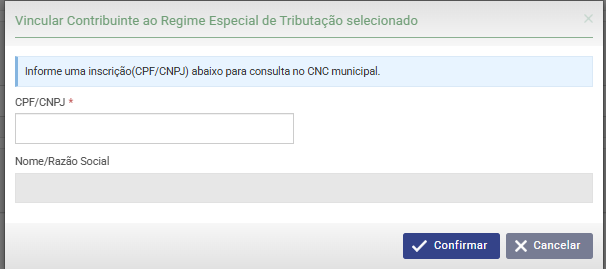

## Page 92

Guia para preenchimento do Painel Municipal da NFSe – versão 1.2
92
Figura 92 – Tela para inclusão de contribuinte em regime de tributação especial via arquivo
1.
Todos os campos do arquivo de entrada do arquivo CSV devem estar preenchidos, conforme leiaute
do arquivo CSV.
<CPF/CNPJ>|<IndicadorDaManutenção>|<Data>|<IdentificadorLegislação>|
a.
<CPF/CNPJ> - 14 dígitos (preencher com 000 à esquerda quando se tratar de um CPF);
b.
<IndicadorDaManutenção> - 0 - Finalizar Vigência; 1 - Iniciar Vigência;
c.
<Data> - Formato da data DD-MM-AAAA;
d.
<IdentificadorLegislação> - 14 digitos;
2.
O arquivo CSV com o resultado do processamento ficará disponível para download na mesma tela de
upload. Este arquivo conterá as mesmas informações linha a linha acrescidas com a mensagem do resultado
do processamento.
3.
A data informada deve ser maior ou igual à data de início da parametrização.
4.
Verificar se já existe CPF/CNPJ cadastrado na parametrização. Se não existir é possível cadastrar nova
vigência. Se já existir, deve-se verificar se o registro possui data final de vigência preenchido. Se existir data
final de vigência, então pode-se ser incluída uma nova vigência para o registro. Se não existir data final de
vigência, então pode-se apenas finalizar a vigência do registro nesta parametrização, desde que a data

### Images from Page 92

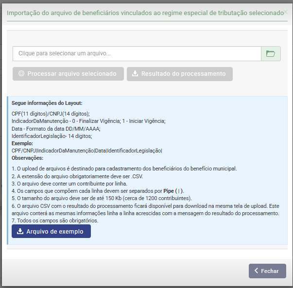

## Page 93

Guia para preenchimento do Painel Municipal da NFSe – versão 1.2
93
informada no upload deste registro seja maior que a data de final de vigência do último registro de
parametrização deste CPF/CNPJ.
5.
Pode haver mais de um registro por CPF/CNPJ em um mesmo arquivo CSV, ressaltando que o
processamento será realizado na sequência em que os registros forem listados no arquivo.
6.
O upload dos beneficiários via CSV deve estar disponível antes e depois da ativação do município no
Painel Municipal.
7.
Manutenção da parametrização a ser realizada:
0 - Finalizar Vigência;
1 - Iniciar Vigência;
8.
Verificar se o identificador da legislação pertence ao município que está realizando a manutenção da
parametrização. (Verificar se os 7 primeiros dígitos do identificador da legislação correspondem ao código do
município informado).
•
A extensão do arquivo obrigatoriamente deve ser .CSV.
•
O arquivo deve conter um registro por linha.
•
Os campos que compõem cada linha devem ser separados por Pipe ( | ).
•
O tamanho do arquivo deve ser de até 300 Kb (cerca de 2000 contribuintes).
•
Para informações detalhadas, consulte o leiaute nas opções abaixo.
________________________________________________________________________________________________
Os municípios devem cadastrar os regimes uma única vez e incluir os contribuintes que estão cobertos por
aquele regime.
________________________________________________________________________________________________
Para os regimes Específicos municipais – município deve instruir que o contribuinte coloque na
descrição do serviço qual o regime que está incluído.
3.7.3.1. Exclusão da configuração dos Regimes Especiais de Tributação.
Nesta etapa, caso tenha sido configurado com erro algum dos regimes, é possível excluir a
configuração feita e refazê-la desde o início.
Ao clicar nos 3 pontos, abre a opção “Excluir”:

### Images from Page 93

## Page 94

Guia para preenchimento do Painel Municipal da NFSe – versão 1.2
94
Figura 93 – Exclusão de contribuinte em regime de tributação especial via arquivo
Ao clicar em excluir, abrirá uma janela para confirmação:
Figura 94 – Tela de confirmação da exclusão de contribuinte em regime de tributação especial.

### Images from Page 94

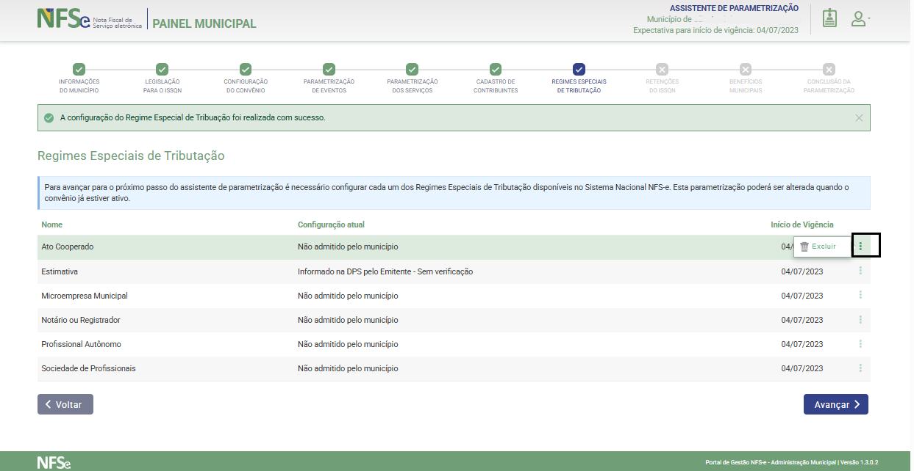

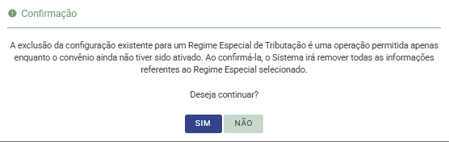

## Page 95

Guia para preenchimento do Painel Municipal da NFSe – versão 1.2
95
3.8. Retenções do ISSQN
Os parâmetros para retenções definem critérios de quem e/ou para quais serviços o município de
incidência do ISSQN define a ocorrência da retenção do tributo para recolhimento pelo tomador e/ou
intermediário de serviços.
O sistema nacional permite opcionalmente para o município duas possibilidades de parametrização de
retenção do ISSQN:
a) A primeira opção define as regras de retenção do município conforme os casos de retenção do Artigo
6º, §2º, II da LC 116/03;
b) A segunda opção permite ao município definir suas próprias regras de retenção, realizando as
parametrizações conforme os casos de retenção que estiverem descritos em sua própria legislação
municipal, observando que, o sistema não abrange todos os possíveis itens que foram adotados
especificamente por alguns municípios para definir os casos de retenção, que estão descritos nas
diversas legislações municipais dos municípios do país (como área de terreno e valor por exemplo). O
sistema nacional abrange aqueles itens que são utilizados mais comumente nas legislações municipais
para configurar os casos de retenção (subitens da lista de serviço, tomador/intermediário, localidade
do prestador de serviço).
É obrigatório fazer a parametrização da retenção, sendo que o município pode realizar a parametrização
dos dois modos de retenção combinados. Enquanto a retenção definida no Artigo 6º, §2º, II da LC 116/03
estiver vigente, a retenção combinada proveniente de uma legislação municipal pode também estar vigente,
desde que não seja conflitante com as situações de retenção da LC 116/03.
O inverso também é válido. Um município pode realizar primeiramente a parametrização de retenções
previstas na sua legislação municipal. Caso queira realizar os casos de retenção previstos da LC 116/03, não
poderá conflitar com os casos já parametrizados e vigentes de sua legislação local.
Para realizar a alteração entre uma e outra ou as duas combinadas, deve encerrar a vigência dos casos
que sejam conflitantes daquela parametrização que estiver vigente primeiro, para em seguida iniciar a vigência
da outra.
Lembrando que, a opção de parametrização do Artigo 6º, §2º, II da LC 116/03 só pode ser realizado
integralmente. Caso o município tenha somente algumas situações idênticas ao Artigo 6º, §2º, II da LC 116/03,
previstas em sua legislação local, deve optar pela parametrização caso a caso refletindo a sua legislação local.
Cada regra de parametrização de retenções incluídas tem um identificador único. O identificador tem a

### Images from Page 95

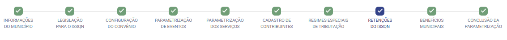

## Page 96

Guia para preenchimento do Painel Municipal da NFSe – versão 1.2
96
seguinte regra de formação: 7 dígitos para o código do município, 2 dígitos para o tipo de parâmetro e 5 dígitos
sequenciais únicos por município/parâmetro;
Figura 95 - Tela de configuração das retenções.
3.8.1. Configuração de Retenções
3.8.1.1. Retenções estabelecidas na legislação municipal
A ATM poderá configurar no Sistema Nacional da NFS-e as retenções estabelecidas por sua legislação
específica, independentemente da habilitação das retenções permitidas pela LC 116/2003 (item B).
Ao clicar em
, será aberta uma janela para a inclusão das seguintes informações de uma
retenção municipal:
•
Descrição;

### Images from Page 96

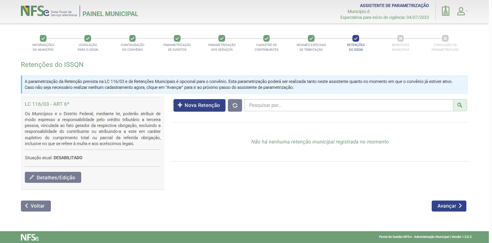

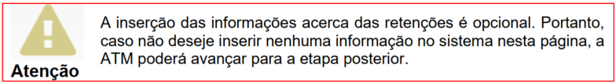

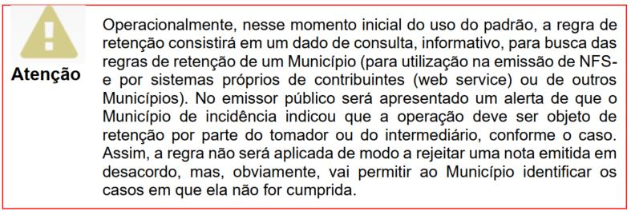

## Page 97

Guia para preenchimento do Painel Municipal da NFSe – versão 1.2
97
•
Legislação;
•
Início da vigência;
•
Configuração da Retenção Municipal
•
Selecione o(s) responsável(eis) pela retenção do ISSQN*
o
Retido pelo Tomador
o
Retido pelo Intermediário
•
Serviços vinculados a Retenção Municipal; e
•
Responsáveis Tributários vinculados a Retenção Municipal
Figura 96 - Tela inclusão das seguintes informações de uma retenção municipal
A primeira informação a ser inserida é a descrição da retenção. Essa informação aparecerá na lista de
retenções e deve ser descrita de modo a ser possível distinguir facilmente cada uma das retenções
cadastradas no sistema da NFS-e Nacional.

### Images from Page 97

## Page 98

Guia para preenchimento do Painel Municipal da NFSe – versão 1.2
98
Figura 97 - Descrição da retenção a ser cadastrada: esses dados servirão para identificar na lista de retenções
municipais qual é a retenção abrangida.
A próxima informação requisitada é sobre a legislação municipal que estabelece a retenção a ser
cadastrada.
Ao selecionar o campo para preenchimento, será mostrada toda a lista da legislação cadastrada para
o município. A ATM deverá então identificar e selecionar o ato correspondente.
Figura 98 - Seleção da legislação que estabelece a retenção no município.
Uma vez selecionada a legislação, o sistema preencherá os campos de início e, se for o caso, o final
da vigência, de acordo com as informações salvas pela ATM na legislação municipal.
Em seguida, será requisitada a informação sobre o início da vigência da retenção municipal no Sistema
Nacional da NFS-e.
Figura 99 - Inserção da data do início da vigência da retenção municipal.

### Images from Page 98

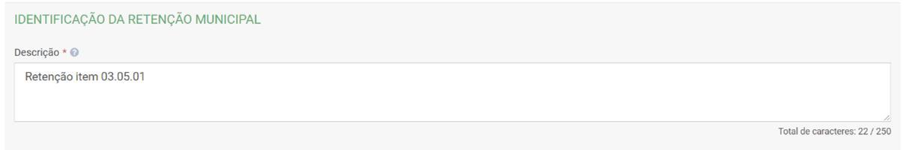

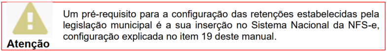

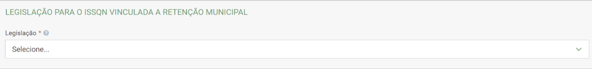

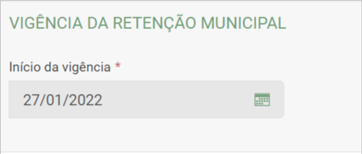

## Page 99

Guia para preenchimento do Painel Municipal da NFSe – versão 1.2
99
Em seguida, a ATM deverá indicar quem é o responsável por fazer a retenção a ser cadastrada. O
sistema disponibiliza duas opções:
● O Tomador do serviço;
● O Intermediário da prestação do serviço
Figura 100 – Configuração da Retenção Municipal.
Uma vez escolhidos os serviços, a seleção deverá ser realizada por meio do botão “Confirmar”.

### Images from Page 99

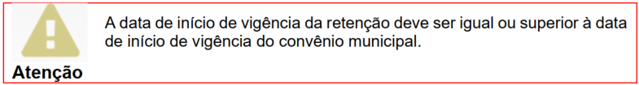

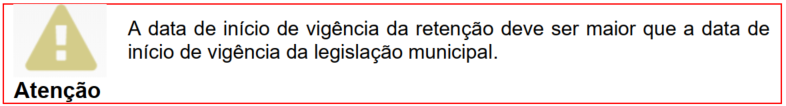

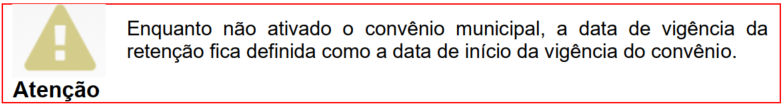

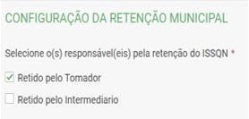

## Page 100

Guia para preenchimento do Painel Municipal da NFSe – versão 1.2
100
Figura 101 - A lista de serviços é disponibilizada para seleção.
Figura 102 - Seleção da inclusão dos responsáveis tributários.
Outra parametrização disponível é a dos responsáveis tributários específicos pela retenção a serem
cadastrados. Para acessar a tela de inclusão, deve-se selecionar o botão “Incluir”.
O sistema irá solicitar os CPF’s ou CNPJ’s dos contribuintes vinculados à retenção em questão. A ATM
deverá digitar os dados, conferir as informações carregadas na tela e confirmar.

### Images from Page 100

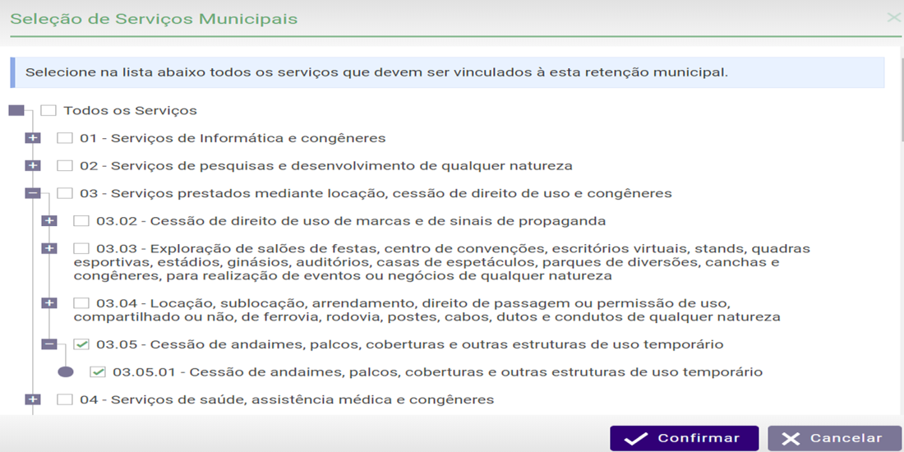

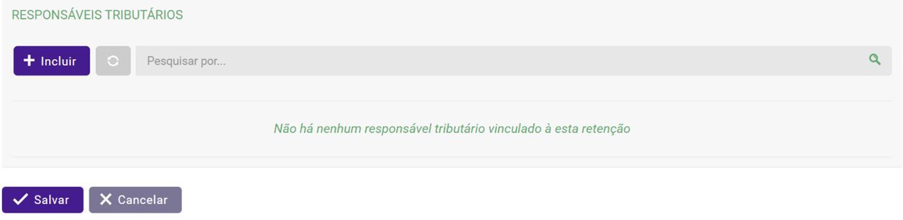

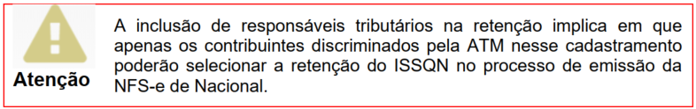

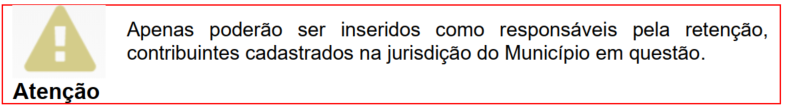

## Page 101

Guia para preenchimento do Painel Municipal da NFSe – versão 1.2
101
Figura 103 - Informações para inclusão dos responsáveis tributários.
Uma vez sendo inseridas todas as informações, estas deverão ser salvas, acessando o botão “Salvar” no
final da página.
A página de retenções é novamente exibida, mostrando a retenção salva.
Figura 104 - Confirmação do cadastro da nova retenção
3.8.1.2. Retenções previstas na Lei Complementar 116/2003
Inicialmente o sistema tem as parametrizações de retenção segundo a LC 116/2003 desabilitadas.
Para habilitar a inserção de retenções de acordo com a LC 116/2003, a ATM terá que acessar o botão
“Detalhes/Edição”.

### Images from Page 101

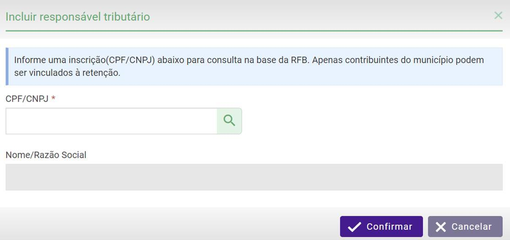

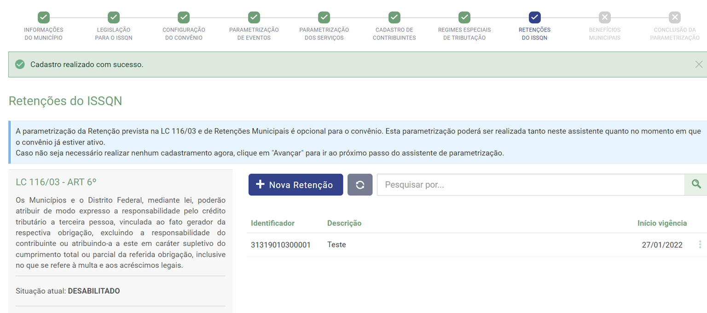

## Page 102

Guia para preenchimento do Painel Municipal da NFSe – versão 1.2
102
Figura 105 - Página para habilitação das configurações relativas às retenções municipais.
A página de habilitação é então exibida e basta acionar o botão “Habilitar” para ativar as retenções
propostas pela Lei Complementar 116/2003.
Figura 106 - Página de habilitação das configurações relativas às retenções municipais
Enquanto não ativado o convênio municipal, fica definida como data de início da vigência a data de
início da vigência do convênio. Em seguida o botão “Habilitar” deverá ser acionado.

### Images from Page 102

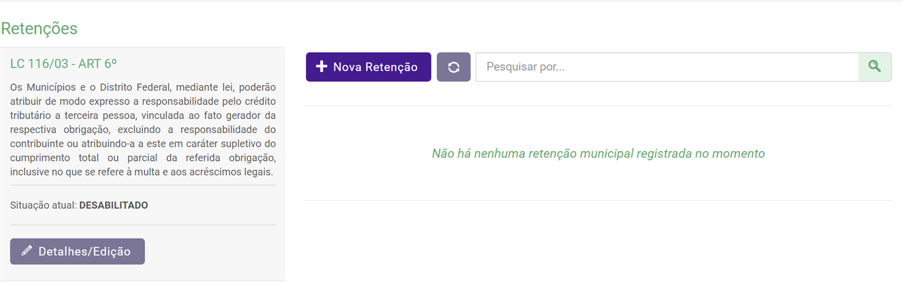

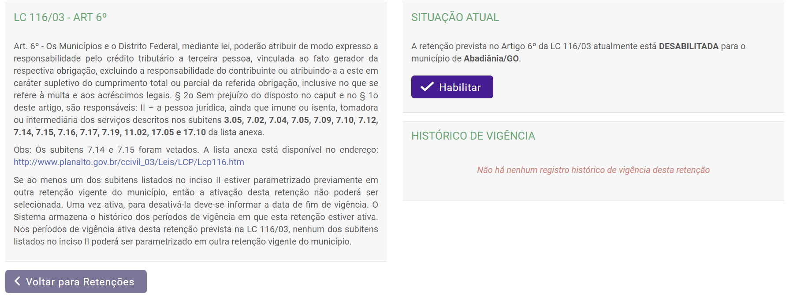

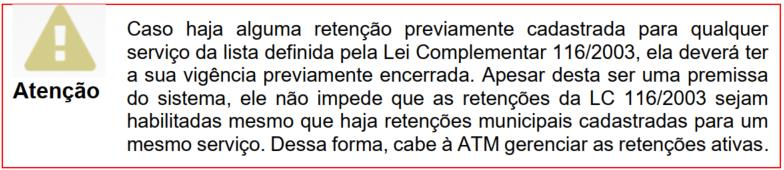

## Page 103

Guia para preenchimento do Painel Municipal da NFSe – versão 1.2
103
Figura 107 - Tela de configuração da vigência da retenção prevista pela Lei Complementar 116/2003.
3.8.1.3. Exclusão de uma retenção
Enquanto não ativado o convênio uma retenção poderá ser excluída. Para excluir uma retenção, a ATM
deverá acessar a página de configuração das retenções e selecionar o ícone na linha da retenção que deseja
realizar o encerramento. E em seguida, selecionar a opção “Excluir”.
Figura 108 – Opção de excluir uma retenção cadastrada.

### Images from Page 103

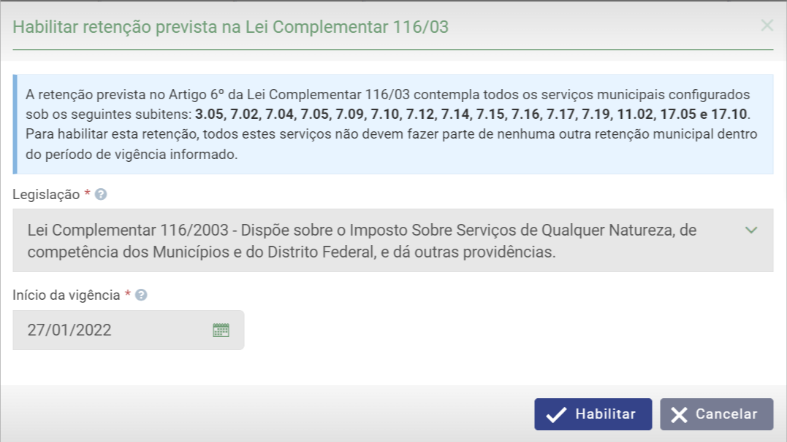

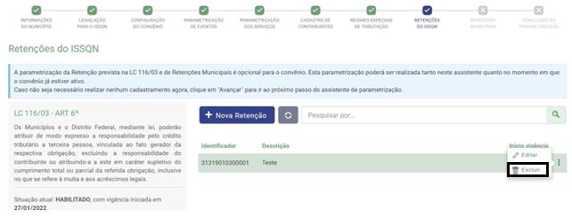

## Page 104

Guia para preenchimento do Painel Municipal da NFSe – versão 1.2
104
Figura 109 - Mensagem de confirmação da exclusão da retenção selecionada.
3.8.2. Upload de Arquivo dos contribuintes vinculados às Retenções do ISSQN
A ATM poderá então selecionar o(s) serviço(s) na lista ao(s) qual(is) se vincula(m) a retenção. Basta
então selecionar o botão “Incluir” e a lista de serviços será disponibilizada.
A funcionalidade permite em um único procedimento incluir as informações de um ou mais
contribuintes. As regras gerais estão descritas no site web da funcionalidade.
Figura 110 - Seleção da inclusão de um serviço vinculado à retenção a ser cadastrada.
1.
Todos os campos do arquivo de entrada do arquivo CSV devem estar preenchidos, conforme leiaute
do arquivo CSV.
<CPF/CNPJ>|<IndicadorDaManutenção>|<Data>|<IdentificadorLegislação>|
a.
<CPF/CNPJ> - 14 dígitos (preencher com 000 à esquerda quando se tratar de um CPF);
b.
<IndicadorDaManutenção> - 0 - Finalizar Vigência; 1 - Iniciar Vigência;
c.
<Data> - Formato da data DD-MM-AAAA;
d.
<IdentificadorLegislação> - 14 digitos;
2.
O arquivo CSV com o resultado do processamento ficará disponível para download na mesma tela de
upload. Este arquivo conterá as mesmas informações linha a linha acrescidas com a mensagem do resultado
do processamento.
3.
A data informada deve ser maior ou igual à data de início da parametrização.
4.
Verificar se já existe CPF/CNPJ cadastrado na parametrização. Se não existir é possível cadastrar nova
vigência. Se já existir, deve-se verificar se o registro possui data final de vigência preenchido. Se existir data
final de vigência, então pode-se ser incluída uma nova vigência para o registro. Se não existir data final de
vigência, então pode-se apenas finalizar a vigência do registro nesta parametrização, desde que a data
informada no upload deste registro seja maior que a data de final de vigência do último registro de
parametrização deste CPF/CNPJ.
5.
Pode haver mais de um registro por CPF/CNPJ em um mesmo arquivo CSV, ressaltando que o
processamento será realizado na sequência em que os registros forem listados no arquivo.
6.
O upload dos beneficiários via CSV deve estar disponível antes e depois da ativação do município no
Painel Municipal.

### Images from Page 104

## Page 105

Guia para preenchimento do Painel Municipal da NFSe – versão 1.2
105
7.
Manutenção da parametrização a ser realizada:
0 - Finalizar Vigência;
1 - Iniciar Vigência;
8.
Verificar se o identificador da legislação pertence ao município que está realizando a manutenção da
parametrização. (Verificar se os 7 primeiros dígitos do identificador da legislação correspondem ao código do
município informado).
•
A extensão do arquivo obrigatoriamente deve ser .CSV.
•
O arquivo deve conter um registro por linha.
•
Os campos que compõem cada linha devem ser separados por Pipe ( | ).
•
O tamanho do arquivo deve ser de até 300 Kb (cerca de 2000 contribuintes).
•
Para informações detalhadas, consulte o leiaute nas opções abaixo.

### Images from Page 105

## Page 106

Guia para preenchimento do Painel Municipal da NFSe – versão 1.2
106
3.9.
Benefícios Municipais
Os Municípios poderão parametrizar benefícios estabelecidos pela legislação municipal, não previstos
na Lei Complementar 116/2003, mas com ela compatíveis. Para o sistema NFS-e Nacional, uma regra de
isenção resulta em não haver cálculo do ISS para a operação tributável. Em respeito à regra da alíquota mínima
efetiva (art. 8º-A da LC 116/2003), apenas os serviços com códigos equivalentes à construção civil e
transportes coletivos serão passíveis de serem indicados como isentos (subitens 7.02, 07.05 e 16.01 da Lista
Anexa à LC 116/2003, respectivamente).
Para benefícios parciais, deve-se utilizar os benefícios de redução de base de cálculo ou a alíquota
diferenciada. Para eventuais outros benefícios que se traduzam em valores sobre uma possível totalização de
receitas (que não dizem respeito ao cálculo de uma nota em si), poderá ser utilizado, quando disponível, o
MAN, com a inclusão de valores para abatimento de uma totalização de notas selecionadas para pagamento.
Para inclusão de um novo benefício, clicar em
:
Figura 111 – Tela inicial para parametrização de Benefícios Municipais
Ao clicar em “Novo Benefício”, será uma tela para a inclusão das informações necessárias.
Figura 112 - Seleção para adicionar um novo benefício municipal.
Serão solicitados diversos campos para preenchimento pela ATM.

### Images from Page 106

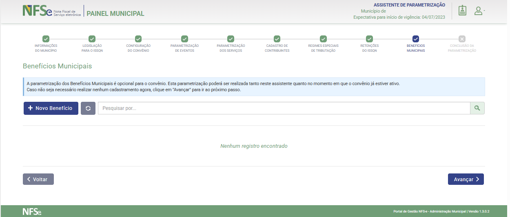

## Page 107

Guia para preenchimento do Painel Municipal da NFSe – versão 1.2
107
Figura 113 –Cadastro do benefício municipal
•
Descrição; neste campo é exigida a descrição do benefício: o texto que será exibido na lista dos
benefícios cadastrados e que deverá identificá-lo facilmente.
Figura 114 - Campo de descrição do benefício a ser inserido.
•
Legislação Municipal: A ATM deverá selecionar na lista da legislação vinculada o ato normativo que
institui o benefício a ser incluído. Este ato deve ser previamente cadastrado no sistema.

### Images from Page 107

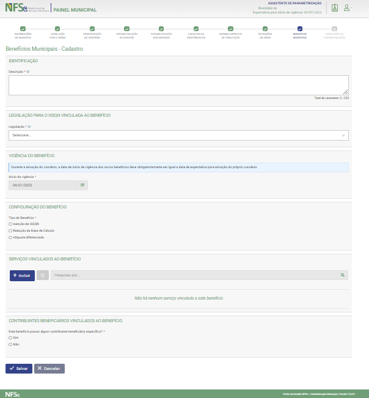

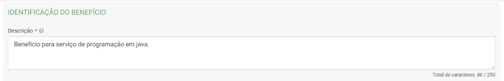

## Page 108

Guia para preenchimento do Painel Municipal da NFSe – versão 1.2
108
Figura 115 - Seleção da legislação municipal que institui o benefício.
•
Vigência do Benefício: Enquanto não ativado o convênio municipal, a data de vigência do benefício
será a data de expectativa para a ativação do próprio convênio.
Figura 116 – Data de início da vigência do benefício coincide com a data de expectativa de ativação do
convênio.
•
Tipo de Benefício* Neste campo são disponibilizadas três opções de escolha de benefícios:
Figura 117 - Isenção de ISSQN: não são necessárias outras configurações
a) Isenção de ISSQN: a seleção desta opção não requer outras configurações;

### Images from Page 108

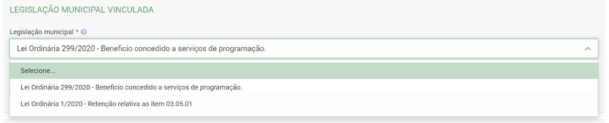

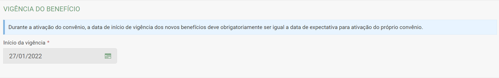

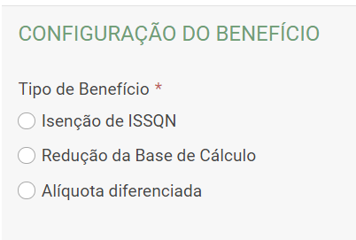

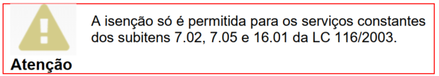

## Page 109

Guia para preenchimento do Painel Municipal da NFSe – versão 1.2
109
b) Redução da base de cálculo: pode ser por valor percentual ou por valor monetário. Ao escolher
a primeira opção, a ATM deverá estabelecer o limite do percentual aceitável para a redução da
base de cálculo. Ao escolher a segunda opção, nenhuma outra configuração é necessária;
Figura 118 - Configurações da redução da base de cálculo por valor percentual.
c) Alíquota diferenciada: a seleção dessa opção requer a configuração da alíquota a ser aplicada.
Esta deverá estar entre 2% e 5%, de acordo com a Lei Complementar 116/2003.
•
Serviços vinculados ao Benefício;
Figura 119 - Inclusão de serviços vinculados ao benefício.

### Images from Page 109

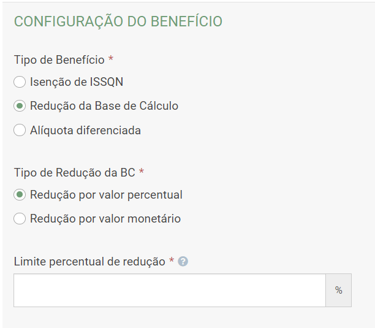

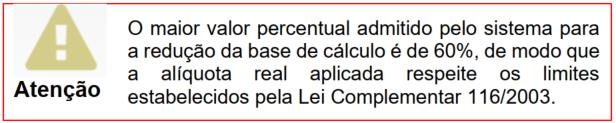

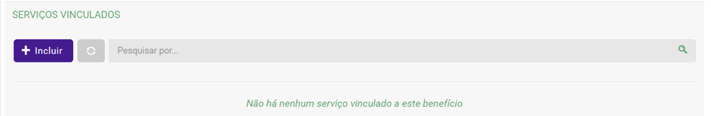

## Page 110

Guia para preenchimento do Painel Municipal da NFSe – versão 1.2
110
Figura 120 - Seleção dos serviços vinculados ao benefício.
•
Contribuintes beneficiários:
A ATM poderá definir contribuintes específicos como beneficiários do benefício fiscal a ser cadastrado.
Para isso deverá selecionar “Sim” no item correspondente na página.
Figura 121 - Informações solicitadas para a definição do benefício para contribuintes específicos.
Ao definir o benefício para contribuintes específicos, outros contribuintes não poderão
aplicá-lo durante a emissão da NFS-e de Nacional.
Uma vez realizada a opção de determinar contribuintes específicos para o benefício, a ATM deverá

### Images from Page 110

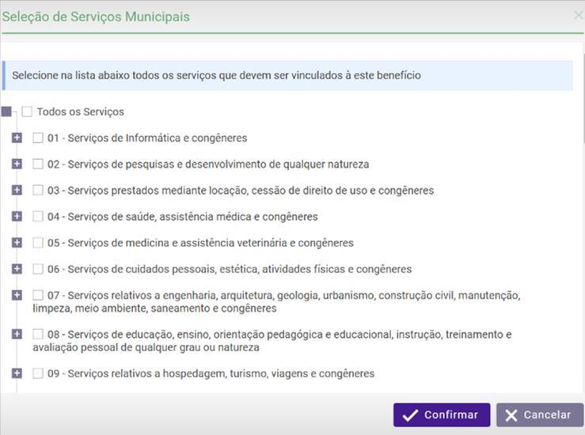

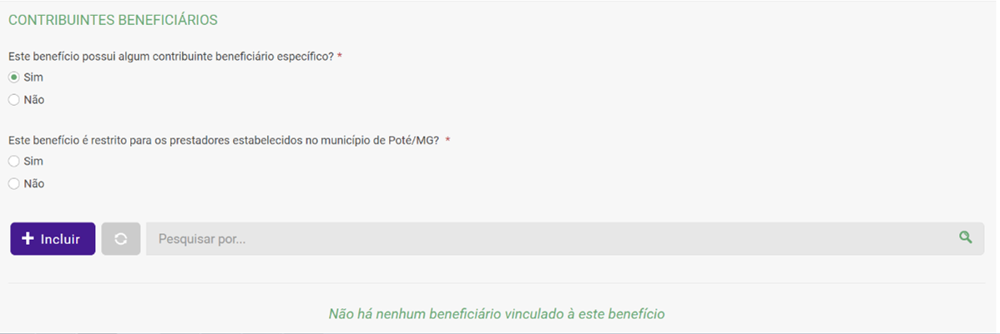

## Page 111

Guia para preenchimento do Painel Municipal da NFSe – versão 1.2
111
indicar também se o benefício a ser cadastrado é restrito para prestadores de serviços estabelecidos no
município.
Figura 122 - Informações solicitadas para a definição do benefício para contribuintes específicos.
3.9.1. Vinculação individual de contribuinte ao benefício
É possível a vinculação individual de um contribuinte ao benefício selecionado. Clicar em
,
o painel exibirá uma janela para inclusão do CPF/CNPJ.
O sistema exibirá então a tela para inserção do CPF/CNPJ em questão. Uma vez digitadas as
informações, o botão “Confirmar” deverá ser selecionado.
Figura 123 - Inserção do CPF/CNPJ do contribuinte beneficiário.
Mais de um contribuinte poderá ser inserido para um mesmo benefício, basta que os procedimentos
descritos neste subitem sejam repetidos.
3.9.2. Upload de Arquivo de contribuintes vinculados ao Benefício Municipal
A funcionalidade permite em um único procedimento incluir as informações de um ou mais
contribuintes. As regras gerais estão descritas no site web da funcionalidade.

### Images from Page 111

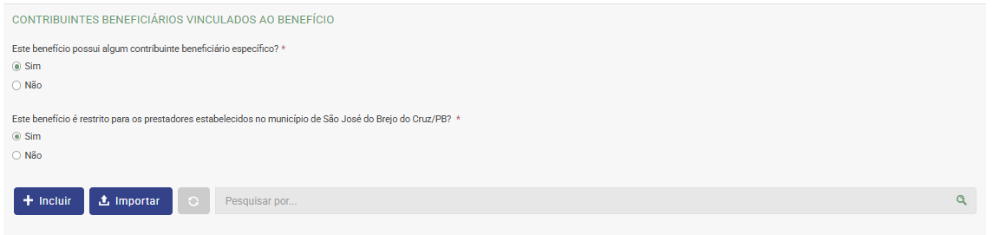

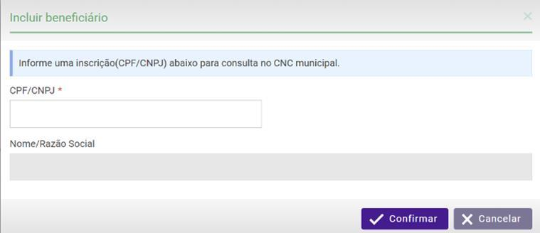

## Page 112

Guia para preenchimento do Painel Municipal da NFSe – versão 1.2
112
Clicar em
e fazer p upload do arquivo, conforme as configurações abaixo.
1.
Todos os campos do arquivo de entrada do arquivo CSV devem estar preenchidos, conforme leiaute
do arquivo CSV.
<CPF/CNPJ>|<IndicadorDaManutenção>|<Data>|<IdentificadorLegislação>|
a.
<CPF/CNPJ> - 14 dígitos (preencher com 000 à esquerda quando se tratar de um CPF);
b.
<IndicadorDaManutenção> - 0 - Finalizar Vigência; 1 - Iniciar Vigência;
c.
<Data> - Formato da data DD-MM-AAAA;
d.
<IdentificadorLegislação> - 14 digitos;
2.
O arquivo CSV com o resultado do processamento ficará disponível para download na mesma tela de
upload. Este arquivo conterá as mesmas informações linha a linha acrescidas com a mensagem do resultado
do processamento.
3.
A data informada deve ser maior ou igual à data de início da parametrização.
4.
Verificar se já existe CPF/CNPJ cadastrado na parametrização. Se não existir é possível cadastrar nova
vigência. Se já existir, deve-se verificar se o registro possui data final de vigência preenchido. Se existir data
final de vigência, então pode-se ser incluída uma nova vigência para o registro. Se não existir data final de
vigência, então pode-se apenas finalizar a vigência do registro nesta parametrização, desde que a data
informada no upload deste registro seja maior que a data de final de vigência do último registro de
parametrização deste CPF/CNPJ.
5.
Pode haver mais de um registro por CPF/CNPJ em um mesmo arquivo CSV, ressaltando que o
processamento será realizado na sequência em que os registros forem listados no arquivo.
6.
O upload dos beneficiários via CSV deve estar disponível antes e depois da ativação do município no
Painel Municipal.
7.
Manutenção da parametrização a ser realizada:
0 - Finalizar Vigência;
1 - Iniciar Vigência;
8.
Verificar se o identificador da legislação pertence ao município que está realizando a manutenção da
parametrização. (Verificar se os 7 primeiros dígitos do identificador da legislação correspondem ao código do
município informado).
•
A extensão do arquivo obrigatoriamente deve ser .CSV.
•
O arquivo deve conter um regsitro por linha.
•
Os campos que compõem cada linha devem ser separados por Pipe ( | ).
•
O tamanho do arquivo deve ser de até 300 Kb (cerca de 2000 contribuintes).
•
Para informações detalhadas, consulte o leiaute nas opções abaixo.

### Images from Page 112

## Page 113

Guia para preenchimento do Painel Municipal da NFSe – versão 1.2
113
3.10. Parametrização Decisões Administrativas / Judiciais
Foi criado um módulo com o objetivo de tratar um novo fluxo de emissão de
documentos na Sefin Nacional que permita a geração de notas sem a aplicação de algumas
regras de validação conforme consta no ANEXO_I-SEFIN_ADN-DPS_NFSe-SNNFSe na
planilha RN_DPS_NFS-e coluna “L”. Esta funcionalidade foi pensada para tratar as decisões
administrativas ou judiciais, que em muitos casos demandam a não validação de
determinadas regras para atender a decisão exarada. A ATM poderá incluir decisões
administrativas / judiciais através do menu “Parametrização -> Decisões Administrativas /
Judiciais” e logo em seguida em “Nova Decisão”, conforme as figuras abaixo:
Figura 124 – Emissão de NFS-e com decisão administrativa ou judicial
Figura 125 – Inclusão de nova decisão.
Na tela seguinte, deve-se incluir as seguintes informações: identificação (descrição),
Processo Administrativo/Judicial (número e descrição), vigência (data de início) e escolher os

### Images from Page 113

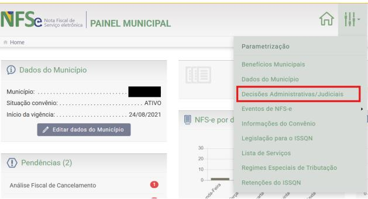

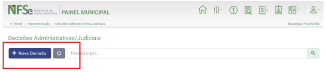

## Page 114

Guia para preenchimento do Painel Municipal da NFSe – versão 1.2
114
serviços e contribuintes vinculados. Para escolher os serviços e contribuintes vinculados,
deve-se informar primeiramente uma data de início de vigência:
Figura 126 – Inserção de serviços e contribuintes vinculados.
Para vincular os serviços a decisão cadastrada, clicar no botão Incluir onde será mostrada a seguinte
tela, onde será possível marcar os serviços vinculados a decisão:

### Images from Page 114

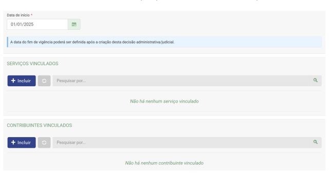

## Page 115

Guia para preenchimento do Painel Municipal da NFSe – versão 1.2
115
Figura 127 – Escolha de serviços vinculados.
Para inclusão do contribuinte, basta clicar em Incluir e informar na tela seguinte informar o CPF ou
CNPJ:
Figura 128 – Inserção de contribuinte vinculado.
É possível incluir vários contribuintes, repetindo o passo anterior. Após a inclusão das informações,
devese clicar em Salvar. Após salvar as informações, será apresentada a lista de decisões administrativas /
judiciais cadastradas:

### Images from Page 115

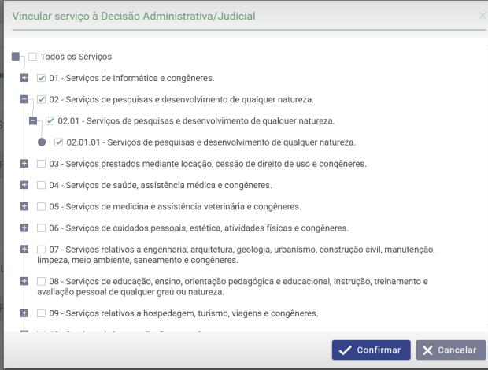

## Page 116

Guia para preenchimento do Painel Municipal da NFSe – versão 1.2
116
Figura 129 – Lista com as decisões cadastradas pelo município.
3.10.1 Encerramento de data de vigência
Para editar as informações, inclusive para incluir uma data fim de vigência, deve-se
clicar nos ícones conforme destacado em vermelho na figura anterior. Será aberta a tela
abaixo, com todas as informações cadastradas anteriormente:
Figura 130 – Tela com as informações de decisão cadastrada.
Nesta mesma tela, temos a opção de encerrar a vigência da decisão:
Figura 131 – Tela para encerramento de vigência
Após clicar em Encerrar vigência, será aberta a tela seguinte, para preenchimento da
data de fim de vigência e da permissão para o contribuinte emitir novas NFS-e após o

### Images from Page 116

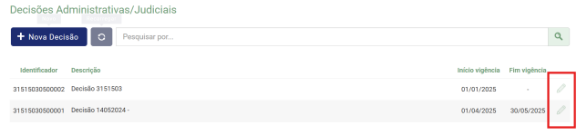

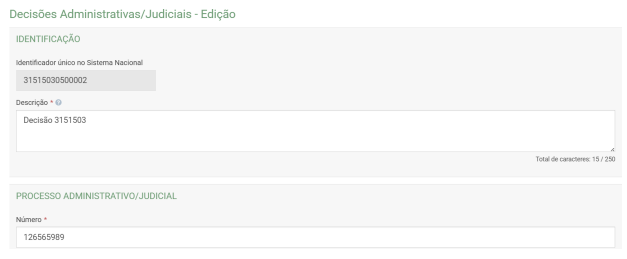

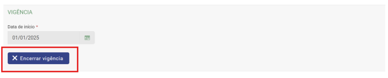

## Page 117

Guia para preenchimento do Painel Municipal da NFSe – versão 1.2
117
encerramento da vigência, desde que a competência esteja dentro do período de vigência
informado. Após o preenchimento, clicar em confirmar para salvar as informações:
Figura 132 – Informação da data de encerramento da vigência.
É possível também encerrar a vigência dos serviços vinculados a decisão, conforme a
tela abaixo:
Figura 133 – Tela com para iniciar o encerramento de vigência de serviço vinculado a decisão.
Após clicar em Encerrar vigência, será aberta a tela seguinte, onde deve-se informar a data fim
da vigência do serviço escolhido:

### Images from Page 117

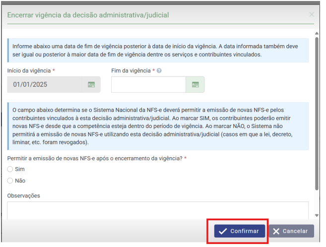

## Page 118

Guia para preenchimento do Painel Municipal da NFSe – versão 1.2
118
Figura 134 – Inserção da data fim de vigência de serviço vinculado a decisão.
Em relação aos contribuintes vinculados a decisão, também é possível encerrar a sua
vigência individualmente, na mesma página onde são apresentadas as informações sobre a
decisão, conforme a figura abaixo:
Figura 135 – Tela com para iniciar o encerramento de vigência de contribuinte vinculado a decisão.
Clicando em “Encerrar vigência”, será aberta a tela a seguir, onde deverá ser informada
a data fim de vigência. O campo observações é opcional:

### Images from Page 118

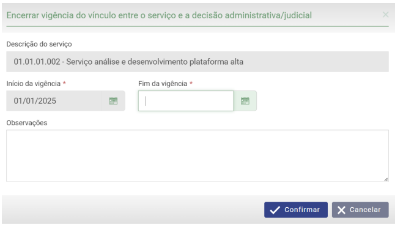

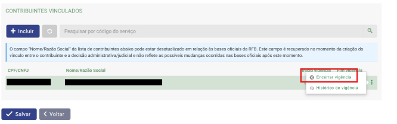

## Page 119

Guia para preenchimento do Painel Municipal da NFSe – versão 1.2
119
Figura 136 – Inserção da data fim da vigência de contribuinte vinculado a decisão.
3.10.2. Criar nova vigência de serviço ou contribuinte
É possível ativar novamente tanto os serviços como os contribuintes vinculados a decisão. Nos
parágrafos a seguir serão descritos os passos para conclusão da reativação. Primeiramente, deve-se
escolher a decisão em que pretende alterar reativar a vigência do serviço ou contribuinte, clicando nos
ícones destacados em vermelho, desde que a decisão não tem sido encerrada:
Figura 137 – Escolha para criar nova vigência de serviço ou contribuinte.
Neste exemplo, foi selecionado um serviço onde sua vigência foi encerrada, e agora iremos reativá-
lo, clicando nos três pontos ao lado e em seguida criar nova vigência:

### Images from Page 119

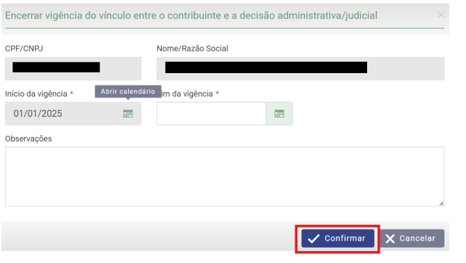

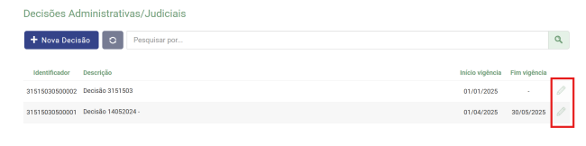

## Page 120

Guia para preenchimento do Painel Municipal da NFSe – versão 1.2
120
Figura 138 – Seleção de serviço para criar nova vigência.
Na tela seguinte, deve-se informar a nova data de vigência, lembrando que a data de início da nova
vigência deve ser superior à data de fim da última vigência do serviço selecionado:
Figura 139 – Informação do início de vigência.
Para criar nova vigência para contribuinte vinculado a decisão, a sistemática é similar ao que foi
apresentada em relação aos serviços. Neste exemplo, foi selecionado um contribuinte onde sua vigência foi
encerrada, e agora iremos reativá-lo, clicando nos três pontos ao lado e em seguida criar nova vigência:

### Images from Page 120

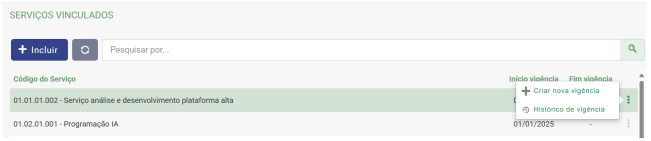

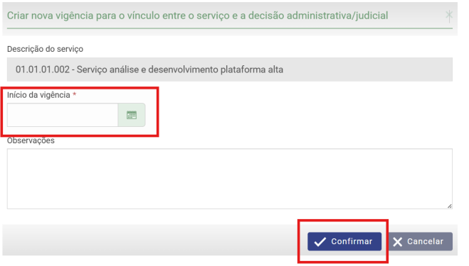

## Page 121

Guia para preenchimento do Painel Municipal da NFSe – versão 1.2
121
Figura 140 – Seleção de contribuinte para nova vigência.
Na tela seguinte, basta informar a nova data inicial de vigência, lembrando que a data de início da
nova vigência deve ser superior à data de fim da última vigência informada:
Figura 141 – Inserção da nova data de vigência.

### Images from Page 121

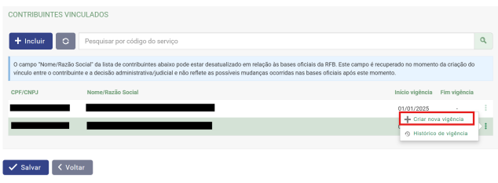

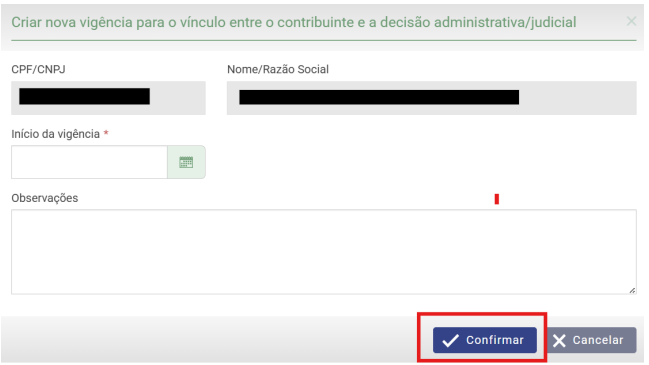

## Page 122

Guia para preenchimento do Painel Municipal da NFSe – versão 1.2
122
3.11. Conclusão da Parametrização
“Ativação” do Município no Sistema Nacional NFS-e
Concluída todas as parametrizações obrigatórias que o município deve realizar antes que possa estar
plenamente ativo no Sistema Nacional NFS-e, o sistema disponibiliza o comando para que o gestor municipal
possa acionar e ativar o município no sistema nacional, ou seja, a partir desta ativação, a emissão de qualquer
NFS-e, emitida através dos emissores públicos nacionais, que necessite de alguma informação que seja
parametrizável pelo município, poderá ser validada com esta informação parametrizada no município ativado.
Figura 142 – Passo de conclusão da parametrização
Os contribuintes do município ativado no sistema nacional, se emitirem NFS-e utilizando os emissores
públicos nacionais terão otimizados os preenchimentos e cálculos dos valores, além de maior controle nas
informações prestadas pois o sistema está automatizado para otimizar o preenchimento da declaração de
prestação de serviço e emissão da NFS-e com maior precisão, já que as informações preenchidas são
validadas com as parametrizações.
A partir da ativação do convênio do município:

### Images from Page 122

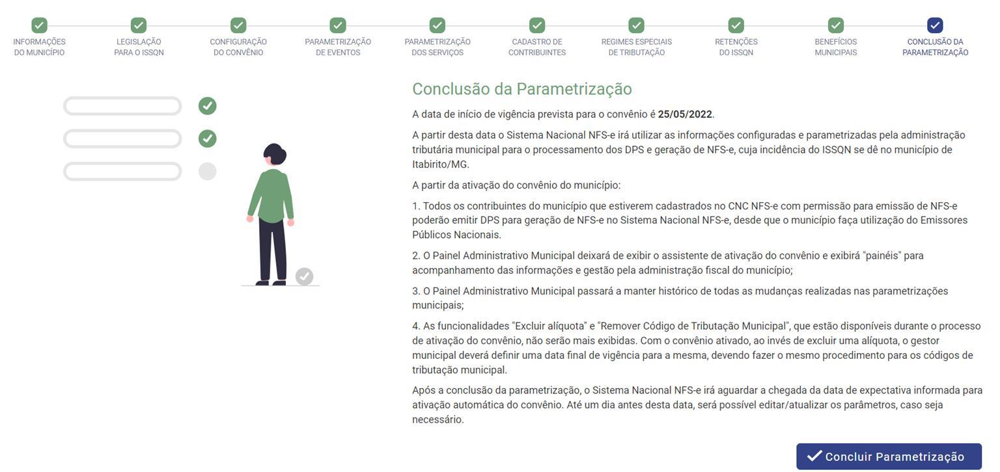

## Page 123

Guia para preenchimento do Painel Municipal da NFSe – versão 1.2
123
1. Todos os contribuintes do município que estiverem cadastrados no CNC NFS-e com permissão para
emissão de NFS-e poderão emitir DPS para geração de NFS-e no Sistema Nacional NFS-e, desde que o
município faça utilização do Emissores Públicos Nacionais.
2. O Painel Administrativo Municipal deixará de exibir o assistente de ativação do convênio e exibirá "painéis"
para acompanhamento das informações e gestão pela administração fiscal do município;
3. O Painel Administrativo Municipal passará a manter histórico de todas as mudanças realizadas nas
parametrizações municipais;
4. As funcionalidades "Excluir alíquota" e "Remover Código de Tributação Municipal", que estão disponíveis
durante o processo de ativação do convênio, não serão mais exibidas. Com o convênio ativado, ao invés de
excluir uma alíquota, o gestor municipal deverá definir uma data final de vigência para ela, devendo fazer o
mesmo procedimento para os códigos de tributação municipal.
Após a conclusão da parametrização, o Sistema Nacional NFS-e irá aguardar a chegada da data de expectativa
informada para ativação automática do convênio. Até um dia antes desta data, será possível editar/atualizar os
parâmetros, caso seja necessário.
A data de expectativa para o início de vigência deste convênio é inferior à data atual. Para conclusão
da
parametrização,
esta
data
deve
ser
igual
ou
superior
à
data
atual.
Entre em contato com o Comitê Gestor do Sistema Nacional NFS-e para solicitar a alteração desta data de
expectativa para início de vigência do convênio.
Ao selecionar o botão “Concluir Parametrização” o Sistema NFS-e exibe um aviso sobre a conclusão
da parametrização e as consequências desse passo.
Figura 143 - Aviso sobre as consequências da conclusão da parametrização e a ativação do convênio.

### Images from Page 123

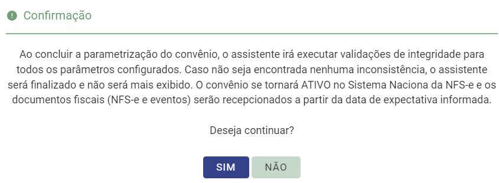

## Page 124

Guia para preenchimento do Painel Municipal da NFSe – versão 1.2
124
Depois da ativação, os parâmetros continuam editáveis, porém, com controle de início e encerramento
de vigência próprios.
Após a parametrização, ao entrar no painel municipal, será exibida a tela inicial com um resumo das
informações do município.
Figura 144 - Página inicial do Painel Administrativo Municipal após a ativação do convênio.

### Images from Page 124

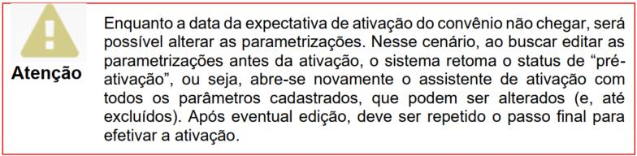

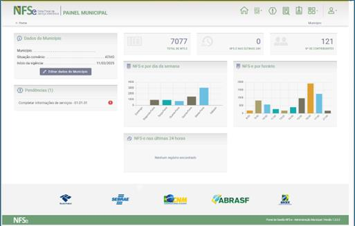

## Page 125

Guia para preenchimento do Painel Municipal da NFSe – versão 1.2
125
4.
Segunda Etapa – Alteração das Parametrizações Municipais Após
Ativação
O gerenciamento das parametrizações após a ativação do convênio é realizado da mesma forma que
foram explicadas até agora.
Uma vez ativado o convênio, para se alterar qualquer parâmetro, o sistema exige o novo valor do
parâmetro, a informação de uma data início de vigência para o novo valor do parâmetro, o motivo da alteração
e a legislação que embasa a alteração realizada. O motivo e a legislação são itens obrigatórios de
preenchimento como forma de registro para auditoria futura que venha a ser necessária.
Para facilitar o preenchimento das informações acerca da legislação que é solicitada em cada
alteração, foi criado um cadastro de legislações onde o município pode cadastrar seu conjunto de
ordenamentos legislativos. No momento da alteração de um parâmetro e preenchimento da informação acerca
da legislação, ele pode simplesmente escolher dentre as legislações previamente cadastradas aquela que está
relacionada à alteração realizada. Caso não tenha a legislação correta no momento da alteração, o sistema
permite que seja cadastrada a legislação antes que se conclua a alteração do parâmetro, sem que para isso o
gestor saia da tela ou perca informações que já foram preenchidas para a alteração do parâmetro.
Desta forma o sistema garante que, para os parâmetros obrigatórios sempre haverá valores de
parâmetros que garantam as validações realizadas sobre a DPS enviada pelos emitentes à Sefin Nacional
pelos Emissores Públicos Nacionais Web e Móvel e pelas aplicações próprias dos contribuintes para as APIs
da Sefin Nacional.
________________________________________________________________________________________________
Para qualquer alteração de parâmetros deve haver uma “data fim de vigência” daquele parâmetro.
________________________________________________________________________________________________

### Images from Page 125

## Page 126

Guia para preenchimento do Painel Municipal da NFSe – versão 1.2
126
5.
Painel Municipal Principal
5.1.
Página Inicial
Após ativado o convênio, o Painel Administrativo Municipal passará a exibir na página inicial, além do
Menu principal, algumas informações gerenciais relevantes, como a quantidade de pendências na fila para
análise, a quantidade de NFS-e emitidas por dia da semana e por horário, as NFS-e emitidas nas últimas 24
horas, entre outras informações.
Após a ativação qualquer mudança de valores dos parâmetros é considerada uma alteração
“controlada” e é registrada no histórico de alterações dos parâmetros com as datas inicial e final de vigência,
pois a emissão de documentos fiscais é afetada pelo período de vigência conforme a data de competência da
DPS (da qual irá ser gerada a NFS-e).
Figura 145 - Página inicial do Painel Administrativo Municipal após a ativação do convênio.
5.2.
Parametrização
A partir desse momento todas as configurações disponibilizadas quando da ativação do convênio
poderão ser revistas, acessando o menu no canto superior direito da página.
Cada item do menu é detalhado neste manual.

### Images from Page 126

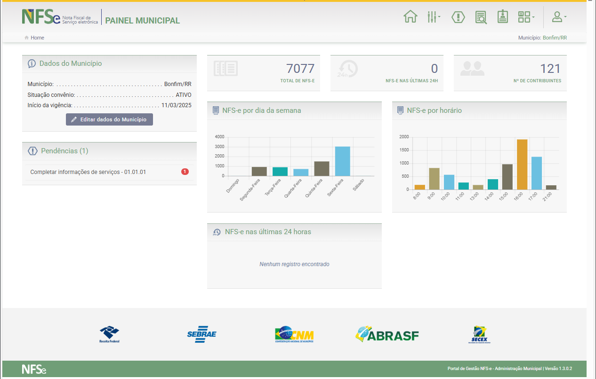

## Page 127

Guia para preenchimento do Painel Municipal da NFSe – versão 1.2
127
Muitos parâmetros cadastrados na etapa 1 podem ser editados, no entanto, para alguns deles isto não
será possível.
Acessando o botão
a parametrização municipal poderá ser alterada, respeitando as regras para a
implantação das mudanças realizadas.
Todas as configurações da parametrização foram abordadas no item 3 deste manual.
Figura 146 - Seleção da Parametrização municipal no menu.

### Images from Page 127

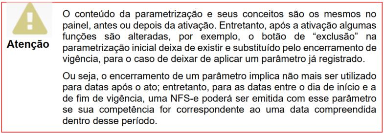

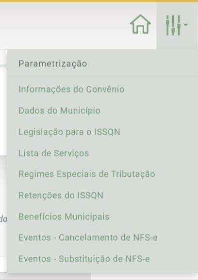

## Page 128

Guia para preenchimento do Painel Municipal da NFSe – versão 1.2
128
5.2.1. Informações do Convênio
Ao acessar o menu “Parametrização”- “Dados do Município” é possível verificar a parametrização feita
na etapa inicial de parametrização. Algumas informações são possíveis de serem editadas.
Figura 147 – seleção das “Informações do Convênio”
Figura 148 – Tela de Configuração do Convênio.

### Images from Page 128

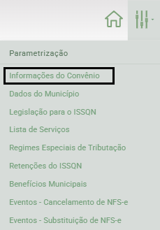

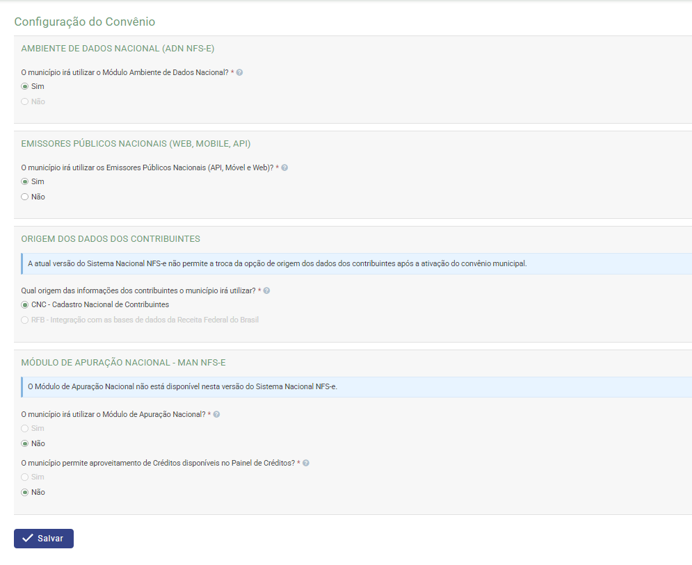

## Page 129

Guia para preenchimento do Painel Municipal da NFSe – versão 1.2
129
5.2.2. Dados do Município
Ao acessar o Menu “Parametrização” ou  selecionar o botão “Editar dados do Município” no painel
Municipal o sistema será redirecionado para a página que contém as informações básicas relativas ao
município em questão. De maneira geral, as informações editadas nesta página serão exibidas nas NFS-e
emitidas na sua jurisdição.
Figura 149 – Painel inicial com destaque para Editar os dados do Município.
Figura 150 – Parametrização dos dados do Município.

### Images from Page 129

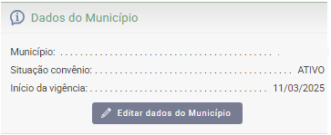

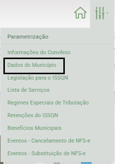

## Page 130

Guia para preenchimento do Painel Municipal da NFSe – versão 1.2
130
Figura 151 - Dados básicos relativos ao município, a serem exibidos na NFS-e.
•
Nome: este campo é exibido no cabeçalho do DANFS-e, para identificação do município. O tamanho
máximo que pode assumir é de 56 caracteres e normalmente é preenchido com “Prefeitura Municipal
de XXX”;
•
Complemento: neste campo, pode ser inserido para exibição no DANFS-e o nome do departamento
responsável pela administração do ISSQN no município. O tamanho máximo que pode assumir é de
32 caracteres;
•
Endereço: caso seja interesse da ATM, o endereço para atendimentos relativos ao ISSQN e à NFS-e
no Município poderá ser informado e exibido no DANFS-e. Neste caso, a ATM deverá preencher os
campos relativos ao endereço: CEP, logradouro, número, complemento e bairro
•
Contato e informações: poderão ser inseridos os dados relativos ao e-mail institucional, ao telefone e
ao website que são disponibilizados aos contribuintes para entrarem em contato com a ATM para tirar
dúvidas quanto ao ISSQN e à NFS-e.
•
Brasão: caso deseje, a ATM poderá inserir o brasão da prefeitura para exibição no DANFS-e. Para
isso deverá selecionar a imagem do brasão através tela exibida quando da seleção do ícone
.

### Images from Page 130

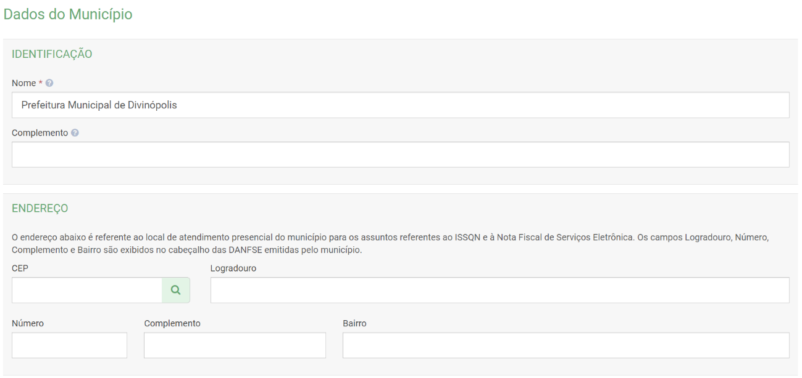

## Page 131

Guia para preenchimento do Painel Municipal da NFSe – versão 1.2
131
Figura 152 - Informações de contato e inserção do brasão da prefeitura no sistema
Caso a ATM deseje apenas excluir o brasão atual, deverá selecionar a caixa “Excluir o brasão atual”.
Uma vez realizadas todas as alterações, o botão “Salvar” disponibilizado ao final da página deverá ser
selecionado. Será então exibida uma mensagem de confirmação das alterações e a página é atualizada.
Figura 153 – Confirmação da atualização das informações
5.2.3. Alterações da “Legislação para o ISSQN”
Ao clicar na opção “Legislação para o ISSQN” abrirá uma janela onde será possível, consultar ,
editar e ver vínculos de uma legislação já cadastrada ou cadastrar uma nova.

### Images from Page 131

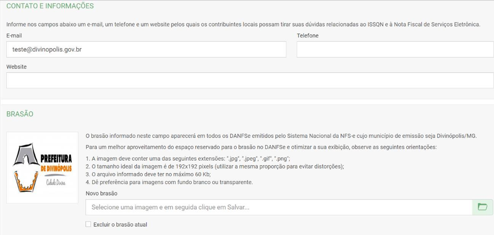

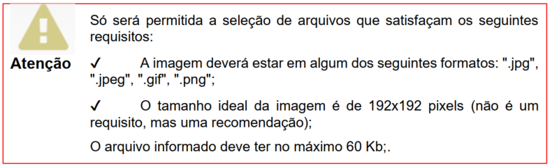

## Page 132

Guia para preenchimento do Painel Municipal da NFSe – versão 1.2
132
Figura 154 – Seleção da alteração da Legislação no botão Parametrização.
5.2.3.1.1. Consultar Legislação
Exibe uma tabela paginada com a relação de toda a legislação já cadastrada com opção
para incluir
nova legislação, pesquisar legislação pelo número da lei, ano ou descrição conforme figura abaixo:
Figura 155 – Tela inicial da Legislação ISSQN.

### Images from Page 132

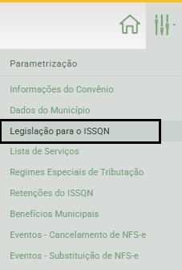

## Page 133

Guia para preenchimento do Painel Municipal da NFSe – versão 1.2
133
5.2.3.1.2. Alterar Informações da Legislação
Não é possível alterar informações sobre uma legislação já cadastrada.
Para alterar a legislação, deve-se incluir uma data com o fim da vigência de uma e cadastrar
uma nova.
5.2.3.1.3. Encerrar vigência da Legislação
Para informar a “Data do fim da vigência”, deve-se usar a janela de edição que abrirá clicando nos 3
pontos ao final da linha da referida legislação.
Figura 156 – Opção “editar” na tela inicial da Legislação ISSQN
Abrirá a janela para edição, ara inclusão da data do fim de vigência. Deve-se incluir a data e clicar em
.
Figura 157 – Tela edição de Legislação Municipal

### Images from Page 133

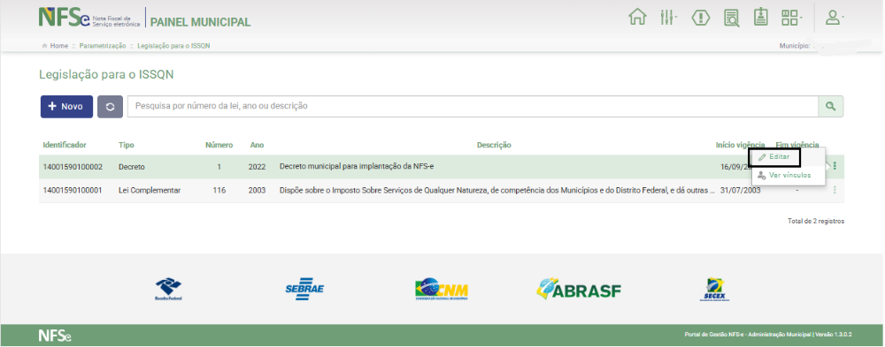

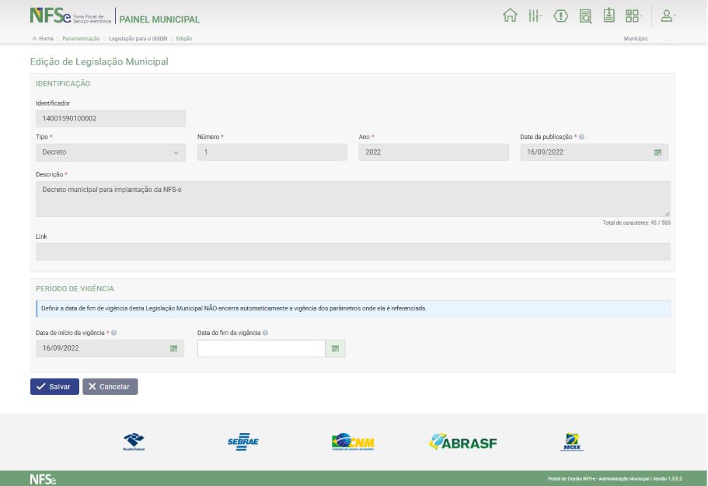

## Page 134

Guia para preenchimento do Painel Municipal da NFSe – versão 1.2
134
5.2.3.1.4. Incluir Legislação
Ao clicar no botão
será apresentada uma janela para a inserção das informações (Tipo,
Número, Ano, Data da publicação, Descrição, Link e o período de vigência). Preencher todas as informações
e clicar em
. Mais informações ver no item 3.2. deste manual.
Figura 158 – Opção “Novo” na tela inicial da Legislação ISSQN
Figura 159 – Tela de Cadastro de Legislação Municipal
5.2.4. Alterações da “Lista de Serviços”
Ao clicar na opção “Lista de Serviços” abrirá a janela de parametrização de Serviços com a lista de
serviços cadastrados pelo Município na primeira etapa.

### Images from Page 134

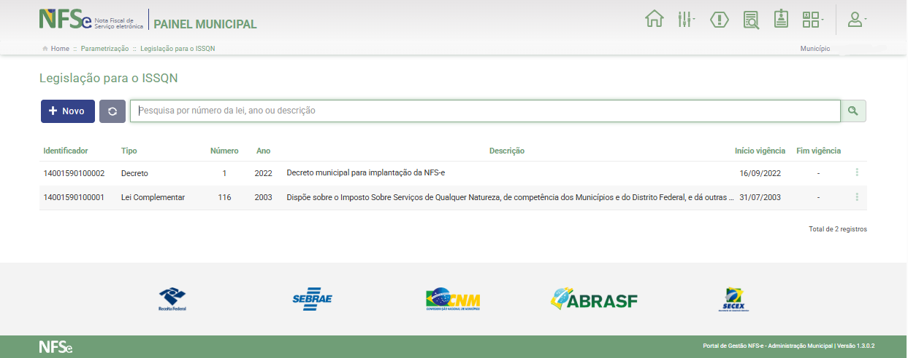

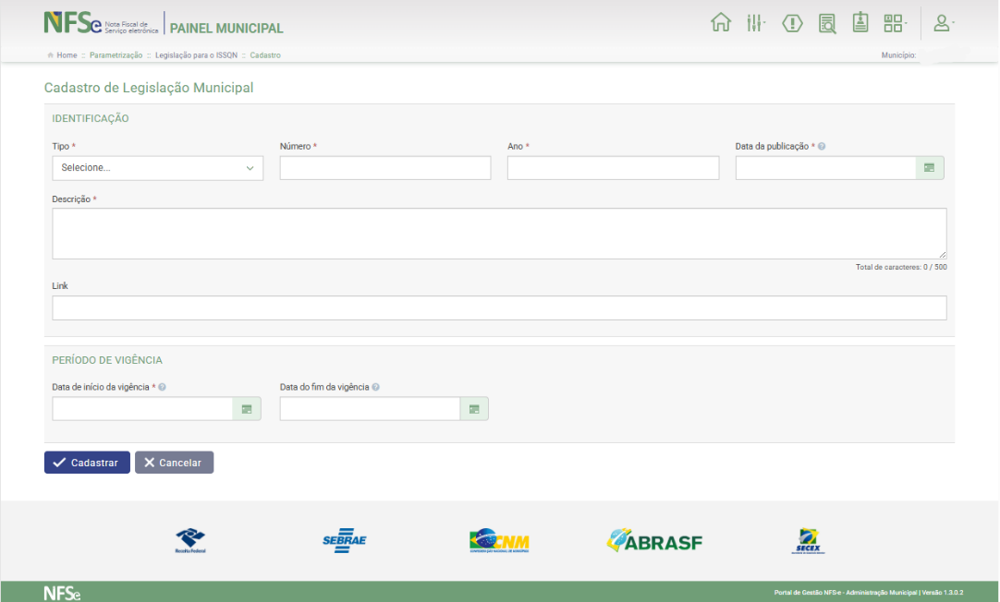

## Page 135

Guia para preenchimento do Painel Municipal da NFSe – versão 1.2
135
Figura 160 – Seleção da alteração da Legislação no botão Parametrização.
Como cadastrar novos serviços ou editar os serviços constantes estão contidos no item 3.5. deste
Manual.
5.2.4.1.
Alteração Alíquota
Para alterar uma alíquota, deve-se selecionar o serviço a ser editado e a janela para edição será
mostrada do lado direito do painel.
O encerramento de vigência de alíquota poderá se dar pelo processo de Generalização ou
Especialização.
Na Generalização a alteração da alíquota/vigência é feita através do item Pai ou subitem nacional:
A alteração irá expandir para todos os subitens, desdobros nacionais e códigos tributários municipais
criados. Essa alteração só será possível se a nova data de vigência for maior que a data de vigência de todos
os subitens/desdobros nacionais/códigos tributários municipais.
Deve-se considerar a convenção abaixo para melhor entendimento:
AA – item Pai
AA.BB – subitem
AA.BB.CC – desdobro nacional
AA.BB.CC.DDD – Código Tributário Municipal

### Images from Page 135

## Page 136

Guia para preenchimento do Painel Municipal da NFSe – versão 1.2
136
Na Especialização a alteração/encerramento é feita através do Código Tributário Municipal e o efeito
será apenas nesse código.
Seja qual for o processo de alteração/encerramento, o gestor municipal deve excluir do serviço
administrado qualquer parametrização de benefícios e/ou retenções. Para admitir um encerramento, o sistema
realiza a rastreabilidade de cada serviço administrado pelo município, benefícios municipais ou retenções,
para garantir que a alteração/encerramento não gere inconsistências.
Figura 161 – Tela para edição da parametrização dos serviços.
Clicar em
e abrirá a janela para a inclusão da alíquota e início da vigência.
Todo item Pai, subitem, desdobro nacional existente na lista de serviços, é obrigatório a
existência de uma alíquota vigente. Portanto ao alterar uma alíquota a mesma estará em
vigor a partir da nova data informada. A alíquota anterior terá como data de encerramento
da vigência a nova data informada decrescida de um dia.
A exceção se dá para os Códigos Tributários Nacionais que porventura tenham sido
criados pelo Gerente Municipal e podem ter sua vigência encerrada a critério do
Município. Os Códigos Tributários Municipais com vigência encerrada não poderão mais
ser objeto de geração de uma nota fiscal.

### Images from Page 136

## Page 137

Guia para preenchimento do Painel Municipal da NFSe – versão 1.2
137
Sempre a data de início de vigência do novo valor do parâmetro que se está alterando é
futura, do dia seguinte à data atual em diante. Assim o sistema sempre inicia uma nova
vigência de valores de parâmetros à 00h da data programada e encerra a vigência do
valor do parâmetro que se está alterando às 23h59min59seg do dia anterior à data
programada o início de vigência do novo valor do parâmetro.
Figura 162 – Tela para definição de nova alíquota e data de vigência para um serviço

### Images from Page 137

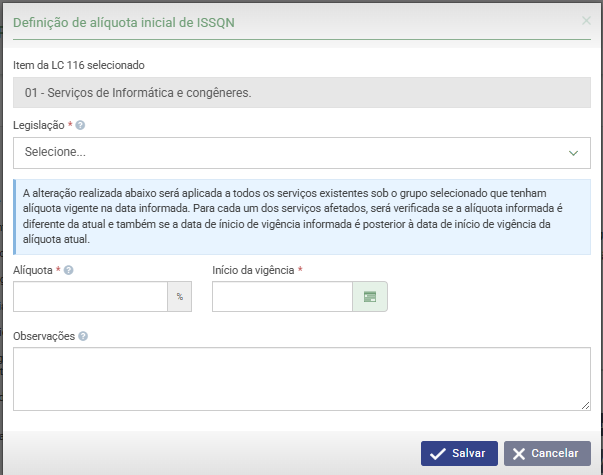

## Page 138

Guia para preenchimento do Painel Municipal da NFSe – versão 1.2
138
5.2.4.2.
Alteração Dedução/Redução
É possível fazer alterações nas deduções/reduções na janela mostrada a partir do botão
.
Figura 163 – Tela para parametrização de serviços
Figura 164– Tela para alterar situação de tipo de redução de base de cálculo do ISSQN.

### Images from Page 138

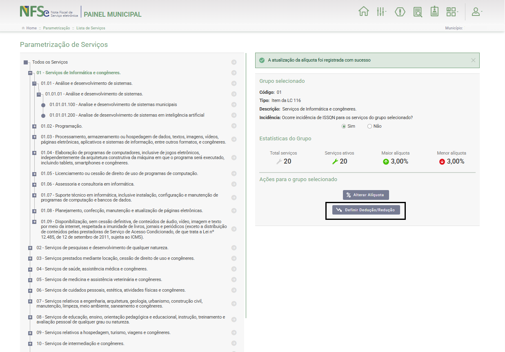

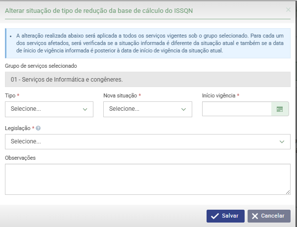

## Page 139

Guia para preenchimento do Painel Municipal da NFSe – versão 1.2
139
5.2.5. Alteração Regime Especial de Tributação
Figura 165 – Menu Regimes Especiais de Tributação
É possível editar a configuração dos campos envolvidos do Regime Especial de Tributação clicando
em
conforme figura abaixo:
Figura 166 –Regimes Especiais de Tributação
Preencher os campos da janela abaixo e clicar em
.

### Images from Page 139

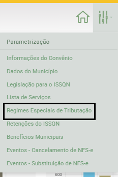

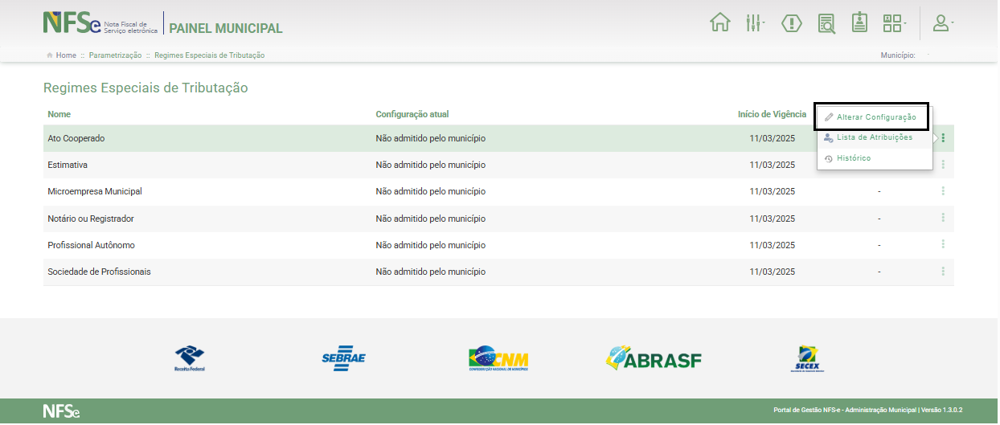

## Page 140

Guia para preenchimento do Painel Municipal da NFSe – versão 1.2
140
Figura 167 –Configuração de Regimes Especiais de Tributação – Ato Cooperado
5.2.6. Editar Retenções do ISSQN
Figura 168 – Menu Retenções do ISSQN
É possível cadastrar retenções de ISSQN ou editar outras feitas anteriormente:

### Images from Page 140

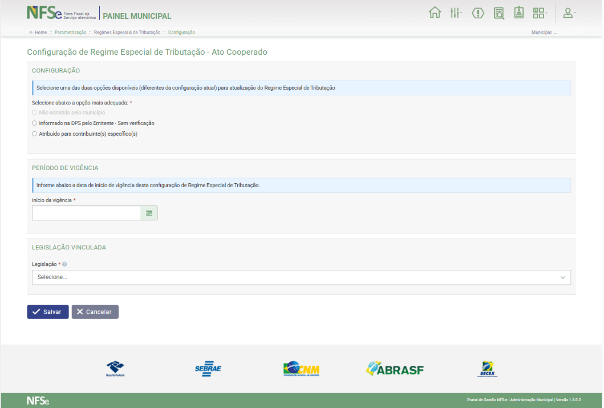

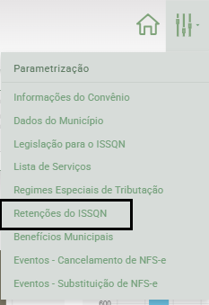

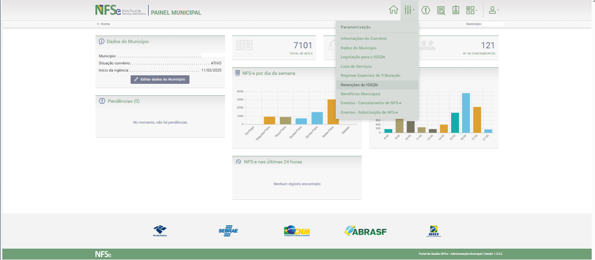

## Page 141

Guia para preenchimento do Painel Municipal da NFSe – versão 1.2
141
Figura 169 – Configuração de Retenções do ISSQN
Figura 170 – Configuração de Retenções do ISSQN.
5.2.7. Edição de Benefícios Municipais
Figura 171 – Menu Benefícios Municipais
Nesta funcionalidade é possível alterar a legislação, encerrar a vigência do benefício a partir de uma
data, Incluir serviço e incluir contribuintes a serem beneficiados em algum benefício fiscal, deve-se clicar, no
menu principal, em Benefícios Fiscais, conforme figura abaixo.
Então, clicar no final da linha do benefício que ser quer editar.

### Images from Page 141

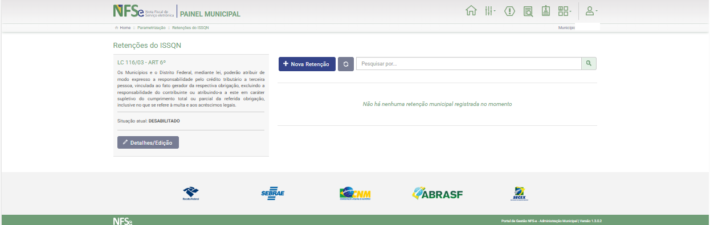

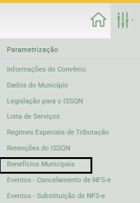

## Page 142

Guia para preenchimento do Painel Municipal da NFSe – versão 1.2
142
Figura 172 – Tela com os Benefícios Municipais cadastrados
É possível alterar a legislação, encerrar a vigência do benefício a partir de uma data, Incluir serviço e
incluir contribuintes a serem beneficiados.

### Images from Page 142

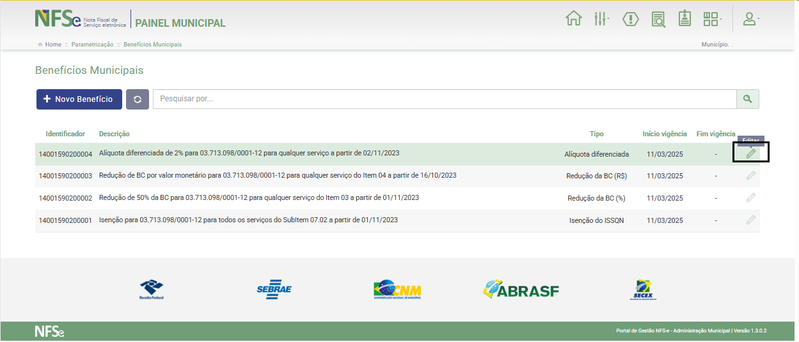

## Page 143

Guia para preenchimento do Painel Municipal da NFSe – versão 1.2
143
Figura 173 – Benefícios Municipais - edição
5.2.8. Eventos – Cancelamento de NFS-e
A ATM pode alterar a parametrização inicial feita no sistema que envolve todas as situações em que
aceitará um pedido de cancelamento da NFS-e Nacional. Caso o pedido esteja de acordo com essa
parametrização, a nota poderá ser cancelada de forma automatizada, via sistema. Mais detalhes
verificar no item 3.4.1 deste Manual.
5.2.9. Eventos – Substituição de NFS-e
Assim como nas configurações sobre cancelamento, a ATM deverá indicar as situações que aceitará
a substituição da NFS-e Nacional.

### Images from Page 143

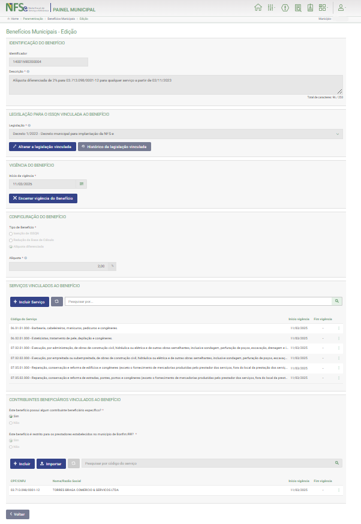

## Page 144

Guia para preenchimento do Painel Municipal da NFSe – versão 1.2
144
A substituição de nota ocorre com a ação de substituição de NFS-e pelo envio de nova DPS indicando
uma chave de acesso de NFS-e já existente no sistema. Ao receber uma DPS contendo uma chave de acesso
a ser substituída, o sistema cancela a NFS-e existente e gera uma nota substituta, vinculando os documentos
envolvidos (notas substituída e substituta). Mais detalhes verificar no item 3.4.2 deste Manual.
5.3.
Verificar Pendências
Em situações não admitidas pela ATM para o cancelamento automático da NFS-e Nacional (de acordo
com o item 15 deste manual), os contribuintes podem solicitar a análise fiscal.
Esta funcionalidade exibe para o gestor municipal uma lista de Eventos de Solicitação de
Cancelamento de NFS-e por Análise Fiscal emitidos por seus contribuintes que precisam ser analisados para
que o fisco possa deferir ou indeferir o cancelamento de NFS-e solicitado.
Por exemplo, não há possibilidade de o fisco realizar os dois eventos para a mesma solicitação de
cancelamento de uma NFS-e.
A ação de deferir ou indeferir as solicitações gera, respectivamente, os eventos de Cancelamento de
NFS-e Deferido por Análise Fiscal e o Cancelamento de NFS-e Indeferido por Análise Fiscal. Estas ações de
deferimento ou indeferimento geram os respectivos arquivos XML, conforme leiaute definido no anexo II e,
que serão processados, armazenados e vinculas à NFS-e correspondente.
Esta solicitação fica disponível para a ATM através do Painel Administrativo Municipal, no ícone
Figura 174 - Lista de pendências de análise fiscal.
Aparecerão na tela todas as solicitações de cancelamento pendentes de análise pela ATM.
Para analisar uma solicitação, a ATM deverá acessar o ícone
na mesma linha da solicitação.

### Images from Page 144

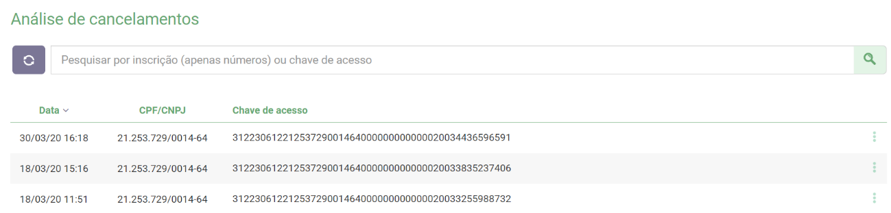

## Page 145

Guia para preenchimento do Painel Municipal da NFSe – versão 1.2
145
Serão então exibidas três opções:
Figura 175 - Opções para análise da pendência pela ATM
•
Visualizar NFS-e: nesta opção, a ATM terá acesso a todas as informações da NFS-e a ser analisada,
bem como o motivo alegado pelo contribuinte para a solicitação do cancelamento do documento
fiscal;
Figura 176 - Tela de visualização de algumas informações da NFS-e a ser analisada
Nesta opção do menu, a ATM poderá apenas visualizar, realizar o download do xml e do DANFS-e, mas
não poderá deferir/indeferir a solicitação. Para isso, deve retornar à página de pendências e selecionar o item
do menu que desejar: “Deferir solicitação” ou “Indeferir solicitação”.
● Deferir solicitação: ao selecionar essa opção, uma nova tela será exibida e algumas informações básicas
da NFS-e poderão ser exibidas através da opção “Exibir detalhes da NFS-e”, para que sejam reduzidas as
possibilidades de erro por parte da ATM.

### Images from Page 145

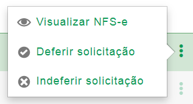

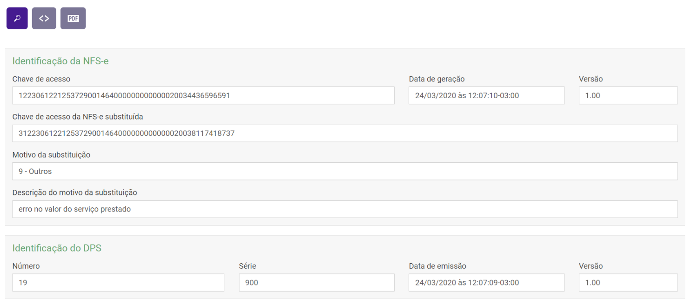

## Page 146

Guia para preenchimento do Painel Municipal da NFSe – versão 1.2
146
Figura 177 - As informações básicas são exibidas na tela para conferência
Para que haja o deferimento da solicitação, a ATM poderá inserir em campo próprio (caso exista) o número
do processo administrativo municipal vinculado à solicitação de cancelamento da NFS-e.
Os demais campos são de preenchimento obrigatório pela ATM e deverão demonstrar os motivos pelos
quais a ATM decidiu por acatar o pedido do contribuinte.
Figura 178 - Informações a serem inseridas sobre o deferimento do cancelamento
Uma vez inseridas todas as informações, a ATM deverá confirmar o deferimento da solicitação.

### Images from Page 146

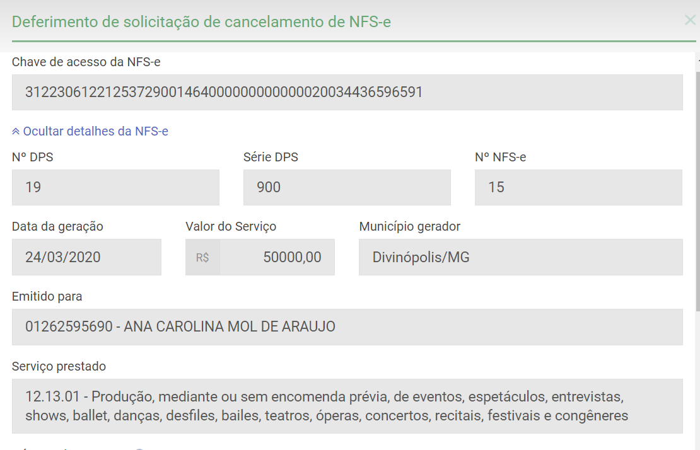

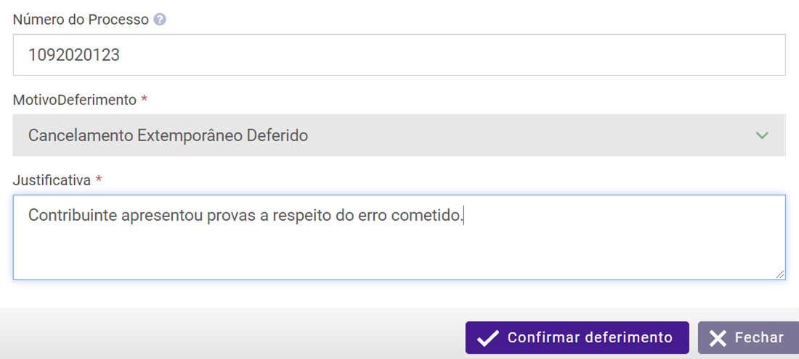

## Page 147

Guia para preenchimento do Painel Municipal da NFSe – versão 1.2
147
Será então exibida uma mensagem de confirmação do deferimento.
● Indeferir solicitação: ao selecionar essa opção, assim como ocorre para o deferimento, uma nova
tela será exibida e algumas informações básicas da NFS-e poderão ser exibidas através da opção
“Exibir detalhes da NFS-e”, para que sejam reduzidas as possibilidades de erro por parte da ATM.
Figura 179 - Possibilidade de exibição de informações básicas da NFSe para conferência antes do
indeferimento da solicitação.
Figura 180 - Campos a serem preenchidos para o indeferimento da solicitação de cancelamento.
Para o indeferimento da solicitação, a ATM poderá inserir em campo próprio (caso exista) o número do
processo administrativo municipal vinculado à solicitação de cancelamento da NFS-e.
No campo “Tipo do indeferimento” a ATM deverá selecionar entre “Cancelamento extemporâneo
indeferido” e “Cancelamento extemporâneo indeferido sem análise de mérito”.

### Images from Page 147

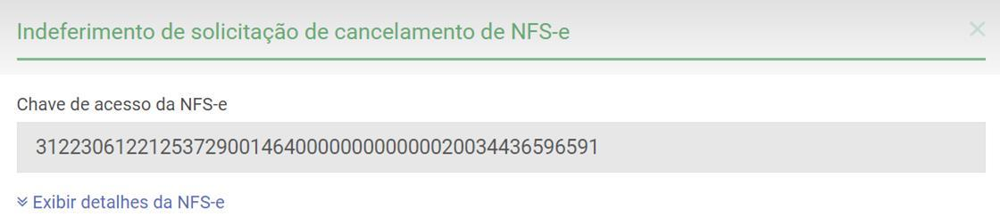

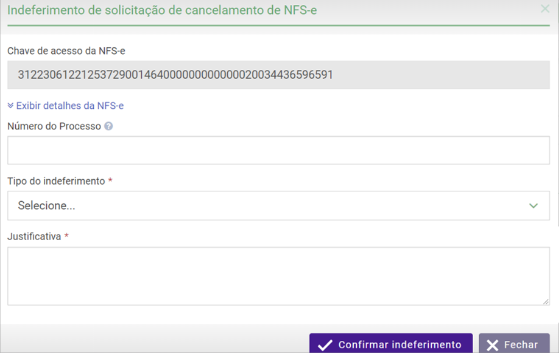

## Page 148

Guia para preenchimento do Painel Municipal da NFSe – versão 1.2
148
Em seguida, a justificativa para o indeferimento deverá ser incluída em campo próprio, para que o
contribuinte saiba as razões que levaram ao não cancelamento do documento fiscal.
Será então exibida uma mensagem de confirmação do indeferimento.
5.4.
Consulta NFS-e
A ATM poderá consultar as notas emitidas na sua jurisdição, para isso deve acessar o ícone
do
menu principal.
Poderão ser consultadas as NFS-e emitidas pelos contribuintes cadastrados no município em questão
e aqueles em que o município consta como município de incidência do ISSQN.
De maneira geral, a consulta às NFS-e pode acontecer de duas formas: especificamente, através da
chave da NFS-e ou por filtros de pesquisa mais gerais.
Figura 181 - Página de consulta das NFS-e emitidas na jurisdição municipal
Para pesquisar uma NFS-e específica, a sua chave de acesso poderá ser inserida no campo específico
no início da página e em seguida o botão
deverá der selecionado. A página com as informações da NFS-
e será exibida, dando a possibilidade de fazer o download do xml ou do DANFS-e ou realizar uma nova
pesquisa através dos ícones
disponíveis no canto superior esquerdo da página.

### Images from Page 148

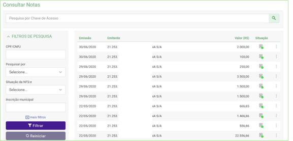

## Page 149

Guia para preenchimento do Painel Municipal da NFSe – versão 1.2
149
Caso deseje, a ATM poderá pesquisar as NFS-e emitidas utilizando outros critérios, tendo a
possibilidade de realizar uma análise mais gerencial dos documentos fiscais emitidos na sua jurisdição. Para
isso deverá utilizar os filtros disponíveis no canto esquerdo da página de consulta e em seguida selecionar o
botão “Filtrar”. As NFS-e que atenderem aos critérios selecionados, serão exibidas na página.
Os parâmetros de filtros da consulta são os demonstrados na tela abaixo. Pode-se usar cada um dos filtros
individualmente ou associados.
Figura 182 - Exemplo de filtros aplicados para a exibição de NFS-e emitidas por prestadores de serviço e que
foram substituídas.
No exemplo abaixo, a ATM deseja saber a lista de NFS-e emitidas por prestadores de serviço que
foram substituídas. No canto direito de cada linha de pesquisa exibida, são disponibilizadas as seguintes
opções: visualizar a NFS-e, cancelar por ofício, realizar o download do xml ou do DANFS-e para cada uma das
NFS-e emitidas.
Figura 183 – Tela inicial de consulta das NFS-e.

### Images from Page 149

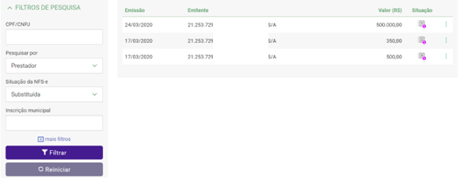

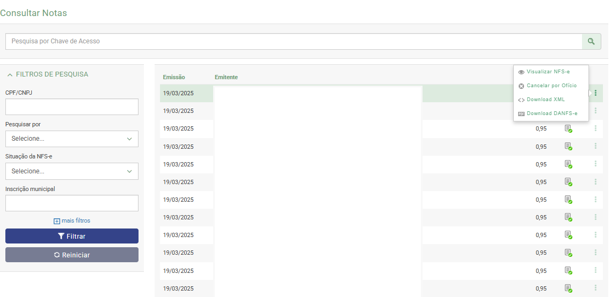

## Page 150

Guia para preenchimento do Painel Municipal da NFSe – versão 1.2
150
'
Figura 184 - Opções disponibilizadas na consulta das NFS-e.
O botão
disponível abaixo dos filtros de pesquisa limpa todos os filtros de pesquisa e
redireciona o sistema para a página inicial de consulta da NFS-e.
5.4.1. Visualizar NFS-e e Eventos Vinculados
Permite visualizar as informações da NFS-e além da opção de download da mesma nos formatos
HTML (Transformação do XML com XSLT), XML e PDF. A visualização retorna, além das informações da NFS-
e, também dos eventos vinculados à NFS-e. Estes últimos, os eventos, estão disponíveis somente no formato
HTML (Transformação do XML com XSLT).
Figura 185 – Tela Consultar Notas.

### Images from Page 150

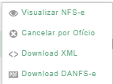

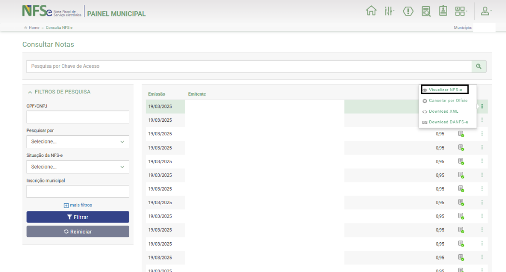

## Page 151

Guia para preenchimento do Painel Municipal da NFSe – versão 1.2
151
Figura 186 – Tela com dados sobre uma NFS-e.
Na tela de Visualização da NFS-e existem 3 opções
(Pesquisar, Download xml
da NFS-e e Download PDF da DANFS-e)
a) Pesquisar:
Ao clicar no ícone
“pesquisar”, o sistema retorna à página anterior para realizar uma nova pesquisa.
Figura 187 – Opção pesquisar.

### Images from Page 151

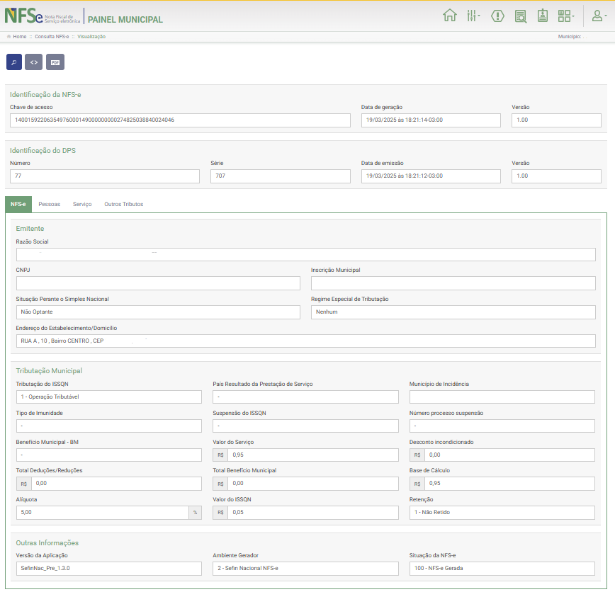

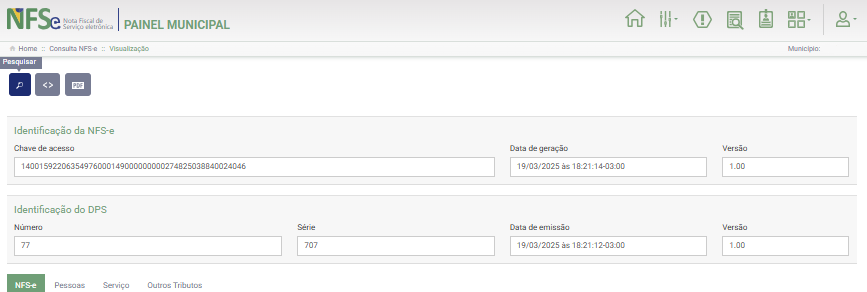

## Page 152

Guia para preenchimento do Painel Municipal da NFSe – versão 1.2
152
b) Download XML:
Ao clicar no ícone
“Download XML”, o sistema fará o download da NFS-e no computador do
usuário.
Figura 188 – Opção Download XML.
Ou:
Pode ser acessado diretamente na tela “Consultar Notas”.
Figura 189 – Consultar Notas com opção Download XML.
c) Download DANFS-e

### Images from Page 152

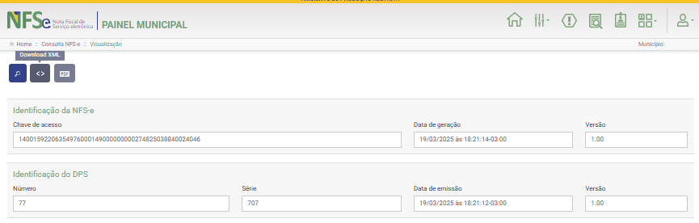

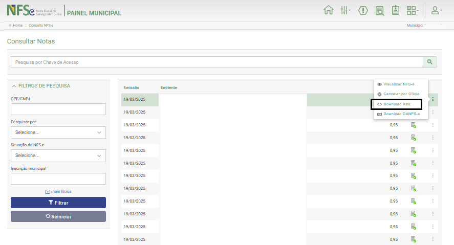

## Page 153

Guia para preenchimento do Painel Municipal da NFSe – versão 1.2
153
d) Ao clicar no ícone
“Download DANFS-e”, o sistema fará o download da DANFS-e no
computador do usuário.
Figura 190 – Opção Download DANFS-e.
Ou:
Pode ser acessado diretamente na tela “Consultar Notas”.
Figura 191 – Consultar Notas com opção Download DANFS-e.
5.4.2. Cancelamento por Ofício
A Administração Tributária Municipal poderá cancelar por ofício qualquer NFS-e que tenha sido
emitida pelo contribuinte daquele município, ou seja, em que o município seja o município emissor daquela
nota. Esta ação será possível através da funcionalidade disponibilizada nas NFS-e que resultarem (que o

### Images from Page 153

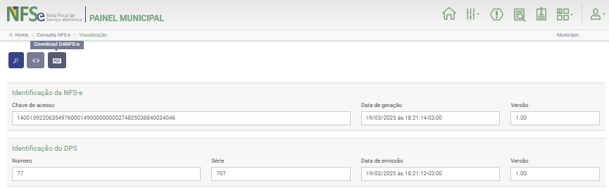

## Page 154

Guia para preenchimento do Painel Municipal da NFSe – versão 1.2
154
município seja o município emissor) da consulta de NFS-e do Painel Administrativo Municipal.
No painel Consultar Notas, ao clicar nos
ao final da linha de cada NFS-e da lista, há a opção
“Cancelar de Ofício”.
Figura 192 – Consultar Notas com opção Cancelar por Ofício.
Ao clicar em “Cancelar por Ofício”, aparecerá a Janela de confirmação do cancelamento. Deverá
informar
o
Número
do
Processo
Administrativo
e
a
Justificativa
e
então
clicar
em
.
Figura 193 – Confirmação do Cancelamento por Ofício.

### Images from Page 154

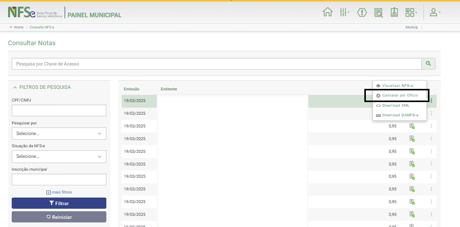

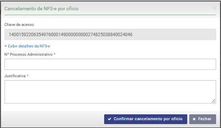

## Page 155

Guia para preenchimento do Painel Municipal da NFSe – versão 1.2
155
5.5.
Gestores Municipais
O gerenciamento dos perfis de acesso dos Gestores Municipais contempla as funcionalidades para
cadastramento para o acesso ao Painel Administrativo Municipal. Todas as funcionalidades administrativas
para os gestores municipais do município conveniado estão disponíveis no painel municipal. Ao clicar em
gestores Municipais, o painel exibirá uma lista com todos os gestores cadastrados para o Município, com o
Perfil de cada um, a data da atualização e a situação atual (Ativo ou Inativo).
Acessando o botão
disponível no menu, a depender do perfil do usuário do sistema, os perfis
dos gestores municipais poderão ser visualizados e alterados.
Figura 194 – Tela Gestores Municipais.
Ao clicar nos 3 pontos no final da linha com os dados do gestor, e possível editar os dados de cada,
alterar a situação de ativo para inativo ou vice-versa e verificar o histórico das alterações.
5.5.1. Editar
Ao selecionar a opção “Editar”, é exibida na tela todas as informações sobre o gestor municipal: CPF,
Nome, Tipo (perfil cadastrado), Telefone, e-mail, situação atual e última atualização. Entretanto, apenas os
campos Tipo, Telefone e e-mail poderão ser editados.

### Images from Page 155

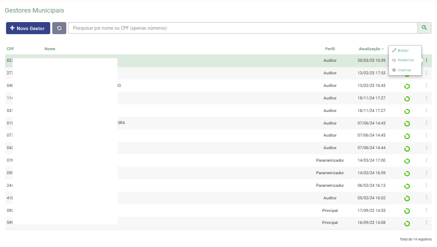

## Page 156

Guia para preenchimento do Painel Municipal da NFSe – versão 1.2
156
Figura 195 – Opção “Editar” de um gestor municipal.
Figura 196 - Edição de gestor municipal.
5.5.2. Histórico
Ao clicar em “Histórico”, o sistema exibirá a tela onde é possível ver o histórico das alterações feitas
em cada um dos gestores, como as ativações e as inativações realizadas para o gestor municipal selecionado.
Figura 197 – Opção “Histórico” de um gestor municipal.

### Images from Page 156

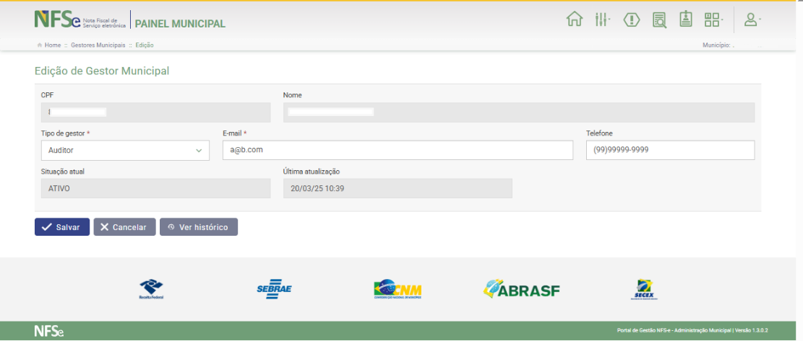

## Page 157

Guia para preenchimento do Painel Municipal da NFSe – versão 1.2
157
Figura 198 – Tela “Histórico” de um gestor municipal.
5.5.3. Inativar
A opção “Inativar” ao lado dos gestores municipais com o símbolo
, tem como consequência
bloquear o acesso do gestor selecionado ao sistema da NFS-e.
Um Gestor Municipal, uma vez cadastrado, não pode ser excluído, para que ele não
possa mais realizar acesso ao painel municipal, o ATM deve Inativar a situação do
referido gestor.
Figura 199 – Opção “Inativar” um gestor municipal.
Ao clicar em “Inativar”, o sistema exibirá uma janela de confirmação para inativação do gestor.

### Images from Page 157

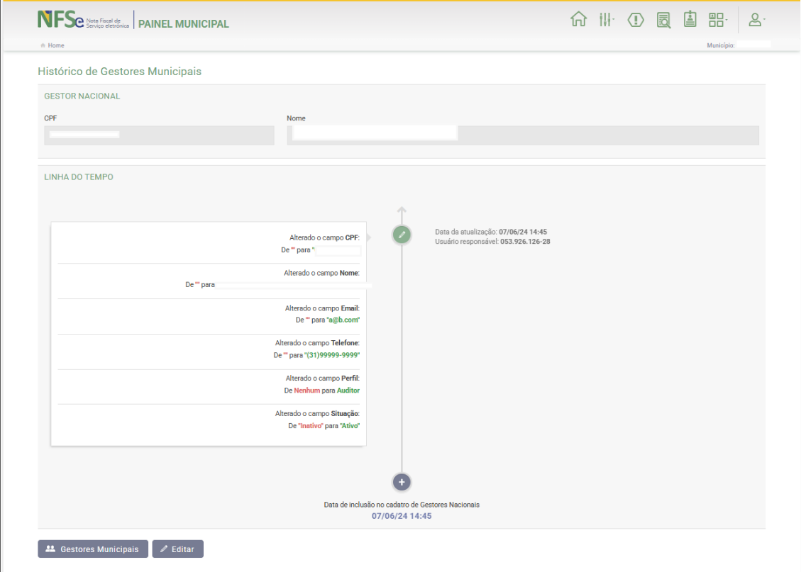

## Page 158

Guia para preenchimento do Painel Municipal da NFSe – versão 1.2
158
Figura 200 – Tela de confirmação para Inativar um gestor municipal.
Uma vez confirmada a inativação, a página é atualizada e o gestor selecionado ficará sinalizado com
na frente.
Para ativar um gestor basta selecionar a opção “Ativar” no menu. Será mostrada uma mensagem de
confirmação na tela e se confirmada a alteração, a página será atualizada e o gestor será sinalizado com
.

### Images from Page 158

## Page 159

Guia para preenchimento do Painel Municipal da NFSe – versão 1.2
159
5.6.
Cadastro Nacional de Contribuintes (CNC NFS-e)
Após a parametrização inicial do Painel, é possível ter a visão geral do município, visualizar e cadastrar
contribuintes locais, realizar consulta nacional e fazer upload de arquivos de cadastro e de autorização de
emissão.
Permite o gerenciamento das pessoas (físicas e jurídicas) que são contribuintes do ISSQN pelo
município conveniado com o Sistema Nacional NFS-e.
A funcionalidade tem opção para Incluir Novo Contribuinte, Pesquisar, Alterar e Excluir as informações
de cada um dos registros do cadastro mantendo seu histórico de atividades no sistema.
Para cada registro encontrado é possível visualizar os detalhes das informações do contribuinte cadastrado
no município em questão, bem como o histórico de alterações destas informações.
5.6.1. Visão Geral
No menu principal, ao clicar no ícone
e ir até “visão Geral” o painel exibirá uma página com
alguns dados e estatísticas a respeito dos contribuintes cadastrados, como: Nº de Contribuintes (Pessoas
Físicas e Pessoas Jurídicas), Aptos a emitir NFS-e, Bloqueados p/ emissão, Regimes Especiais de Tributação,
Status para emissão de NFS-e, Últimos cadastramentos e Últimas atualizações.
Figura 201 – Menu Cadastro Nacional de Contribuintes com destaque para Visão Geral

### Images from Page 159

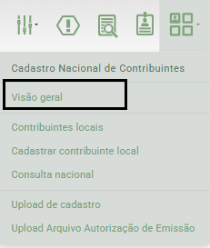

## Page 160

Guia para preenchimento do Painel Municipal da NFSe – versão 1.2
160
Figura 202 – Visão Geral do Cadastro Nacional de Contribuintes
Para a lista dos “Últimos cadastramentos” e “Últimas atualizações” é possível “visualizar” cada uma
delas clicando no ícone
que se encontra do lado direito de cada um dos nomes, então se abrirá a tela
onde será possível editar algumas informações relativas àquele contribuinte local. Mais detalhes sobre as
informações a serem preenchidas estão no item 3.6. deste guia.
Figura 203 – Edição contribuinte local

### Images from Page 160

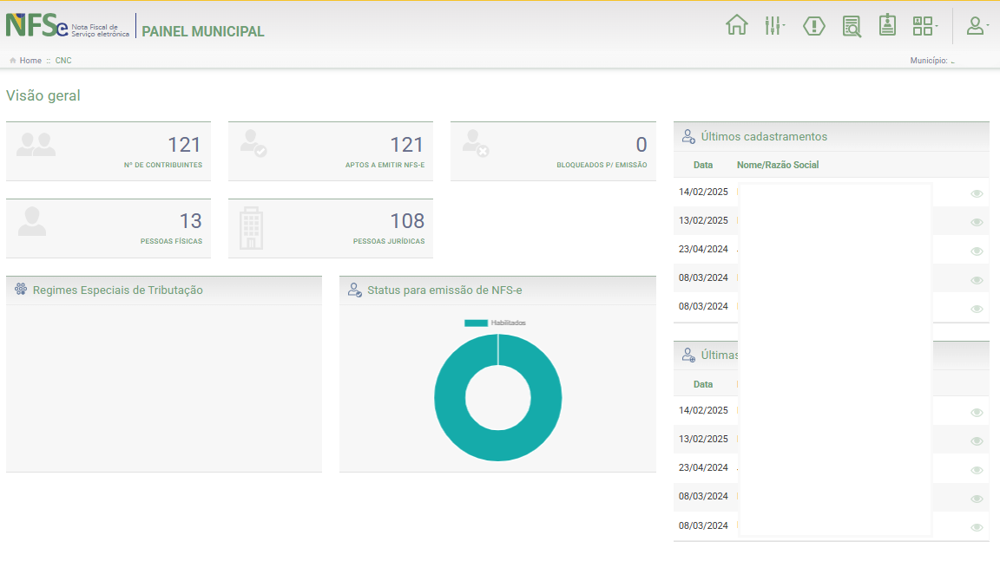

## Page 161

Guia para preenchimento do Painel Municipal da NFSe – versão 1.2
161
5.6.2. Contribuintes locais
No menu principal, ao clicar no ícone
e ir até “Contribuintes locais”, este item do menu direciona
para a página em que é possível verificar os contribuintes cadastrados, administrá-los e realizar a inclusão de
novos.
Figura 204 – Menu Cadastro Nacional de Contribuintes com destaque Contribuintes locais.
Permite o gerenciamento das pessoas (físicas e jurídicas) que são contribuintes do ISSQN pelo
município conveniado com o Sistema Nacional NFS-e.
A funcionalidade tem opção para Incluir Novo Contribuinte, Pesquisar, Alterar e Excluir as informações
de cada um dos registros do cadastro mantendo seu histórico de atividades no sistema.
Para cada registro encontrado é possível visualizar os detalhes das informações do contribuinte
cadastrado no município em questão, bem como o histórico de alterações destas informações.

### Images from Page 161

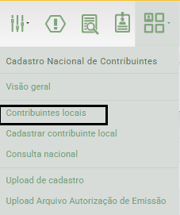

## Page 162

Guia para preenchimento do Painel Municipal da NFSe – versão 1.2
162
Figura 205 – Página de administração dos contribuintes locais cadastrados
Nesta página é possível realizar as seguintes operações acessando o ícone à direita da
linha do contribuinte:
Figura 206 - Opções de administração dos contribuintes cadastrados.
5.6.2.1.
Editar/Exibir Informações do Contribuinte
Para editar ou solicitar detalhes das informações sobre um contribuinte,  no grid do lado direito do da
linha que contém as informações deverá clicar em editar/detalhes e o painel apresentará uma tela com as
mesmas informações solicitadas quando do cadastramento inicial do contribuinte.
Figura 207 – Opções de administração dos contribuintes cadastrados.

### Images from Page 162

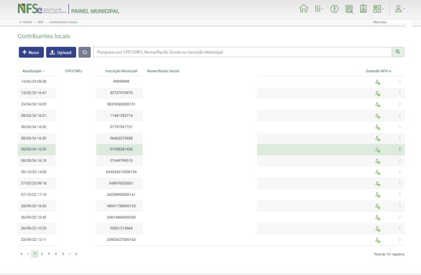

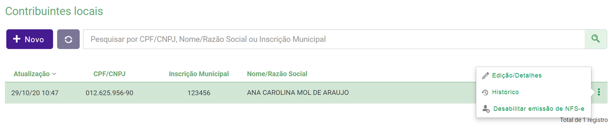

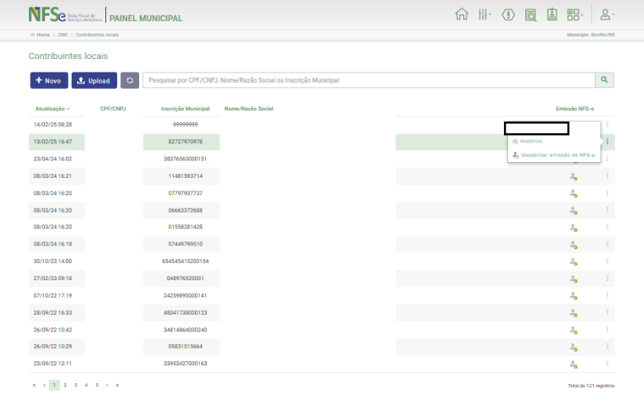

## Page 163

Guia para preenchimento do Painel Municipal da NFSe – versão 1.2
163
Figura 208 – Escolha da opção "Edição/Detalhes" no menu para administração das informações de um
contribuinte.
Ao clicar na “Edição/detalhes, se abrirá a tela onde será possível editar algumas informações relativas
àquele contribuinte local, conforme mostrado no item anterior. Mais detalhes sobre as informações a serem
preenchidas estão no item 3.6. deste guia.
Figura 209 – Informações disponibilizadas para edição relativamente aos contribuintes.
Alterar aquilo que for necessário e
.
5.6.2.2.
Visualizar Histórico de Alterações de Informações do Contribuinte
Nesta funcionalidade é possível verificar o histórico de alterações cadastrais e situação para a emissão de
NFS-e;  será apresentado, para o contribuinte selecionado, seu CPF/CNPJ e respectivo Nome/Razão Social e
uma linha do tempo com as alterações efetuadas evidenciando:
•
O campo alterado

### Images from Page 163

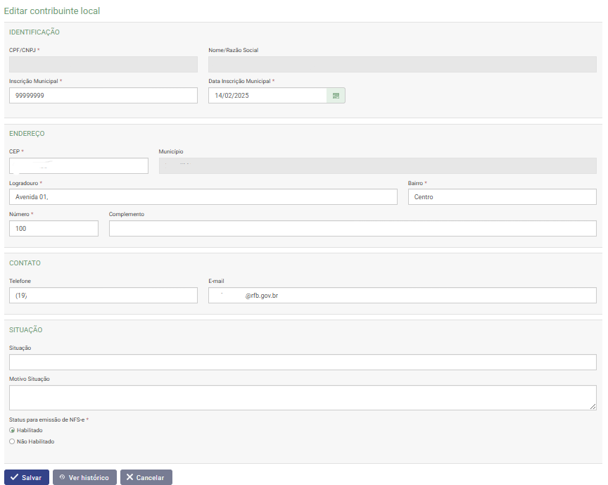

## Page 164

Guia para preenchimento do Painel Municipal da NFSe – versão 1.2
164
•
A informação anterior e a informação alterada (De “xxx” Para “YYY”)
•
Data da alteração
•
Usuário responsável pela alteração (CPF)
Figura 210 – Escolha da opção "Histórico" no menu para administração das informações de um contribuinte.
Figura 211 – Página que disponibiliza o histórico da situação cadastral do contribuinte selecionado.
5.6.2.3.
Desabilitar emissão de NFS-e
Nesta funcionalidade é possível definir que o contribuinte ficará impedido de emitir a NFS-e Nacional.
Uma mensagem de confirmação da operação é exibida na tela.
Figura 212 – Escolha da opção "Desabilitar emissão de NFS-e" no menu para administração das informações
de um contribuinte.

### Images from Page 164

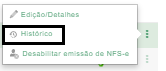

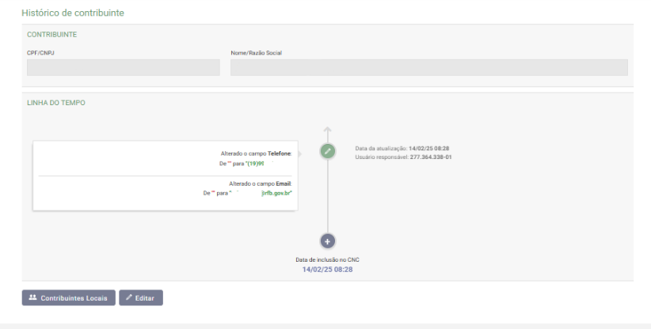

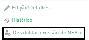

## Page 165

Guia para preenchimento do Painel Municipal da NFSe – versão 1.2
165
Figura 213 – Mensagem de confirmação da desabilitação do contribuinte.
5.6.3. Cadastrar um Contribuinte Local
Nesta parte do menu poderá ir diretamente para a tela de inclusão de contribuinte local. Será exibida
a tela para a inclusão de um contribuinte individualmente.
Figura 214 – Menu Cadastrar contribuinte local.
Figura 215 – Tela cadastrar contribuinte local.

### Images from Page 165

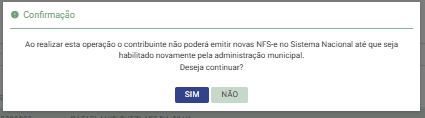

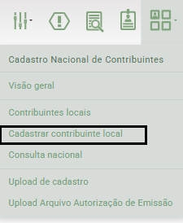

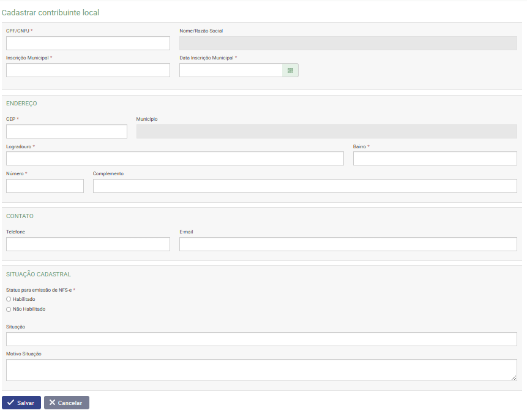

## Page 166

Guia para preenchimento do Painel Municipal da NFSe – versão 1.2
166
O painel exibirá uma tela para a inserção de um CPF ou CNPJ no campo indicado que realiza a busca
pelo registro no cadastro CPF ou CNPJ, recuperando o nome da pessoa física ou a razão social,
respectivamente. O CEP recupera na tabela TOM as informações de logradouro, município e bairro. As demais
informações são preenchidas pelo cadastrador. Mais informações podem ser consultadas n item 3.6. deste
manual.
5.6.4. Consulta Nacional
Figura 216 – Menu Consulta nacional.
Neste item do menu, a ATM poderá realizar consultas para verificar em quais municípios um
contribuinte está cadastrado, o seu status para emissão de NFS-e em cada município, bem como verificar o
histórico de cada cadastramento e os detalhes de cada cadastro.
A busca poderá ser realizada por diversos critérios, podendo ser utilizados um ou mais deles:
(CPF/CNPJ, Nome/Razão social, Inscrição municipal ou município) e o sistema exibirá uma lista com o
resultado dos parâmetros preenchidos.
Figura 217 – Critérios para realização da consulta de cadastros no CNC.

### Images from Page 166

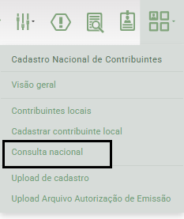

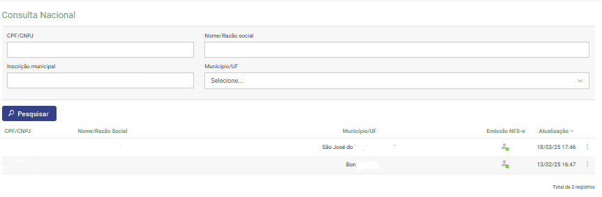

## Page 167

Guia para preenchimento do Painel Municipal da NFSe – versão 1.2
167
Figura 218 - Exibição dos resultados da busca realizada, segundo os critérios escolhidos.
Os resultados gerados exibirão todos os contribuintes que atendem aos critérios de busca inseridos.
Em cada contribuinte exibido na lista, a ATM poderá verificar os detalhes e o histórico de cada
cadastro, através do ícone
em cada linha.
Figura 219 - Opções de informações que poderão ser visualizadas pela ATM para cada resultado da busca.
5.6.5. Upload de cadastro
Esta funcionalidade permite que em um único procedimento que sejam incluídas as informações de
um ou mais contribuintes. As regras gerais estão descritas no item 3.6. deste manual.

### Images from Page 167

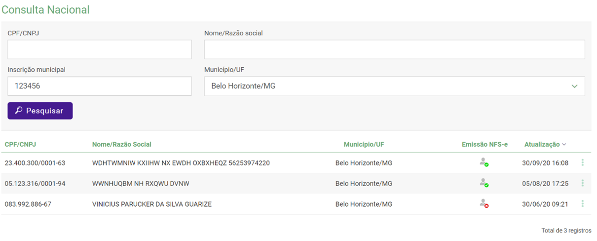

## Page 168

Guia para preenchimento do Painel Municipal da NFSe – versão 1.2
168
Figura 220 – Menu Upload de cadastro
É possível realizar o upload na funcionalidade
na tela Contribuintes Locais ou no menu principal
contribuintes em “Upload de cadastro” no painel Contribuintes Locais.
Figura 221 – Tela Upload de Contribuintes.
Com relação aos Regimes Especiais de Tributação, estarão disponíveis para inclusão ao contribuinte,
apenas aqueles já parametrizados no momento da adesão.
5.6.6. Upload Arquivo Autorização de Emissão
Esta funcionalidade permite que seja feita a habilitação ou desabilitação para emissão
de NFS-e feita através do upload de um arquivo para habilitar/desabilitar contribuintes a
emitirem NFS-e para aquele município.

### Images from Page 168

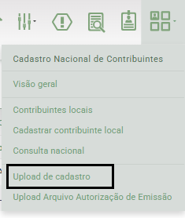

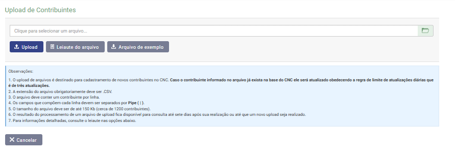

## Page 169

Guia para preenchimento do Painel Municipal da NFSe – versão 1.2
169
Neste caso os contribuintes alterados devem estar previamente cadastrados no
sistema.
Para realizar as alterações desejadas é necessário o upload de um arquivo contendo
três informações, conforme demonstra o leiaute do arquivo.
Figura 222  – Menu Upload Arquivo Autorização de Emissão
Ao clicar em “Upload Arquivo Autorização de Emissão” o sistema exibirá a tela para a inclusão do
arquivo. Deve-se clicar informar a localização do arquivo, clicando no ícone
à direita da tela,
o sistema abrirá uma janela para que seja informado a localização do arquivo. Selecionar o arquivo,
clicar em “Abrir “ e posteriormente clicar em “Incluir arquivo”.
Figura 223 – Tela Upload de Contribuintes.
Na janela há um quadro com “Observações” informando as definições que o arquivo deve ter:

### Images from Page 169

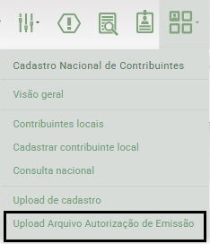

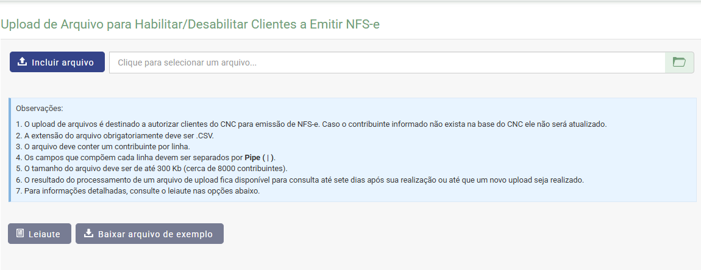

## Page 170

Guia para preenchimento do Painel Municipal da NFSe – versão 1.2
170
Na mesma janela, há o botão
. Ao clicar neste botão, será exibida uma janela com
o leiaute do arquivo CSV para upload.
Figura 224 - Leiaute do arquivo de upload de autorização de emissão da NFS-e Nacional.
Além das informações do leiaute do arquivo, na página de upload é disponibilizado um botão de
para download do arquivo de exemplo do leiaute supradescrito.
Figura 225 - Download do arquivo de exemplo do leiaute de autorização de emissão da NFSe
Por fim, para fazer o upload do arquivo, o botão
e selecionar o arquivo desejado e em seguida
selecionar “Incluir arquivo”.

### Images from Page 170

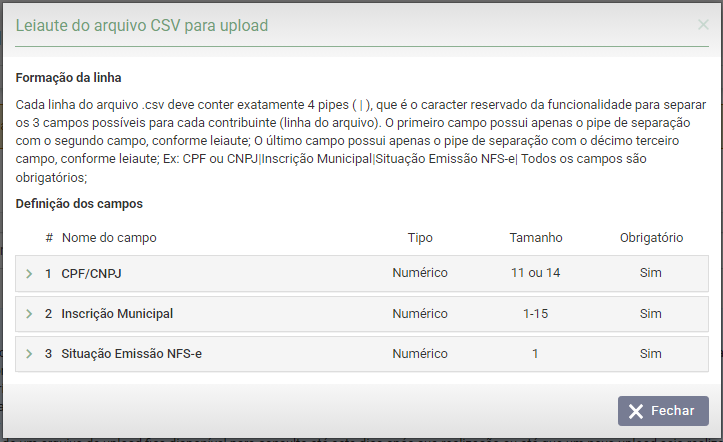

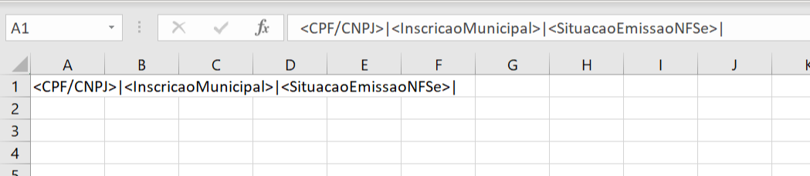

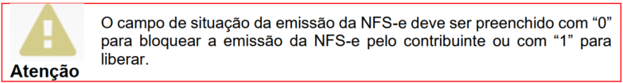

## Page 171

Guia para preenchimento do Painel Municipal da NFSe – versão 1.2
171
Figura 226 - Tela de resultado do upload do arquivo.
6.
Controle de Acesso ao Sistema Nacional NFS-e – Municípios
6.1.  Gerenciamento de Perfis e Níveis de Acesso
6.1.1.  Gerenciar Níveis e Perfis de Acesso dos Gestores Municipais
O gerenciamento dos perfis de acesso dos Gestores Municipais contempla as funcionalidades de
cadastramento para o acesso ao Painel Administrativo Municipal NFS-e (painel municipal). Todas as
funcionalidades administrativas para os gestores municipais do município conveniado estão disponíveis no
painel municipal. Segue abaixo a descrição deste gerenciamento.
6.1.1.1. Perfis Gestores Municipais
Existem três perfis de gestores no âmbito municipal definidos para o Sistema Nacional NFS-e:
•
Gestor Principal do Município;
•
Gestor Auditor Municipal;
•
Gestor Parametrizador;
•
Gestor Atendente Municipal;
6.1.1.2. Cadastramento dos Gestores Municipais
O Gestor Principal do município conveniado é cadastrado inicialmente pelo gerenciamento nacional quando o
município se convenia e é cadastrado no Sistema Nacional NFS-e. Este perfil é único por município e obtido
através de um cadastro já existente no Simples Nacional. Corresponde a figura de um agente ou administrador
público tido como responsável nacional pelo município.

### Images from Page 171

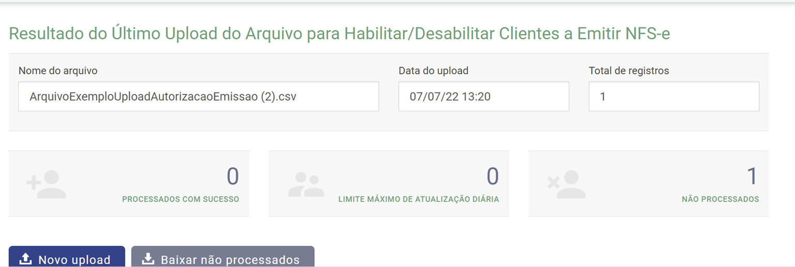

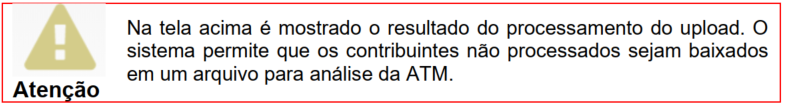

## Page 172

Guia para preenchimento do Painel Municipal da NFSe – versão 1.2
172
O Gestor Auditor Municipal e Parametrizador são cadastrados pelo Gestor Principal e por outros Gestores
Auditores. Este perfil é múltiplo por município, mas uma vez cadastrado em um município não pode ter
qualquer perfil gestor em outro município.
Finalmente o Gestor Atendente Municipal é responsável pelo atendimento aos contribuintes do município
conveniado ao Sistema Nacional NFS-e. Este perfil é cadastrado pelos outros dois perfis gestores do município.
Este perfil também é múltiplo por município, e, uma vez cadastrado em um município, não pode ter qualquer
perfil gestor em outro município.
6.1.1.3. Acesso à Área Restrita do Painel Administrativo Municipal
Ocorre somente via certificado digital pelos Gestores Municipais (Principal, Auditor, Parametrizador e
Atendente).
6.1.1.4. Níveis de Acesso às Funcionalidades para Gestores Municipais
Gestor Principal Municipal – O perfil deste gestor tem acesso e permissão para executar todas as
funcionalidades disponíveis no painel municipal, inclusive a funcionalidade de cadastramento dos demais
perfis de gestores municipais além da sua própria substituição por outro Gestor Principal do Município.
Gestor Auditor Municipal – O perfil deste gestor tem acesso e permissão para executar todas as
funcionalidades disponíveis no Painel Administrativo Municipal.
Gestor Parametrizador Municipal – O perfil deste gestor tem acesso e permissão para parametrizar as
funcionalidades disponíveis no painel municipal.
Gestor Atendente Municipal – O perfil deste gestor tem acesso e permissão para executar apenas as
funcionalidades de gerenciamento do cadastro de contribuintes do município, disponíveis no painel municipal.

### Images from Page 172

